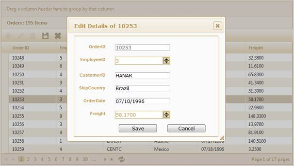

::: {style="DISPLAY: none"}
{#d2h_url_template}{#d2h_package_url style="WIDTH: 0px; DISPLAY: none; HEIGHT: 0px"}
:::

::: {.d2h_secondary_topic style="PADDING-BOTTOM: 10pt; MARGIN: 0pt; PADDING-LEFT: 0pt; PADDING-RIGHT: 0pt; PADDING-TOP: 0pt"}
##### Through Grid Builder {#through-grid-builder style="tab-stops: 0pt"}

The steps to work with the editing feature through **GridBuilder** are as follows:

1.   Add the **MicrosoftMvcValidation.debug.js** file in the master page.

 

+-----------------------------------------------------------------------------------------------------------------------------------------------------------------------------------------------------------------------------------------------------------------------------------------------------------------------------------------------------------------------------------------------------------------------------------------------------------------------------------------------------------------------------+
| **[\[ASPX\]]{style="FONT-FAMILY: 'Courier New'"}**                                                                                                                                                                                                                                                                                                                                                                                                                                                                          |
|                                                                                                                                                                                                                                                                                                                                                                                                                                                                                                                             |
| [\<]{style="FONT-FAMILY: 'Courier New'; COLOR: blue"}[head]{style="FONT-FAMILY: 'Courier New'; COLOR: maroon"}[ [runat]{style="COLOR: red"}[=\"server\"\>]{style="COLOR: blue"}]{style="FONT-FAMILY: 'Courier New'"}[]{style="FONT-FAMILY: 'Times New Roman','serif'"}                                                                                                                                                                                                                                                      |
|                                                                                                                                                                                                                                                                                                                                                                                                                                                                                                                             |
| [    [\<]{style="COLOR: blue"}[title]{style="COLOR: maroon"}[\>\<]{style="COLOR: blue"}[asp]{style="COLOR: maroon"}[:]{style="COLOR: blue"}[ContentPlaceHolder]{style="COLOR: maroon"} [ID]{style="COLOR: red"}[=\"TitleContent\"]{style="COLOR: blue"} [runat]{style="COLOR: red"}[=\"server\"]{style="COLOR: blue"} [/\>\</]{style="COLOR: blue"}[title]{style="COLOR: maroon"}[\>]{style="COLOR: blue"}]{style="FONT-FAMILY: 'Courier New'"}[]{style="FONT-FAMILY: 'Times New Roman','serif'"}                           |
|                                                                                                                                                                                                                                                                                                                                                                                                                                                                                                                             |
| [.........]{style="FONT-FAMILY: 'Courier New'; COLOR: blue"}[]{style="FONT-FAMILY: 'Times New Roman','serif'"}                                                                                                                                                                                                                                                                                                                                                                                                              |
|                                                                                                                                                                                                                                                                                                                                                                                                                                                                                                                             |
| [    [\<]{style="COLOR: blue"}[script]{style="COLOR: maroon"} [src]{style="COLOR: red"}[=\"]{style="COLOR: blue"}[\<%]{style="BACKGROUND: yellow"}[=]{style="COLOR: blue"} Url.Content(\"\~/Scripts/MicrosoftMvcValidation.debug.js\") [%\>]{style="BACKGROUND: yellow"}[\"]{style="COLOR: blue"} [type]{style="COLOR: red"}[=\"text/javascript\"\>\</]{style="COLOR: blue"}[script]{style="COLOR: maroon"}[\>]{style="COLOR: blue"}]{style="FONT-FAMILY: 'Courier New'"}[]{style="FONT-FAMILY: 'Times New Roman','serif'"} |
|                                                                                                                                                                                                                                                                                                                                                                                                                                                                                                                             |
| [    ]{style="FONT-FAMILY: 'Courier New'"}[]{style="FONT-FAMILY: 'Times New Roman','serif'"}                                                                                                                                                                                                                                                                                                                                                                                                                                |
|                                                                                                                                                                                                                                                                                                                                                                                                                                                                                                                             |
| [\</]{style="FONT-FAMILY: 'Courier New'; COLOR: blue"}[head]{style="FONT-FAMILY: 'Courier New'; COLOR: maroon"}[\>]{style="FONT-FAMILY: 'Courier New'; COLOR: blue"}[]{style="FONT-FAMILY: 'Times New Roman','serif'"}                                                                                                                                                                                                                                                                                                      |
+-----------------------------------------------------------------------------------------------------------------------------------------------------------------------------------------------------------------------------------------------------------------------------------------------------------------------------------------------------------------------------------------------------------------------------------------------------------------------------------------------------------------------------+

 

2.   Create a model in the application[.]{style="COLOR: windowtext"}

3.   Create a strongly typed view[.]{style="COLOR: windowtext"}

4.   In the view, use the **Model** property in the **Datasource()** method to bind the data source.

 

+--------------------------------------------------------------------------------------------------------------------------------------------------------------------------------------------------------------------------------------------------+
| **[\[ASPX\]]{style="FONT-FAMILY: 'Courier New'"}**                                                                                                                                                                                               |
|                                                                                                                                                                                                                                                  |
| [\<%]{style="FONT-FAMILY: 'Courier New'; BACKGROUND: yellow"}[=]{style="FONT-FAMILY: 'Courier New'; COLOR: blue"}[Html.Grid\<[EditableOrder]{style="COLOR: #2b91af"}\>([\"Grid1\"]{style="COLOR: #a31515"})]{style="FONT-FAMILY: 'Courier New'"} |
|                                                                                                                                                                                                                                                  |
| [                         .Datasource(Model) ]{style="FONT-FAMILY: 'Courier New'"}                                                                                                                                                               |
|                                                                                                                                                                                                                                                  |
| [                         .Caption([\"Orders\"]{style="COLOR: #a31515"})]{style="FONT-FAMILY: 'Courier New'"}                                                                                                                                    |
|                                                                                                                                                                                                                                                  |
| [                         .Column(column =\>]{style="FONT-FAMILY: 'Courier New'"}                                                                                                                                                                |
|                                                                                                                                                                                                                                                  |
| [                         {]{style="FONT-FAMILY: 'Courier New'"}                                                                                                                                                                                 |
|                                                                                                                                                                                                                                                  |
| []{style="FONT-FAMILY: 'Courier New'"}                                                                                                                                                                                                           |
|                                                                                                                                                                                                                                                  |
| [                             column.Add(p =\> p.OrderID).HeaderText([\"Order ID\"]{style="COLOR: #a31515"});]{style="FONT-FAMILY: 'Courier New'"}                                                                                               |
|                                                                                                                                                                                                                                                  |
| [                             column.Add(p =\> p.CustomerID).HeaderText([\"Customer ID\"]{style="COLOR: #a31515"});]{style="FONT-FAMILY: 'Courier New'"}                                                                                         |
|                                                                                                                                                                                                                                                  |
| [                             column.Add(p =\> p.ShipCountry).HeaderText([\"Ship Country\"]{style="COLOR: #a31515"}).CellEditType([CellEditType]{style="COLOR: #2b91af"}.DropdownEdit);]{style="FONT-FAMILY: 'Courier New'"}                     |
|                                                                                                                                                                                                                                                  |
| [                             column.Add(p =\> p.OrderDate).HeaderText([\"Order Date\"]{style="COLOR: #a31515"}).Format([\"{0:MM/dd/yyyy}\"]{style="COLOR: #a31515"});]{style="FONT-FAMILY: 'Courier New'"}                                      |
|                                                                                                                                                                                                                                                  |
| [                             column.Add(p =\> p.Freight).HeaderText([\"Freight\"]{style="COLOR: #a31515"}).Format([\"{0:C}\"]{style="COLOR: #a31515"});]{style="FONT-FAMILY: 'Courier New'"}                                                    |
|                                                                                                                                                                                                                                                  |
| [                             column.Add(p =\> p.Delivered).HeaderText([\"Delivered\"]{style="COLOR: #a31515"});]{style="FONT-FAMILY: 'Courier New'"}                                                                                            |
|                                                                                                                                                                                                                                                  |
| [                         })]{style="FONT-FAMILY: 'Courier New'"}                                                                                                                                                                                |
|                                                                                                                                                                                                                                                  |
| [                        ]{style="FONT-FAMILY: 'Courier New'"}                                                                                                                                                                                   |
|                                                                                                                                                                                                                                                  |
| []{style="FONT-FAMILY: 'Courier New'"}                                                                                                                                                                                                           |
|                                                                                                                                                                                                                                                  |
| [%\>]{style="FONT-FAMILY: 'Courier New'; BACKGROUND: yellow"}                                                                                                                                                                                    |
+--------------------------------------------------------------------------------------------------------------------------------------------------------------------------------------------------------------------------------------------------+

 

 

+------------------------------------------------------------------------------------------------------------------------------------------------------------------------------------------------------------------------------+
| **[\[Razor\]]{style="FONT-FAMILY: 'Courier New'"}**                                                                                                                                                                          |
|                                                                                                                                                                                                                              |
| [\@{]{style="FONT-FAMILY: 'Courier New'; BACKGROUND: yellow"}[ Html.Grid\<[EditableOrder]{style="COLOR: #2b91af"}\>([\"Grid1\"]{style="COLOR: #a31515"})[]{style="BACKGROUND: yellow"}]{style="FONT-FAMILY: 'Courier New'"}  |
|                                                                                                                                                                                                                              |
| [                         .Datasource(Model) ]{style="FONT-FAMILY: 'Courier New'"}                                                                                                                                           |
|                                                                                                                                                                                                                              |
| [                         .Caption([\"Orders\"]{style="COLOR: #a31515"})]{style="FONT-FAMILY: 'Courier New'"}                                                                                                                |
|                                                                                                                                                                                                                              |
| [                         .Column(column =\>]{style="FONT-FAMILY: 'Courier New'"}                                                                                                                                            |
|                                                                                                                                                                                                                              |
| [                         {]{style="FONT-FAMILY: 'Courier New'"}                                                                                                                                                             |
|                                                                                                                                                                                                                              |
| []{style="FONT-FAMILY: 'Courier New'"}                                                                                                                                                                                       |
|                                                                                                                                                                                                                              |
| [                             column.Add(p =\> p.OrderID).HeaderText([\"Order ID\"]{style="COLOR: #a31515"});]{style="FONT-FAMILY: 'Courier New'"}                                                                           |
|                                                                                                                                                                                                                              |
| [                             column.Add(p =\> p.CustomerID).HeaderText([\"Customer ID\"]{style="COLOR: #a31515"});]{style="FONT-FAMILY: 'Courier New'"}                                                                     |
|                                                                                                                                                                                                                              |
| [                             column.Add(p =\> p.ShipCountry).HeaderText([\"Ship Country\"]{style="COLOR: #a31515"}).CellEditType([CellEditType]{style="COLOR: #2b91af"}.DropdownEdit);]{style="FONT-FAMILY: 'Courier New'"} |
|                                                                                                                                                                                                                              |
| [                             column.Add(p =\> p.OrderDate).HeaderText([\"Order Date\"]{style="COLOR: #a31515"}).Format([\"{0:MM/dd/yyyy}\"]{style="COLOR: #a31515"});]{style="FONT-FAMILY: 'Courier New'"}                  |
|                                                                                                                                                                                                                              |
| [                             column.Add(p =\> p.Freight).HeaderText([\"Freight\"]{style="COLOR: #a31515"}).Format([\"{0:C}\"]{style="COLOR: #a31515"});]{style="FONT-FAMILY: 'Courier New'"}                                |
|                                                                                                                                                                                                                              |
| [                             column.Add(p =\> p.Delivered).HeaderText([\"Delivered\"]{style="COLOR: #a31515"});]{style="FONT-FAMILY: 'Courier New'"}                                                                        |
|                                                                                                                                                                                                                              |
| [                         })]{style="FONT-FAMILY: 'Courier New'"}                                                                                                                                                            |
|                                                                                                                                                                                                                              |
| [                        ]{style="FONT-FAMILY: 'Courier New'"}                                                                                                                                                               |
|                                                                                                                                                                                                                              |
| [ .Render();]{style="FONT-FAMILY: 'Courier New'"}                                                                                                                                                                            |
|                                                                                                                                                                                                                              |
| [}]{style="FONT-FAMILY: 'Courier New'; BACKGROUND: yellow"}[]{style="FONT-FAMILY: 'Courier New'"}                                                                                                                            |
+------------------------------------------------------------------------------------------------------------------------------------------------------------------------------------------------------------------------------+

 

5.   Enable Dialog editing mode by setting the edit mode to **Dialog**[ ]{style="FONT-FAMILY: 'Verdana','sans-serif'; FONT-SIZE: 8.5pt"}and configure the dialog and editing properties such as allow new, allow edit, and allow delete, as displayed below:[]{style="FONT-SIZE: 14pt"}

 

+-------------------------------------------------------------------------------------------------------------------------------------------------------------------------------------------------------------------------------------------------------------------------------------------------------------------------------------------------------------------------------------------------------+
| **[\[ASPX\]]{style="FONT-FAMILY: 'Courier New'"}**                                                                                                                                                                                                                                                                                                                                                    |
|                                                                                                                                                                                                                                                                                                                                                                                                       |
| []{style="FONT-FAMILY: 'Courier New'; BACKGROUND: yellow"}                                                                                                                                                                                                                                                                                                                                            |
|                                                                                                                                                                                                                                                                                                                                                                                                       |
| [\<%]{style="FONT-FAMILY: 'Courier New'; BACKGROUND: yellow"}[=]{style="FONT-FAMILY: 'Courier New'; COLOR: blue"}[Html.Syncfusion().Grid\<[EditableOrder]{style="COLOR: #2b91af"}\>([\"Grid1\"]{style="COLOR: #a31515"})]{style="FONT-FAMILY: 'Courier New'"}                                                                                                                                         |
|                                                                                                                                                                                                                                                                                                                                                                                                       |
| [.Editing( edit=\>{]{style="FONT-FAMILY: 'Courier New'"}                                                                                                                                                                                                                                                                                                                                              |
|                                                                                                                                                                                                                                                                                                                                                                                                       |
| [        edit.Dialog(dialog =\>]{style="FONT-FAMILY: 'Courier New'"}                                                                                                                                                                                                                                                                                                                                  |
|                                                                                                                                                                                                                                                                                                                                                                                                       |
| [        {]{style="FONT-FAMILY: 'Courier New'"}                                                                                                                                                                                                                                                                                                                                                       |
|                                                                                                                                                                                                                                                                                                                                                                                                       |
| [      dialog.Height(500);]{style="FONT-FAMILY: 'Courier New'"}                                                                                                                                                                                                                                                                                                                                       |
|                                                                                                                                                                                                                                                                                                                                                                                                       |
| [dialog.Width(460);                                                   dialog.Position([DialogPositions]{style="COLOR: #2b91af"}.Center);                                                  dialog.Show([DialogAnimations]{style="COLOR: #2b91af"}.bounce);                                          dialog.Hide([DialogAnimations]{style="COLOR: #2b91af"}.fold);]{style="FONT-FAMILY: 'Courier New'"} |
|                                                                                                                                                                                                                                                                                                                                                                                                       |
| [      });]{style="FONT-FAMILY: 'Courier New'"}                                                                                                                                                                                                                                                                                                                                                       |
|                                                                                                                                                                                                                                                                                                                                                                                                       |
| [        edit.AllowEdit([true]{style="COLOR: blue"}, [\"OrderSave\"]{style="COLOR: #a31515"})]{style="FONT-FAMILY: 'Courier New'"}                                                                                                                                                                                                                                                                    |
|                                                                                                                                                                                                                                                                                                                                                                                                       |
| [        .AllowNew([true]{style="COLOR: blue"}, [\"AddOrder\"]{style="COLOR: #a31515"})]{style="FONT-FAMILY: 'Courier New'"}                                                                                                                                                                                                                                                                          |
|                                                                                                                                                                                                                                                                                                                                                                                                       |
| [       .AllowDelete([true]{style="COLOR: blue"}, [\"DeleteOrder\"]{style="COLOR: #a31515"});]{style="FONT-FAMILY: 'Courier New'"}                                                                                                                                                                                                                                                                    |
|                                                                                                                                                                                                                                                                                                                                                                                                       |
| **[})               ]{style="FONT-FAMILY: 'Courier New'"}**[]{style="FONT-FAMILY: 'Courier New'"}                                                                                                                                                                                                                                                                                                     |
|                                                                                                                                                                                                                                                                                                                                                                                                       |
| [    [%\>]{style="BACKGROUND: yellow"}]{style="FONT-FAMILY: 'Courier New'"}                                                                                                                                                                                                                                                                                                                           |
|                                                                                                                                                                                                                                                                                                                                                                                                       |
| []{style="FONT-FAMILY: 'Courier New'"}                                                                                                                                                                                                                                                                                                                                                                |
+-------------------------------------------------------------------------------------------------------------------------------------------------------------------------------------------------------------------------------------------------------------------------------------------------------------------------------------------------------------------------------------------------------+

 

+-------------------------------------------------------------------------------------------------------------------------------------------------------------------------------------------------------------------------------------------------------------------------------------------------------------------------------------------------------------------------------------------------------+
| **[\[Razor\]]{style="FONT-FAMILY: 'Courier New'"}**                                                                                                                                                                                                                                                                                                                                                   |
|                                                                                                                                                                                                                                                                                                                                                                                                       |
| [\@{]{style="FONT-FAMILY: 'Courier New'; BACKGROUND: yellow"}[ Html.Syncfusion().Grid\<[EditableOrder]{style="COLOR: #2b91af"}\>([\"Grid1\"]{style="COLOR: #a31515"})]{style="FONT-FAMILY: 'Courier New'"}                                                                                                                                                                                            |
|                                                                                                                                                                                                                                                                                                                                                                                                       |
| [.Editing( edit=\>{]{style="FONT-FAMILY: 'Courier New'"}                                                                                                                                                                                                                                                                                                                                              |
|                                                                                                                                                                                                                                                                                                                                                                                                       |
| [        edit.Dialog(dialog =\>]{style="FONT-FAMILY: 'Courier New'"}                                                                                                                                                                                                                                                                                                                                  |
|                                                                                                                                                                                                                                                                                                                                                                                                       |
| [        {]{style="FONT-FAMILY: 'Courier New'"}                                                                                                                                                                                                                                                                                                                                                       |
|                                                                                                                                                                                                                                                                                                                                                                                                       |
| [      dialog.Height(500);]{style="FONT-FAMILY: 'Courier New'"}                                                                                                                                                                                                                                                                                                                                       |
|                                                                                                                                                                                                                                                                                                                                                                                                       |
| [dialog.Width(460);                                                   dialog.Position([DialogPositions]{style="COLOR: #2b91af"}.Center);                                                  dialog.Show([DialogAnimations]{style="COLOR: #2b91af"}.bounce);                                          dialog.Hide([DialogAnimations]{style="COLOR: #2b91af"}.fold);]{style="FONT-FAMILY: 'Courier New'"} |
|                                                                                                                                                                                                                                                                                                                                                                                                       |
| [      });]{style="FONT-FAMILY: 'Courier New'"}                                                                                                                                                                                                                                                                                                                                                       |
|                                                                                                                                                                                                                                                                                                                                                                                                       |
| [        edit.AllowEdit([true]{style="COLOR: blue"}, [\"OrderSave\"]{style="COLOR: #a31515"})]{style="FONT-FAMILY: 'Courier New'"}                                                                                                                                                                                                                                                                    |
|                                                                                                                                                                                                                                                                                                                                                                                                       |
| [        .AllowNew([true]{style="COLOR: blue"}, [\"AddOrder\"]{style="COLOR: #a31515"})]{style="FONT-FAMILY: 'Courier New'"}                                                                                                                                                                                                                                                                          |
|                                                                                                                                                                                                                                                                                                                                                                                                       |
| [       .AllowDelete([true]{style="COLOR: blue"}, [\"DeleteOrder\"]{style="COLOR: #a31515"});]{style="FONT-FAMILY: 'Courier New'"}                                                                                                                                                                                                                                                                    |
|                                                                                                                                                                                                                                                                                                                                                                                                       |
| **[})]{style="FONT-FAMILY: 'Courier New'"}**[.Render();]{style="FONT-FAMILY: 'Courier New'"}                                                                                                                                                                                                                                                                                                          |
|                                                                                                                                                                                                                                                                                                                                                                                                       |
| [}]{style="FONT-FAMILY: 'Courier New'; BACKGROUND: yellow"}[]{style="FONT-FAMILY: 'Courier New'"}                                                                                                                                                                                                                                                                                                     |
+-------------------------------------------------------------------------------------------------------------------------------------------------------------------------------------------------------------------------------------------------------------------------------------------------------------------------------------------------------------------------------------------------------+

 

6.   Grid allows adding new records through grid toolbar items. In this example, **AddNew**, **Edit**, **Delete**, **Save**, and **Cancel** buttons have been added in the toolbar items. Therefore, configure the toolbar as displayed below:

 

+--------------------------------------------------------------------------------------------------------------------------------------------------------------------------------------------------------------------------------------------------+
| **[\[ASPX\]]{style="FONT-FAMILY: 'Courier New'"}**                                                                                                                                                                                               |
|                                                                                                                                                                                                                                                  |
| []{style="FONT-FAMILY: 'Courier New'; BACKGROUND: yellow"}                                                                                                                                                                                       |
|                                                                                                                                                                                                                                                  |
| [\<%]{style="FONT-FAMILY: 'Courier New'; BACKGROUND: yellow"}[=]{style="FONT-FAMILY: 'Courier New'; COLOR: blue"}[Html.Grid\<[EditableOrder]{style="COLOR: #2b91af"}\>([\"Grid1\"]{style="COLOR: #a31515"})]{style="FONT-FAMILY: 'Courier New'"} |
|                                                                                                                                                                                                                                                  |
| [                         .Datasource(Model).ActionMode([ActionMode]{style="COLOR: #2b91af"}.JSON)]{style="FONT-FAMILY: 'Courier New'"}                                                                                                          |
|                                                                                                                                                                                                                                                  |
| **[]{style="FONT-FAMILY: 'Courier New'"}**                                                                                                                                                                                                       |
|                                                                                                                                                                                                                                                  |
| [.ToolBar(tools =\>]{style="FONT-FAMILY: 'Courier New'"}                                                                                                                                                                                         |
|                                                                                                                                                                                                                                                  |
| [  {]{style="FONT-FAMILY: 'Courier New'"}                                                                                                                                                                                                        |
|                                                                                                                                                                                                                                                  |
| [    tools.Add([GridToolBarItems]{style="COLOR: #2b91af"}.AddNew)[// Toolbar item for inserting records.]{style="COLOR: green"}]{style="FONT-FAMILY: 'Courier New'"}                                                                             |
|                                                                                                                                                                                                                                                  |
| [         .Add([GridToolBarItems]{style="COLOR: #2b91af"}.Edit) )[// Toolbar item for editing records.]{style="COLOR: green"}]{style="FONT-FAMILY: 'Courier New'"}                                                                               |
|                                                                                                                                                                                                                                                  |
| [         .Add([GridToolBarItems]{style="COLOR: #2b91af"}.Delete)[// Toolbar item for deleting records.]{style="COLOR: green"}]{style="FONT-FAMILY: 'Courier New'"}                                                                              |
|                                                                                                                                                                                                                                                  |
| [         .Add([GridToolBarItems]{style="COLOR: #2b91af"}.Update)[// Toolbar item for saving changes.]{style="COLOR: green"}]{style="FONT-FAMILY: 'Courier New'"}                                                                                |
|                                                                                                                                                                                                                                                  |
| [         .Add([GridToolBarItems]{style="COLOR: #2b91af"}.Cancel);[// Toolbar item for canceling request.                                                       ]{style="COLOR: green"}]{style="FONT-FAMILY: 'Courier New'"}                     |
|                                                                                                                                                                                                                                                  |
| [      })]{style="FONT-FAMILY: 'Courier New'"}                                                                                                                                                                                                   |
|                                                                                                                                                                                                                                                  |
| [%\>]{style="FONT-FAMILY: 'Courier New'; BACKGROUND: yellow"}                                                                                                                                                                                    |
+--------------------------------------------------------------------------------------------------------------------------------------------------------------------------------------------------------------------------------------------------+

 

 

+------------------------------------------------------------------------------------------------------------------------------------------------------------------------------------------------------------------------------+
| **[\[Razor\]]{style="FONT-FAMILY: 'Courier New'"}**                                                                                                                                                                          |
|                                                                                                                                                                                                                              |
| [\@{]{style="FONT-FAMILY: 'Courier New'; BACKGROUND: yellow"}[ Html.Grid\<[EditableOrder]{style="COLOR: #2b91af"}\>([\"Grid1\"]{style="COLOR: #a31515"})]{style="FONT-FAMILY: 'Courier New'"}                                |
|                                                                                                                                                                                                                              |
| [                         .Datasource(Model).ActionMode([ActionMode]{style="COLOR: #2b91af"}.JSON)]{style="FONT-FAMILY: 'Courier New'"}                                                                                      |
|                                                                                                                                                                                                                              |
| **[]{style="FONT-FAMILY: 'Courier New'"}**                                                                                                                                                                                   |
|                                                                                                                                                                                                                              |
| [.ToolBar(tools =\>]{style="FONT-FAMILY: 'Courier New'"}                                                                                                                                                                     |
|                                                                                                                                                                                                                              |
| [  {]{style="FONT-FAMILY: 'Courier New'"}                                                                                                                                                                                    |
|                                                                                                                                                                                                                              |
| [    tools.Add([GridToolBarItems]{style="COLOR: #2b91af"}.AddNew)[// Toolbar item for inserting records.]{style="COLOR: green"}]{style="FONT-FAMILY: 'Courier New'"}                                                         |
|                                                                                                                                                                                                                              |
| [         .Add([GridToolBarItems]{style="COLOR: #2b91af"}.Edit) )[// Toolbar item for editing records.]{style="COLOR: green"}]{style="FONT-FAMILY: 'Courier New'"}                                                           |
|                                                                                                                                                                                                                              |
| [         .Add([GridToolBarItems]{style="COLOR: #2b91af"}.Delete)[// Toolbar item for deleting records.]{style="COLOR: green"}]{style="FONT-FAMILY: 'Courier New'"}                                                          |
|                                                                                                                                                                                                                              |
| [         .Add([GridToolBarItems]{style="COLOR: #2b91af"}.Update)[// Toolbar item for saving changes.]{style="COLOR: green"}]{style="FONT-FAMILY: 'Courier New'"}                                                            |
|                                                                                                                                                                                                                              |
| [         .Add([GridToolBarItems]{style="COLOR: #2b91af"}.Cancel);[// Toolbar item for canceling request.                                                       ]{style="COLOR: green"}]{style="FONT-FAMILY: 'Courier New'"} |
|                                                                                                                                                                                                                              |
| [      })]{style="FONT-FAMILY: 'Courier New'"}                                                                                                                                                                               |
|                                                                                                                                                                                                                              |
| [.Render();]{style="FONT-FAMILY: 'Courier New'"}                                                                                                                                                                             |
|                                                                                                                                                                                                                              |
| [       ]{style="FONT-FAMILY: 'Courier New'"}                                                                                                                                                                                |
|                                                                                                                                                                                                                              |
| [   [}]{style="BACKGROUND: yellow"}]{style="FONT-FAMILY: 'Courier New'"}                                                                                                                                                     |
+------------------------------------------------------------------------------------------------------------------------------------------------------------------------------------------------------------------------------+

 

7.   Specify the primary property which uniquely identifies the grid record.[]{style="FONT-SIZE: 14pt"}

[]{style="FONT-SIZE: 14pt"} 

+---------------------------------------------------------------------------------------------------------------------------------------------------------------------------------------------------------------------------------------------------------------+
| **[\[ASPX\]]{style="FONT-FAMILY: 'Courier New'"}**                                                                                                                                                                                                            |
|                                                                                                                                                                                                                                                               |
| []{style="FONT-FAMILY: 'Courier New'; BACKGROUND: yellow"}                                                                                                                                                                                                    |
|                                                                                                                                                                                                                                                               |
| [\<%]{style="FONT-FAMILY: 'Courier New'; BACKGROUND: yellow"}[=]{style="FONT-FAMILY: 'Courier New'; COLOR: blue"}[Html.Syncfusion().Grid\<[EditableOrder]{style="COLOR: #2b91af"}\>([\"Grid1\"]{style="COLOR: #a31515"})]{style="FONT-FAMILY: 'Courier New'"} |
|                                                                                                                                                                                                                                                               |
| [.Editing( edit=\>{]{style="FONT-FAMILY: 'Courier New'"}                                                                                                                                                                                                      |
|                                                                                                                                                                                                                                                               |
| []{style="FONT-FAMILY: 'Courier New'"}                                                                                                                                                                                                                        |
|                                                                                                                                                                                                                                                               |
| **[edit.PrimaryKey(key =\> key.Add(p =\> p.OrderID)); [// Add primary key to primary key collections.]{style="COLOR: green"}]{style="FONT-FAMILY: 'Courier New'"}**                                                                                           |
|                                                                                                                                                                                                                                                               |
| [})**            **]{style="FONT-FAMILY: 'Courier New'"}[]{style="FONT-FAMILY: 'Courier New'"}                                                                                                                                                                |
|                                                                                                                                                                                                                                                               |
| [    [%\>]{style="BACKGROUND: yellow"}]{style="FONT-FAMILY: 'Courier New'"}                                                                                                                                                                                   |
+---------------------------------------------------------------------------------------------------------------------------------------------------------------------------------------------------------------------------------------------------------------+

 

+------------------------------------------------------------------------------------------------------------------------------------------------------------------------------------------------------------+
| **[\[Razor\]]{style="FONT-FAMILY: 'Courier New'"}**                                                                                                                                                        |
|                                                                                                                                                                                                            |
| []{style="FONT-FAMILY: 'Courier New'; BACKGROUND: yellow"}                                                                                                                                                 |
|                                                                                                                                                                                                            |
| [\@{]{style="FONT-FAMILY: 'Courier New'; BACKGROUND: yellow"}[ Html.Syncfusion().Grid\<[EditableOrder]{style="COLOR: #2b91af"}\>([\"Grid1\"]{style="COLOR: #a31515"})]{style="FONT-FAMILY: 'Courier New'"} |
|                                                                                                                                                                                                            |
| [.Editing( edit=\>{]{style="FONT-FAMILY: 'Courier New'"}                                                                                                                                                   |
|                                                                                                                                                                                                            |
| []{style="FONT-FAMILY: 'Courier New'"}                                                                                                                                                                     |
|                                                                                                                                                                                                            |
| **[edit.PrimaryKey(key =\> key.Add(p =\> p.OrderID)); [// Add primary key to primary key collections.]{style="COLOR: green"}]{style="FONT-FAMILY: 'Courier New'"}**                                        |
|                                                                                                                                                                                                            |
| [})**  []{style="COLOR: green"}**]{style="FONT-FAMILY: 'Courier New'"}                                                                                                                                     |
|                                                                                                                                                                                                            |
| [.Render();]{style="FONT-FAMILY: 'Courier New'"}                                                                                                                                                           |
|                                                                                                                                                                                                            |
| [}]{style="FONT-FAMILY: 'Courier New'; BACKGROUND: yellow"}[]{style="FONT-FAMILY: 'Courier New'"}                                                                                                          |
+------------------------------------------------------------------------------------------------------------------------------------------------------------------------------------------------------------+

 

8.   In the controller, create a method to add new records to grid, as displayed below. In this example, the repository method **Add()** is being created to insert records to the database. Refer the repository action method displayed below.

 

+------------------------------------------------------------------------------------------------------------------------------------------------------------------------------------------------------------------------------------------------------------------------------------------------------------------------------------------------------+
| **[Controller]{style="FONT-FAMILY: 'Courier New'; COLOR: black"}**                                                                                                                                                                                                                                                                                   |
|                                                                                                                                                                                                                                                                                                                                                      |
| [///]{style="FONT-FAMILY: 'Courier New'; COLOR: gray"}[ ]{style="FONT-FAMILY: 'Courier New'; COLOR: green"}[\<summary\>]{style="FONT-FAMILY: 'Courier New'; COLOR: gray"}                                                                                                                                                                            |
|                                                                                                                                                                                                                                                                                                                                                      |
| [///]{style="FONT-FAMILY: 'Courier New'; COLOR: gray"}[ Used to insert the record into the database and refresh the grid.]{style="FONT-FAMILY: 'Courier New'; COLOR: green"}                                                                                                                                                                         |
|                                                                                                                                                                                                                                                                                                                                                      |
| [///]{style="FONT-FAMILY: 'Courier New'; COLOR: gray"}[ ]{style="FONT-FAMILY: 'Courier New'; COLOR: green"}[\</summary\>]{style="FONT-FAMILY: 'Courier New'; COLOR: gray"}                                                                                                                                                                           |
|                                                                                                                                                                                                                                                                                                                                                      |
| [///]{style="FONT-FAMILY: 'Courier New'; COLOR: gray"}[ ]{style="FONT-FAMILY: 'Courier New'; COLOR: green"}[\<param name=\"ord\"\>]{style="FONT-FAMILY: 'Courier New'; COLOR: gray"}[Editable order.]{style="FONT-FAMILY: 'Courier New'; COLOR: green"}[\</param\>]{style="FONT-FAMILY: 'Courier New'; COLOR: gray"}                                 |
|                                                                                                                                                                                                                                                                                                                                                      |
| [///]{style="FONT-FAMILY: 'Courier New'; COLOR: gray"}[ ]{style="FONT-FAMILY: 'Courier New'; COLOR: green"}[\<returns\>]{style="FONT-FAMILY: 'Courier New'; COLOR: gray"}[HtmlActionResult returns the data displayed in the grid.]{style="FONT-FAMILY: 'Courier New'; COLOR: green"}[\</returns\>]{style="FONT-FAMILY: 'Courier New'; COLOR: gray"} |
|                                                                                                                                                                                                                                                                                                                                                      |
| [\[[AcceptVerbs]{style="COLOR: #2b91af"}([HttpVerbs]{style="COLOR: #2b91af"}.Post)\]]{style="FONT-FAMILY: 'Courier New'"}                                                                                                                                                                                                                            |
|                                                                                                                                                                                                                                                                                                                                                      |
| [public]{style="FONT-FAMILY: 'Courier New'; COLOR: blue"}[ [ActionResult]{style="COLOR: #2b91af"} AddOrder([EditableOrder]{style="COLOR: #2b91af"} ord)]{style="FONT-FAMILY: 'Courier New'"}                                                                                                                                                         |
|                                                                                                                                                                                                                                                                                                                                                      |
| [{]{style="FONT-FAMILY: 'Courier New'"}                                                                                                                                                                                                                                                                                                              |
|                                                                                                                                                                                                                                                                                                                                                      |
| [// Repository action method Add() is used to insert records in the data source.]{style="FONT-FAMILY: 'Courier New'; COLOR: green"}                                                                                                                                                                                                                  |
|                                                                                                                                                                                                                                                                                                                                                      |
| **[OrderRepository]{style="FONT-FAMILY: 'Courier New'; COLOR: #2b91af"}[.Add(ord);]{style="FONT-FAMILY: 'Courier New'"}**                                                                                                                                                                                                                            |
|                                                                                                                                                                                                                                                                                                                                                      |
| [// After adding the record into the database, refresh the grid.]{style="FONT-FAMILY: 'Courier New'; COLOR: green"}                                                                                                                                                                                                                                  |
|                                                                                                                                                                                                                                                                                                                                                      |
| [var]{style="FONT-FAMILY: 'Courier New'; COLOR: blue"}[ data = [OrderRepository]{style="COLOR: #2b91af"}.GetAllRecords();]{style="FONT-FAMILY: 'Courier New'"}                                                                                                                                                                                       |
|                                                                                                                                                                                                                                                                                                                                                      |
| [return]{style="FONT-FAMILY: 'Courier New'; COLOR: blue"}[ data.GridActions\<[EditableOrder]{style="COLOR: #2b91af"}\>();]{style="FONT-FAMILY: 'Courier New'"}                                                                                                                                                                                       |
|                                                                                                                                                                                                                                                                                                                                                      |
| [}]{style="FONT-FAMILY: 'Courier New'"}                                                                                                                                                                                                                                                                                                              |
+------------------------------------------------------------------------------------------------------------------------------------------------------------------------------------------------------------------------------------------------------------------------------------------------------------------------------------------------------+

 

9.   In the controller, create a method to save changes as displayed below.

 

 In this example, the repository method **Update()** is used to update records to the data source.

 

+---------------------------------------------------------------------------------------------------------------------------------------------------------------------------------------------------------------------------------------------------------------------------------------------------------------------------------------------------------+
| **[Controller]{style="FONT-FAMILY: 'Courier New'; COLOR: black"}**                                                                                                                                                                                                                                                                                      |
|                                                                                                                                                                                                                                                                                                                                                         |
| [///]{style="FONT-FAMILY: 'Courier New'; COLOR: gray"}[ Used to insert the record into database and refresh the grid.]{style="FONT-FAMILY: 'Courier New'; COLOR: green"}                                                                                                                                                                                |
|                                                                                                                                                                                                                                                                                                                                                         |
| [///]{style="FONT-FAMILY: 'Courier New'; COLOR: gray"}[ ]{style="FONT-FAMILY: 'Courier New'; COLOR: green"}[\</summary\>]{style="FONT-FAMILY: 'Courier New'; COLOR: gray"}                                                                                                                                                                              |
|                                                                                                                                                                                                                                                                                                                                                         |
| [///]{style="FONT-FAMILY: 'Courier New'; COLOR: gray"}[ ]{style="FONT-FAMILY: 'Courier New'; COLOR: green"}[\<param name=\"ord\"\>]{style="FONT-FAMILY: 'Courier New'; COLOR: gray"}[Editable order.]{style="FONT-FAMILY: 'Courier New'; COLOR: green"}[\</param\>]{style="FONT-FAMILY: 'Courier New'; COLOR: gray"}                                    |
|                                                                                                                                                                                                                                                                                                                                                         |
| [///]{style="FONT-FAMILY: 'Courier New'; COLOR: gray"}[ ]{style="FONT-FAMILY: 'Courier New'; COLOR: green"}[\<returns\>]{style="FONT-FAMILY: 'Courier New'; COLOR: gray"}[HtmlActionResult returns the data is displayed in the grid.]{style="FONT-FAMILY: 'Courier New'; COLOR: green"}[\</returns\>]{style="FONT-FAMILY: 'Courier New'; COLOR: gray"} |
|                                                                                                                                                                                                                                                                                                                                                         |
| [\[[AcceptVerbs]{style="COLOR: #2b91af"}([HttpVerbs]{style="COLOR: #2b91af"}.Post)\]]{style="FONT-FAMILY: 'Courier New'"}                                                                                                                                                                                                                               |
|                                                                                                                                                                                                                                                                                                                                                         |
| [public]{style="FONT-FAMILY: 'Courier New'; COLOR: blue"}[ [ActionResult]{style="COLOR: #2b91af"} OrderSave([EditableOrder]{style="COLOR: #2b91af"} ord)]{style="FONT-FAMILY: 'Courier New'"}                                                                                                                                                           |
|                                                                                                                                                                                                                                                                                                                                                         |
| [{]{style="FONT-FAMILY: 'Courier New'"}                                                                                                                                                                                                                                                                                                                 |
|                                                                                                                                                                                                                                                                                                                                                         |
| [// Repository action method Update() is used to update the records in the data source.]{style="FONT-FAMILY: 'Courier New'; COLOR: green"}                                                                                                                                                                                                              |
|                                                                                                                                                                                                                                                                                                                                                         |
| **[OrderRepository]{style="FONT-FAMILY: 'Courier New'; COLOR: #2b91af"}[.Update(ord);]{style="FONT-FAMILY: 'Courier New'"}**                                                                                                                                                                                                                            |
|                                                                                                                                                                                                                                                                                                                                                         |
| [// After saving the records to the data source, refresh the grid.]{style="FONT-FAMILY: 'Courier New'; COLOR: green"}                                                                                                                                                                                                                                   |
|                                                                                                                                                                                                                                                                                                                                                         |
| [var]{style="FONT-FAMILY: 'Courier New'; COLOR: blue"}[ data = [OrderRepository]{style="COLOR: #2b91af"}.GetAllRecords();]{style="FONT-FAMILY: 'Courier New'"}                                                                                                                                                                                          |
|                                                                                                                                                                                                                                                                                                                                                         |
| [return]{style="FONT-FAMILY: 'Courier New'; COLOR: blue"}[ data.GridActions\<[EditableOrder]{style="COLOR: #2b91af"}\>();]{style="FONT-FAMILY: 'Courier New'"}                                                                                                                                                                                          |
|                                                                                                                                                                                                                                                                                                                                                         |
| [}]{style="FONT-FAMILY: 'Courier New'"}                                                                                                                                                                                                                                                                                                                 |
+---------------------------------------------------------------------------------------------------------------------------------------------------------------------------------------------------------------------------------------------------------------------------------------------------------------------------------------------------------+

 

10.  In the controller, create a method to delete the records from the database as displayed below.

 

In this example, the repository action **Delete()** will delete the record from the data source.

 

+------------------------------------------------------------------------------------------------------------------------------------------------------------------------------------------------------------------------------------------------------------------------------------------------------------------------------------------------------+
| **[Controller]{style="FONT-FAMILY: 'Courier New'"}**                                                                                                                                                                                                                                                                                                 |
|                                                                                                                                                                                                                                                                                                                                                      |
| [///]{style="FONT-FAMILY: 'Courier New'; COLOR: gray"}[ ]{style="FONT-FAMILY: 'Courier New'; COLOR: green"}[\<summary\>]{style="FONT-FAMILY: 'Courier New'; COLOR: gray"}                                                                                                                                                                            |
|                                                                                                                                                                                                                                                                                                                                                      |
| [///]{style="FONT-FAMILY: 'Courier New'; COLOR: gray"}[ Used to delete the records from the data source and refresh the grid.]{style="FONT-FAMILY: 'Courier New'; COLOR: green"}                                                                                                                                                                     |
|                                                                                                                                                                                                                                                                                                                                                      |
| [///]{style="FONT-FAMILY: 'Courier New'; COLOR: gray"}[ ]{style="FONT-FAMILY: 'Courier New'; COLOR: green"}[\</summary\>]{style="FONT-FAMILY: 'Courier New'; COLOR: gray"}                                                                                                                                                                           |
|                                                                                                                                                                                                                                                                                                                                                      |
| [///]{style="FONT-FAMILY: 'Courier New'; COLOR: gray"}[ ]{style="FONT-FAMILY: 'Courier New'; COLOR: green"}[\<param name=\"OrderID\"\>]{style="FONT-FAMILY: 'Courier New'; COLOR: gray"}[Primary key values.]{style="FONT-FAMILY: 'Courier New'; COLOR: green"}[\</param\>]{style="FONT-FAMILY: 'Courier New'; COLOR: gray"}                         |
|                                                                                                                                                                                                                                                                                                                                                      |
| [///]{style="FONT-FAMILY: 'Courier New'; COLOR: gray"}[ ]{style="FONT-FAMILY: 'Courier New'; COLOR: green"}[\<returns\>]{style="FONT-FAMILY: 'Courier New'; COLOR: gray"}[HtmlActionResult returns the data displayed in the grid.]{style="FONT-FAMILY: 'Courier New'; COLOR: green"}[\</returns\>]{style="FONT-FAMILY: 'Courier New'; COLOR: gray"} |
|                                                                                                                                                                                                                                                                                                                                                      |
| [\[[AcceptVerbs]{style="COLOR: #2b91af"}([HttpVerbs]{style="COLOR: #2b91af"}.Post)\]]{style="FONT-FAMILY: 'Courier New'"}                                                                                                                                                                                                                            |
|                                                                                                                                                                                                                                                                                                                                                      |
| [public]{style="FONT-FAMILY: 'Courier New'; COLOR: blue"}[ [ActionResult]{style="COLOR: #2b91af"} DeleteOrder([int]{style="COLOR: blue"} OrderID)]{style="FONT-FAMILY: 'Courier New'"}                                                                                                                                                               |
|                                                                                                                                                                                                                                                                                                                                                      |
| [{]{style="FONT-FAMILY: 'Courier New'"}                                                                                                                                                                                                                                                                                                              |
|                                                                                                                                                                                                                                                                                                                                                      |
| [// Repository action Delete() deletes the given primary value record from the data source.]{style="FONT-FAMILY: 'Courier New'; COLOR: green"}                                                                                                                                                                                                       |
|                                                                                                                                                                                                                                                                                                                                                      |
| **[OrderRepository]{style="FONT-FAMILY: 'Courier New'; COLOR: #2b91af"}[.Delete(OrderID);]{style="FONT-FAMILY: 'Courier New'"}**                                                                                                                                                                                                                     |
|                                                                                                                                                                                                                                                                                                                                                      |
| [// After deleting, refresh the grid.]{style="FONT-FAMILY: 'Courier New'; COLOR: green"}                                                                                                                                                                                                                                                             |
|                                                                                                                                                                                                                                                                                                                                                      |
| [var]{style="FONT-FAMILY: 'Courier New'; COLOR: blue"}[ data = [OrderRepository]{style="COLOR: #2b91af"}.GetAllRecords();]{style="FONT-FAMILY: 'Courier New'"}                                                                                                                                                                                       |
|                                                                                                                                                                                                                                                                                                                                                      |
| [return]{style="FONT-FAMILY: 'Courier New'; COLOR: blue"}[ data.GridActions\<[EditableOrder]{style="COLOR: #2b91af"}\>();]{style="FONT-FAMILY: 'Courier New'"}                                                                                                                                                                                       |
|                                                                                                                                                                                                                                                                                                                                                      |
| [}]{style="FONT-FAMILY: 'Courier New'"}                                                                                                                                                                                                                                                                                                              |
+------------------------------------------------------------------------------------------------------------------------------------------------------------------------------------------------------------------------------------------------------------------------------------------------------------------------------------------------------+

 

11.  Run the application and double click any record to edit. The grid will appear as displayed below.

[]{style="FONT-SIZE: 9.5pt"} 

{border="0"}

Figure 183: Dialog edit through Grid Builder**[]{style="FONT-STYLE: normal"}**

 

[]{#related-topics}
:::
