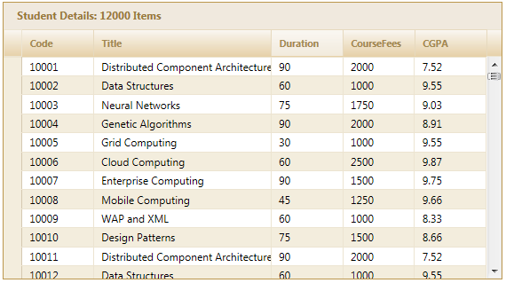
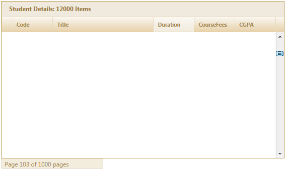
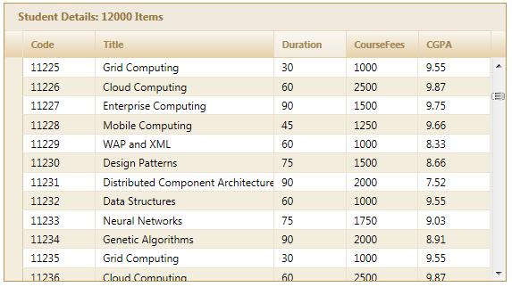

::: {style="DISPLAY: none"}
{#d2h_url_template}{#d2h_package_url style="WIDTH: 0px; DISPLAY: none; HEIGHT: 0px"}
:::

::: {.d2h_secondary_topic style="PADDING-BOTTOM: 10pt; MARGIN: 0pt; PADDING-LEFT: 0pt; PADDING-RIGHT: 0pt; PADDING-TOP: 0pt"}
##### Through Grid Builder {#through-grid-builder style="tab-stops: 0pt"}

1.   Create a model in the application.

2.   Create a strongly typed view.

3.   Call the **AllowVirtualScrolling** method to enable or disable virtual scrolling in the grid.

 

+--------------------------------------------------------------------------------------------------------------------------------------------------------------------------------------------------------------+
| **[\[ASPX\] ]{style="FONT-FAMILY: 'Courier New'"}**                                                                                                                                                          |
|                                                                                                                                                                                                              |
| [ [\<%]{style="BACKGROUND: yellow"}[=]{style="COLOR: blue"}Html.Syncfusion().Grid\<[EditableOrder]{style="COLOR: #2b91af"}\>([\"Grid\"]{style="COLOR: #a31515"})]{style="FONT-FAMILY: 'Courier New'"}        |
|                                                                                                                                                                                                              |
| [                      .Datasource(Model)]{style="FONT-FAMILY: 'Courier New'"}                                                                                                                               |
|                                                                                                                                                                                                              |
| [                  .Column(column =\>]{style="FONT-FAMILY: 'Courier New'"}                                                                                                                                   |
|                                                                                                                                                                                                              |
| [                  {]{style="FONT-FAMILY: 'Courier New'"}                                                                                                                                                    |
|                                                                                                                                                                                                              |
| [                      column.Add(p =\> p.OrderID).HeaderText([\"Order ID\"]{style="COLOR: #a31515"});]{style="FONT-FAMILY: 'Courier New'"}                                                                  |
|                                                                                                                                                                                                              |
| [                      column.Add(p =\> p.EmployeeID).HeaderText([\"Employee ID\"]{style="COLOR: #a31515"});]{style="FONT-FAMILY: 'Courier New'"}                                                            |
|                                                                                                                                                                                                              |
| [                      column.Add(p =\> p.CustomerID).HeaderText([\"Customer ID\"]{style="COLOR: #a31515"});]{style="FONT-FAMILY: 'Courier New'"}                                                            |
|                                                                                                                                                                                                              |
| [                      column.Add(p =\> p.ShipCountry).HeaderText([\"Ship Country\"]{style="COLOR: #a31515"});]{style="FONT-FAMILY: 'Courier New'"}                                                          |
|                                                                                                                                                                                                              |
| [                      column.Add(p =\> p.OrderDate).HeaderText([\"Order Date\"]{style="COLOR: #a31515"}).Format([\"{OrderDate:MM/dd/yyyy}\"]{style="COLOR: #a31515"});]{style="FONT-FAMILY: 'Courier New'"} |
|                                                                                                                                                                                                              |
| [                      column.Add(p =\> p.Freight).HeaderText([\"Freight\"]{style="COLOR: #a31515"});]{style="FONT-FAMILY: 'Courier New'"}                                                                   |
|                                                                                                                                                                                                              |
| [                  })]{style="FONT-FAMILY: 'Courier New'"}                                                                                                                                                   |
|                                                                                                                                                                                                              |
| [                  \-\-\--]{style="FONT-FAMILY: 'Courier New'"}                                                                                                                                              |
|                                                                                                                                                                                                              |
| [                  .Scrolling(scroll=\>{]{style="FONT-FAMILY: 'Courier New'"}                                                                                                                                |
|                                                                                                                                                                                                              |
| [                      **scroll.AllowVirtualScrolling([true]{style="COLOR: blue"});** [// Enabling virtual scrolling.]{style="COLOR: green"}]{style="FONT-FAMILY: 'Courier New'"}                            |
|                                                                                                                                                                                                              |
| []{style="FONT-FAMILY: 'Courier New'"}                                                                                                                                                                       |
|                                                                                                                                                                                                              |
| [                  })[]{style="COLOR: green"}]{style="FONT-FAMILY: 'Courier New'"}                                                                                                                           |
|                                                                                                                                                                                                              |
| [                                                        ]{style="FONT-FAMILY: 'Courier New'"}                                                                                                               |
|                                                                                                                                                                                                              |
| [\-\-\--]{style="FONT-FAMILY: 'Courier New'"}                                                                                                                                                                |
|                                                                                                                                                                                                              |
| [                    ]{style="FONT-FAMILY: 'Courier New'"}                                                                                                                                                   |
|                                                                                                                                                                                                              |
| [         [%\>]{style="BACKGROUND: yellow"}]{style="FONT-FAMILY: 'Courier New'"}                                                                                                                             |
|                                                                                                                                                                                                              |
| []{style="FONT-FAMILY: 'Courier New'"}                                                                                                                                                                       |
+--------------------------------------------------------------------------------------------------------------------------------------------------------------------------------------------------------------+

 

+-------------------------------------------------------------------------------------------------------------------------------------------------------------------------------------------------------------------------+
| **[\[Razor\]]{style="FONT-FAMILY: 'Courier New'"}**[]{style="FONT-FAMILY: 'Courier New'"}                                                                                                                               |
|                                                                                                                                                                                                                         |
| []{style="FONT-FAMILY: 'Courier New'; BACKGROUND: yellow"}                                                                                                                                                              |
|                                                                                                                                                                                                                         |
| [\@{]{style="FONT-FAMILY: 'Courier New'; BACKGROUND: yellow"}                                                                                                                                                           |
|                                                                                                                                                                                                                         |
| [Html.Syncfusion().Grid\<[EditableOrder]{style="COLOR: #2b91af"}\>([\"Grid\"]{style="COLOR: #a31515"})]{style="FONT-FAMILY: 'Courier New'"}                                                                             |
|                                                                                                                                                                                                                         |
| [                      .Datasource(Model)]{style="FONT-FAMILY: 'Courier New'"}                                                                                                                                          |
|                                                                                                                                                                                                                         |
| [                  .Column(column =\>]{style="FONT-FAMILY: 'Courier New'"}                                                                                                                                              |
|                                                                                                                                                                                                                         |
| [                  {]{style="FONT-FAMILY: 'Courier New'"}                                                                                                                                                               |
|                                                                                                                                                                                                                         |
| [                      column.Add(p =\> p.OrderID).HeaderText([\"Order ID\"]{style="COLOR: #a31515"});]{style="FONT-FAMILY: 'Courier New'"}                                                                             |
|                                                                                                                                                                                                                         |
| [                      column.Add(p =\> p.EmployeeID).HeaderText([\"Employee ID\"]{style="COLOR: #a31515"});]{style="FONT-FAMILY: 'Courier New'"}                                                                       |
|                                                                                                                                                                                                                         |
| [                      column.Add(p =\> p.CustomerID).HeaderText([\"Customer ID\"]{style="COLOR: #a31515"});]{style="FONT-FAMILY: 'Courier New'"}                                                                       |
|                                                                                                                                                                                                                         |
| [                      column.Add(p =\> p.ShipCountry).HeaderText([\"Ship Country\"]{style="COLOR: #a31515"});]{style="FONT-FAMILY: 'Courier New'"}                                                                     |
|                                                                                                                                                                                                                         |
| [                      column.Add(p =\> p.OrderDate).HeaderText([\"Order Date\"]{style="COLOR: #a31515"}).Format([\"{OrderDate:MM/dd/yyyy}\"]{style="COLOR: #a31515"});]{style="FONT-FAMILY: 'Courier New'"}            |
|                                                                                                                                                                                                                         |
| [                      column.Add(p =\> p.Freight).HeaderText([\"Freight\"]{style="COLOR: #a31515"});]{style="FONT-FAMILY: 'Courier New'"}                                                                              |
|                                                                                                                                                                                                                         |
| [                  })]{style="FONT-FAMILY: 'Courier New'"}                                                                                                                                                              |
|                                                                                                                                                                                                                         |
| [                  \-\-\--]{style="FONT-FAMILY: 'Courier New'"}                                                                                                                                                         |
|                                                                                                                                                                                                                         |
| [                  .Scrolling(scroll=\>{]{style="FONT-FAMILY: 'Courier New'"}                                                                                                                                           |
|                                                                                                                                                                                                                         |
| **[                      scroll.AllowVirtualScrolling([true]{style="COLOR: blue"});]{style="FONT-FAMILY: 'Courier New'"}**[ [// Enabling virtual scrolling.]{style="COLOR: green"}]{style="FONT-FAMILY: 'Courier New'"} |
|                                                                                                                                                                                                                         |
| []{style="FONT-FAMILY: 'Courier New'"}                                                                                                                                                                                  |
|                                                                                                                                                                                                                         |
| [                  })[]{style="COLOR: green"}]{style="FONT-FAMILY: 'Courier New'"}                                                                                                                                      |
|                                                                                                                                                                                                                         |
| [                                             ]{style="FONT-FAMILY: 'Courier New'"}                                                                                                                                     |
|                                                                                                                                                                                                                         |
| [\-\-\--]{style="FONT-FAMILY: 'Courier New'"}                                                                                                                                                                           |
|                                                                                                                                                                                                                         |
| [.Render()]{style="FONT-FAMILY: 'Courier New'"}                                                                                                                                                                         |
|                                                                                                                                                                                                                         |
| [                    ]{style="FONT-FAMILY: 'Courier New'"}                                                                                                                                                              |
|                                                                                                                                                                                                                         |
| [         [}]{style="BACKGROUND: yellow"}]{style="FONT-FAMILY: 'Courier New'"}                                                                                                                                          |
|                                                                                                                                                                                                                         |
| []{style="FONT-FAMILY: 'Courier New'"}                                                                                                                                                                                  |
|                                                                                                                                                                                                                         |
| []{style="FONT-FAMILY: 'Courier New'"}                                                                                                                                                                                  |
+-------------------------------------------------------------------------------------------------------------------------------------------------------------------------------------------------------------------------+

 

4.   Set the data source and render the view.

 

+--------------------------------------------------------------------------------------------------------------------------------------------------------------------------------------------------------------------------------+
| **[Controller]{style="FONT-FAMILY: 'Courier New'"}**                                                                                                                                                                           |
|                                                                                                                                                                                                                                |
| []{style="FONT-FAMILY: 'Courier New'; COLOR: gray"}                                                                                                                                                                            |
|                                                                                                                                                                                                                                |
| [///]{style="FONT-FAMILY: 'Courier New'; COLOR: gray"}[ ]{style="FONT-FAMILY: 'Courier New'; COLOR: green"}[\<summary\>]{style="FONT-FAMILY: 'Courier New'; COLOR: gray"}[]{style="FONT-FAMILY: 'Courier New'"}                |
|                                                                                                                                                                                                                                |
| [        [///]{style="COLOR: gray"}[ Used for rendering the grid initially.]{style="COLOR: green"}]{style="FONT-FAMILY: 'Courier New'"}                                                                                        |
|                                                                                                                                                                                                                                |
| [        [///]{style="COLOR: gray"}[ ]{style="COLOR: green"}[\</summary\>]{style="COLOR: gray"}]{style="FONT-FAMILY: 'Courier New'"}                                                                                           |
|                                                                                                                                                                                                                                |
| [        [///]{style="COLOR: gray"}[ ]{style="COLOR: green"}[\<returns\>]{style="COLOR: gray"}[View page; it displays the grid.]{style="COLOR: green"}[\</returns\>]{style="COLOR: gray"}]{style="FONT-FAMILY: 'Courier New'"} |
|                                                                                                                                                                                                                                |
| [        [public]{style="COLOR: blue"} [ActionResult]{style="COLOR: #2b91af"} Index()]{style="FONT-FAMILY: 'Courier New'"}                                                                                                     |
|                                                                                                                                                                                                                                |
| [        {]{style="FONT-FAMILY: 'Courier New'"}                                                                                                                                                                                |
|                                                                                                                                                                                                                                |
| [            [IEnumerable]{style="COLOR: #2b91af"} data = [new]{style="COLOR: blue"} [NorthwindDataContext]{style="COLOR: #2b91af"}().Orders.Take(200).ToList();]{style="FONT-FAMILY: 'Courier New'"}                          |
|                                                                                                                                                                                                                                |
| [            [return]{style="COLOR: blue"} View(data);]{style="FONT-FAMILY: 'Courier New'"}                                                                                                                                    |
|                                                                                                                                                                                                                                |
| [        }]{style="FONT-FAMILY: 'Courier New'"}                                                                                                                                                                                |
|                                                                                                                                                                                                                                |
| []{style="FONT-FAMILY: 'Courier New'; COLOR: gray"}                                                                                                                                                                            |
|                                                                                                                                                                                                                                |
| [       ]{style="FONT-FAMILY: 'Courier New'"}                                                                                                                                                                                  |
+--------------------------------------------------------------------------------------------------------------------------------------------------------------------------------------------------------------------------------+

 

5.   In order to work with filter actions, create a **Post** method for **Index** actions and bind the data source to the grid as shown in the following code:

 

+--------------------------------------------------------------------------------------------------------------------------------------------------------------------------------------------------------+
| **[Controller     []{style="COLOR: gray"}]{style="FONT-FAMILY: 'Courier New'"}**                                                                                                                       |
|                                                                                                                                                                                                        |
| []{style="FONT-FAMILY: 'Courier New'; COLOR: gray"}                                                                                                                                                    |
|                                                                                                                                                                                                        |
| [\<summary\>]{style="FONT-FAMILY: 'Courier New'; COLOR: gray"}[]{style="FONT-FAMILY: 'Courier New'"}                                                                                                   |
|                                                                                                                                                                                                        |
| [        [///]{style="COLOR: gray"}[ Paging/editing/filtering requests are mapped to this method. This method invokes the HtmlActionResult]{style="COLOR: green"}]{style="FONT-FAMILY: 'Courier New'"} |
|                                                                                                                                                                                                        |
| [        [///]{style="COLOR: gray"}[ from the grid and the required response is generated.]{style="COLOR: green"}]{style="FONT-FAMILY: 'Courier New'"}                                                 |
|                                                                                                                                                                                                        |
| [        [///]{style="COLOR: gray"}[ ]{style="COLOR: green"}[\</summary\>]{style="COLOR: gray"}]{style="FONT-FAMILY: 'Courier New'"}                                                                   |
|                                                                                                                                                                                                        |
| [        \[[AcceptVerbs]{style="COLOR: #2b91af"}([HttpVerbs]{style="COLOR: #2b91af"}.Post)\]]{style="FONT-FAMILY: 'Courier New'"}                                                                      |
|                                                                                                                                                                                                        |
| [        [public]{style="COLOR: blue"} [ActionResult]{style="COLOR: #2b91af"} Index([PagingParams]{style="COLOR: #2b91af"} args)]{style="FONT-FAMILY: 'Courier New'"}                                  |
|                                                                                                                                                                                                        |
| [        {]{style="FONT-FAMILY: 'Courier New'"}                                                                                                                                                        |
|                                                                                                                                                                                                        |
| [            [IEnumerable]{style="COLOR: #2b91af"} data = [new]{style="COLOR: blue"} [NorthwindDataContext]{style="COLOR: #2b91af"}().Orders.Take(200).ToList();]{style="FONT-FAMILY: 'Courier New'"}  |
|                                                                                                                                                                                                        |
| [            [return]{style="COLOR: blue"} data.GridActions\<[Order]{style="COLOR: #2b91af"}\>();]{style="FONT-FAMILY: 'Courier New'"}                                                                 |
|                                                                                                                                                                                                        |
| []{style="FONT-FAMILY: 'Courier New'"}                                                                                                                                                                 |
|                                                                                                                                                                                                        |
| [        }]{style="FONT-FAMILY: 'Courier New'"}                                                                                                                                                        |
|                                                                                                                                                                                                        |
| []{style="FONT-FAMILY: 'Courier New'"}                                                                                                                                                                 |
+--------------------------------------------------------------------------------------------------------------------------------------------------------------------------------------------------------+

 

6.   Run the application. You can see the grid loaded with the initial items and upon scrolling the required data is loaded.

 

{border="0"}

Figure 221: Grid with Initial Items Loaded

 

{border="0"}

Figure 222: Grid on Scrolling

 

{border="0"}

Figure 223: Required Data Loaded on Scrolling Completed

 

 

 

[]{#related-topics}
:::
