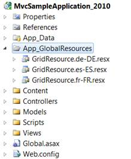
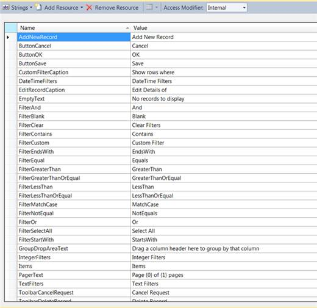
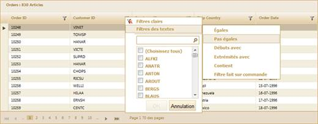

::: {style="DISPLAY: none"}
{#d2h_url_template}{#d2h_package_url style="WIDTH: 0px; DISPLAY: none; HEIGHT: 0px"}
:::

::::::::: {.d2h_secondary_topic style="PADDING-BOTTOM: 10pt; MARGIN: 0pt; PADDING-LEFT: 0pt; PADDING-RIGHT: 0pt; PADDING-TOP: 0pt"}
#### Through GridBuilder {#through-gridbuilder style="tab-stops: 0pt"}

 

To enable the localization feature using **GridBuilder**:

 

1.   Create a model in the application (Refer [[to ]{style="COLOR: windowtext; TEXT-DECORATION: none; text-underline: none"}]{.UGHyperlink}[Getting Started\>Adding a Model to the Application]{.UGHyperlink}).

2.   Create a strongly typed view (Refer to [How to\>Strongly Typed View]{.UGHyperlink}[[)]{style="COLOR: windowtext"}]{.UGHyperlink}.

3.   Create a folder named **App_GlobalResources** in the application and create your own localization resource (.resx) file in this folder.

 

{border="0"}

Figure 264: App_GlobalResource Folder

**[]{style="FONT-FAMILY: 'Myriad Pro','sans-serif'"}** 

**[]{style="FONT-FAMILY: 'Myriad Pro','sans-serif'"}** 

In order to create a new localization resource file, download the default localization file from the following location, rename it, and then use Visual Studio to edit the values.

[]{style="FONT-FAMILY: 'Myriad Pro','sans-serif'"} 

[[GridResource.zip]{.UGHyperlink}](http://help.syncfusion.com/support/grid_mvc/v8.3.0.20/UG/GridResource.zip)[]{.UGHyperlink}

[]{style="FONT-FAMILY: 'Myriad Pro','sans-serif'"} 

The default English localization file is shown in the following screenshot:

 

{border="0"}

Figure 265: Resource File For English Localization

**[]{style="FONT-FAMILY: 'Myriad Pro','sans-serif'"}** 

***[]{style="LAYOUT-GRID-MODE: line; FONT-SIZE: 9pt"}*** 

::: {style="BORDER-BOTTOM: windowtext 1pt solid; BORDER-LEFT: medium none; PADDING-BOTTOM: 1pt; MARGIN-TOP: 9pt; PADDING-LEFT: 0pt; PADDING-RIGHT: 0pt; MARGIN-BOTTOM: 9pt; BORDER-TOP: windowtext 1pt solid; BORDER-RIGHT: medium none; PADDING-TOP: 1pt"}
{border="0"}Note: The name of the localization file should be in the format GridResource.\[culture\].resx. For example: \"GridLocalization.fr-FR.resx\"
:::

[]{style="FONT-FAMILY: 'Myriad Pro','sans-serif'"} 

1.   Create the Grid control in the view and configure its properties.

2.   There are two ways to specify the culture information, namely:

[]{style="FONT-FAMILY: 'Myriad Pro','sans-serif'"} 

[·      ]{style="FONT-FAMILY: Symbol"}Setting the **CurrentUICulture** property of the **CurrentThread** inside your **Action** method:

[]{style="FONT-FAMILY: 'Myriad Pro','sans-serif'"} 

+------------------------------------------------------------------------------------------------------------------------------------------------------------------------------------------------------------------------------------------------------------------+
| **[\[C#\]]{style="FONT-FAMILY: 'Courier New'"}**                                                                                                                                                                                                                 |
|                                                                                                                                                                                                                                                                  |
| [   [public]{style="COLOR: blue"} [ActionResult]{style="COLOR: #2b91af"} Index()\                                                                                                                                                                                |
|    {\                                                                                                                                                                                                                                                            |
|              System.Threading.[Thread]{style="COLOR: #2b91af"}.CurrentThread.CurrentUICulture = [new]{style="COLOR: blue"} System.Globalization.[CultureInfo]{style="COLOR: #2b91af"}([\"fr-FR\"]{style="COLOR: #a31515"});]{style="FONT-FAMILY: 'Courier New'"} |
|                                                                                                                                                                                                                                                                  |
| [        [var]{style="COLOR: blue"} data = [new]{style="COLOR: blue"} [NorthwindDataContext]{style="COLOR: #2b91af"}().Orders;\                                                                                                                                  |
|         [return]{style="COLOR: blue"} View(data);]{style="FONT-FAMILY: 'Courier New'"}                                                                                                                                                                           |
|                                                                                                                                                                                                                                                                  |
| [   }]{style="FONT-FAMILY: 'Courier New'"}                                                                                                                                                                                                                       |
|                                                                                                                                                                                                                                                                  |
|                                                                                                                                                                                                                                                                  |
+------------------------------------------------------------------------------------------------------------------------------------------------------------------------------------------------------------------------------------------------------------------+

[]{style="FONT-FAMILY: 'Myriad Pro','sans-serif'"} 

[·      ]{style="FONT-FAMILY: Symbol"}Specifying the culture using the **Localize()** method:

[]{style="FONT-FAMILY: 'Myriad Pro','sans-serif'"} 

::: {align="center"}
+-----------------------------------------------------------------------------------------------------------------------------------------------------------------------------------------------------------------------------------------------------+
| **[View \[ASPX\]]{style="FONT-FAMILY: 'Courier New'"}**                                                                                                                                                                                             |
|                                                                                                                                                                                                                                                     |
| **[]{style="FONT-FAMILY: 'Courier New'"}**                                                                                                                                                                                                          |
|                                                                                                                                                                                                                                                     |
| [ ]{style="FONT-FAMILY: Consolas"}[\<%]{style="FONT-FAMILY: 'Courier New'; BACKGROUND: yellow"}[=]{style="FONT-FAMILY: 'Courier New'; COLOR: blue"}[Html.Syncfusion().Grid\<[Order]{style="COLOR: #2b91af"}\>([\"Grid1\"]{style="COLOR: #a31515"})\ |
|        .Datasource(Model)\                                                                                                                                                                                                                          |
|        .Caption([\"Orders\"]{style="COLOR: #a31515"})\                                                                                                                                                                                              |
|        .EnablePaging()\                                                                                                                                                                                                                             |
|        .EnableSorting()\                                                                                                                                                                                                                            |
|        .EnableFiltering()\                                                                                                                                                                                                                          |
|        .AutoFormat([Skins]{style="COLOR: #2b91af"}.Sandune)  \                                                                                                                                                                                      |
|        **.Localize([\"fr-FR\"]{style="COLOR: #a31515"})**[// Specify the culture code.    ]{style="COLOR: green"}\                                                                                                                                  |
|        .Column( columns =\> {\                                                                                                                                                                                                                      |
|            columns.Add(p =\> p.OrderID).HeaderText([\"Order ID\"]{style="COLOR: #a31515"});\                                                                                                                                                        |
|            columns.Add(p =\> p.CustomerID).HeaderText([\"Customer ID\"]{style="COLOR: #a31515"});\                                                                                                                                                  |
|            columns.Add(p =\> p.EmployeeID).HeaderText([\"Employee ID\"]{style="COLOR: #a31515"});           \                                                                                                                                       |
|            columns.Add(P =\> P.ShipCountry).HeaderText([\"Ship Country\"]{style="COLOR: #a31515"});\                                                                                                                                                |
|            columns.Add(p =\> p.OrderDate).HeaderText([\"Order Date\"]{style="COLOR: #a31515"}).Format([\"{0:dd-MM-yyyy}\"]{style="COLOR: #a31515"});\                                                                                               |
|            })\                                                                                                                                                                                                                                      |
|        [%\>]{style="BACKGROUND: yellow"}]{style="FONT-FAMILY: 'Courier New'"}                                                                                                                                                                       |
|                                                                                                                                                                                                                                                     |
| [   ]{style="FONT-FAMILY: 'Courier New'"}                                                                                                                                                                                                           |
+-----------------------------------------------------------------------------------------------------------------------------------------------------------------------------------------------------------------------------------------------------+
:::

[]{style="FONT-FAMILY: 'Myriad Pro','sans-serif'"} 

[]{style="FONT-FAMILY: 'Myriad Pro','sans-serif'"} 

::: {align="center"}
+-----------------------------------------------------------------------------------------------------------------------------------------------------------------------------------------------------------------------------------------------------+
| **[View \[cshtml\]]{style="FONT-FAMILY: 'Courier New'"}**                                                                                                                                                                                           |
|                                                                                                                                                                                                                                                     |
| **[]{style="FONT-FAMILY: 'Courier New'"}**                                                                                                                                                                                                          |
|                                                                                                                                                                                                                                                     |
| [ ]{style="FONT-FAMILY: Consolas"}[\@{]{style="FONT-FAMILY: 'Courier New'; BACKGROUND: yellow"}[ ]{style="FONT-FAMILY: 'Courier New'; COLOR: blue"}[Html.Syncfusion().Grid\<[Order]{style="COLOR: #2b91af"}\>([\"Grid1\"]{style="COLOR: #a31515"})\ |
|        .Datasource(Model)\                                                                                                                                                                                                                          |
|        .Caption([\"Orders\"]{style="COLOR: #a31515"})\                                                                                                                                                                                              |
|        .EnablePaging()\                                                                                                                                                                                                                             |
|        .EnableSorting()\                                                                                                                                                                                                                            |
|        .EnableFiltering()\                                                                                                                                                                                                                          |
|        .AutoFormat([Skins]{style="COLOR: #2b91af"}.Sandune)  \                                                                                                                                                                                      |
|        **.Localize([\"fr-FR\"]{style="COLOR: #a31515"})**[// Specify the culture code.    ]{style="COLOR: green"}\                                                                                                                                  |
|        .Column( columns =\> {\                                                                                                                                                                                                                      |
|            columns.Add(p =\> p.OrderID).HeaderText([\"Order ID\"]{style="COLOR: #a31515"});\                                                                                                                                                        |
|            columns.Add(p =\> p.CustomerID).HeaderText([\"Customer ID\"]{style="COLOR: #a31515"});\                                                                                                                                                  |
|            columns.Add(p =\> p.EmployeeID).HeaderText([\"Employee ID\"]{style="COLOR: #a31515"});           \                                                                                                                                       |
|            columns.Add(P =\> P.ShipCountry).HeaderText([\"Ship Country\"]{style="COLOR: #a31515"});\                                                                                                                                                |
|            columns.Add(p =\> p.OrderDate).HeaderText([\"Order Date\"]{style="COLOR: #a31515"}).Format([\"{0:dd-MM-yyyy}\"]{style="COLOR: #a31515"});\                                                                                               |
|            }).Render();]{style="FONT-FAMILY: 'Courier New'"}                                                                                                                                                                                        |
|                                                                                                                                                                                                                                                     |
| [       [}]{style="BACKGROUND: yellow"}]{style="FONT-FAMILY: 'Courier New'"}                                                                                                                                                                        |
|                                                                                                                                                                                                                                                     |
| [   ]{style="FONT-FAMILY: 'Courier New'"}                                                                                                                                                                                                           |
+-----------------------------------------------------------------------------------------------------------------------------------------------------------------------------------------------------------------------------------------------------+
:::

[]{style="FONT-FAMILY: 'Myriad Pro','sans-serif'"} 

3.   Set its data source and render the **View**.

[]{style="FONT-FAMILY: 'Myriad Pro','sans-serif'"} 

::: {align="center"}
+-----------------------------------------------------------------------------------------------------------------------------------------------------------------------------------------------------------------------------------+
| **[\[C#\]]{style="FONT-FAMILY: 'Courier New'"}**                                                                                                                                                                                  |
|                                                                                                                                                                                                                                   |
| [        ]{style="FONT-FAMILY: Consolas; COLOR: gray"}[///]{style="FONT-FAMILY: 'Courier New'; COLOR: gray"}[ ]{style="FONT-FAMILY: 'Courier New'; COLOR: green"}[\<summary\>]{style="FONT-FAMILY: 'Courier New'; COLOR: gray"}[\ |
|         [///]{style="COLOR: gray"}[ Used for rendering the grid initially.]{style="COLOR: green"}\                                                                                                                                |
|         [///]{style="COLOR: gray"}[ ]{style="COLOR: green"}[\</summary\>]{style="COLOR: gray"}\                                                                                                                                   |
|         [///]{style="COLOR: gray"}[ ]{style="COLOR: green"}[\<returns\>]{style="COLOR: gray"}[View page; it displays the grid.]{style="COLOR: green"}[\</returns\>]{style="COLOR: gray"}\                                         |
|         [public]{style="COLOR: blue"} [ActionResult]{style="COLOR: #2b91af"} Index()\                                                                                                                                             |
|         {\                                                                                                                                                                                                                        |
|             [var]{style="COLOR: blue"} data = [new]{style="COLOR: blue"} [NorthwindDataContext]{style="COLOR: #2b91af"}().Orders;\                                                                                                |
|             [return]{style="COLOR: blue"} View(data);\                                                                                                                                                                            |
|         }]{style="FONT-FAMILY: 'Courier New'"}                                                                                                                                                                                    |
|                                                                                                                                                                                                                                   |
| [   ]{style="FONT-FAMILY: 'Courier New'"}                                                                                                                                                                                         |
+-----------------------------------------------------------------------------------------------------------------------------------------------------------------------------------------------------------------------------------+
:::

[]{style="FONT-FAMILY: 'Myriad Pro','sans-serif'"} 

4.   Run the application. The grid will appear as shown below:

[]{style="FONT-FAMILY: 'Myriad Pro','sans-serif'"} 

{border="0"}

Figure 266: Grid With French Localization

 

Customization

 

If you want to customize the localization resource file folder path, then use the **LocalizationPath() ** method.

[]{style="FONT-FAMILY: 'Myriad Pro','sans-serif'"} 

::: {align="center"}
+-----------------------------------------------------------------------------------------------------------------------------------------------------------------------------------------------------------------------------------------------------+
| **[View \[ASPX\]]{style="FONT-FAMILY: 'Courier New'"}**                                                                                                                                                                                             |
|                                                                                                                                                                                                                                                     |
| **[]{style="FONT-FAMILY: 'Courier New'"}**                                                                                                                                                                                                          |
|                                                                                                                                                                                                                                                     |
| [ ]{style="FONT-FAMILY: Consolas"}[\<%]{style="FONT-FAMILY: 'Courier New'; BACKGROUND: yellow"}[=]{style="FONT-FAMILY: 'Courier New'; COLOR: blue"}[Html.Syncfusion().Grid\<[Order]{style="COLOR: #2b91af"}\>([\"Grid1\"]{style="COLOR: #a31515"})\ |
|        .Datasource(Model)\                                                                                                                                                                                                                          |
|        .Caption([\"Orders\"]{style="COLOR: #a31515"})]{style="FONT-FAMILY: 'Courier New'"}                                                                                                                                                          |
|                                                                                                                                                                                                                                                     |
| [       .Localize([\"fr-FR\"]{style="COLOR: #a31515"})[// Specify the culture code.  ]{style="COLOR: green"}]{style="FONT-FAMILY: 'Courier New'"}                                                                                                   |
|                                                                                                                                                                                                                                                     |
| **[       ]{style="FONT-FAMILY: Consolas"}[.LocalizationPath([\"\~/App_LocalResources\"]{style="COLOR: #a31515"}) [// Specify the folder. ]{style="COLOR: green"}]{style="FONT-FAMILY: 'Courier New'"}**                                            |
|                                                                                                                                                                                                                                                     |
| [       [%\>]{style="BACKGROUND: yellow"}]{style="FONT-FAMILY: 'Courier New'"}                                                                                                                                                                      |
|                                                                                                                                                                                                                                                     |
| [   ]{style="FONT-FAMILY: 'Courier New'"}                                                                                                                                                                                                           |
+-----------------------------------------------------------------------------------------------------------------------------------------------------------------------------------------------------------------------------------------------------+
:::

[   ]{style="FONT-FAMILY: 'Courier New'"}

[]{style="FONT-FAMILY: 'Myriad Pro','sans-serif'"} 

::: {align="center"}
+-----------------------------------------------------------------------------------------------------------------------------------------------------------------------------------------------------------------------------------------------------+
| **[View \[cshtml\]]{style="FONT-FAMILY: 'Courier New'"}**                                                                                                                                                                                           |
|                                                                                                                                                                                                                                                     |
| **[]{style="FONT-FAMILY: 'Courier New'"}**                                                                                                                                                                                                          |
|                                                                                                                                                                                                                                                     |
| [ ]{style="FONT-FAMILY: Consolas"}[\@{]{style="FONT-FAMILY: 'Courier New'; BACKGROUND: yellow"}[ ]{style="FONT-FAMILY: 'Courier New'; COLOR: blue"}[Html.Syncfusion().Grid\<[Order]{style="COLOR: #2b91af"}\>([\"Grid1\"]{style="COLOR: #a31515"})\ |
|        .Datasource(Model)\                                                                                                                                                                                                                          |
|        .Caption([\"Orders\"]{style="COLOR: #a31515"})]{style="FONT-FAMILY: 'Courier New'"}                                                                                                                                                          |
|                                                                                                                                                                                                                                                     |
| [       .Localize([\"fr-FR\"]{style="COLOR: #a31515"})[// Specify the culture code.  ]{style="COLOR: green"}]{style="FONT-FAMILY: 'Courier New'"}                                                                                                   |
|                                                                                                                                                                                                                                                     |
| **[        ]{style="FONT-FAMILY: Consolas"}[.LocalizationPath([\"\~/App_LocalResources\"]{style="COLOR: #a31515"}) [// Specify the folder. ]{style="COLOR: green"}]{style="FONT-FAMILY: 'Courier New'"}**                                           |
|                                                                                                                                                                                                                                                     |
| [       .Render();        []{style="BACKGROUND: yellow"}]{style="FONT-FAMILY: 'Courier New'"}                                                                                                                                                       |
|                                                                                                                                                                                                                                                     |
| [}]{style="FONT-FAMILY: 'Courier New'; BACKGROUND: yellow"}[]{style="FONT-FAMILY: 'Courier New'"}                                                                                                                                                   |
|                                                                                                                                                                                                                                                     |
| [   ]{style="FONT-FAMILY: 'Courier New'"}                                                                                                                                                                                                           |
+-----------------------------------------------------------------------------------------------------------------------------------------------------------------------------------------------------------------------------------------------------+
:::

[   ]{style="FONT-FAMILY: 'Courier New'"}[]{style="FONT-FAMILY: 'Myriad Pro','sans-serif'"}

[]{style="FONT-FAMILY: 'Myriad Pro','sans-serif'"} 

[]{#related-topics}
:::::::::
