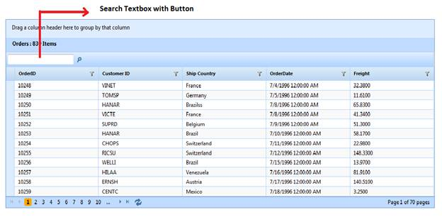

::: {style="DISPLAY: none"}
{#d2h_url_template}{#d2h_package_url style="WIDTH: 0px; DISPLAY: none; HEIGHT: 0px"}
:::

::: {.d2h_secondary_topic style="PADDING-BOTTOM: 10pt; MARGIN: 0pt; PADDING-LEFT: 0pt; PADDING-RIGHT: 0pt; PADDING-TOP: 0pt"}
#### Through GridBuilder {#through-gridbuilder style="tab-stops: 0pt"}

To add the **Search** text box to the grid through GridBuilder:

1.   Create a model in the application (Refer to GettingStarted \> Adding a Model to the Application).

2.  Create a strongly typed view (Refer to [How to \> Strongly Typed View]{style="FONT-FAMILY: 'Arial','sans-serif'"}).

3.  In the **view**, you can use its **Model** property in **Datasource()** to bind the data source.

 

+-----------------------------------------------------------------------------------------------------------------------------------------------------------------------------------------------------------------------------------------------------------------------------------------------------------------+
| [ ]{style="FONT-FAMILY: 'Times New Roman','serif'; FONT-SIZE: 12pt"}**[View \[ASPX\]]{style="FONT-FAMILY: 'Courier New'"}**[]{style="FONT-FAMILY: 'Times New Roman','serif'"}                                                                                                                                   |
|                                                                                                                                                                                                                                                                                                                 |
| [\<%]{style="FONT-FAMILY: 'Courier New'; BACKGROUND: yellow"}[=]{style="FONT-FAMILY: 'Courier New'; COLOR: blue"}[Html.Syncfusion().Grid\<[Order]{style="COLOR: #2b91af"}\>([\"SearchingGrid\"]{style="COLOR: #a31515"})]{style="FONT-FAMILY: 'Courier New'"}[]{style="FONT-FAMILY: 'Times New Roman','serif'"} |
|                                                                                                                                                                                                                                                                                                                 |
| **[       .Datasource(Model)]{style="FONT-FAMILY: 'Courier New'"}**[]{style="FONT-FAMILY: 'Times New Roman','serif'"}                                                                                                                                                                                           |
|                                                                                                                                                                                                                                                                                                                 |
| [       .Caption([\"Orders\"]{style="COLOR: #a31515"})]{style="FONT-FAMILY: 'Courier New'"}[]{style="FONT-FAMILY: 'Times New Roman','serif'"}                                                                                                                                                                   |
|                                                                                                                                                                                                                                                                                                                 |
| [       .EnablePaging() ]{style="FONT-FAMILY: 'Courier New'"}[]{style="FONT-FAMILY: 'Times New Roman','serif'"}                                                                                                                                                                                                 |
|                                                                                                                                                                                                                                                                                                                 |
| [       .AutoFormat([Skins]{style="COLOR: #2b91af"}.Sandune) ]{style="FONT-FAMILY: 'Courier New'"}[]{style="FONT-FAMILY: 'Times New Roman','serif'"}                                                                                                                                                            |
|                                                                                                                                                                                                                                                                                                                 |
| [       .Column( columns =\> {]{style="FONT-FAMILY: 'Courier New'"}[]{style="FONT-FAMILY: 'Times New Roman','serif'"}                                                                                                                                                                                           |
|                                                                                                                                                                                                                                                                                                                 |
| [           columns.Add(p =\> p.OrderID).HeaderText([\"Order ID\"]{style="COLOR: #a31515"});]{style="FONT-FAMILY: 'Courier New'"}[]{style="FONT-FAMILY: 'Times New Roman','serif'"}                                                                                                                             |
|                                                                                                                                                                                                                                                                                                                 |
| [           columns.Add(p =\> p.CustomerID).HeaderText([\"Customer ID\"]{style="COLOR: #a31515"});]{style="FONT-FAMILY: 'Courier New'"}[]{style="FONT-FAMILY: 'Times New Roman','serif'"}                                                                                                                       |
|                                                                                                                                                                                                                                                                                                                 |
| [           columns.Add(p =\> p.EmployeeID).HeaderText([\"Employee ID\"]{style="COLOR: #a31515"});           ]{style="FONT-FAMILY: 'Courier New'"}[]{style="FONT-FAMILY: 'Times New Roman','serif'"}                                                                                                            |
|                                                                                                                                                                                                                                                                                                                 |
| [           columns.Add(P =\> P.ShipCountry).HeaderText([\"Ship Country\"]{style="COLOR: #a31515"});]{style="FONT-FAMILY: 'Courier New'"}[]{style="FONT-FAMILY: 'Times New Roman','serif'"}                                                                                                                     |
|                                                                                                                                                                                                                                                                                                                 |
| [           columns.Add(p =\> p.ShipCity).HeaderText([\"Ship City\"]{style="COLOR: #a31515"});]{style="FONT-FAMILY: 'Courier New'"}[]{style="FONT-FAMILY: 'Times New Roman','serif'"}                                                                                                                           |
|                                                                                                                                                                                                                                                                                                                 |
| [           })[%\>]{style="BACKGROUND: yellow"}]{style="FONT-FAMILY: 'Courier New'"}[]{style="FONT-FAMILY: 'Times New Roman','serif'; FONT-SIZE: 12pt"}                                                                                                                                                         |
+-----------------------------------------------------------------------------------------------------------------------------------------------------------------------------------------------------------------------------------------------------------------------------------------------------------------+

[]{style="FONT-FAMILY: 'Times New Roman','serif'; FONT-SIZE: 12pt"} 

+-----------------------------------------------------------------------------------------------------------------------------------------------------------------------------------------------------------------------------------------------------------------------------------------------------------------+
| **[View \[cshtml\]]{style="FONT-FAMILY: 'Courier New'"}**[ ]{style="FONT-FAMILY: 'Times New Roman','serif'"}                                                                                                                                                                                                    |
|                                                                                                                                                                                                                                                                                                                 |
| [\@{]{style="FONT-FAMILY: 'Courier New'; BACKGROUND: yellow"}[ ]{style="FONT-FAMILY: 'Courier New'; COLOR: blue"}[Html.Syncfusion().Grid\<[Order]{style="COLOR: #2b91af"}\>([\"SearchingGrid\"]{style="COLOR: #a31515"})]{style="FONT-FAMILY: 'Courier New'"}[]{style="FONT-FAMILY: 'Times New Roman','serif'"} |
|                                                                                                                                                                                                                                                                                                                 |
| **[       .Datasource(Model)]{style="FONT-FAMILY: 'Courier New'"}**[]{style="FONT-FAMILY: 'Times New Roman','serif'"}                                                                                                                                                                                           |
|                                                                                                                                                                                                                                                                                                                 |
| [       .Caption([\"Orders\"]{style="COLOR: #a31515"})]{style="FONT-FAMILY: 'Courier New'"}[]{style="FONT-FAMILY: 'Times New Roman','serif'"}                                                                                                                                                                   |
|                                                                                                                                                                                                                                                                                                                 |
| [       .EnablePaging() ]{style="FONT-FAMILY: 'Courier New'"}[]{style="FONT-FAMILY: 'Times New Roman','serif'"}                                                                                                                                                                                                 |
|                                                                                                                                                                                                                                                                                                                 |
| [       .AutoFormat([Skins]{style="COLOR: #2b91af"}.Sandune) ]{style="FONT-FAMILY: 'Courier New'"}[]{style="FONT-FAMILY: 'Times New Roman','serif'"}                                                                                                                                                            |
|                                                                                                                                                                                                                                                                                                                 |
| [       .Column( columns =\> {]{style="FONT-FAMILY: 'Courier New'"}[]{style="FONT-FAMILY: 'Times New Roman','serif'"}                                                                                                                                                                                           |
|                                                                                                                                                                                                                                                                                                                 |
| [           columns.Add(p =\> p.OrderID).HeaderText([\"Order ID\"]{style="COLOR: #a31515"});]{style="FONT-FAMILY: 'Courier New'"}[]{style="FONT-FAMILY: 'Times New Roman','serif'"}                                                                                                                             |
|                                                                                                                                                                                                                                                                                                                 |
| [           columns.Add(p =\> p.CustomerID).HeaderText([\"Customer ID\"]{style="COLOR: #a31515"});]{style="FONT-FAMILY: 'Courier New'"}[]{style="FONT-FAMILY: 'Times New Roman','serif'"}                                                                                                                       |
|                                                                                                                                                                                                                                                                                                                 |
| [           columns.Add(p =\> p.EmployeeID).HeaderText([\"Employee ID\"]{style="COLOR: #a31515"});           ]{style="FONT-FAMILY: 'Courier New'"}[]{style="FONT-FAMILY: 'Times New Roman','serif'"}                                                                                                            |
|                                                                                                                                                                                                                                                                                                                 |
| [           columns.Add(P =\> P.ShipCountry).HeaderText([\"Ship Country\"]{style="COLOR: #a31515"});]{style="FONT-FAMILY: 'Courier New'"}[]{style="FONT-FAMILY: 'Times New Roman','serif'"}                                                                                                                     |
|                                                                                                                                                                                                                                                                                                                 |
| [           columns.Add(p =\> p.ShipCity).HeaderText([\"Ship City\"]{style="COLOR: #a31515"});]{style="FONT-FAMILY: 'Courier New'"}[]{style="FONT-FAMILY: 'Times New Roman','serif'"}                                                                                                                           |
|                                                                                                                                                                                                                                                                                                                 |
| [           }).Render();            [}]{style="BACKGROUND: yellow"}]{style="FONT-FAMILY: 'Courier New'"}[]{style="FONT-FAMILY: 'Times New Roman','serif'; FONT-SIZE: 12pt"}                                                                                                                                     |
+-----------------------------------------------------------------------------------------------------------------------------------------------------------------------------------------------------------------------------------------------------------------------------------------------------------------+

[]{style="FONT-FAMILY: 'Times New Roman','serif'; FONT-SIZE: 12pt"} 

4.  To activate the search feature in the **view**, set the **AllowSearching** property to **True.**[ ]{style="FONT-SIZE: 12pt"}

 

+-----------------------------------------------------------------------------------------------------------------------------------------------------------------------------------------------------------------------------------------------------------------------------------------------------------------+
| **[View \[ASPX\]]{style="FONT-FAMILY: 'Courier New'"}**[ ]{style="FONT-FAMILY: 'Times New Roman','serif'"}                                                                                                                                                                                                      |
|                                                                                                                                                                                                                                                                                                                 |
| [\<%]{style="FONT-FAMILY: 'Courier New'; BACKGROUND: yellow"}[=]{style="FONT-FAMILY: 'Courier New'; COLOR: blue"}[Html.Syncfusion().Grid\<[Order]{style="COLOR: #2b91af"}\>([\"SearchingGrid\"]{style="COLOR: #a31515"})]{style="FONT-FAMILY: 'Courier New'"}[]{style="FONT-FAMILY: 'Times New Roman','serif'"} |
|                                                                                                                                                                                                                                                                                                                 |
| [       .Datasource(Model)]{style="FONT-FAMILY: 'Courier New'"}[]{style="FONT-FAMILY: 'Times New Roman','serif'"}                                                                                                                                                                                               |
|                                                                                                                                                                                                                                                                                                                 |
| [       .Caption([\"Orders\"]{style="COLOR: #a31515"})]{style="FONT-FAMILY: 'Courier New'"}[]{style="FONT-FAMILY: 'Times New Roman','serif'"}                                                                                                                                                                   |
|                                                                                                                                                                                                                                                                                                                 |
| [       **.AllowSearching(**]{style="FONT-FAMILY: 'Courier New'"}[true]{style="FONT-FAMILY: 'Courier New'; COLOR: blue"}**[)]{style="FONT-FAMILY: 'Courier New'"}**[]{style="FONT-FAMILY: 'Times New Roman','serif'"}                                                                                           |
|                                                                                                                                                                                                                                                                                                                 |
| [       .EnablePaging() ]{style="FONT-FAMILY: 'Courier New'"}[]{style="FONT-FAMILY: 'Times New Roman','serif'"}                                                                                                                                                                                                 |
|                                                                                                                                                                                                                                                                                                                 |
| [       .AutoFormat([Skins]{style="COLOR: #2b91af"}.Sandune) ]{style="FONT-FAMILY: 'Courier New'"}[]{style="FONT-FAMILY: 'Times New Roman','serif'"}                                                                                                                                                            |
|                                                                                                                                                                                                                                                                                                                 |
| [       .Column( columns =\> {]{style="FONT-FAMILY: 'Courier New'"}[]{style="FONT-FAMILY: 'Times New Roman','serif'"}                                                                                                                                                                                           |
|                                                                                                                                                                                                                                                                                                                 |
| [           columns.Add(p =\> p.OrderID).HeaderText([\"Order ID\"]{style="COLOR: #a31515"});]{style="FONT-FAMILY: 'Courier New'"}[]{style="FONT-FAMILY: 'Times New Roman','serif'"}                                                                                                                             |
|                                                                                                                                                                                                                                                                                                                 |
| [           columns.Add(p =\> p.CustomerID).HeaderText([\"Customer ID\"]{style="COLOR: #a31515"});]{style="FONT-FAMILY: 'Courier New'"}[]{style="FONT-FAMILY: 'Times New Roman','serif'"}                                                                                                                       |
|                                                                                                                                                                                                                                                                                                                 |
| [           columns.Add(p =\> p.EmployeeID).HeaderText([\"Employee ID\"]{style="COLOR: #a31515"});           ]{style="FONT-FAMILY: 'Courier New'"}[]{style="FONT-FAMILY: 'Times New Roman','serif'"}                                                                                                            |
|                                                                                                                                                                                                                                                                                                                 |
| [           columns.Add(P =\> P.ShipCountry).HeaderText([\"Ship Country\"]{style="COLOR: #a31515"});]{style="FONT-FAMILY: 'Courier New'"}[]{style="FONT-FAMILY: 'Times New Roman','serif'"}                                                                                                                     |
|                                                                                                                                                                                                                                                                                                                 |
| [           columns.Add(p =\> p.ShipCity).HeaderText([\"Ship City\"]{style="COLOR: #a31515"});]{style="FONT-FAMILY: 'Courier New'"}[]{style="FONT-FAMILY: 'Times New Roman','serif'"}                                                                                                                           |
|                                                                                                                                                                                                                                                                                                                 |
| [           })[%\>]{style="BACKGROUND: yellow"}]{style="FONT-FAMILY: 'Courier New'"}[]{style="FONT-FAMILY: 'Times New Roman','serif'"}                                                                                                                                                                          |
+-----------------------------------------------------------------------------------------------------------------------------------------------------------------------------------------------------------------------------------------------------------------------------------------------------------------+

[]{style="FONT-FAMILY: 'Times New Roman','serif'; FONT-SIZE: 12pt"} 

+----------------------------------------------------------------------------------------------------------------------------------------------------------------------------------------------------------------------------------------------------------------------------------------------------------------+
| [ ]{style="FONT-FAMILY: 'Times New Roman','serif'; FONT-SIZE: 12pt"}**[View \[cshtml\]]{style="FONT-FAMILY: 'Courier New'"}**[]{style="FONT-FAMILY: 'Times New Roman','serif'"}                                                                                                                                |
|                                                                                                                                                                                                                                                                                                                |
| []{style="FONT-FAMILY: 'Times New Roman','serif'"}                                                                                                                                                                                                                                                             |
|                                                                                                                                                                                                                                                                                                                |
| [@(]{style="FONT-FAMILY: 'Courier New'; BACKGROUND: yellow"}[ ]{style="FONT-FAMILY: 'Courier New'; COLOR: blue"}[Html.Syncfusion().Grid\<[Order]{style="COLOR: #2b91af"}\>([\"SearchingGrid\"]{style="COLOR: #a31515"})]{style="FONT-FAMILY: 'Courier New'"}[]{style="FONT-FAMILY: 'Times New Roman','serif'"} |
|                                                                                                                                                                                                                                                                                                                |
| [       .Datasource(Model)]{style="FONT-FAMILY: 'Courier New'"}[]{style="FONT-FAMILY: 'Times New Roman','serif'"}                                                                                                                                                                                              |
|                                                                                                                                                                                                                                                                                                                |
| [       .Caption([\"Orders\"]{style="COLOR: #a31515"})]{style="FONT-FAMILY: 'Courier New'"}[]{style="FONT-FAMILY: 'Times New Roman','serif'"}                                                                                                                                                                  |
|                                                                                                                                                                                                                                                                                                                |
| [       **.AllowSearching(**]{style="FONT-FAMILY: 'Courier New'"}[true]{style="FONT-FAMILY: 'Courier New'; COLOR: blue"}**[)]{style="FONT-FAMILY: 'Courier New'"}**[]{style="FONT-FAMILY: 'Times New Roman','serif'"}                                                                                          |
|                                                                                                                                                                                                                                                                                                                |
| [       .EnablePaging() ]{style="FONT-FAMILY: 'Courier New'"}[]{style="FONT-FAMILY: 'Times New Roman','serif'"}                                                                                                                                                                                                |
|                                                                                                                                                                                                                                                                                                                |
| [       .AutoFormat([Skins]{style="COLOR: #2b91af"}.Sandune) ]{style="FONT-FAMILY: 'Courier New'"}[]{style="FONT-FAMILY: 'Times New Roman','serif'"}                                                                                                                                                           |
|                                                                                                                                                                                                                                                                                                                |
| [       .Column( columns =\> {]{style="FONT-FAMILY: 'Courier New'"}[]{style="FONT-FAMILY: 'Times New Roman','serif'"}                                                                                                                                                                                          |
|                                                                                                                                                                                                                                                                                                                |
| [           columns.Add(p =\> p.OrderID).HeaderText([\"Order ID\"]{style="COLOR: #a31515"});]{style="FONT-FAMILY: 'Courier New'"}[]{style="FONT-FAMILY: 'Times New Roman','serif'"}                                                                                                                            |
|                                                                                                                                                                                                                                                                                                                |
| [           columns.Add(p =\> p.CustomerID).HeaderText([\"Customer ID\"]{style="COLOR: #a31515"});]{style="FONT-FAMILY: 'Courier New'"}[]{style="FONT-FAMILY: 'Times New Roman','serif'"}                                                                                                                      |
|                                                                                                                                                                                                                                                                                                                |
| [           columns.Add(p =\> p.EmployeeID).HeaderText([\"Employee ID\"]{style="COLOR: #a31515"});           ]{style="FONT-FAMILY: 'Courier New'"}[]{style="FONT-FAMILY: 'Times New Roman','serif'"}                                                                                                           |
|                                                                                                                                                                                                                                                                                                                |
| [           columns.Add(P =\> P.ShipCountry).HeaderText([\"Ship Country\"]{style="COLOR: #a31515"});]{style="FONT-FAMILY: 'Courier New'"}[]{style="FONT-FAMILY: 'Times New Roman','serif'"}                                                                                                                    |
|                                                                                                                                                                                                                                                                                                                |
| [           columns.Add(p =\> p.ShipCity).HeaderText([\"Ship City\"]{style="COLOR: #a31515"});]{style="FONT-FAMILY: 'Courier New'"}[]{style="FONT-FAMILY: 'Times New Roman','serif'"}                                                                                                                          |
|                                                                                                                                                                                                                                                                                                                |
| [           }) [)]{style="BACKGROUND: yellow"}]{style="FONT-FAMILY: 'Courier New'"}[]{style="FONT-FAMILY: 'Times New Roman','serif'"}                                                                                                                                                                          |
+----------------------------------------------------------------------------------------------------------------------------------------------------------------------------------------------------------------------------------------------------------------------------------------------------------------+

 

5.  If you want to enable or disable the search options for individual columns, use the **AllowSearching(bool)** method in column mapping.

[]{style="FONT-FAMILY: 'Times New Roman','serif'; FONT-SIZE: 12pt"} 

+------------------------------------------------------------------------------------------------------------------------------------------------------------------------------------------------------------+
| **[View \[ASPX\]]{style="FONT-FAMILY: 'Courier New'"}**[]{style="FONT-FAMILY: 'Times New Roman','serif'"}                                                                                                  |
|                                                                                                                                                                                                            |
| [ [\<%]{style="BACKGROUND: yellow"}[=]{style="COLOR: blue"}Html.Syncfusion().Grid\<[Order]{style="COLOR: #2b91af"}\>([\"SearchingGrid\"]{style="COLOR: #a31515"})\                                         |
| **       .**Datasource(Model)\                                                                                                                                                                             |
|        .Caption([\"Orders\"]{style="COLOR: #a31515"})\                                                                                                                                                     |
|        .EnablePaging()\                                                                                                                                                                                    |
|        .EnableSorting()\                                                                                                                                                                                   |
|        .EnableFiltering()\                                                                                                                                                                                 |
|        .AutoFormat([Skins]{style="COLOR: #2b91af"}.Sandune)      \                                                                                                                                         |
|        .Column( columns =\> {]{style="FONT-FAMILY: 'Courier New'"}                                                                                                                                         |
|                                                                                                                                                                                                            |
| [\                                                                                                                                                                                                         |
|        columns.Add(p =\> p.OrderID).HeaderText([\"Order ID\"]{style="COLOR: #a31515"}).**AllowSearching**([false]{style="COLOR: blue"});\                                                                  |
|        columns.Add(p =\> p.CustomerID).HeaderText([\"Customer ID\"]{style="COLOR: #a31515"});\                                                                                                             |
|        columns.Add(p =\> p.EmployeeID).HeaderText([\"Employee ID\"]{style="COLOR: #a31515"});                    columns.Add(P =\> P.ShipCountry).HeaderText([\"Ship Country\"]{style="COLOR: #a31515"});\ |
|        columns.Add(p =\> p.OrderDate).HeaderText([\"Order Date\"]{style="COLOR: #a31515"});\                                                                                                               |
|            })\                                                                                                                                                                                             |
|        [%\>]{style="BACKGROUND: yellow"}]{style="FONT-FAMILY: 'Courier New'"}[]{style="FONT-FAMILY: 'Times New Roman','serif'"}                                                                            |
|                                                                                                                                                                                                            |
| []{style="FONT-FAMILY: 'Times New Roman','serif'"}                                                                                                                                                         |
+------------------------------------------------------------------------------------------------------------------------------------------------------------------------------------------------------------+

[]{style="FONT-FAMILY: 'Times New Roman','serif'; FONT-SIZE: 12pt"} 

+------------------------------------------------------------------------------------------------------------------------------------------------------------------------------------------------------------+
| **[View \[cshtml\]]{style="FONT-FAMILY: 'Courier New'"}**[]{style="FONT-FAMILY: 'Times New Roman','serif'"}                                                                                                |
|                                                                                                                                                                                                            |
| [ [\@{]{style="BACKGROUND: yellow"}[ ]{style="COLOR: blue"}Html.Syncfusion().Grid\<[Order]{style="COLOR: #2b91af"}\>([\"SearchingGrid\"]{style="COLOR: #a31515"})\                                         |
| **       .**Datasource(Model)\                                                                                                                                                                             |
|        .Caption([\"Orders\"]{style="COLOR: #a31515"})\                                                                                                                                                     |
|        .EnablePaging()\                                                                                                                                                                                    |
|        .EnableSorting()\                                                                                                                                                                                   |
|        .EnableFiltering()\                                                                                                                                                                                 |
|        .AutoFormat([Skins]{style="COLOR: #2b91af"}.Sandune)      \                                                                                                                                         |
|        .Column( columns =\> {\                                                                                                                                                                             |
|        columns.Add(p =\> p.OrderID).HeaderText([\"Order ID\"]{style="COLOR: #a31515"}). **AllowSearching**([false]{style="COLOR: blue"});\                                                                 |
|        columns.Add(p =\> p.CustomerID).HeaderText([\"Customer ID\"]{style="COLOR: #a31515"});\                                                                                                             |
|        columns.Add(p =\> p.EmployeeID).HeaderText([\"Employee ID\"]{style="COLOR: #a31515"});                    columns.Add(P =\> P.ShipCountry).HeaderText([\"Ship Country\"]{style="COLOR: #a31515"});\ |
|        columns.Add(p =\> p.OrderDate).HeaderText([\"Order Date\"]{style="COLOR: #a31515"});\                                                                                                               |
|            }).Render();\                                                                                                                                                                                   |
|        [}]{style="BACKGROUND: yellow"}]{style="FONT-FAMILY: 'Courier New'"}[]{style="FONT-FAMILY: 'Times New Roman','serif'"}                                                                              |
|                                                                                                                                                                                                            |
| []{style="FONT-FAMILY: 'Times New Roman','serif'"}                                                                                                                                                         |
+------------------------------------------------------------------------------------------------------------------------------------------------------------------------------------------------------------+

[]{style="FONT-FAMILY: 'Times New Roman','serif'; FONT-SIZE: 12pt"} 

6.  Set its data source and render the view.

[]{style="FONT-FAMILY: 'Times New Roman','serif'; FONT-SIZE: 12pt"} 

+----------------------------------------------------------------------------------------------------------------------------------------------------------------------------------------------------------------------------------------------------------------------------------+
| **[Controller]{style="FONT-FAMILY: 'Courier New'"}**[]{style="FONT-FAMILY: 'Times New Roman','serif'"}                                                                                                                                                                           |
|                                                                                                                                                                                                                                                                                  |
| []{style="FONT-FAMILY: 'Times New Roman','serif'"}                                                                                                                                                                                                                               |
|                                                                                                                                                                                                                                                                                  |
| [///]{style="FONT-FAMILY: 'Courier New'; COLOR: gray"}[ ]{style="FONT-FAMILY: 'Courier New'; COLOR: green"}[\<summary\>]{style="FONT-FAMILY: 'Courier New'; COLOR: gray"}[]{style="FONT-FAMILY: 'Times New Roman','serif'"}                                                      |
|                                                                                                                                                                                                                                                                                  |
| [        [///]{style="COLOR: gray"}[ Used to bind the grid. ]{style="COLOR: green"}]{style="FONT-FAMILY: 'Courier New'"}[]{style="FONT-FAMILY: 'Times New Roman','serif'"}                                                                                                       |
|                                                                                                                                                                                                                                                                                  |
| [        [///]{style="COLOR: gray"}[ ]{style="COLOR: green"}[\</summary\>]{style="COLOR: gray"}]{style="FONT-FAMILY: 'Courier New'"}[]{style="FONT-FAMILY: 'Times New Roman','serif'"}                                                                                           |
|                                                                                                                                                                                                                                                                                  |
| [        [///]{style="COLOR: gray"}[ ]{style="COLOR: green"}[\<returns\>]{style="COLOR: gray"}[View page; it displays the grid.]{style="COLOR: green"}[\</returns\>]{style="COLOR: gray"}]{style="FONT-FAMILY: 'Courier New'"}[]{style="FONT-FAMILY: 'Times New Roman','serif'"} |
|                                                                                                                                                                                                                                                                                  |
| [        [public]{style="COLOR: blue"} [ActionResult]{style="COLOR: #2b91af"} Index()]{style="FONT-FAMILY: 'Courier New'"}[]{style="FONT-FAMILY: 'Times New Roman','serif'"}                                                                                                     |
|                                                                                                                                                                                                                                                                                  |
| [        {]{style="FONT-FAMILY: 'Courier New'"}[]{style="FONT-FAMILY: 'Times New Roman','serif'"}                                                                                                                                                                                |
|                                                                                                                                                                                                                                                                                  |
| [            [var]{style="COLOR: blue"} data = [new]{style="COLOR: blue"} [NorthwindDataContext]{style="COLOR: #2b91af"}().Orders;]{style="FONT-FAMILY: 'Courier New'"}[]{style="FONT-FAMILY: 'Times New Roman','serif'"}                                                        |
|                                                                                                                                                                                                                                                                                  |
| [            [return]{style="COLOR: blue"} View(data);]{style="FONT-FAMILY: 'Courier New'"}[]{style="FONT-FAMILY: 'Times New Roman','serif'"}                                                                                                                                    |
|                                                                                                                                                                                                                                                                                  |
| [        }]{style="FONT-FAMILY: 'Courier New'"}[]{style="FONT-FAMILY: 'Times New Roman','serif'"}                                                                                                                                                                                |
+----------------------------------------------------------------------------------------------------------------------------------------------------------------------------------------------------------------------------------------------------------------------------------+

[]{style="FONT-FAMILY: 'Times New Roman','serif'; FONT-SIZE: 12pt"} 

7.  In order to work with searching actions, create a **Post** method for **Index** actions and bind the data source to the grid as shown in the following code.

[  ]{style="FONT-FAMILY: Consolas; COLOR: gray; FONT-SIZE: 9.5pt"}[]{style="FONT-FAMILY: 'Times New Roman','serif'; FONT-SIZE: 12pt"}

+---------------------------------------------------------------------------------------------------------------------------------------------------------------------------------------------------------------------------------------------------------------------------------------+
| **[Controller]{style="FONT-FAMILY: 'Courier New'"}**[]{style="FONT-FAMILY: 'Times New Roman','serif'"}                                                                                                                                                                                |
|                                                                                                                                                                                                                                                                                       |
| []{style="FONT-FAMILY: 'Times New Roman','serif'"}                                                                                                                                                                                                                                    |
|                                                                                                                                                                                                                                                                                       |
| [ ///]{style="FONT-FAMILY: 'Courier New'; COLOR: gray"}[ ]{style="FONT-FAMILY: 'Courier New'; COLOR: green"}[\<summary\>]{style="FONT-FAMILY: 'Courier New'; COLOR: gray"}[]{style="FONT-FAMILY: 'Times New Roman','serif'"}                                                          |
|                                                                                                                                                                                                                                                                                       |
| [        [///]{style="COLOR: gray"}[ Paging/sorting requests are mapped to this method. This method invokes the HtmlActionResult]{style="COLOR: green"}]{style="FONT-FAMILY: 'Courier New'"}[]{style="FONT-FAMILY: 'Times New Roman','serif'"}                                        |
|                                                                                                                                                                                                                                                                                       |
| [        [///]{style="COLOR: gray"}[ from the grid. Required response is generated.]{style="COLOR: green"}]{style="FONT-FAMILY: 'Courier New'"}[]{style="FONT-FAMILY: 'Times New Roman','serif'"}                                                                                     |
|                                                                                                                                                                                                                                                                                       |
| [        [///]{style="COLOR: gray"}[ ]{style="COLOR: green"}[\</summary\>]{style="COLOR: gray"}]{style="FONT-FAMILY: 'Courier New'"}[]{style="FONT-FAMILY: 'Times New Roman','serif'"}                                                                                                |
|                                                                                                                                                                                                                                                                                       |
| [        [///]{style="COLOR: gray"}[ ]{style="COLOR: green"}[\<param name=\"args\"\>]{style="COLOR: gray"}[Contains paging properties.]{style="COLOR: green"}[\</param\>]{style="COLOR: gray"}]{style="FONT-FAMILY: 'Courier New'"}[]{style="FONT-FAMILY: 'Times New Roman','serif'"} |
|                                                                                                                                                                                                                                                                                       |
| [        [///]{style="COLOR: gray"}[ ]{style="COLOR: green"}[\<returns\>]{style="COLOR: gray"}]{style="FONT-FAMILY: 'Courier New'"}[]{style="FONT-FAMILY: 'Times New Roman','serif'"}                                                                                                 |
|                                                                                                                                                                                                                                                                                       |
| [        [///]{style="COLOR: gray"}[ HtmlActionResult returns the data displayed on the grid.]{style="COLOR: green"}]{style="FONT-FAMILY: 'Courier New'"}[]{style="FONT-FAMILY: 'Times New Roman','serif'"}                                                                           |
|                                                                                                                                                                                                                                                                                       |
| [        [///]{style="COLOR: gray"}[ ]{style="COLOR: green"}[\</returns\>]{style="COLOR: gray"}]{style="FONT-FAMILY: 'Courier New'"}[]{style="FONT-FAMILY: 'Times New Roman','serif'"}                                                                                                |
|                                                                                                                                                                                                                                                                                       |
| [        \[[AcceptVerbs]{style="COLOR: #2b91af"}([HttpVerbs]{style="COLOR: #2b91af"}.Post)\]]{style="FONT-FAMILY: 'Courier New'"}[]{style="FONT-FAMILY: 'Times New Roman','serif'"}                                                                                                   |
|                                                                                                                                                                                                                                                                                       |
| [        [public]{style="COLOR: blue"} [ActionResult]{style="COLOR: #2b91af"} Index([PagingParams]{style="COLOR: #2b91af"} args)]{style="FONT-FAMILY: 'Courier New'"}[]{style="FONT-FAMILY: 'Times New Roman','serif'"}                                                               |
|                                                                                                                                                                                                                                                                                       |
| [        {]{style="FONT-FAMILY: 'Courier New'"}[]{style="FONT-FAMILY: 'Times New Roman','serif'"}                                                                                                                                                                                     |
|                                                                                                                                                                                                                                                                                       |
| [            [IEnumerable]{style="COLOR: #2b91af"} data = [new]{style="COLOR: blue"} [NorthwindDataContext]{style="COLOR: #2b91af"}().Orders;]{style="FONT-FAMILY: 'Courier New'"}[]{style="FONT-FAMILY: 'Times New Roman','serif'"}                                                  |
|                                                                                                                                                                                                                                                                                       |
| [            [return]{style="COLOR: blue"} data.GridActions\<[Order]{style="COLOR: #2b91af"}\>();]{style="FONT-FAMILY: 'Courier New'"}[]{style="FONT-FAMILY: 'Times New Roman','serif'"}                                                                                              |
|                                                                                                                                                                                                                                                                                       |
| [        }]{style="FONT-FAMILY: 'Courier New'"}[]{style="FONT-FAMILY: 'Times New Roman','serif'"}                                                                                                                                                                                     |
+---------------------------------------------------------------------------------------------------------------------------------------------------------------------------------------------------------------------------------------------------------------------------------------+

[]{style="FONT-SIZE: 12pt"} 

8.  Run the application. The grid will appear as shown below.

{border="0"}

Figure 129: Grid with Search Text Box

[]{#related-topics}
:::
