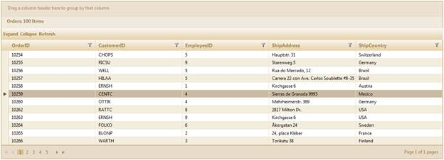

::: {style="DISPLAY: none"}
{#d2h_url_template}{#d2h_package_url style="WIDTH: 0px; DISPLAY: none; HEIGHT: 0px"}
:::

::: {.d2h_secondary_topic style="PADDING-BOTTOM: 10pt; MARGIN: 0pt; PADDING-LEFT: 0pt; PADDING-RIGHT: 0pt; PADDING-TOP: 0pt"}
#### Through GridBuilder {#through-gridbuilder style="tab-stops: 0pt"}

 

To customize the grid toolbar using **GridBuilder**:

 

1.   Create a model in the application (Refer to [[Getting Started\>Adding a Model to the Application]{style="COLOR: blue"}]{.underline}).

2.   Create a strongly typed view (Refer to [[How to\>Strongly Typed View]{style="COLOR: blue"}]{.underline}).

3.   Create the Grid control in the view and configure its properties.

4.   Set the **OnToolbarClickEvent** handler for handling the toolbar click events.

 

+------------------------------------------------------------------------------------------------------------------------------------------------------------------------------------------------------------+
| **[View \[ASPX\]]{style="FONT-FAMILY: 'Courier New'"}**[ ]{style="FONT-FAMILY: 'Courier New'"}                                                                                                             |
|                                                                                                                                                                                                            |
| [\<%]{style="FONT-FAMILY: 'Courier New'; BACKGROUND: yellow"}[=Html.Syncfusion().Grid\<[EditableOrder]{style="COLOR: #2b91af"}\>([\"Grid1\"]{style="COLOR: #a31515"})]{style="FONT-FAMILY: 'Courier New'"} |
|                                                                                                                                                                                                            |
| [                         .Datasource(Model)]{style="FONT-FAMILY: 'Courier New'"}                                                                                                                          |
|                                                                                                                                                                                                            |
| [                         .Caption([\"Orders\"]{style="COLOR: #a31515"})]{style="FONT-FAMILY: 'Courier New'"}                                                                                              |
|                                                                                                                                                                                                            |
| [                         .Column(column =\>]{style="FONT-FAMILY: 'Courier New'"}                                                                                                                          |
|                                                                                                                                                                                                            |
| [                         {]{style="FONT-FAMILY: 'Courier New'"}                                                                                                                                           |
|                                                                                                                                                                                                            |
| [                             column.Add(p =\> p.OrderID).HeaderText([\"Order ID\"]{style="COLOR: #a31515"});]{style="FONT-FAMILY: 'Courier New'"}                                                         |
|                                                                                                                                                                                                            |
| [                             column.Add(p =\> p.CustomerID).HeaderText([\"Customer ID\"]{style="COLOR: #a31515"});]{style="FONT-FAMILY: 'Courier New'"}                                                   |
|                                                                                                                                                                                                            |
| [                             column.Add(p =\> p.EmployeeID).HeaderText([\"EmployeeID\"]{style="COLOR: #a31515"});]{style="FONT-FAMILY: 'Courier New'"}                                                    |
|                                                                                                                                                                                                            |
| [                             column.Add(p =\> p.ShipCountry).HeaderText([\"ShipCountry\"]{style="COLOR: #a31515"});]{style="FONT-FAMILY: 'Courier New'"}                                                  |
|                                                                                                                                                                                                            |
| [                             column.Add(p =\> p.ShipAddress).HeaderText([\"ShipAddress\"]{style="COLOR: #a31515"});]{style="FONT-FAMILY: 'Courier New'"}                                                  |
|                                                                                                                                                                                                            |
| [                         })]{style="FONT-FAMILY: 'Courier New'"}                                                                                                                                          |
|                                                                                                                                                                                                            |
| []{style="FONT-FAMILY: 'Courier New'"}                                                                                                                                                                     |
|                                                                                                                                                                                                            |
| [             **.ClientSideEvents(e =\> e.OnToolbarClickEvent([\"OnToolbarClickEvent\"]{style="COLOR: #a31515"}))**]{style="FONT-FAMILY: 'Courier New'"}                                                   |
|                                                                                                                                                                                                            |
| []{style="FONT-FAMILY: 'Courier New'"}                                                                                                                                                                     |
|                                                                                                                                                                                                            |
| [             **.ToolBar(tools =\>**]{style="FONT-FAMILY: 'Courier New'"}                                                                                                                                  |
|                                                                                                                                                                                                            |
| **[               {       ]{style="FONT-FAMILY: 'Courier New'"}**                                                                                                                                          |
|                                                                                                                                                                                                            |
| **[               [// Adding the custom toolbar items.]{style="COLOR: green"} ]{style="FONT-FAMILY: 'Courier New'"}**                                                                                      |
|                                                                                                                                                                                                            |
| **[               [// Add(customItemtitle, customItemcaption, customItemCssClass)]{style="COLOR: green"}                   ]{style="FONT-FAMILY: 'Courier New'"}**                                         |
|                                                                                                                                                                                                            |
| **[                tools.Add([\"ExpandAll\"]{style="COLOR: #a31515"}, [\"Expand\"]{style="COLOR: #a31515"}, [\"ExpandItem\"]{style="COLOR: #a31515"})]{style="FONT-FAMILY: 'Courier New'"}**               |
|                                                                                                                                                                                                            |
| **[                .Add([\"CollapseAll\"]{style="COLOR: #a31515"}, [\"Collapse\"]{style="COLOR: #a31515"}, [\"CollapseItem\"]{style="COLOR: #a31515"})]{style="FONT-FAMILY: 'Courier New'"}**              |
|                                                                                                                                                                                                            |
| **[                 .Add([\"Refresh\"]{style="COLOR: #a31515"}, [\"Refresh\"]{style="COLOR: #a31515"}, [\"Refresh\"]{style="COLOR: #a31515"});]{style="FONT-FAMILY: 'Courier New'"}**                      |
|                                                                                                                                                                                                            |
| **[                })]{style="FONT-FAMILY: 'Courier New'"}**                                                                                                                                               |
|                                                                                                                                                                                                            |
| []{style="FONT-FAMILY: 'Courier New'"}                                                                                                                                                                     |
|                                                                                                                                                                                                            |
| []{style="FONT-FAMILY: 'Courier New'"}                                                                                                                                                                     |
|                                                                                                                                                                                                            |
| [%\>]{style="FONT-FAMILY: 'Courier New'; BACKGROUND: yellow"}                                                                                                                                              |
+------------------------------------------------------------------------------------------------------------------------------------------------------------------------------------------------------------+

[  ]{style="FONT-FAMILY: 'Times New Roman','serif'; FONT-SIZE: 12pt"}

+--------------------------------------------------------------------------------------------------------------------------------------------------------------------------------------------------------------+
| **[View \[cshtml\]]{style="FONT-FAMILY: 'Courier New'"}**[ ]{style="FONT-FAMILY: 'Courier New'"}                                                                                                             |
|                                                                                                                                                                                                              |
| [\@{]{style="FONT-FAMILY: 'Courier New'; BACKGROUND: yellow"}[ Html.Syncfusion().Grid\<[EditableOrder]{style="COLOR: #2b91af"}\>([\"Grid1\"]{style="COLOR: #a31515"})]{style="FONT-FAMILY: 'Courier New'"}   |
|                                                                                                                                                                                                              |
| [                         .Datasource(Model)]{style="FONT-FAMILY: 'Courier New'"}                                                                                                                            |
|                                                                                                                                                                                                              |
| [                         .Caption([\"Orders\"]{style="COLOR: #a31515"})]{style="FONT-FAMILY: 'Courier New'"}                                                                                                |
|                                                                                                                                                                                                              |
| [                         .Column(column =\>]{style="FONT-FAMILY: 'Courier New'"}                                                                                                                            |
|                                                                                                                                                                                                              |
| [                         {]{style="FONT-FAMILY: 'Courier New'"}                                                                                                                                             |
|                                                                                                                                                                                                              |
| [                             column.Add(p =\> p.OrderID).HeaderText([\"Order ID\"]{style="COLOR: #a31515"});]{style="FONT-FAMILY: 'Courier New'"}                                                           |
|                                                                                                                                                                                                              |
| [                             column.Add(p =\> p.CustomerID).HeaderText([\"Customer ID\"]{style="COLOR: #a31515"});]{style="FONT-FAMILY: 'Courier New'"}                                                     |
|                                                                                                                                                                                                              |
| [                             column.Add(p =\> p.EmployeeID).HeaderText([\"EmployeeID\"]{style="COLOR: #a31515"});]{style="FONT-FAMILY: 'Courier New'"}                                                      |
|                                                                                                                                                                                                              |
| [                             column.Add(p =\> p.ShipCountry).HeaderText([\"ShipCountry\"]{style="COLOR: #a31515"});]{style="FONT-FAMILY: 'Courier New'"}                                                    |
|                                                                                                                                                                                                              |
| [                             column.Add(p =\> p.ShipAddress).HeaderText([\"ShipAddress\"]{style="COLOR: #a31515"});]{style="FONT-FAMILY: 'Courier New'"}                                                    |
|                                                                                                                                                                                                              |
| [                         })]{style="FONT-FAMILY: 'Courier New'"}                                                                                                                                            |
|                                                                                                                                                                                                              |
| []{style="FONT-FAMILY: 'Courier New'"}                                                                                                                                                                       |
|                                                                                                                                                                                                              |
| [             **.ClientSideEvents(e =\> e.OnToolbarClickEvent([\"OnToolbarClickEvent\"]{style="COLOR: #a31515"}))**]{style="FONT-FAMILY: 'Courier New'"}                                                     |
|                                                                                                                                                                                                              |
| **[]{style="FONT-FAMILY: 'Courier New'"}**                                                                                                                                                                   |
|                                                                                                                                                                                                              |
| **[       .ToolBar(tools =\>]{style="FONT-FAMILY: 'Courier New'"}**                                                                                                                                          |
|                                                                                                                                                                                                              |
| **[       {   ]{style="FONT-FAMILY: 'Courier New'"}**                                                                                                                                                        |
|                                                                                                                                                                                                              |
| **[        [// Adding the custom toolbar items.]{style="COLOR: green"} ]{style="FONT-FAMILY: 'Courier New'"}**                                                                                               |
|                                                                                                                                                                                                              |
| **[        [// Add(customItemtitle, customItemcaption, customItemCssClass)]{style="COLOR: green"}]{style="FONT-FAMILY: 'Courier New'"}**                                                                     |
|                                                                                                                                                                                                              |
| **[        tools.Add([\"ExpandAll\"]{style="COLOR: #a31515"}, [\"Expand\"]{style="COLOR: #a31515"}, [\"ExpandItem\"]{style="COLOR: #a31515"})[]{style="COLOR: green"}]{style="FONT-FAMILY: 'Courier New'"}** |
|                                                                                                                                                                                                              |
| **[              .Add([\"CollapseAll\"]{style="COLOR: #a31515"}, [\"Collapse\"]{style="COLOR: #a31515"}, [\"CollapseItem\"]{style="COLOR: #a31515"})]{style="FONT-FAMILY: 'Courier New'"}**                  |
|                                                                                                                                                                                                              |
| **[              .Add([\"Refresh\"]{style="COLOR: #a31515"}, [\"Refresh\"]{style="COLOR: #a31515"}, [\"Refresh\"]{style="COLOR: #a31515"});]{style="FONT-FAMILY: 'Courier New'"}**                           |
|                                                                                                                                                                                                              |
| **[                })]{style="FONT-FAMILY: 'Courier New'"}**                                                                                                                                                 |
|                                                                                                                                                                                                              |
| **[]{style="FONT-FAMILY: 'Courier New'"}**                                                                                                                                                                   |
|                                                                                                                                                                                                              |
| [                        .Render();]{style="FONT-FAMILY: 'Courier New'"}                                                                                                                                     |
|                                                                                                                                                                                                              |
| [}]{style="FONT-FAMILY: 'Courier New'; BACKGROUND: yellow"}[]{style="FONT-FAMILY: 'Courier New'"}                                                                                                            |
|                                                                                                                                                                                                              |
| **[]{style="FONT-FAMILY: 'Courier New'"}**[]{style="FONT-FAMILY: 'Courier New'; BACKGROUND: yellow"}                                                                                                         |
+--------------------------------------------------------------------------------------------------------------------------------------------------------------------------------------------------------------+

 

5.   Handle the **OnToolbarClickEvent** as shown in the code block.

 

+----------------------------------------------------------------------------------------------------------------------------------------------------------------------------+
| []{style="FONT-FAMILY: 'Courier New'"}                                                                                                                                     |
|                                                                                                                                                                            |
| [    [\<]{style="COLOR: blue"}[script]{style="COLOR: maroon"} [type]{style="COLOR: red"}[=\"text/javascript\"\>]{style="COLOR: blue"}]{style="FONT-FAMILY: 'Courier New'"} |
|                                                                                                                                                                            |
| [      ]{style="FONT-FAMILY: 'Courier New'"}                                                                                                                               |
|                                                                                                                                                                            |
| [        [function]{style="COLOR: blue"} OnToolbarClickEvent(sender, args) {]{style="FONT-FAMILY: 'Courier New'"}                                                          |
|                                                                                                                                                                            |
| [          [//Handling the toolbar click event]{style="COLOR: darkgreen"}]{style="FONT-FAMILY: 'Courier New'"}                                                             |
|                                                                                                                                                                            |
| [    }]{style="FONT-FAMILY: 'Courier New'"}                                                                                                                                |
|                                                                                                                                                                            |
| [     [\</]{style="COLOR: blue"}[script]{style="COLOR: maroon"}[\>]{style="COLOR: blue"}]{style="FONT-FAMILY: 'Courier New'"}                                              |
|                                                                                                                                                                            |
| []{style="FONT-FAMILY: 'Courier New'"}                                                                                                                                     |
+----------------------------------------------------------------------------------------------------------------------------------------------------------------------------+

 

6.   Render the view.

[]{style="FONT-FAMILY: 'Times New Roman','serif'; FONT-SIZE: 12pt"} 

+------------------------------------------------------------------------------------------------------------------------------------------------------------------------+
| **[Controller]{style="FONT-FAMILY: 'Courier New'"}**[]{style="FONT-FAMILY: 'Courier New'"}                                                                             |
|                                                                                                                                                                        |
| [        [public]{style="COLOR: blue"} [ActionResult]{style="COLOR: #2b91af"} Index()]{style="FONT-FAMILY: 'Courier New'"}                                             |
|                                                                                                                                                                        |
| [        {]{style="FONT-FAMILY: 'Courier New'"}                                                                                                                        |
|                                                                                                                                                                        |
| [           [var]{style="COLOR: blue"} data = [new]{style="COLOR: blue"} [NorthwindDataContext]{style="COLOR: #2b91af"}().Orders;]{style="FONT-FAMILY: 'Courier New'"} |
|                                                                                                                                                                        |
| [            [return]{style="COLOR: blue"} View(data);]{style="FONT-FAMILY: 'Courier New'"}                                                                            |
|                                                                                                                                                                        |
| [        }]{style="FONT-FAMILY: 'Courier New'"}                                                                                                                        |
+------------------------------------------------------------------------------------------------------------------------------------------------------------------------+

[]{style="LINE-HEIGHT: 115%; FONT-FAMILY: 'Calibri','sans-serif'; FONT-SIZE: 11pt"} 

7.   Run the application. The grid will appear as shown below.

 

{border="0"}

Figure 298: Grid with Custom Toolbar

[]{style="LINE-HEIGHT: 115%; FONT-FAMILY: 'Calibri','sans-serif'; FONT-SIZE: 11pt"} 

[]{#related-topics}
:::
