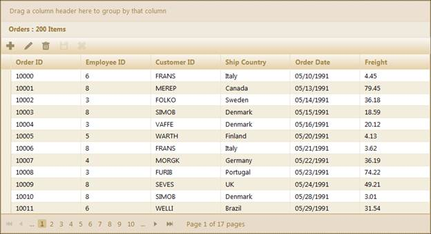
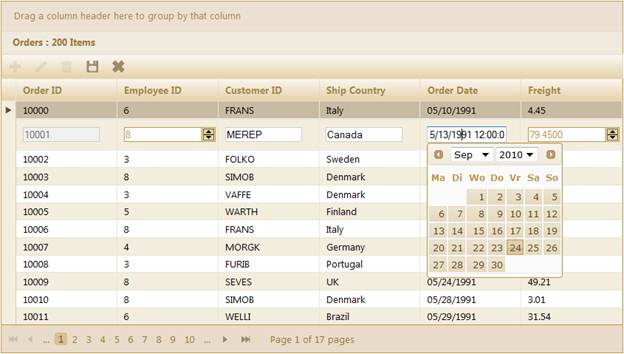
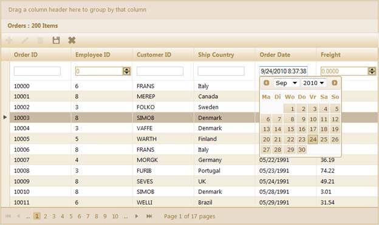
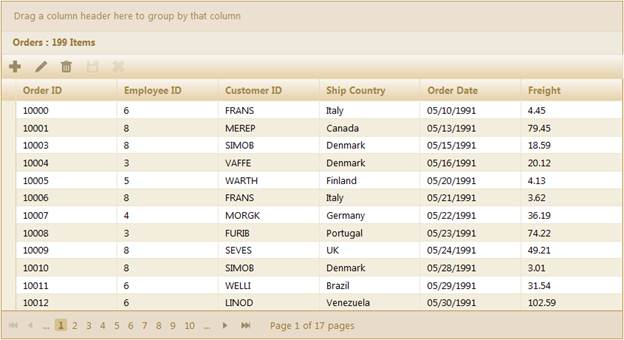

::: {style="DISPLAY: none"}
{#d2h_url_template}{#d2h_package_url style="WIDTH: 0px; DISPLAY: none; HEIGHT: 0px"}
:::

:::::: {.d2h_secondary_topic style="PADDING-BOTTOM: 10pt; MARGIN: 0pt; PADDING-LEFT: 0pt; PADDING-RIGHT: 0pt; PADDING-TOP: 0pt"}
#### Through GridPropertiesModel {#through-gridpropertiesmodel style="tab-stops: 0pt"}

The steps to work with the editing feature through the **GridPropertiesModel** are as follows.

1.   Add the **MicrosoftMvcValidation.debug.js** file in the master page.

 

+-------------------------------------------------------------------------------------------------------------------------------------------------------------------------------------------------------------------------------------------------------------------------------------------------------------------------------------------------------------------------------------------------------------------------------------------------------------------------------------------------------------------------------------------------------------------------------------------------------------------------------------------------------+
| **[\[Site.Master\]]{style="FONT-FAMILY: 'Courier New'"}**                                                                                                                                                                                                                                                                                                                                                                                                                                                                                                                                                                                             |
|                                                                                                                                                                                                                                                                                                                                                                                                                                                                                                                                                                                                                                                       |
| [\<]{style="FONT-FAMILY: 'Courier New'; COLOR: blue"}[head]{style="FONT-FAMILY: 'Courier New'; COLOR: maroon"}[ [runat]{style="COLOR: red"}[=\"server\"\>]{style="COLOR: blue"}]{style="FONT-FAMILY: 'Courier New'"}                                                                                                                                                                                                                                                                                                                                                                                                                                  |
|                                                                                                                                                                                                                                                                                                                                                                                                                                                                                                                                                                                                                                                       |
| [    [\<]{style="COLOR: blue"}[title]{style="COLOR: maroon"}[\>\<]{style="COLOR: blue"}[asp]{style="COLOR: maroon"}[:]{style="COLOR: blue"}[ContentPlaceHolder]{style="COLOR: maroon"} [ID]{style="COLOR: red"}[=\"TitleContent\"]{style="COLOR: blue"} [runat]{style="COLOR: red"}[=\"server\"]{style="COLOR: blue"} [/\>\</]{style="COLOR: blue"}[title]{style="COLOR: maroon"}[\>]{style="COLOR: blue"}]{style="FONT-FAMILY: 'Courier New'"}                                                                                                                                                                                                       |
|                                                                                                                                                                                                                                                                                                                                                                                                                                                                                                                                                                                                                                                       |
| [.........]{style="FONT-FAMILY: 'Courier New'; COLOR: blue"}[]{style="FONT-FAMILY: 'Courier New'"}                                                                                                                                                                                                                                                                                                                                                                                                                                                                                                                                                    |
|                                                                                                                                                                                                                                                                                                                                                                                                                                                                                                                                                                                                                                                       |
| [\<]{style="FONT-FAMILY: 'Courier New'; COLOR: blue"}[script ]{style="FONT-FAMILY: 'Courier New'; COLOR: maroon"}[src]{style="FONT-FAMILY: 'Courier New'; COLOR: red"}[=\"]{style="FONT-FAMILY: 'Courier New'; COLOR: blue"}[\<%]{style="FONT-FAMILY: 'Courier New'; BACKGROUND: yellow"}[=]{style="FONT-FAMILY: 'Courier New'; COLOR: blue"}[ Url.Content(\"\~/Scripts/MicrosoftMvcValidation.debug.js\") [%\>]{style="BACKGROUND: yellow"}[\"]{style="COLOR: blue"} [type]{style="COLOR: red"}[=\"text/javascript\"\>\</]{style="COLOR: blue"}[script]{style="COLOR: maroon"}[\>]{style="COLOR: blue"}        ]{style="FONT-FAMILY: 'Courier New'"} |
|                                                                                                                                                                                                                                                                                                                                                                                                                                                                                                                                                                                                                                                       |
| [\</]{style="FONT-FAMILY: 'Courier New'; COLOR: blue"}[head]{style="FONT-FAMILY: 'Courier New'; COLOR: maroon"}[\>]{style="FONT-FAMILY: 'Courier New'; COLOR: blue"}[]{style="FONT-SIZE: 12pt"}                                                                                                                                                                                                                                                                                                                                                                                                                                                       |
+-------------------------------------------------------------------------------------------------------------------------------------------------------------------------------------------------------------------------------------------------------------------------------------------------------------------------------------------------------------------------------------------------------------------------------------------------------------------------------------------------------------------------------------------------------------------------------------------------------------------------------------------------------+

[]{style="FONT-FAMILY: 'Myriad Pro','sans-serif'"} 

+-------------------------------------------------------------------------------------------------------------------------------------------------------------------------------------------------------------------------------------------------------------------------------------------------------------------------------------------------------------------------------------------------------------------------------------------------------------------------------------------------------------------------------------------------------------------------------------------------------------------------------------------------------------------------------------------------------------------------------------------------------------------------+
| **[\[\_Layout.cshtml\]]{style="FONT-FAMILY: 'Courier New'"}**                                                                                                                                                                                                                                                                                                                                                                                                                                                                                                                                                                                                                                                                                                           |
|                                                                                                                                                                                                                                                                                                                                                                                                                                                                                                                                                                                                                                                                                                                                                                         |
| []{style="FONT-FAMILY: 'Courier New'; COLOR: blue"}                                                                                                                                                                                                                                                                                                                                                                                                                                                                                                                                                                                                                                                                                                                     |
|                                                                                                                                                                                                                                                                                                                                                                                                                                                                                                                                                                                                                                                                                                                                                                         |
| [\<]{style="FONT-FAMILY: 'Courier New'; COLOR: blue"}[head]{style="FONT-FAMILY: 'Courier New'; COLOR: maroon"}[ [runat]{style="COLOR: red"}[=\"server\"\>]{style="COLOR: blue"}]{style="FONT-FAMILY: 'Courier New'"}                                                                                                                                                                                                                                                                                                                                                                                                                                                                                                                                                    |
|                                                                                                                                                                                                                                                                                                                                                                                                                                                                                                                                                                                                                                                                                                                                                                         |
| [    [\<]{style="COLOR: blue"}[title]{style="COLOR: maroon"}[\>\<]{style="COLOR: blue"}[asp]{style="COLOR: maroon"}[:]{style="COLOR: blue"}[ContentPlaceHolder]{style="COLOR: maroon"} [ID]{style="COLOR: red"}[=\"TitleContent\"]{style="COLOR: blue"} [runat]{style="COLOR: red"}[=\"server\"]{style="COLOR: blue"} [/\>\</]{style="COLOR: blue"}[title]{style="COLOR: maroon"}[\>]{style="COLOR: blue"}]{style="FONT-FAMILY: 'Courier New'"}                                                                                                                                                                                                                                                                                                                         |
|                                                                                                                                                                                                                                                                                                                                                                                                                                                                                                                                                                                                                                                                                                                                                                         |
| [.........]{style="FONT-FAMILY: 'Courier New'; COLOR: blue"}[]{style="FONT-FAMILY: 'Courier New'"}                                                                                                                                                                                                                                                                                                                                                                                                                                                                                                                                                                                                                                                                      |
|                                                                                                                                                                                                                                                                                                                                                                                                                                                                                                                                                                                                                                                                                                                                                                         |
| []{style="FONT-FAMILY: 'Courier New'; COLOR: blue"}                                                                                                                                                                                                                                                                                                                                                                                                                                                                                                                                                                                                                                                                                                                     |
|                                                                                                                                                                                                                                                                                                                                                                                                                                                                                                                                                                                                                                                                                                                                                                         |
| [         \<]{style="FONT-FAMILY: Consolas; COLOR: blue; FONT-SIZE: 9.5pt"}[script]{style="FONT-FAMILY: Consolas; COLOR: maroon; FONT-SIZE: 9.5pt"}[ [src]{style="COLOR: red"}[=\"]{style="COLOR: blue"}[@]{style="BACKGROUND: yellow"}[Url.Content(]{style="COLOR: blue"}[\"\~/Scripts/]{style="COLOR: #c0504d"}]{style="FONT-FAMILY: Consolas; FONT-SIZE: 9.5pt"}[MicrosoftMvcValidation.debug.js \"]{style="FONT-FAMILY: 'Courier New'; COLOR: #c0504d"}[)\"]{style="FONT-FAMILY: Consolas; COLOR: blue; FONT-SIZE: 9.5pt"}[ [type]{style="COLOR: red"}[=\"text/javascript\"\>\</]{style="COLOR: blue"}[script]{style="COLOR: maroon"}[\>]{style="COLOR: blue"}]{style="FONT-FAMILY: Consolas; FONT-SIZE: 9.5pt"}[]{style="FONT-FAMILY: 'Courier New'; COLOR: blue"} |
|                                                                                                                                                                                                                                                                                                                                                                                                                                                                                                                                                                                                                                                                                                                                                                         |
| []{style="FONT-FAMILY: 'Courier New'; COLOR: blue"}                                                                                                                                                                                                                                                                                                                                                                                                                                                                                                                                                                                                                                                                                                                     |
|                                                                                                                                                                                                                                                                                                                                                                                                                                                                                                                                                                                                                                                                                                                                                                         |
| [  \</]{style="FONT-FAMILY: 'Courier New'; COLOR: blue"}[head]{style="FONT-FAMILY: 'Courier New'; COLOR: maroon"}[\>]{style="FONT-FAMILY: 'Courier New'; COLOR: blue"}[]{style="FONT-FAMILY: 'Courier New'"}                                                                                                                                                                                                                                                                                                                                                                                                                                                                                                                                                            |
+-------------------------------------------------------------------------------------------------------------------------------------------------------------------------------------------------------------------------------------------------------------------------------------------------------------------------------------------------------------------------------------------------------------------------------------------------------------------------------------------------------------------------------------------------------------------------------------------------------------------------------------------------------------------------------------------------------------------------------------------------------------------------+

 

2.   Create a model in the application. Refer to [[[Getting Started\>Adding a Model to the Application]{style="COLOR: blue"}]{.underline}](http://help.syncfusion.com/ug_84/User%20Interface/ASP.NET%20MVC/Grid/Documents/addingamodeltotheapplication.htm)

and [[[Editing\>EditableOrder Class]{style="COLOR: blue"}]{.underline}](http://help.syncfusion.com/ug_84/User%20Interface/ASP.NET%20MVC/Grid/Documents/editableorderclass.htm).

3.   Add the following code in the **Index.aspx** file, to create the Grid control in the view.

 

+-------------------------------------------------------------------------------------------------------------------------------------------------------------------------------------------------------------------------------------------------------------------------------------------------------------------------+
| **[View]{style="FONT-FAMILY: 'Courier New'; COLOR: black"}[ \[ASPX\]]{style="FONT-FAMILY: 'Courier New'"}**                                                                                                                                                                                                             |
|                                                                                                                                                                                                                                                                                                                         |
| [\<%]{style="FONT-FAMILY: 'Courier New'; BACKGROUND: yellow"}[=]{style="FONT-FAMILY: 'Courier New'; COLOR: blue"}[Html.Syncfusion().Grid\<[EditableOrder]{style="COLOR: #2b91af"}\>([\"Orders_Grid\"]{style="COLOR: #a31515"},[\"GridModel\"]{style="COLOR: #a31515"}, column=\> {]{style="FONT-FAMILY: 'Courier New'"} |
|                                                                                                                                                                                                                                                                                                                         |
| [    column.Add(p =\> p.OrderID).HeaderText([\"Order ID\"]{style="COLOR: #a31515"});]{style="FONT-FAMILY: 'Courier New'"}                                                                                                                                                                                               |
|                                                                                                                                                                                                                                                                                                                         |
| [    column.Add(p =\> p.EmployeeID).HeaderText([\"Employee ID\"]{style="COLOR: #a31515"});]{style="FONT-FAMILY: 'Courier New'"}                                                                                                                                                                                         |
|                                                                                                                                                                                                                                                                                                                         |
| [    column.Add(p =\> p.CustomerID).HeaderText([\"Customer ID\"]{style="COLOR: #a31515"});]{style="FONT-FAMILY: 'Courier New'"}                                                                                                                                                                                         |
|                                                                                                                                                                                                                                                                                                                         |
| [    column.Add(p =\> p.ShipCountry).HeaderText([\"Ship Country\"]{style="COLOR: #a31515"});]{style="FONT-FAMILY: 'Courier New'"}                                                                                                                                                                                       |
|                                                                                                                                                                                                                                                                                                                         |
| [    column.Add(p =\> p.OrderDate).HeaderText([\"Order Date\"]{style="COLOR: #a31515"}).Format([\"{OrderDate:MM/dd/yyyy}\"]{style="COLOR: #a31515"});]{style="FONT-FAMILY: 'Courier New'"}                                                                                                                              |
|                                                                                                                                                                                                                                                                                                                         |
| [    column.Add(p =\> p.Freight).HeaderText([\"Freight\"]{style="COLOR: #a31515"}); ]{style="FONT-FAMILY: 'Courier New'"}                                                                                                                                                                                               |
|                                                                                                                                                                                                                                                                                                                         |
| [    })[%\>]{style="BACKGROUND: yellow"}]{style="FONT-FAMILY: 'Courier New'"}[]{style="FONT-SIZE: 12pt"}                                                                                                                                                                                                                |
+-------------------------------------------------------------------------------------------------------------------------------------------------------------------------------------------------------------------------------------------------------------------------------------------------------------------------+

 

::: {align="center"}
+--------------------------------------------------------------------------------------------------------------------------------------------------------------------------------------------------------------------------------------------------------------------------------------------------------------------------------------------------------------------------------------------------------------------------------------------------------------------------------------+
| **[View \[cshtml\]]{style="FONT-FAMILY: 'Courier New'"}**                                                                                                                                                                                                                                                                                                                                                                                                                            |
|                                                                                                                                                                                                                                                                                                                                                                                                                                                                                      |
| [   ]{style="FONT-FAMILY: 'Courier New'"}[@(]{style="FONT-FAMILY: Consolas; BACKGROUND: yellow; FONT-SIZE: 9.5pt"}[new]{style="FONT-FAMILY: Consolas; COLOR: blue; FONT-SIZE: 9.5pt"}[ [HtmlString]{style="COLOR: #2b91af"}(]{style="FONT-FAMILY: Consolas; FONT-SIZE: 9.5pt"}[Html.Syncfusion().Grid\<[EditableOrder]{style="COLOR: #2b91af"}\>([\"Orders_Grid\"]{style="COLOR: #a31515"},[\"GridModel\"]{style="COLOR: #a31515"}, column=\> {]{style="FONT-FAMILY: 'Courier New'"} |
|                                                                                                                                                                                                                                                                                                                                                                                                                                                                                      |
| [    column.Add(p =\> p.OrderID).HeaderText([\"Order ID\"]{style="COLOR: #a31515"});]{style="FONT-FAMILY: 'Courier New'"}                                                                                                                                                                                                                                                                                                                                                            |
|                                                                                                                                                                                                                                                                                                                                                                                                                                                                                      |
| [    column.Add(p =\> p.EmployeeID).HeaderText([\"Employee ID\"]{style="COLOR: #a31515"});]{style="FONT-FAMILY: 'Courier New'"}                                                                                                                                                                                                                                                                                                                                                      |
|                                                                                                                                                                                                                                                                                                                                                                                                                                                                                      |
| [    column.Add(p =\> p.CustomerID).HeaderText([\"Customer ID\"]{style="COLOR: #a31515"});]{style="FONT-FAMILY: 'Courier New'"}                                                                                                                                                                                                                                                                                                                                                      |
|                                                                                                                                                                                                                                                                                                                                                                                                                                                                                      |
| [    column.Add(p =\> p.ShipCountry).HeaderText([\"Ship Country\"]{style="COLOR: #a31515"});]{style="FONT-FAMILY: 'Courier New'"}                                                                                                                                                                                                                                                                                                                                                    |
|                                                                                                                                                                                                                                                                                                                                                                                                                                                                                      |
| [    column.Add(p =\> p.OrderDate).HeaderText([\"Order Date\"]{style="COLOR: #a31515"}).Format([\"{OrderDate:MM/dd/yyyy}\"]{style="COLOR: #a31515"});]{style="FONT-FAMILY: 'Courier New'"}                                                                                                                                                                                                                                                                                           |
|                                                                                                                                                                                                                                                                                                                                                                                                                                                                                      |
| [    column.Add(p =\> p.Freight).HeaderText([\"Freight\"]{style="COLOR: #a31515"}); ]{style="FONT-FAMILY: 'Courier New'"}                                                                                                                                                                                                                                                                                                                                                            |
|                                                                                                                                                                                                                                                                                                                                                                                                                                                                                      |
| [    })]{style="FONT-FAMILY: 'Courier New'"}[.ToString())[)]{style="BACKGROUND: yellow"}    ]{style="FONT-FAMILY: Consolas; FONT-SIZE: 9.5pt"}[    ]{style="FONT-FAMILY: 'Courier New'"}[]{style="FONT-FAMILY: 'Courier New'"}                                                                                                                                                                                                                                                       |
+--------------------------------------------------------------------------------------------------------------------------------------------------------------------------------------------------------------------------------------------------------------------------------------------------------------------------------------------------------------------------------------------------------------------------------------------------------------------------------------+
:::

 

4.   Create a **GridPropertiesModel** in the **Index** method and assign the grid properties in the model.

 

+-----------------------------------------------------------------------------------------------------------------------------------------------------------------------------------------------------------------------------------------------------------------+
| **[Controller]{style="FONT-FAMILY: 'Courier New'; COLOR: black"}[]{style="FONT-FAMILY: 'Courier New'"}**                                                                                                                                                        |
|                                                                                                                                                                                                                                                                 |
| [   [GridPropertiesModel]{style="COLOR: #2b91af"}\<[EditableOrder]{style="COLOR: #2b91af"}\> model = [new]{style="COLOR: blue"} [GridPropertiesModel]{style="COLOR: #2b91af"}\<[EditableOrder]{style="COLOR: #2b91af"}\>()]{style="FONT-FAMILY: 'Courier New'"} |
|                                                                                                                                                                                                                                                                 |
| [            {]{style="FONT-FAMILY: 'Courier New'"}                                                                                                                                                                                                             |
|                                                                                                                                                                                                                                                                 |
| **[                ActionMode = ActionMode.JSON,]{style="FONT-FAMILY: 'Courier New'"}**                                                                                                                                                                         |
|                                                                                                                                                                                                                                                                 |
| [                Caption = [\"Orders\"]{style="COLOR: #a31515"},]{style="FONT-FAMILY: 'Courier New'"}                                                                                                                                                           |
|                                                                                                                                                                                                                                                                 |
| [                AutoFormat=[Skins]{style="COLOR: #2b91af"}.Sandune]{style="FONT-FAMILY: 'Courier New'"}                                                                                                                                                        |
|                                                                                                                                                                                                                                                                 |
| [            };]{style="FONT-FAMILY: 'Courier New'"}                                                                                                                                                                                                            |
|                                                                                                                                                                                                                                                                 |
| [            ViewData\[[\"GridModel\"]{style="COLOR: #a31515"}\] = model;[ // Pass the model from controller to view using ViewData.]{style="COLOR: green"}]{style="FONT-FAMILY: 'Courier New'"}[]{style="FONT-SIZE: 12pt"}                                     |
+-----------------------------------------------------------------------------------------------------------------------------------------------------------------------------------------------------------------------------------------------------------------+

 

5.   Enable editing by using the **Editing** property in the **GridPropertiesModel,** and configure the editing properties such as **AllowNew**, **AllowEdit**, and **AllowDelete** as displayed below.

+--------------------------------------------------------------------------------------------------------------------------------------------------------------------------------------------------------------------------------------------------------------------------------------------------------+
| **[Controller]{style="FONT-FAMILY: 'Courier New'; COLOR: black"}[]{style="FONT-FAMILY: 'Courier New'"}**                                                                                                                                                                                               |
|                                                                                                                                                                                                                                                                                                        |
| [  ]{style="FONT-FAMILY: Consolas; COLOR: green; FONT-SIZE: 9.5pt"}[// Create an object for grid editing and enable edit, addnew and delete actions.]{style="FONT-FAMILY: 'Courier New'; COLOR: green"}[]{style="FONT-FAMILY: 'Courier New'"}                                                          |
|                                                                                                                                                                                                                                                                                                        |
| [            [GridEditing]{style="COLOR: #2b91af"} edit = [new]{style="COLOR: blue"} [GridEditing]{style="COLOR: #2b91af"}() { AllowEdit = [true]{style="COLOR: blue"}, AllowDelete = [true]{style="COLOR: blue"}, AllowNew = [true]{style="COLOR: blue"}      };]{style="FONT-FAMILY: 'Courier New'"} |
|                                                                                                                                                                                                                                                                                                        |
| []{style="FONT-FAMILY: 'Courier New'"}                                                                                                                                                                                                                                                                 |
|                                                                                                                                                                                                                                                                                                        |
| [            [// Set the action mappers for insert, delete and save actions.]{style="COLOR: green"}]{style="FONT-FAMILY: 'Courier New'"}                                                                                                                                                               |
|                                                                                                                                                                                                                                                                                                        |
| [            edit.DeleteMapper = [\"DeleteOrder\"]{style="COLOR: #a31515"};]{style="FONT-FAMILY: 'Courier New'"}                                                                                                                                                                                       |
|                                                                                                                                                                                                                                                                                                        |
| [            edit.InsertMapper = [\"AddOrder\"]{style="COLOR: #a31515"};]{style="FONT-FAMILY: 'Courier New'"}                                                                                                                                                                                          |
|                                                                                                                                                                                                                                                                                                        |
| [            edit.GridSaveMapper = [\"OrderSave\"]{style="COLOR: #a31515"};]{style="FONT-FAMILY: 'Courier New'"}[]{style="FONT-SIZE: 12pt"}                                                                                                                                                            |
+--------------------------------------------------------------------------------------------------------------------------------------------------------------------------------------------------------------------------------------------------------------------------------------------------------+

 

6.   Specify the grid editing mode through the **EditMode** property.[ ]{style="FONT-SIZE: 20pt"}

+---------------------------------------------------------------------------------------------------------------------------------------------+
| **[Controller]{style="FONT-FAMILY: 'Courier New'; COLOR: black"}[]{style="FONT-FAMILY: 'Courier New'"}**                                    |
|                                                                                                                                             |
| [// Set the Edit mode.]{style="FONT-FAMILY: 'Courier New'; COLOR: green"}[]{style="FONT-FAMILY: 'Courier New'"}                             |
|                                                                                                                                             |
| [            edit.EditMode = [GridEditMode]{style="COLOR: #2b91af"}.Normal;]{style="FONT-FAMILY: 'Courier New'"}[]{style="FONT-SIZE: 12pt"} |
+---------------------------------------------------------------------------------------------------------------------------------------------+

 

7.   Specify the primary property which uniquely identifies the grid record.

+----------------------------------------------------------------------------------------------------------------------------------------------------------------------------------------------------------------------------------------+
| **[Controller]{style="FONT-FAMILY: 'Courier New'; COLOR: black"}[]{style="FONT-FAMILY: 'Courier New'"}**                                                                                                                               |
|                                                                                                                                                                                                                                        |
| [// Add the primarykey value to identify the record uniquely.]{style="FONT-FAMILY: 'Courier New'; COLOR: green"}[]{style="FONT-FAMILY: 'Courier New'"}                                                                                 |
|                                                                                                                                                                                                                                        |
| [            edit.PrimaryKey = [new]{style="COLOR: blue"} [List]{style="COLOR: #2b91af"}\<[string]{style="COLOR: blue"}\>() { [\"OrderID\"]{style="COLOR: #a31515"} };]{style="FONT-FAMILY: 'Courier New'"}[]{style="FONT-SIZE: 12pt"} |
+----------------------------------------------------------------------------------------------------------------------------------------------------------------------------------------------------------------------------------------+

 

8.   Add the **Edit** setting to the model.

+-------------------------------------------------------------------------------------------------------------------------------+
| **[Controller]{style="FONT-FAMILY: 'Courier New'; COLOR: black"}[]{style="FONT-FAMILY: 'Courier New'"}**                      |
|                                                                                                                               |
| [  // Add the edit setting to model.]{style="FONT-FAMILY: 'Courier New'; COLOR: green"}[]{style="FONT-FAMILY: 'Courier New'"} |
|                                                                                                                               |
| [            model.Editing = edit;]{style="FONT-FAMILY: 'Courier New'"}[]{style="FONT-SIZE: 12pt"}                            |
+-------------------------------------------------------------------------------------------------------------------------------+

 

9.   Essential Grid allows adding new records through grid toolbar items. In this example, **AddNew**, **Edit**, **Delete**, **Save**, and **Cancel** buttons have been added as toolbar items as shown below.[ ]{style="FONT-FAMILY: Consolas; COLOR: green; FONT-SIZE: 9.5pt"}

[]{style="FONT-FAMILY: Consolas; COLOR: green; FONT-SIZE: 9.5pt"} 

+----------------------------------------------------------------------------------------------------------------------------------------------------------------------------------------------------------+
| **[Controller]{style="FONT-FAMILY: 'Courier New'; COLOR: black"}[]{style="FONT-FAMILY: 'Courier New'"}**                                                                                                 |
|                                                                                                                                                                                                          |
| [        ]{style="FONT-FAMILY: 'Courier New'; COLOR: #2b91af"}[// Configure the toolbar.]{style="FONT-FAMILY: 'Courier New'; COLOR: green"}[]{style="FONT-FAMILY: 'Courier New'"}                        |
|                                                                                                                                                                                                          |
| [       [ToolbarSettings]{style="COLOR: #2b91af"} toolbar = [new]{style="COLOR: blue"} [ToolbarSettings]{style="COLOR: #2b91af"}();]{style="FONT-FAMILY: 'Courier New'"}                                 |
|                                                                                                                                                                                                          |
| []{style="FONT-FAMILY: 'Courier New'"}                                                                                                                                                                   |
|                                                                                                                                                                                                          |
| [       toolbar.Enable = [true]{style="COLOR: blue"};]{style="FONT-FAMILY: 'Courier New'"}                                                                                                               |
|                                                                                                                                                                                                          |
| []{style="FONT-FAMILY: 'Courier New'"}                                                                                                                                                                   |
|                                                                                                                                                                                                          |
| [            [// Add the Add New, Edit, Delete, Save, and Cancel buttons to the toolbar.]{style="COLOR: green"}]{style="FONT-FAMILY: 'Courier New'"}                                                     |
|                                                                                                                                                                                                          |
| []{style="FONT-FAMILY: 'Courier New'"}                                                                                                                                                                   |
|                                                                                                                                                                                                          |
| [        toolbar.Items.Add([new]{style="COLOR: blue"} [ToolbarOptions]{style="COLOR: #2b91af"}() { ItemType= [GridToolBarItems]{style="COLOR: #2b91af"}.AddNew});]{style="FONT-FAMILY: 'Courier New'"}   |
|                                                                                                                                                                                                          |
| [        toolbar.Items.Add([new]{style="COLOR: blue"} [ToolbarOptions]{style="COLOR: #2b91af"}() { ItemType = [GridToolBarItems]{style="COLOR: #2b91af"}.Edit });]{style="FONT-FAMILY: 'Courier New'"}   |
|                                                                                                                                                                                                          |
| []{style="FONT-FAMILY: 'Courier New'"}                                                                                                                                                                   |
|                                                                                                                                                                                                          |
| [        toolbar.Items.Add([new]{style="COLOR: blue"} [ToolbarOptions]{style="COLOR: #2b91af"}() { ItemType = [GridToolBarItems]{style="COLOR: #2b91af"}.Delete });]{style="FONT-FAMILY: 'Courier New'"} |
|                                                                                                                                                                                                          |
| []{style="FONT-FAMILY: 'Courier New'"}                                                                                                                                                                   |
|                                                                                                                                                                                                          |
| [        toolbar.Items.Add([new]{style="COLOR: blue"} [ToolbarOptions]{style="COLOR: #2b91af"}() { ItemType = [GridToolBarItems]{style="COLOR: #2b91af"}.Update });]{style="FONT-FAMILY: 'Courier New'"} |
|                                                                                                                                                                                                          |
| []{style="FONT-FAMILY: 'Courier New'"}                                                                                                                                                                   |
|                                                                                                                                                                                                          |
| [        toolbar.Items.Add([new]{style="COLOR: blue"} [ToolbarOptions]{style="COLOR: #2b91af"}() { ItemType = [GridToolBarItems]{style="COLOR: #2b91af"}.Cancel });]{style="FONT-FAMILY: 'Courier New'"} |
|                                                                                                                                                                                                          |
| []{style="FONT-FAMILY: 'Courier New'"}                                                                                                                                                                   |
|                                                                                                                                                                                                          |
| [       model.ToolBar = toolbar;]{style="FONT-FAMILY: 'Courier New'"}                                                                                                                                    |
|                                                                                                                                                                                                          |
| []{style="FONT-FAMILY: Consolas; COLOR: green; FONT-SIZE: 9.5pt"}                                                                                                                                        |
|                                                                                                                                                                                                          |
| []{style="FONT-FAMILY: Consolas; COLOR: green; FONT-SIZE: 9.5pt"}                                                                                                                                        |
+----------------------------------------------------------------------------------------------------------------------------------------------------------------------------------------------------------+

::: {style="BORDER-BOTTOM: windowtext 1pt solid; BORDER-LEFT: medium none; PADDING-BOTTOM: 1pt; MARGIN-TOP: 9pt; PADDING-LEFT: 0pt; PADDING-RIGHT: 0pt; MARGIN-BOTTOM: 9pt; BORDER-TOP: windowtext 1pt solid; BORDER-RIGHT: medium none; PADDING-TOP: 1pt"}
{border="0"}Note: In our earlier versions, toolbar item collection is of type [Dictionary\<GridToolBarItems key, string value\>]{style="FONT-FAMILY: 'Courier New'"}. With the inclusion of custom toolbar item support, we can't add multiple custom items. The key will be the same (GridToolBarItems.Custom) for all custom items and so we have modified the toolbar item collection type as [List\<ToolbarOptions\>.]{style="FONT-FAMILY: 'Courier New'"}[]{style="FONT-FAMILY: Consolas; FONT-SIZE: 9.5pt"}
:::

[    ]{style="FONT-FAMILY: Consolas; COLOR: green; FONT-SIZE: 9.5pt"}

10.  In the controller, create a method to add new records to the grid as displayed below. In this example, the repository method **Add()** is being created to insert records to the database. Refer to the repository action method displayed below.

 

+------------------------------------------------------------------------------------------------------------------------------------------------------------------------------------+
| **[Controller]{style="FONT-FAMILY: 'Courier New'; COLOR: black"}[]{style="FONT-FAMILY: 'Courier New'"}**                                                                           |
|                                                                                                                                                                                    |
| [        ]{style="FONT-FAMILY: Consolas; FONT-SIZE: 8pt"}[\[[AcceptVerbs]{style="COLOR: #2b91af"}([HttpVerbs]{style="COLOR: #2b91af"}.Post)\]]{style="FONT-FAMILY: 'Courier New'"} |
|                                                                                                                                                                                    |
| [        [public]{style="COLOR: blue"} [ActionResult]{style="COLOR: #2b91af"} AddOrder([EditableOrder]{style="COLOR: #2b91af"} ord)]{style="FONT-FAMILY: 'Courier New'"}           |
|                                                                                                                                                                                    |
| [        {]{style="FONT-FAMILY: 'Courier New'"}                                                                                                                                    |
|                                                                                                                                                                                    |
| [         // Repository action method, Add is used to insert records into the datasource.]{style="FONT-FAMILY: 'Courier New'; COLOR: green"}[]{style="FONT-FAMILY: 'Courier New'"} |
|                                                                                                                                                                                    |
| **[            [OrderRepository]{style="COLOR: #2b91af"}.Add(ord);]{style="FONT-FAMILY: 'Courier New'"}**[]{style="FONT-FAMILY: 'Courier New'"}                                    |
|                                                                                                                                                                                    |
| []{style="FONT-FAMILY: 'Courier New'"}                                                                                                                                             |
|                                                                                                                                                                                    |
| [            [// Refresh the grid, after adding the record into the database. ]{style="COLOR: green"}]{style="FONT-FAMILY: 'Courier New'"}                                         |
|                                                                                                                                                                                    |
| [            [var]{style="COLOR: blue"} data = [OrderRepository]{style="COLOR: #2b91af"}.GetAllRecords();]{style="FONT-FAMILY: 'Courier New'"}                                     |
|                                                                                                                                                                                    |
| [            [return]{style="COLOR: blue"} data.GridJSONActions\<[EditableOrder]{style="COLOR: #2b91af"}\>();]{style="FONT-FAMILY: 'Courier New'"}                                 |
|                                                                                                                                                                                    |
| [        }]{style="FONT-FAMILY: 'Courier New'"}                                                                                                                                    |
+------------------------------------------------------------------------------------------------------------------------------------------------------------------------------------+

::: {style="BORDER-BOTTOM: windowtext 1pt solid; BORDER-LEFT: medium none; PADDING-BOTTOM: 1pt; MARGIN-TOP: 9pt; PADDING-LEFT: 0pt; PADDING-RIGHT: 0pt; MARGIN-BOTTOM: 9pt; BORDER-TOP: windowtext 1pt solid; BORDER-RIGHT: medium none; PADDING-TOP: 1pt"}
 

{border="0"}Note: Refer to repository action codes in [[Editing\>OrderRepository Class]{.UGHyperlink}](http://help.syncfusion.com/ug_84/User%20Interface/ASP.NET%20MVC/Grid/Documents/orderrepositoryclass.htm).
:::

11.  In [t]{.NumberedListChar}he controller, create a method to save changes as displayed below. In this example, the repository method **Update()** is used to update records to the data source.

 

+------------------------------------------------------------------------------------------------------------------------------------------------------------------------------------+
| ** [Controller]{style="FONT-FAMILY: 'Courier New'; COLOR: black"}[]{style="FONT-FAMILY: 'Courier New'"}**                                                                          |
|                                                                                                                                                                                    |
| [    ]{style="FONT-FAMILY: Consolas; FONT-SIZE: 8pt"}[    \[[AcceptVerbs]{style="COLOR: #2b91af"}([HttpVerbs]{style="COLOR: #2b91af"}.Post)\]]{style="FONT-FAMILY: 'Courier New'"} |
|                                                                                                                                                                                    |
| [        [public]{style="COLOR: blue"} [ActionResult]{style="COLOR: #2b91af"} OrderSave([EditableOrder]{style="COLOR: #2b91af"} ord)]{style="FONT-FAMILY: 'Courier New'"}          |
|                                                                                                                                                                                    |
| [        {]{style="FONT-FAMILY: 'Courier New'"}                                                                                                                                    |
|                                                                                                                                                                                    |
| [            [// Repository action method Update is used to update the records into datasource.]{style="COLOR: green"}]{style="FONT-FAMILY: 'Courier New'"}                        |
|                                                                                                                                                                                    |
| **[            [OrderRepository]{style="COLOR: #2b91af"}.Update(ord);]{style="FONT-FAMILY: 'Courier New'"}**[]{style="FONT-FAMILY: 'Courier New'"}                                 |
|                                                                                                                                                                                    |
| []{style="FONT-FAMILY: 'Courier New'"}                                                                                                                                             |
|                                                                                                                                                                                    |
| [            [// Refresh the grid, after saving the records into the datasource ]{style="COLOR: green"}]{style="FONT-FAMILY: 'Courier New'"}                                       |
|                                                                                                                                                                                    |
| [            [var]{style="COLOR: blue"} data = [OrderRepository]{style="COLOR: #2b91af"}.GetAllRecords();]{style="FONT-FAMILY: 'Courier New'"}                                     |
|                                                                                                                                                                                    |
| [            [return]{style="COLOR: blue"} data.GridJSONActions\<[EditableOrder]{style="COLOR: #2b91af"}\>();]{style="FONT-FAMILY: 'Courier New'"}                                 |
|                                                                                                                                                                                    |
| [        }]{style="FONT-FAMILY: 'Courier New'"}[]{style="FONT-SIZE: 12pt"}                                                                                                         |
+------------------------------------------------------------------------------------------------------------------------------------------------------------------------------------+

 

12.  In the controller, create a method to delete the records from the database as displayed below. In this example, the repository action **Delete()** is used to delete the record from the data source.

 

+------------------------------------------------------------------------------------------------------------------------------------------------------------------------------------+
| [       ]{style="FONT-FAMILY: Consolas; FONT-SIZE: 8pt"}[ \[[AcceptVerbs]{style="COLOR: #2b91af"}([HttpVerbs]{style="COLOR: #2b91af"}.Post)\]]{style="FONT-FAMILY: 'Courier New'"} |
|                                                                                                                                                                                    |
| [        [public]{style="COLOR: blue"} [ActionResult]{style="COLOR: #2b91af"} DeleteOrder([int]{style="COLOR: blue"} OrderID)]{style="FONT-FAMILY: 'Courier New'"}                 |
|                                                                                                                                                                                    |
| [        {]{style="FONT-FAMILY: 'Courier New'"}                                                                                                                                    |
|                                                                                                                                                                                    |
| [            [// Repository action Delete(), deletes the given primary value record from the datasource.]{style="COLOR: green"}]{style="FONT-FAMILY: 'Courier New'"}               |
|                                                                                                                                                                                    |
| **[            [OrderRepository]{style="COLOR: #2b91af"}.Delete(OrderID);]{style="FONT-FAMILY: 'Courier New'"}**[]{style="FONT-FAMILY: 'Courier New'"}                             |
|                                                                                                                                                                                    |
| []{style="FONT-FAMILY: 'Courier New'"}                                                                                                                                             |
|                                                                                                                                                                                    |
| [            [// Refresh the grid, after deleting.]{style="COLOR: green"}]{style="FONT-FAMILY: 'Courier New'"}                                                                     |
|                                                                                                                                                                                    |
| [            [var]{style="COLOR: blue"} data = [OrderRepository]{style="COLOR: #2b91af"}.GetAllRecords();]{style="FONT-FAMILY: 'Courier New'"}                                     |
|                                                                                                                                                                                    |
| [            [return]{style="COLOR: blue"} data.GridJSONActions\<[EditableOrder]{style="COLOR: #2b91af"}\>();]{style="FONT-FAMILY: 'Courier New'"}                                 |
|                                                                                                                                                                                    |
| [        }]{style="FONT-FAMILY: 'Courier New'"}                                                                                                                                    |
|                                                                                                                                                                                    |
| []{style="FONT-SIZE: 12pt"}                                                                                                                                                        |
+------------------------------------------------------------------------------------------------------------------------------------------------------------------------------------+

 

13.  In order to work with editing actions, create a **Post** method for **Index** actions and bind the data source to the grid as given in the following code sample.[ ]{style="FONT-FAMILY: 'Times New Roman','serif'"}

[]{style="FONT-FAMILY: 'Times New Roman','serif'"} 

+---------------------------------------------------------------------------------------------------------------------------------------------------------------------------------------------------------------------------------------------------------+
| **[Controller]{style="FONT-FAMILY: 'Courier New'"}**[]{style="FONT-FAMILY: 'Courier New'"}                                                                                                                                                              |
|                                                                                                                                                                                                                                                         |
| [ ]{style="FONT-FAMILY: 'Times New Roman','serif'; FONT-SIZE: 12pt"}[  ]{style="FONT-FAMILY: 'Courier New'; COLOR: gray"}[     \[[AcceptVerbs]{style="COLOR: #2b91af"}([HttpVerbs]{style="COLOR: #2b91af"}.Post)\]]{style="FONT-FAMILY: 'Courier New'"} |
|                                                                                                                                                                                                                                                         |
| [        [public]{style="COLOR: blue"} [ActionResult]{style="COLOR: #2b91af"} Index([PagingParams]{style="COLOR: #2b91af"} args)]{style="FONT-FAMILY: 'Courier New'"}                                                                                   |
|                                                                                                                                                                                                                                                         |
| [        {]{style="FONT-FAMILY: 'Courier New'"}                                                                                                                                                                                                         |
|                                                                                                                                                                                                                                                         |
| [            [IEnumerable]{style="COLOR: #2b91af"} data = [new]{style="COLOR: blue"} [NorthwindDataContext]{style="COLOR: #2b91af"}().Orders.ToList();]{style="FONT-FAMILY: 'Courier New'"}                                                             |
|                                                                                                                                                                                                                                                         |
| **[            [return]{style="COLOR: blue"} data.GridJSONActions\<[Order]{style="COLOR: #2b91af"}\>();]{style="FONT-FAMILY: 'Courier New'"}**                                                                                                          |
|                                                                                                                                                                                                                                                         |
| [        }]{style="FONT-FAMILY: 'Courier New'"}[]{style="FONT-FAMILY: 'Times New Roman','serif'; FONT-SIZE: 12pt"}                                                                                                                                      |
+---------------------------------------------------------------------------------------------------------------------------------------------------------------------------------------------------------------------------------------------------------+

[]{style="FONT-FAMILY: 'Myriad Pro','sans-serif'"} 

14.  Run the application. The grid will appear as shown below.

[        ]{style="LINE-HEIGHT: 115%; FONT-FAMILY: 'Calibri','sans-serif'; FONT-SIZE: 11pt"}

{border="0"}

Figure 162: Grid with Toolbar Options for Editing, Inserting, and Deleting Records

 

{border="0"}

Figure 163: Grid with Inline Row Editing[]{style="COLOR: gray"}

[        ]{style="LINE-HEIGHT: 115%; FONT-FAMILY: 'Calibri','sans-serif'; COLOR: black; FONT-SIZE: 11pt"}

{border="0"}

Figure 164: Grid with Inline Row Inserting

*[]{style="FONT-SIZE: 9pt"}* 

{border="0"}

Figure 165: Grid after Deletion of Row with OrderID 10002

*[]{style="FONT-SIZE: 9pt"}* 

More:

[ ]{#related-topics}

[{border="0" align="absMiddle"}GridMode Configuration](ms-xhelp:///?Id=85941c64-c1ac-4514-946a-cb2aa129a34c){style="TEXT-DECORATION: none"}
::::::
