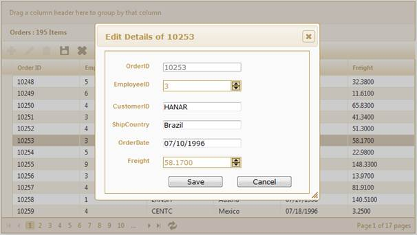

::: {style="DISPLAY: none"}
{#d2h_url_template}{#d2h_package_url style="WIDTH: 0px; DISPLAY: none; HEIGHT: 0px"}
:::

::: {.d2h_secondary_topic style="PADDING-BOTTOM: 10pt; MARGIN: 0pt; PADDING-LEFT: 0pt; PADDING-RIGHT: 0pt; PADDING-TOP: 0pt"}
##### Through GridPropertiesModel {#through-gridpropertiesmodel style="tab-stops: 0pt"}

The steps to work with the editing feature through GridPropertiesModel are as follows.

 

1.   Add the **MicrosoftMvcValidation.debug.js** file in the master page.

 

+---------------------------------------------------------------------------------------------------------------------------------------------------------------------------------------------------------------------------------------------------------------------------------------------------------------------------------------------------------------------------------------------------------------------------------------------------------------------------------------------------------------------------------------------------------------------------------------------------------------------+
| **[\[ASPX\]]{style="FONT-FAMILY: 'Courier New'"}**                                                                                                                                                                                                                                                                                                                                                                                                                                                                                                                                                                  |
|                                                                                                                                                                                                                                                                                                                                                                                                                                                                                                                                                                                                                     |
| []{style="FONT-FAMILY: 'Courier New'; COLOR: blue"}                                                                                                                                                                                                                                                                                                                                                                                                                                                                                                                                                                 |
|                                                                                                                                                                                                                                                                                                                                                                                                                                                                                                                                                                                                                     |
| [\<]{style="FONT-FAMILY: 'Courier New'; COLOR: blue"}[head]{style="FONT-FAMILY: 'Courier New'; COLOR: maroon"}[ [runat]{style="COLOR: red"}[=\"server\"\>]{style="COLOR: blue"}]{style="FONT-FAMILY: 'Courier New'"}                                                                                                                                                                                                                                                                                                                                                                                                |
|                                                                                                                                                                                                                                                                                                                                                                                                                                                                                                                                                                                                                     |
| [\<]{style="FONT-FAMILY: 'Courier New'; COLOR: blue"}[title]{style="FONT-FAMILY: 'Courier New'; COLOR: maroon"}[\>\<]{style="FONT-FAMILY: 'Courier New'; COLOR: blue"}[asp]{style="FONT-FAMILY: 'Courier New'; COLOR: maroon"}[:]{style="FONT-FAMILY: 'Courier New'; COLOR: blue"}[ContentPlaceHolder]{style="FONT-FAMILY: 'Courier New'; COLOR: maroon"}[ [ID]{style="COLOR: red"}[=\"TitleContent\"]{style="COLOR: blue"} [runat]{style="COLOR: red"}[=\"server\"]{style="COLOR: blue"} [/\>\</]{style="COLOR: blue"}[title]{style="COLOR: maroon"}[\>]{style="COLOR: blue"}]{style="FONT-FAMILY: 'Courier New'"} |
|                                                                                                                                                                                                                                                                                                                                                                                                                                                                                                                                                                                                                     |
| [.........]{style="FONT-FAMILY: 'Courier New'; COLOR: blue"}[]{style="FONT-FAMILY: 'Courier New'"}                                                                                                                                                                                                                                                                                                                                                                                                                                                                                                                  |
|                                                                                                                                                                                                                                                                                                                                                                                                                                                                                                                                                                                                                     |
| [\<]{style="FONT-FAMILY: 'Courier New'; COLOR: blue"}[script]{style="FONT-FAMILY: 'Courier New'; COLOR: maroon"}[ [src]{style="COLOR: red"}[=\"]{style="COLOR: blue"}[\<%]{style="BACKGROUND: yellow"}[=]{style="COLOR: blue"} Url.Content(\"\~/Scripts/MicrosoftMvcValidation.debug.js\") [%\>]{style="BACKGROUND: yellow"}[\"]{style="COLOR: blue"} [type]{style="COLOR: red"}[=\"text/javascript\"\>\</]{style="COLOR: blue"}[script]{style="COLOR: maroon"}[\>]{style="COLOR: blue"}]{style="FONT-FAMILY: 'Courier New'"}                                                                                       |
|                                                                                                                                                                                                                                                                                                                                                                                                                                                                                                                                                                                                                     |
| [\</]{style="FONT-FAMILY: 'Courier New'; COLOR: blue"}[head]{style="FONT-FAMILY: 'Courier New'; COLOR: maroon"}[\>]{style="FONT-FAMILY: 'Courier New'; COLOR: blue"}                                                                                                                                                                                                                                                                                                                                                                                                                                                |
+---------------------------------------------------------------------------------------------------------------------------------------------------------------------------------------------------------------------------------------------------------------------------------------------------------------------------------------------------------------------------------------------------------------------------------------------------------------------------------------------------------------------------------------------------------------------------------------------------------------------+

 

2.   Create a model in the application.

3.   Add the following code in the **Index.aspx** file, to create the Grid control in **View**.

 

+-----------------------------------------------------------------------------------------------------------------------------------------------------------------------------------------------------------------------------------------------------------------------------------------------------------+
| **[\[ASPX\]]{style="FONT-FAMILY: 'Courier New'"}**                                                                                                                                                                                                                                                        |
|                                                                                                                                                                                                                                                                                                           |
| []{style="FONT-FAMILY: 'Courier New'"}                                                                                                                                                                                                                                                                    |
|                                                                                                                                                                                                                                                                                                           |
| [\<%]{style="FONT-FAMILY: 'Courier New'; BACKGROUND: yellow"}[=]{style="FONT-FAMILY: 'Courier New'; COLOR: blue"}[Html.Syncfusion().Grid\<[Order]{style="COLOR: #2b91af"}\>([\"Grid1\"]{style="COLOR: #a31515"}, [\"GridModel\"]{style="COLOR: #a31515"}, column =\>]{style="FONT-FAMILY: 'Courier New'"} |
|                                                                                                                                                                                                                                                                                                           |
| [    {]{style="FONT-FAMILY: 'Courier New'"}                                                                                                                                                                                                                                                               |
|                                                                                                                                                                                                                                                                                                           |
| [        column.Add(p =\> p.OrderID).HeaderText([\"Order ID\"]{style="COLOR: #a31515"});]{style="FONT-FAMILY: 'Courier New'"}                                                                                                                                                                             |
|                                                                                                                                                                                                                                                                                                           |
| [        column.Add(p =\> p.CustomerID).HeaderText([\"Customer ID\"]{style="COLOR: #a31515"});]{style="FONT-FAMILY: 'Courier New'"}                                                                                                                                                                       |
|                                                                                                                                                                                                                                                                                                           |
| [        column.Add(p =\> p.ShipCountry).HeaderText([\"Ship Country]{style="COLOR: #a31515"};]{style="FONT-FAMILY: 'Courier New'"}                                                                                                                                                                        |
|                                                                                                                                                                                                                                                                                                           |
| [        column.Add(p =\> p.OrderDate).HeaderText([\"Order Date\"]{style="COLOR: #a31515"}).Format([\"{0:MM/dd/yyyy}\"]{style="COLOR: #a31515"});]{style="FONT-FAMILY: 'Courier New'"}                                                                                                                    |
|                                                                                                                                                                                                                                                                                                           |
| [        column.Add(p =\> p.Freight).HeaderText([\"Freight]{style="COLOR: #a31515"};]{style="FONT-FAMILY: 'Courier New'"}                                                                                                                                                                                 |
|                                                                                                                                                                                                                                                                                                           |
| [        column.Add(p =\> p.Delivered).HeaderText([\"Delivered\"]{style="COLOR: #a31515"});]{style="FONT-FAMILY: 'Courier New'"}                                                                                                                                                                          |
|                                                                                                                                                                                                                                                                                                           |
| [                         })]{style="FONT-FAMILY: 'Courier New'"}                                                                                                                                                                                                                                         |
|                                                                                                                                                                                                                                                                                                           |
| []{style="FONT-FAMILY: 'Courier New'"}                                                                                                                                                                                                                                                                    |
|                                                                                                                                                                                                                                                                                                           |
| [     })[%\>]{style="BACKGROUND: yellow"}]{style="FONT-FAMILY: 'Courier New'"}                                                                                                                                                                                                                            |
|                                                                                                                                                                                                                                                                                                           |
| []{style="FONT-FAMILY: 'Courier New'"}                                                                                                                                                                                                                                                                    |
|                                                                                                                                                                                                                                                                                                           |
| []{style="FONT-FAMILY: 'Courier New'"}                                                                                                                                                                                                                                                                    |
+-----------------------------------------------------------------------------------------------------------------------------------------------------------------------------------------------------------------------------------------------------------------------------------------------------------+

 

 

+-------------------------------------------------------------------------------------------------------------------------------------------------------------------------------------------------------------------------------------------------------+
| **[\[Razor\]]{style="FONT-FAMILY: 'Courier New'"}**                                                                                                                                                                                                   |
|                                                                                                                                                                                                                                                       |
| []{style="FONT-FAMILY: 'Courier New'; BACKGROUND: yellow"}                                                                                                                                                                                            |
|                                                                                                                                                                                                                                                       |
| [\@{]{style="FONT-FAMILY: 'Courier New'; BACKGROUND: yellow"}[Html.Syncfusion().Grid\<[Order]{style="COLOR: #2b91af"}\>([\"Grid1\"]{style="COLOR: #a31515"}, [\"GridModel\"]{style="COLOR: #a31515"}, column =\>]{style="FONT-FAMILY: 'Courier New'"} |
|                                                                                                                                                                                                                                                       |
| [    {]{style="FONT-FAMILY: 'Courier New'"}                                                                                                                                                                                                           |
|                                                                                                                                                                                                                                                       |
| [        column.Add(p =\> p.OrderID).HeaderText([\"Order ID\"]{style="COLOR: #a31515"});]{style="FONT-FAMILY: 'Courier New'"}                                                                                                                         |
|                                                                                                                                                                                                                                                       |
| [        column.Add(p =\> p.CustomerID).HeaderText([\"Customer ID\"]{style="COLOR: #a31515"});]{style="FONT-FAMILY: 'Courier New'"}                                                                                                                   |
|                                                                                                                                                                                                                                                       |
| [        column.Add(p =\> p.ShipCountry).HeaderText([\"Ship Country]{style="COLOR: #a31515"};]{style="FONT-FAMILY: 'Courier New'"}                                                                                                                    |
|                                                                                                                                                                                                                                                       |
| [        column.Add(p =\> p.OrderDate).HeaderText([\"Order Date\"]{style="COLOR: #a31515"}).Format([\"{0:MM/dd/yyyy}\"]{style="COLOR: #a31515"});]{style="FONT-FAMILY: 'Courier New'"}                                                                |
|                                                                                                                                                                                                                                                       |
| [        column.Add(p =\> p.Freight).HeaderText([\"Freight]{style="COLOR: #a31515"};]{style="FONT-FAMILY: 'Courier New'"}                                                                                                                             |
|                                                                                                                                                                                                                                                       |
| [        column.Add(p =\> p.Delivered).HeaderText([\"Delivered\"]{style="COLOR: #a31515"});]{style="FONT-FAMILY: 'Courier New'"}                                                                                                                      |
|                                                                                                                                                                                                                                                       |
| [                         })]{style="FONT-FAMILY: 'Courier New'"}                                                                                                                                                                                     |
|                                                                                                                                                                                                                                                       |
| [.Render();]{style="FONT-FAMILY: 'Courier New'"}                                                                                                                                                                                                      |
|                                                                                                                                                                                                                                                       |
| [    )[}]{style="BACKGROUND: yellow"}]{style="FONT-FAMILY: 'Courier New'"}                                                                                                                                                                            |
|                                                                                                                                                                                                                                                       |
| []{style="FONT-FAMILY: 'Courier New'"}                                                                                                                                                                                                                |
+-------------------------------------------------------------------------------------------------------------------------------------------------------------------------------------------------------------------------------------------------------+

 

 

4.   Create a **GridPropertiesModel** in the Index method and assign the grid properties in the model.

 

+--------------------------------------------------------------------------------------------------------------------------------------------------------------------------------------------------------------------------------------------------------------------------------------------------------------------------------------------+
| **[Controller]{style="FONT-FAMILY: 'Courier New'; COLOR: black"}[]{style="FONT-FAMILY: 'Times New Roman','serif'"}**                                                                                                                                                                                                                       |
|                                                                                                                                                                                                                                                                                                                                            |
| [GridPropertiesModel]{style="FONT-FAMILY: 'Courier New'; COLOR: #2b91af"}[\<[EditableOrder]{style="COLOR: #2b91af"}\> model = [new]{style="COLOR: blue"} [GridPropertiesModel]{style="COLOR: #2b91af"}\<[EditableOrder]{style="COLOR: #2b91af"}\>()]{style="FONT-FAMILY: 'Courier New'"}[]{style="FONT-FAMILY: 'Times New Roman','serif'"} |
|                                                                                                                                                                                                                                                                                                                                            |
| [            {]{style="FONT-FAMILY: 'Courier New'"}[]{style="FONT-FAMILY: 'Times New Roman','serif'"}                                                                                                                                                                                                                                      |
|                                                                                                                                                                                                                                                                                                                                            |
| [                DataSource = [OrderRepository]{style="COLOR: #2b91af"}.GetAllRecords(),]{style="FONT-FAMILY: 'Courier New'"}[]{style="FONT-FAMILY: 'Times New Roman','serif'"}                                                                                                                                                            |
|                                                                                                                                                                                                                                                                                                                                            |
| [                Caption = [\"Orders\"]{style="COLOR: #a31515"},]{style="FONT-FAMILY: 'Courier New'"}[]{style="FONT-FAMILY: 'Times New Roman','serif'"}                                                                                                                                                                                    |
|                                                                                                                                                                                                                                                                                                                                            |
| [                AllowPaging = [true]{style="COLOR: blue"},]{style="FONT-FAMILY: 'Courier New'"}[]{style="FONT-FAMILY: 'Times New Roman','serif'"}                                                                                                                                                                                         |
|                                                                                                                                                                                                                                                                                                                                            |
| [                AllowSorting = [true]{style="COLOR: blue"},]{style="FONT-FAMILY: 'Courier New'"}[]{style="FONT-FAMILY: 'Times New Roman','serif'"}                                                                                                                                                                                        |
|                                                                                                                                                                                                                                                                                                                                            |
| [                AllowGrouping=[true]{style="COLOR: blue"},]{style="FONT-FAMILY: 'Courier New'"}[]{style="FONT-FAMILY: 'Times New Roman','serif'"}                                                                                                                                                                                         |
|                                                                                                                                                                                                                                                                                                                                            |
| [                AutoFormat=[Skins]{style="COLOR: #2b91af"}.Sandune]{style="FONT-FAMILY: 'Courier New'"}[]{style="FONT-FAMILY: 'Times New Roman','serif'"}                                                                                                                                                                                 |
|                                                                                                                                                                                                                                                                                                                                            |
| [            };]{style="FONT-FAMILY: 'Courier New'"}[]{style="FONT-FAMILY: 'Times New Roman','serif'"}                                                                                                                                                                                                                                     |
|                                                                                                                                                                                                                                                                                                                                            |
| []{style="FONT-FAMILY: 'Times New Roman','serif'"}                                                                                                                                                                                                                                                                                         |
|                                                                                                                                                                                                                                                                                                                                            |
| [            ViewData\[[\"GridModel\"]{style="COLOR: #a31515"}\] = model;]{style="FONT-FAMILY: 'Courier New'"}[]{style="FONT-FAMILY: 'Times New Roman','serif'"}                                                                                                                                                                           |
+--------------------------------------------------------------------------------------------------------------------------------------------------------------------------------------------------------------------------------------------------------------------------------------------------------------------------------------------+

 

[\
\
]{style="FONT-FAMILY: Consolas; COLOR: #2b91af; FONT-SIZE: 9.5pt"}[]{style="FONT-FAMILY: Consolas; FONT-SIZE: 9.5pt"}

[]{style="FONT-FAMILY: Consolas; FONT-SIZE: 9.5pt"} 

5.   Enable editing by using the **Editing** property in the **GridPropertiesModel** and configure the editing properties such as **AllowNew**, **AllowEdit**, and **AllowDelete**, as displayed below.

[            ]{style="FONT-FAMILY: Consolas; FONT-SIZE: 9.5pt"}

+-------------------------------------------------------------------------------------------------------------------------------------------------------------------------------------------------------------------------------------------------------------------------------------------------------------------+
| **[Controller]{style="FONT-FAMILY: 'Courier New'; COLOR: black"}**                                                                                                                                                                                                                                                |
|                                                                                                                                                                                                                                                                                                                   |
| [// Create an object for grid editing and enable the edit, add new, and delete actions.]{style="FONT-FAMILY: 'Courier New'; COLOR: green"}                                                                                                                                                                        |
|                                                                                                                                                                                                                                                                                                                   |
| [GridEditing]{style="FONT-FAMILY: 'Courier New'; COLOR: #2b91af"}[ edit = [new]{style="COLOR: blue"} [GridEditing]{style="COLOR: #2b91af"}() { AllowEdit = [true]{style="COLOR: blue"}, AllowDelete = [true]{style="COLOR: blue"}, AllowNew = [true]{style="COLOR: blue"} };]{style="FONT-FAMILY: 'Courier New'"} |
|                                                                                                                                                                                                                                                                                                                   |
| [// Set the action mappers for the insert, delete, and save actions.]{style="FONT-FAMILY: 'Courier New'; COLOR: green"}                                                                                                                                                                                           |
|                                                                                                                                                                                                                                                                                                                   |
| [edit.DeleteMapper = [\"DeleteOrder\"]{style="COLOR: #a31515"};]{style="FONT-FAMILY: 'Courier New'"}                                                                                                                                                                                                              |
|                                                                                                                                                                                                                                                                                                                   |
| [edit.InsertMapper = [\"AddOrder\"]{style="COLOR: #a31515"};]{style="FONT-FAMILY: 'Courier New'"}                                                                                                                                                                                                                 |
|                                                                                                                                                                                                                                                                                                                   |
| [edit.GridSaveMapper = [\"OrderSave\"]{style="COLOR: #a31515"};]{style="FONT-FAMILY: 'Courier New'"}                                                                                                                                                                                                              |
+-------------------------------------------------------------------------------------------------------------------------------------------------------------------------------------------------------------------------------------------------------------------------------------------------------------------+

 

6.   Customize the dialog as shown below:

 

+--------------------------------------------------------------------------------------------------------------------------------------------------------------------------------------+
| **[Controller]{style="FONT-FAMILY: 'Courier New'; COLOR: black"}[]{style="FONT-FAMILY: 'Courier New'"}**                                                                             |
|                                                                                                                                                                                      |
| [DialogModel]{style="FONT-FAMILY: 'Courier New'; COLOR: #2b91af"}[ dialog = [new]{style="COLOR: blue"} [DialogModel]{style="COLOR: #2b91af"}();]{style="FONT-FAMILY: 'Courier New'"} |
|                                                                                                                                                                                      |
| [            dialog.Height = 500;]{style="FONT-FAMILY: 'Courier New'"}                                                                                                               |
|                                                                                                                                                                                      |
| [            dialog.Width = 460;]{style="FONT-FAMILY: 'Courier New'"}                                                                                                                |
|                                                                                                                                                                                      |
| [            dialog.Show = [DialogAnimations]{style="COLOR: #2b91af"}.bounce;]{style="FONT-FAMILY: 'Courier New'"}                                                                   |
|                                                                                                                                                                                      |
| [            dialog.Hide = [DialogAnimations]{style="COLOR: #2b91af"}.fold;]{style="FONT-FAMILY: 'Courier New'"}                                                                     |
|                                                                                                                                                                                      |
| [            dialog.Position = [DialogPositions]{style="COLOR: #2b91af"}.Center;]{style="FONT-FAMILY: 'Courier New'"}                                                                |
|                                                                                                                                                                                      |
| [            edit.Dialog = dialog;]{style="FONT-FAMILY: 'Courier New'"}                                                                                                              |
+--------------------------------------------------------------------------------------------------------------------------------------------------------------------------------------+

 

7.   Specify the **GridEditMode** through the **EditMode** property.**[ ]{style="COLOR: #4e84c4; FONT-SIZE: 18pt"}**

 

+------------------------------------------------------------------------------------------------------+
| **[Controller]{style="FONT-FAMILY: 'Courier New'; COLOR: black"}**                                   |
|                                                                                                      |
| [// Set the Edit mode.]{style="FONT-FAMILY: 'Courier New'; COLOR: green"}                            |
|                                                                                                      |
| [edit.EditMode = [GridEditMode]{style="COLOR: #2b91af"}.Dialog;]{style="FONT-FAMILY: 'Courier New'"} |
+------------------------------------------------------------------------------------------------------+

 

8.   Specify the primary property which uniquely identifies the grid record.

 

+-------------------------------------------------------------------------------------------------------------------------------------------------------------------------------------------------+
| **[Controller]{style="FONT-FAMILY: 'Courier New'; COLOR: black"}**                                                                                                                              |
|                                                                                                                                                                                                 |
| [// Add the PrimaryKey value to uniquely identify the record.]{style="FONT-FAMILY: 'Courier New'; COLOR: green"}                                                                                |
|                                                                                                                                                                                                 |
| [edit.PrimaryKey = [new]{style="COLOR: blue"} [List]{style="COLOR: #2b91af"}\<[string]{style="COLOR: blue"}\>() { [\"OrderID\"]{style="COLOR: #a31515"} };]{style="FONT-FAMILY: 'Courier New'"} |
+-------------------------------------------------------------------------------------------------------------------------------------------------------------------------------------------------+

 

9.   Add the edit object to the model.

 

+------------------------------------------------------------------------------------------+
| **[Controller]{style="FONT-FAMILY: 'Courier New'; COLOR: black"}**                       |
|                                                                                          |
| [// Add the edit object to the model.]{style="FONT-FAMILY: 'Courier New'; COLOR: green"} |
|                                                                                          |
| [model.Editing = edit;]{style="FONT-FAMILY: 'Courier New'"}                              |
+------------------------------------------------------------------------------------------+

 

10.  Essential Grid allows adding new records through grid toolbar items. In this example, **AddNew**, **Edit**, **Delete**, **Save**, and **Cancel** buttons have been added as toolbar items as displayed below:

 

+--------------------------------------------------------------------------------------------------------------------------------------------------------------------------------------------------+
| **[Controller]{style="FONT-FAMILY: 'Courier New'; COLOR: black"}**                                                                                                                               |
|                                                                                                                                                                                                  |
| [// Configure the toolbar.]{style="FONT-FAMILY: 'Courier New'; COLOR: green"}                                                                                                                    |
|                                                                                                                                                                                                  |
| [ToolbarSettings]{style="FONT-FAMILY: 'Courier New'; COLOR: #2b91af"}[ toolbar = [new]{style="COLOR: blue"} [ToolbarSettings]{style="COLOR: #2b91af"}();]{style="FONT-FAMILY: 'Courier New'"}    |
|                                                                                                                                                                                                  |
| [toolbar.Enable = [true]{style="COLOR: blue"};]{style="FONT-FAMILY: 'Courier New'"}                                                                                                              |
|                                                                                                                                                                                                  |
| [// Add the AddNew, Edit, Delete, Save, and Cancel buttons to the toolbar.]{style="FONT-FAMILY: 'Courier New'; COLOR: green"}                                                                    |
|                                                                                                                                                                                                  |
| [toolbar.Items.Add([new]{style="COLOR: blue"} [ToolbarOptions]{style="COLOR: #2b91af"}() { ItemType= [GridToolBarItems]{style="COLOR: #2b91af"}.AddNew});]{style="FONT-FAMILY: 'Courier New'"}   |
|                                                                                                                                                                                                  |
| [toolbar.Items.Add([new]{style="COLOR: blue"} [ToolbarOptions]{style="COLOR: #2b91af"}() { ItemType = [GridToolBarItems]{style="COLOR: #2b91af"}.Edit });]{style="FONT-FAMILY: 'Courier New'"}   |
|                                                                                                                                                                                                  |
| [toolbar.Items.Add([new]{style="COLOR: blue"} [ToolbarOptions]{style="COLOR: #2b91af"}() { ItemType = [GridToolBarItems]{style="COLOR: #2b91af"}.Delete });]{style="FONT-FAMILY: 'Courier New'"} |
|                                                                                                                                                                                                  |
| [toolbar.Items.Add([new]{style="COLOR: blue"} [ToolbarOptions]{style="COLOR: #2b91af"}() { ItemType = [GridToolBarItems]{style="COLOR: #2b91af"}.Update });]{style="FONT-FAMILY: 'Courier New'"} |
|                                                                                                                                                                                                  |
| [toolbar.Items.Add([new]{style="COLOR: blue"} [ToolbarOptions]{style="COLOR: #2b91af"}() { ItemType = [GridToolBarItems]{style="COLOR: #2b91af"}.Cancel });]{style="FONT-FAMILY: 'Courier New'"} |
|                                                                                                                                                                                                  |
| [model.ToolBar = toolbar;]{style="FONT-FAMILY: 'Courier New'"}                                                                                                                                   |
+--------------------------------------------------------------------------------------------------------------------------------------------------------------------------------------------------+

 

11.  In the controller, create a method to add new records to grid, as displayed below. In this example, the repository method **Add()** is being created to insert records in the database. Refer to the repository action method displayed below.

 

+------------------------------------------------------------------------------------------------------------------------------------------------------------------------------------------------------------------------------------------------------------------------------------------------------------------------------------------------------+
| **[Controller]{style="FONT-FAMILY: 'Courier New'; COLOR: black"}**                                                                                                                                                                                                                                                                                   |
|                                                                                                                                                                                                                                                                                                                                                      |
| [///]{style="FONT-FAMILY: 'Courier New'; COLOR: gray"}[ ]{style="FONT-FAMILY: 'Courier New'; COLOR: green"}[\<summary\>]{style="FONT-FAMILY: 'Courier New'; COLOR: gray"}                                                                                                                                                                            |
|                                                                                                                                                                                                                                                                                                                                                      |
| [///]{style="FONT-FAMILY: 'Courier New'; COLOR: gray"}[ Used to insert the record in the database and refresh the grid.]{style="FONT-FAMILY: 'Courier New'; COLOR: green"}                                                                                                                                                                           |
|                                                                                                                                                                                                                                                                                                                                                      |
| [///]{style="FONT-FAMILY: 'Courier New'; COLOR: gray"}[ ]{style="FONT-FAMILY: 'Courier New'; COLOR: green"}[\</summary\>]{style="FONT-FAMILY: 'Courier New'; COLOR: gray"}                                                                                                                                                                           |
|                                                                                                                                                                                                                                                                                                                                                      |
| [///]{style="FONT-FAMILY: 'Courier New'; COLOR: gray"}[ ]{style="FONT-FAMILY: 'Courier New'; COLOR: green"}[\<param name=\"ord\"\>]{style="FONT-FAMILY: 'Courier New'; COLOR: gray"}[Editable order.]{style="FONT-FAMILY: 'Courier New'; COLOR: green"}[\</param\>]{style="FONT-FAMILY: 'Courier New'; COLOR: gray"}                                 |
|                                                                                                                                                                                                                                                                                                                                                      |
| [///]{style="FONT-FAMILY: 'Courier New'; COLOR: gray"}[ ]{style="FONT-FAMILY: 'Courier New'; COLOR: green"}[\<returns\>]{style="FONT-FAMILY: 'Courier New'; COLOR: gray"}[HtmlActionResult returns the data displayed in the grid.]{style="FONT-FAMILY: 'Courier New'; COLOR: green"}[\</returns\>]{style="FONT-FAMILY: 'Courier New'; COLOR: gray"} |
|                                                                                                                                                                                                                                                                                                                                                      |
| [\[[AcceptVerbs]{style="COLOR: #2b91af"}([HttpVerbs]{style="COLOR: #2b91af"}.Post)\]]{style="FONT-FAMILY: 'Courier New'"}                                                                                                                                                                                                                            |
|                                                                                                                                                                                                                                                                                                                                                      |
| [public]{style="FONT-FAMILY: 'Courier New'; COLOR: blue"}[ [ActionResult]{style="COLOR: #2b91af"} AddOrder([EditableOrder]{style="COLOR: #2b91af"} ord)]{style="FONT-FAMILY: 'Courier New'"}                                                                                                                                                         |
|                                                                                                                                                                                                                                                                                                                                                      |
| [{]{style="FONT-FAMILY: 'Courier New'"}                                                                                                                                                                                                                                                                                                              |
|                                                                                                                                                                                                                                                                                                                                                      |
| [// Repository action method Add() is used to insert records in the data source.]{style="FONT-FAMILY: 'Courier New'; COLOR: green"}                                                                                                                                                                                                                  |
|                                                                                                                                                                                                                                                                                                                                                      |
| **[OrderRepository]{style="FONT-FAMILY: 'Courier New'; COLOR: #2b91af"}[.Add(ord);]{style="FONT-FAMILY: 'Courier New'"}**                                                                                                                                                                                                                            |
|                                                                                                                                                                                                                                                                                                                                                      |
| [// After adding the record to the database, refresh the grid.]{style="FONT-FAMILY: 'Courier New'; COLOR: green"}                                                                                                                                                                                                                                    |
|                                                                                                                                                                                                                                                                                                                                                      |
| [var]{style="FONT-FAMILY: 'Courier New'; COLOR: blue"}[ data = [OrderRepository]{style="COLOR: #2b91af"}.GetAllRecords();]{style="FONT-FAMILY: 'Courier New'"}                                                                                                                                                                                       |
|                                                                                                                                                                                                                                                                                                                                                      |
| [return]{style="FONT-FAMILY: 'Courier New'; COLOR: blue"}[ data.GridActions\<[EditableOrder]{style="COLOR: #2b91af"}\>();]{style="FONT-FAMILY: 'Courier New'"}                                                                                                                                                                                       |
|                                                                                                                                                                                                                                                                                                                                                      |
| [}]{style="FONT-FAMILY: 'Courier New'"}                                                                                                                                                                                                                                                                                                              |
+------------------------------------------------------------------------------------------------------------------------------------------------------------------------------------------------------------------------------------------------------------------------------------------------------------------------------------------------------+

 

12.  In the controller, create a method to save changes as displayed below.

 

 In this example, the repository method **Update()** is used to update records to the data source:

 

+------------------------------------------------------------------------------------------------------------------------------------------------------------------------------------------------------------------------------------------------------------------------------------------------------------------------------------------------------+
| **[Controller]{style="FONT-FAMILY: 'Courier New'; COLOR: black"}**                                                                                                                                                                                                                                                                                   |
|                                                                                                                                                                                                                                                                                                                                                      |
| [///]{style="FONT-FAMILY: 'Courier New'; COLOR: gray"}[ Used to insert the record in the database and refresh the grid.]{style="FONT-FAMILY: 'Courier New'; COLOR: green"}                                                                                                                                                                           |
|                                                                                                                                                                                                                                                                                                                                                      |
| [///]{style="FONT-FAMILY: 'Courier New'; COLOR: gray"}[ ]{style="FONT-FAMILY: 'Courier New'; COLOR: green"}[\</summary\>]{style="FONT-FAMILY: 'Courier New'; COLOR: gray"}                                                                                                                                                                           |
|                                                                                                                                                                                                                                                                                                                                                      |
| [///]{style="FONT-FAMILY: 'Courier New'; COLOR: gray"}[ ]{style="FONT-FAMILY: 'Courier New'; COLOR: green"}[\<param name=\"ord\"\>]{style="FONT-FAMILY: 'Courier New'; COLOR: gray"}[Editable order.]{style="FONT-FAMILY: 'Courier New'; COLOR: green"}[\</param\>]{style="FONT-FAMILY: 'Courier New'; COLOR: gray"}                                 |
|                                                                                                                                                                                                                                                                                                                                                      |
| [///]{style="FONT-FAMILY: 'Courier New'; COLOR: gray"}[ ]{style="FONT-FAMILY: 'Courier New'; COLOR: green"}[\<returns\>]{style="FONT-FAMILY: 'Courier New'; COLOR: gray"}[HtmlActionResult returns the data displayed in the grid.]{style="FONT-FAMILY: 'Courier New'; COLOR: green"}[\</returns\>]{style="FONT-FAMILY: 'Courier New'; COLOR: gray"} |
|                                                                                                                                                                                                                                                                                                                                                      |
| [\[[AcceptVerbs]{style="COLOR: #2b91af"}([HttpVerbs]{style="COLOR: #2b91af"}.Post)\]]{style="FONT-FAMILY: 'Courier New'"}                                                                                                                                                                                                                            |
|                                                                                                                                                                                                                                                                                                                                                      |
| [public]{style="FONT-FAMILY: 'Courier New'; COLOR: blue"}[ [ActionResult]{style="COLOR: #2b91af"} OrderSave([EditableOrder]{style="COLOR: #2b91af"} ord)]{style="FONT-FAMILY: 'Courier New'"}                                                                                                                                                        |
|                                                                                                                                                                                                                                                                                                                                                      |
| [{]{style="FONT-FAMILY: 'Courier New'"}                                                                                                                                                                                                                                                                                                              |
|                                                                                                                                                                                                                                                                                                                                                      |
| [// Repository action method Update is used to update the records into datasource.]{style="FONT-FAMILY: 'Courier New'; COLOR: green"}                                                                                                                                                                                                                |
|                                                                                                                                                                                                                                                                                                                                                      |
| **[OrderRepository]{style="FONT-FAMILY: 'Courier New'; COLOR: #2b91af"}[.Update(ord);]{style="FONT-FAMILY: 'Courier New'"}**                                                                                                                                                                                                                         |
|                                                                                                                                                                                                                                                                                                                                                      |
| [//After saving the records into datasource refresh the grid.]{style="FONT-FAMILY: 'Courier New'; COLOR: green"}                                                                                                                                                                                                                                     |
|                                                                                                                                                                                                                                                                                                                                                      |
| [var]{style="FONT-FAMILY: 'Courier New'; COLOR: blue"}[ data = [OrderRepository]{style="COLOR: #2b91af"}.GetAllRecords();]{style="FONT-FAMILY: 'Courier New'"}                                                                                                                                                                                       |
|                                                                                                                                                                                                                                                                                                                                                      |
| [return]{style="FONT-FAMILY: 'Courier New'; COLOR: blue"}[ data.GridActions\<[EditableOrder]{style="COLOR: #2b91af"}\>();]{style="FONT-FAMILY: 'Courier New'"}                                                                                                                                                                                       |
|                                                                                                                                                                                                                                                                                                                                                      |
| [}]{style="FONT-FAMILY: 'Courier New'"}                                                                                                                                                                                                                                                                                                              |
+------------------------------------------------------------------------------------------------------------------------------------------------------------------------------------------------------------------------------------------------------------------------------------------------------------------------------------------------------+

 

13.  In the controller, create a method to delete the records from the database as displayed below.

 

In this example, the repository action **Delete()** will delete the record from the data source.

 

+------------------------------------------------------------------------------------------------------------------------------------------------------------------------------------------------------------------------------------------------------------------------------------------------------------------------------------------------------+
| **[Controller]{style="FONT-FAMILY: 'Courier New'"}**                                                                                                                                                                                                                                                                                                 |
|                                                                                                                                                                                                                                                                                                                                                      |
| [///]{style="FONT-FAMILY: 'Courier New'; COLOR: gray"}[ ]{style="FONT-FAMILY: 'Courier New'; COLOR: green"}[\<summary\>]{style="FONT-FAMILY: 'Courier New'; COLOR: gray"}                                                                                                                                                                            |
|                                                                                                                                                                                                                                                                                                                                                      |
| [///]{style="FONT-FAMILY: 'Courier New'; COLOR: gray"}[ Used to delete records from the data source and refresh the grid.]{style="FONT-FAMILY: 'Courier New'; COLOR: green"}                                                                                                                                                                         |
|                                                                                                                                                                                                                                                                                                                                                      |
| [///]{style="FONT-FAMILY: 'Courier New'; COLOR: gray"}[ ]{style="FONT-FAMILY: 'Courier New'; COLOR: green"}[\</summary\>]{style="FONT-FAMILY: 'Courier New'; COLOR: gray"}                                                                                                                                                                           |
|                                                                                                                                                                                                                                                                                                                                                      |
| [///]{style="FONT-FAMILY: 'Courier New'; COLOR: gray"}[ ]{style="FONT-FAMILY: 'Courier New'; COLOR: green"}[\<param name=\"OrderID\"\>]{style="FONT-FAMILY: 'Courier New'; COLOR: gray"}[Primary key values.]{style="FONT-FAMILY: 'Courier New'; COLOR: green"}[\</param\>]{style="FONT-FAMILY: 'Courier New'; COLOR: gray"}                         |
|                                                                                                                                                                                                                                                                                                                                                      |
| [///]{style="FONT-FAMILY: 'Courier New'; COLOR: gray"}[ ]{style="FONT-FAMILY: 'Courier New'; COLOR: green"}[\<returns\>]{style="FONT-FAMILY: 'Courier New'; COLOR: gray"}[HtmlActionResult returns the data displayed in the grid.]{style="FONT-FAMILY: 'Courier New'; COLOR: green"}[\</returns\>]{style="FONT-FAMILY: 'Courier New'; COLOR: gray"} |
|                                                                                                                                                                                                                                                                                                                                                      |
| [\[[AcceptVerbs]{style="COLOR: #2b91af"}([HttpVerbs]{style="COLOR: #2b91af"}.Post)\]]{style="FONT-FAMILY: 'Courier New'"}                                                                                                                                                                                                                            |
|                                                                                                                                                                                                                                                                                                                                                      |
| [public]{style="FONT-FAMILY: 'Courier New'; COLOR: blue"}[ [ActionResult]{style="COLOR: #2b91af"} DeleteOrder([int]{style="COLOR: blue"} OrderID)]{style="FONT-FAMILY: 'Courier New'"}                                                                                                                                                               |
|                                                                                                                                                                                                                                                                                                                                                      |
| [{]{style="FONT-FAMILY: 'Courier New'"}                                                                                                                                                                                                                                                                                                              |
|                                                                                                                                                                                                                                                                                                                                                      |
| [// Repoistory action Delete() deletes the given primary value record from the data source.]{style="FONT-FAMILY: 'Courier New'; COLOR: green"}                                                                                                                                                                                                       |
|                                                                                                                                                                                                                                                                                                                                                      |
| **[OrderRepository]{style="FONT-FAMILY: 'Courier New'; COLOR: #2b91af"}[.Delete(OrderID);]{style="FONT-FAMILY: 'Courier New'"}**                                                                                                                                                                                                                     |
|                                                                                                                                                                                                                                                                                                                                                      |
| [// After deleting, refresh the grid.]{style="FONT-FAMILY: 'Courier New'; COLOR: green"}                                                                                                                                                                                                                                                             |
|                                                                                                                                                                                                                                                                                                                                                      |
| [var]{style="FONT-FAMILY: 'Courier New'; COLOR: blue"}[ data = [OrderRepository]{style="COLOR: #2b91af"}.GetAllRecords();]{style="FONT-FAMILY: 'Courier New'"}                                                                                                                                                                                       |
|                                                                                                                                                                                                                                                                                                                                                      |
| [return]{style="FONT-FAMILY: 'Courier New'; COLOR: blue"}[ data.GridActions\<[EditableOrder]{style="COLOR: #2b91af"}\>();]{style="FONT-FAMILY: 'Courier New'"}                                                                                                                                                                                       |
|                                                                                                                                                                                                                                                                                                                                                      |
| [}]{style="FONT-FAMILY: 'Courier New'"}                                                                                                                                                                                                                                                                                                              |
+------------------------------------------------------------------------------------------------------------------------------------------------------------------------------------------------------------------------------------------------------------------------------------------------------------------------------------------------------+

 

14.  Run the application. The grid will appear as displayed below.

 

[{border="0"}]{style="FONT-FAMILY: Consolas; FONT-SIZE: 9.5pt"}

Figure 184: Dialog Editing through the GridPropertiesModel**[]{style="FONT-STYLE: normal"}**

 

[]{#related-topics}
:::
