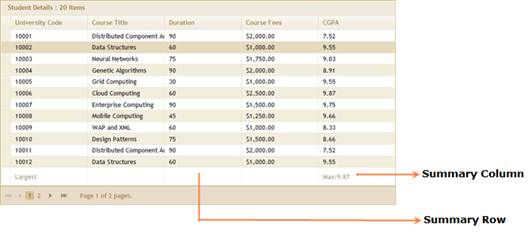

::: {style="DISPLAY: none"}
{#d2h_url_template}{#d2h_package_url style="WIDTH: 0px; DISPLAY: none; HEIGHT: 0px"}
:::

::::: {.d2h_secondary_topic style="PADDING-BOTTOM: 10pt; MARGIN: 0pt; PADDING-LEFT: 0pt; PADDING-RIGHT: 0pt; PADDING-TOP: 0pt"}
#### Through GridPropertiesModel {#through-gridpropertiesmodel style="tab-stops: 0pt"}

 

1.   Create a model in the application (Refer to [[Getting Started\>Adding a Model to the Application]{style="COLOR: blue"}]{.underline}).

2.   Add the following code in the **Index.aspx** file to create the Grid control in the view.

 

+-------------------------------------------------------------------------------------------------------------------------------------------------------------------------------------------------------------------------------------------------------------+
| **[View \[ASPX\]]{style="FONT-FAMILY: 'Courier New'; COLOR: black"}**                                                                                                                                                                                       |
|                                                                                                                                                                                                                                                             |
| []{style="FONT-FAMILY: 'Courier New'"}                                                                                                                                                                                                                      |
|                                                                                                                                                                                                                                                             |
| [  [\<%]{style="BACKGROUND: yellow"}[=]{style="COLOR: blue"}Html.Syncfusion().Grid\<[Student]{style="COLOR: #2b91af"}\>([\"StudentGrid\"]{style="COLOR: #a31515"}, [\"GridModel\"]{style="COLOR: #a31515"}, column =\>]{style="FONT-FAMILY: 'Courier New'"} |
|                                                                                                                                                                                                                                                             |
| [             {]{style="FONT-FAMILY: 'Courier New'"}                                                                                                                                                                                                        |
|                                                                                                                                                                                                                                                             |
| [                 column.Add(p =\> p.UniversityCode).HeaderText([\"University Code\"]{style="COLOR: #a31515"});]{style="FONT-FAMILY: 'Courier New'"}                                                                                                        |
|                                                                                                                                                                                                                                                             |
| [                 column.Add(p =\> p.Title).HeaderText([\"Course Title\"]{style="COLOR: #a31515"});]{style="FONT-FAMILY: 'Courier New'"}                                                                                                                    |
|                                                                                                                                                                                                                                                             |
| [                 column.Add(P =\> P.Duration);]{style="FONT-FAMILY: 'Courier New'"}                                                                                                                                                                        |
|                                                                                                                                                                                                                                                             |
| [                 column.Add(p =\> p.CourseFees).Format([\"{CourseFees:c}\"]{style="COLOR: #a31515"}).HeaderText([\"Course Fees\"]{style="COLOR: #a31515"});]{style="FONT-FAMILY: 'Courier New'"}                                                           |
|                                                                                                                                                                                                                                                             |
| [                 column.Add(p =\> p.CGPA);]{style="FONT-FAMILY: 'Courier New'"}                                                                                                                                                                            |
|                                                                                                                                                                                                                                                             |
| [             }) [%\>]{style="BACKGROUND: yellow"}]{style="FONT-FAMILY: 'Courier New'"}                                                                                                                                                                     |
+-------------------------------------------------------------------------------------------------------------------------------------------------------------------------------------------------------------------------------------------------------------+

[]{style="FONT-FAMILY: Consolas; BACKGROUND: yellow; FONT-SIZE: 9.5pt"} 

[]{style="FONT-FAMILY: 'Myriad Pro','sans-serif'"} 

[]{style="FONT-FAMILY: Consolas; FONT-SIZE: 9.5pt"} 

::: {align="center"}
+------------------------------------------------------------------------------------------------------------------------------------------------------------------------------------------------------------------------------------------------------------------------------------------------------------------------------------------------------------------------------------------------------------------------------------------------------------------------------+
| **[View \[cshtml\]]{style="FONT-FAMILY: 'Courier New'"}**                                                                                                                                                                                                                                                                                                                                                                                                                    |
|                                                                                                                                                                                                                                                                                                                                                                                                                                                                              |
| [ ]{style="FONT-FAMILY: 'Courier New'"}[@(]{style="FONT-FAMILY: Consolas; BACKGROUND: yellow; FONT-SIZE: 9.5pt"}[new]{style="FONT-FAMILY: Consolas; COLOR: blue; FONT-SIZE: 9.5pt"}[ [HtmlString]{style="COLOR: #2b91af"}(]{style="FONT-FAMILY: Consolas; FONT-SIZE: 9.5pt"}[Html.Syncfusion().Grid\<[Student]{style="COLOR: #2b91af"}\>([\"StudentGrid\"]{style="COLOR: #a31515"}, [\"GridModel\"]{style="COLOR: #a31515"}, column =\>]{style="FONT-FAMILY: 'Courier New'"} |
|                                                                                                                                                                                                                                                                                                                                                                                                                                                                              |
| [             {]{style="FONT-FAMILY: 'Courier New'"}                                                                                                                                                                                                                                                                                                                                                                                                                         |
|                                                                                                                                                                                                                                                                                                                                                                                                                                                                              |
| [                 column.Add(p =\> p.UniversityCode).HeaderText([\"University Code\"]{style="COLOR: #a31515"});]{style="FONT-FAMILY: 'Courier New'"}                                                                                                                                                                                                                                                                                                                         |
|                                                                                                                                                                                                                                                                                                                                                                                                                                                                              |
| [                 column.Add(p =\> p.Title).HeaderText([\"Course Title\"]{style="COLOR: #a31515"});]{style="FONT-FAMILY: 'Courier New'"}                                                                                                                                                                                                                                                                                                                                     |
|                                                                                                                                                                                                                                                                                                                                                                                                                                                                              |
| [                 column.Add(P =\> P.Duration);]{style="FONT-FAMILY: 'Courier New'"}                                                                                                                                                                                                                                                                                                                                                                                         |
|                                                                                                                                                                                                                                                                                                                                                                                                                                                                              |
| [                 column.Add(p =\> p.CourseFees).Format([\"{CourseFees:c}\"]{style="COLOR: #a31515"}).HeaderText([\"Course Fees\"]{style="COLOR: #a31515"});]{style="FONT-FAMILY: 'Courier New'"}                                                                                                                                                                                                                                                                            |
|                                                                                                                                                                                                                                                                                                                                                                                                                                                                              |
| [                 column.Add(p =\> p.CGPA);]{style="FONT-FAMILY: 'Courier New'"}                                                                                                                                                                                                                                                                                                                                                                                             |
|                                                                                                                                                                                                                                                                                                                                                                                                                                                                              |
| [             })]{style="FONT-FAMILY: 'Courier New'"}                                                                                                                                                                                                                                                                                                                                                                                                                        |
|                                                                                                                                                                                                                                                                                                                                                                                                                                                                              |
| [.]{style="FONT-FAMILY: 'Courier New'"}[ToString())[)]{style="BACKGROUND: yellow"} ]{style="FONT-FAMILY: Consolas; FONT-SIZE: 9.5pt"}[]{style="FONT-FAMILY: 'Courier New'"}                                                                                                                                                                                                                                                                                                  |
+------------------------------------------------------------------------------------------------------------------------------------------------------------------------------------------------------------------------------------------------------------------------------------------------------------------------------------------------------------------------------------------------------------------------------------------------------------------------------+
:::

[]{style="FONT-FAMILY: 'Courier New'"} 

[]{style="FONT-FAMILY: Consolas; BACKGROUND: yellow; FONT-SIZE: 9.5pt"} 

3.   Create a **GridPropertiesModel** in the **Index** action method. Use the **AllowSummaries** property to enable the summaries feature.

[        ]{style="FONT-FAMILY: Consolas; FONT-SIZE: 9.5pt"}[]{style="FONT-FAMILY: 'Calibri','sans-serif'"}

+----------------------------------------------------------------------------------------------------------------------------------------------------------------------------------------------------------------------------------------------------------------------------------+
| **[Controller]{style="FONT-FAMILY: 'Courier New'; COLOR: black"}**                                                                                                                                                                                                               |
|                                                                                                                                                                                                                                                                                  |
| []{style="FONT-FAMILY: 'Courier New'; COLOR: #2b91af"}                                                                                                                                                                                                                           |
|                                                                                                                                                                                                                                                                                  |
| [GridPropertiesModel]{style="FONT-FAMILY: 'Courier New'; COLOR: #2b91af"}[\<[Student]{style="COLOR: #2b91af"}\> gridModel = [new]{style="COLOR: blue"} [GridPropertiesModel]{style="COLOR: #2b91af"}\<[Student]{style="COLOR: #2b91af"}\>()]{style="FONT-FAMILY: 'Courier New'"} |
|                                                                                                                                                                                                                                                                                  |
| [            {]{style="FONT-FAMILY: 'Courier New'"}                                                                                                                                                                                                                              |
|                                                                                                                                                                                                                                                                                  |
| [                DataSource = [new]{style="COLOR: blue"} [StudentDataContext]{style="COLOR: #2b91af"}().AutoFormatStudent.Skip(0).Take(20).ToList(),]{style="FONT-FAMILY: 'Courier New'"}                                                                                        |
|                                                                                                                                                                                                                                                                                  |
| [                Caption=[\"Student Details\"]{style="COLOR: #a31515"},]{style="FONT-FAMILY: 'Courier New'"}                                                                                                                                                                     |
|                                                                                                                                                                                                                                                                                  |
| [                AllowPaging=[true]{style="COLOR: blue"},]{style="FONT-FAMILY: 'Courier New'"}                                                                                                                                                                                   |
|                                                                                                                                                                                                                                                                                  |
| [                AllowSorting=[true]{style="COLOR: blue"},]{style="FONT-FAMILY: 'Courier New'"}                                                                                                                                                                                  |
|                                                                                                                                                                                                                                                                                  |
| [                **AllowSummaries=[true]{style="COLOR: blue"},**]{style="FONT-FAMILY: 'Courier New'"}                                                                                                                                                                            |
|                                                                                                                                                                                                                                                                                  |
| [                AutoFormat=[Skins]{style="COLOR: #2b91af"}.Sandune]{style="FONT-FAMILY: 'Courier New'"}                                                                                                                                                                         |
|                                                                                                                                                                                                                                                                                  |
| [            };]{style="FONT-FAMILY: 'Courier New'"}                                                                                                                                                                                                                             |
+----------------------------------------------------------------------------------------------------------------------------------------------------------------------------------------------------------------------------------------------------------------------------------+

 

[]{style="FONT-FAMILY: Consolas; FONT-SIZE: 9.5pt"} 

4.   Set up a summary column by instantiating **GridSummaryColumnDescriptor** specifying the **SummaryType** and format.[]{style="FONT-SIZE: 14pt"}

 

+-----------------------------------------------------------------------------------------------------------------------------------------------------------------------------------------------------------------------------+
| **[Controller]{style="FONT-FAMILY: 'Courier New'; COLOR: black"}**                                                                                                                                                          |
|                                                                                                                                                                                                                             |
| []{style="FONT-FAMILY: 'Courier New'; COLOR: green"}                                                                                                                                                                        |
|                                                                                                                                                                                                                             |
| [// Create instance to GridSummaryColumnDescriptor.]{style="FONT-FAMILY: 'Courier New'; COLOR: green"}[]{style="FONT-FAMILY: 'Courier New'"}                                                                                |
|                                                                                                                                                                                                                             |
| [                [GridSummaryColumnDescriptor]{style="COLOR: #2b91af"} maxCGPA = [new]{style="COLOR: blue"} [GridSummaryColumnDescriptor]{style="COLOR: #2b91af"}();]{style="FONT-FAMILY: 'Courier New'"}                   |
|                                                                                                                                                                                                                             |
| [                maxCGPA.Name = [\"Maximum CGPA\"]{style="COLOR: #a31515"};[// Specify the name to summary column.]{style="COLOR: green"}]{style="FONT-FAMILY: 'Courier New'"}                                              |
|                                                                                                                                                                                                                             |
| [                maxCGPA.SummaryType = [SummaryType]{style="COLOR: #2b91af"}.DoubleAggregate;[// Specify the SummaryType.]{style="COLOR: green"}]{style="FONT-FAMILY: 'Courier New'"}                                       |
|                                                                                                                                                                                                                             |
| [                maxCGPA.DataMember = [\"CGPA\"]{style="COLOR: #a31515"};[// Gets or sets the mapping for this column.]{style="COLOR: green"}]{style="FONT-FAMILY: 'Courier New'"}                                          |
|                                                                                                                                                                                                                             |
| [                maxCGPA.DisplayColumn= [\"CGPA\"]{style="COLOR: #a31515"};[// The target column to which the summary is displayed.]{style="COLOR: green"}]{style="FONT-FAMILY: 'Courier New'"}                             |
|                                                                                                                                                                                                                             |
| [                maxCGPA.Format = [\"{Maximum:##.##}\"]{style="COLOR: #a31515"};[// The format string used to format the text to display in the summary column.]{style="COLOR: green"}]{style="FONT-FAMILY: 'Courier New'"} |
+-----------------------------------------------------------------------------------------------------------------------------------------------------------------------------------------------------------------------------+

[]{style="FONT-FAMILY: Consolas; COLOR: green; FONT-SIZE: 9.5pt"} 

5.   Define a SummaryRow and add the SummaryColumn into it.

 

+---------------------------------------------------------------------------------------------------------------------------------------------------------------------------------------------------------------------------------------------------------------+
| **[Controller]{style="FONT-FAMILY: 'Courier New'; COLOR: black"}**                                                                                                                                                                                            |
|                                                                                                                                                                                                                                                               |
| []{style="FONT-FAMILY: 'Courier New'; COLOR: gray"}                                                                                                                                                                                                           |
|                                                                                                                                                                                                                                                               |
| [///]{style="FONT-FAMILY: 'Courier New'; COLOR: gray"}[ A GridSummaryRowDescriptor declares a summary row with one or multiple GridSummaryColumnDescriptor elements.]{style="FONT-FAMILY: 'Courier New'; COLOR: green"}[]{style="FONT-FAMILY: 'Courier New'"} |
|                                                                                                                                                                                                                                                               |
| [                [///]{style="COLOR: gray"}[ ]{style="COLOR: green"}[\<param name=\"name\"\>]{style="COLOR: gray"}[The descriptor name.]{style="COLOR: green"}[\</param\>]{style="COLOR: gray"}]{style="FONT-FAMILY: 'Courier New'"}                          |
|                                                                                                                                                                                                                                                               |
| [                [GridSummaryRowDescriptor]{style="COLOR: #2b91af"} maxRow = [new]{style="COLOR: blue"} [GridSummaryRowDescriptor]{style="COLOR: #2b91af"}([\"Largest\"]{style="COLOR: #a31515"});]{style="FONT-FAMILY: 'Courier New'"}                       |
|                                                                                                                                                                                                                                                               |
| []{style="FONT-FAMILY: 'Courier New'"}                                                                                                                                                                                                                        |
|                                                                                                                                                                                                                                                               |
| [                [///]{style="COLOR: gray"}[ Title displayed in the summary row. ]{style="COLOR: green"}]{style="FONT-FAMILY: 'Courier New'"}                                                                                                                 |
|                                                                                                                                                                                                                                                               |
| [                maxRow.Title = [\"Largest\"]{style="COLOR: #a31515"};]{style="FONT-FAMILY: 'Courier New'"}                                                                                                                                                   |
|                                                                                                                                                                                                                                                               |
| []{style="FONT-FAMILY: 'Courier New'"}                                                                                                                                                                                                                        |
|                                                                                                                                                                                                                                                               |
| [                [///]{style="COLOR: gray"}[ Custom text which can be prefixed with the maxCGPA summary.]{style="COLOR: green"}]{style="FONT-FAMILY: 'Courier New'"}                                                                                          |
|                                                                                                                                                                                                                                                               |
| [                maxCGPA.Prefix = [\"Max:\"]{style="COLOR: #a31515"};             ]{style="FONT-FAMILY: 'Courier New'"}                                                                                                                                       |
|                                                                                                                                                                                                                                                               |
| []{style="FONT-FAMILY: 'Courier New'"}                                                                                                                                                                                                                        |
|                                                                                                                                                                                                                                                               |
| [                [///]{style="COLOR: gray"}[ Summary columns are added into the summary row.                ]{style="COLOR: green"}]{style="FONT-FAMILY: 'Courier New'"}                                                                                      |
|                                                                                                                                                                                                                                                               |
| [                maxRow.SummaryColumns.Add(maxCGPA);]{style="FONT-FAMILY: 'Courier New'"}                                                                                                                                                                     |
+---------------------------------------------------------------------------------------------------------------------------------------------------------------------------------------------------------------------------------------------------------------+

[]{style="FONT-FAMILY: Consolas; FONT-SIZE: 9.5pt"} 

6.   Finally add the summary row to the grid using **SummaryRows**. [      ]{style="FONT-FAMILY: Consolas; FONT-SIZE: 9.5pt"}

[         ]{style="FONT-FAMILY: Consolas; FONT-SIZE: 9.5pt"}[[ ]{style="FONT-SIZE: 20pt"}]{.Heading1Char}

+--------------------------------------------------------------------------------------------------------------------------------------------------------------------------------------------------------------------------+
| **[Controller]{style="FONT-FAMILY: 'Courier New'; COLOR: black"}**                                                                                                                                                       |
|                                                                                                                                                                                                                          |
| [             ]{style="FONT-FAMILY: 'Courier New'"}                                                                                                                                                                      |
|                                                                                                                                                                                                                          |
| [   [// Add summary rows to the grid.]{style="COLOR: green"}]{style="FONT-FAMILY: 'Courier New'"}                                                                                                                        |
|                                                                                                                                                                                                                          |
| [            [foreach]{style="COLOR: blue"} ([GridSummaryRowDescriptor]{style="COLOR: #2b91af"} summaryRow [in]{style="COLOR: blue"} [this]{style="COLOR: blue"}.SummaryCollection)]{style="FONT-FAMILY: 'Courier New'"} |
|                                                                                                                                                                                                                          |
| [                gridModel.SummaryRows.Add(summaryRow);]{style="FONT-FAMILY: 'Courier New'"}                                                                                                                             |
|                                                                                                                                                                                                                          |
| []{style="FONT-FAMILY: 'Courier New'"}                                                                                                                                                                                   |
|                                                                                                                                                                                                                          |
| [ViewData\[[\"GridModel\"]{style="COLOR: #a31515"}\] = gridModel;]{style="FONT-FAMILY: 'Courier New'"}                                                                                                                   |
+--------------------------------------------------------------------------------------------------------------------------------------------------------------------------------------------------------------------------+

 

::: {style="BORDER-BOTTOM: windowtext 1pt solid; BORDER-LEFT: medium none; PADDING-BOTTOM: 1pt; MARGIN-TOP: 9pt; PADDING-LEFT: 0pt; PADDING-RIGHT: 0pt; MARGIN-BOTTOM: 9pt; BORDER-TOP: windowtext 1pt solid; BORDER-RIGHT: medium none; PADDING-TOP: 1pt"}
{border="0"}Note: In this sample, summary rows are defined inside the private property "SummaryRows".
:::

[]{style="FONT-FAMILY: Consolas; FONT-SIZE: 9.5pt"} 

7.   If you enable the paging and sorting features, rebind the **SummaryRow** property again in **Post** actions as given below.

 

[  ]{style="FONT-FAMILY: Consolas; FONT-SIZE: 9.5pt"}

+--------------------------------------------------------------------------------------------------------------------------------------------------------------------------------------------------------------------------------------+
| [///]{style="FONT-FAMILY: 'Courier New'; COLOR: gray"}[ ]{style="FONT-FAMILY: 'Courier New'; COLOR: green"}[\<summary\>]{style="FONT-FAMILY: 'Courier New'; COLOR: gray"}[]{style="FONT-FAMILY: 'Courier New'"}                      |
|                                                                                                                                                                                                                                      |
| [        [///]{style="COLOR: gray"}[ Paging/sorting requests are mapped to this method. This method invokes the HtmlActionResult]{style="COLOR: green"}]{style="FONT-FAMILY: 'Courier New'"}                                         |
|                                                                                                                                                                                                                                      |
| [        [///]{style="COLOR: gray"}[ from the grid. The required response is generated.]{style="COLOR: green"}]{style="FONT-FAMILY: 'Courier New'"}                                                                                  |
|                                                                                                                                                                                                                                      |
| [        [///]{style="COLOR: gray"}[ ]{style="COLOR: green"}[\</summary\>]{style="COLOR: gray"}]{style="FONT-FAMILY: 'Courier New'"}                                                                                                 |
|                                                                                                                                                                                                                                      |
| [        [///]{style="COLOR: gray"}[ ]{style="COLOR: green"}[\<param name=\"args\"\>]{style="COLOR: gray"}[Contains paging properties. ]{style="COLOR: green"}[\</param\>]{style="COLOR: gray"}]{style="FONT-FAMILY: 'Courier New'"} |
|                                                                                                                                                                                                                                      |
| [        [///]{style="COLOR: gray"}[ ]{style="COLOR: green"}[\<returns\>]{style="COLOR: gray"}]{style="FONT-FAMILY: 'Courier New'"}                                                                                                  |
|                                                                                                                                                                                                                                      |
| [        [///]{style="COLOR: gray"}[ HtmlActionResult returns the data displayed in the grid.]{style="COLOR: green"}]{style="FONT-FAMILY: 'Courier New'"}                                                                            |
|                                                                                                                                                                                                                                      |
| [        [///]{style="COLOR: gray"}[ ]{style="COLOR: green"}[\</returns\>]{style="COLOR: gray"}]{style="FONT-FAMILY: 'Courier New'"}                                                                                                 |
|                                                                                                                                                                                                                                      |
| [        \[[AcceptVerbs]{style="COLOR: #2b91af"}([HttpVerbs]{style="COLOR: #2b91af"}.Post)\]]{style="FONT-FAMILY: 'Courier New'"}                                                                                                    |
|                                                                                                                                                                                                                                      |
| [        [public]{style="COLOR: blue"} [ActionResult]{style="COLOR: #2b91af"} Index([PagingParams]{style="COLOR: #2b91af"} args)]{style="FONT-FAMILY: 'Courier New'"}                                                                |
|                                                                                                                                                                                                                                      |
| [        {]{style="FONT-FAMILY: 'Courier New'"}                                                                                                                                                                                      |
|                                                                                                                                                                                                                                      |
| [            [IEnumerable]{style="COLOR: #2b91af"} data = [new]{style="COLOR: blue"} [StudentDataContext]{style="COLOR: #2b91af"}().AutoFormatStudent.Skip(0).Take(20).ToList();]{style="FONT-FAMILY: 'Courier New'"}                |
|                                                                                                                                                                                                                                      |
| []{style="FONT-FAMILY: 'Courier New'"}                                                                                                                                                                                               |
|                                                                                                                                                                                                                                      |
| [            [ActionResult]{style="COLOR: #2b91af"} result = data.GridActions\<[Student]{style="COLOR: #2b91af"}\>();]{style="FONT-FAMILY: 'Courier New'"}                                                                           |
|                                                                                                                                                                                                                                      |
| [            [var]{style="COLOR: blue"} engineSource = result [as]{style="COLOR: blue"} [GridHtmlActionResult]{style="COLOR: #2b91af"}\<[Student]{style="COLOR: #2b91af"}\>;]{style="FONT-FAMILY: 'Courier New'"}                    |
|                                                                                                                                                                                                                                      |
| []{style="FONT-FAMILY: 'Courier New'"}                                                                                                                                                                                               |
|                                                                                                                                                                                                                                      |
| [            [// Rebinding the SummaryRows.]{style="COLOR: green"}]{style="FONT-FAMILY: 'Courier New'"}                                                                                                                              |
|                                                                                                                                                                                                                                      |
| [            [foreach]{style="COLOR: blue"} ([GridSummaryRowDescriptor]{style="COLOR: #2b91af"} summaryRow [in]{style="COLOR: blue"} [this]{style="COLOR: blue"}.SummaryCollection)]{style="FONT-FAMILY: 'Courier New'"}             |
|                                                                                                                                                                                                                                      |
| [                engineSource.GridModel.SummaryRows.Add(summaryRow);]{style="FONT-FAMILY: 'Courier New'"}                                                                                                                            |
|                                                                                                                                                                                                                                      |
| []{style="FONT-FAMILY: 'Courier New'"}                                                                                                                                                                                               |
|                                                                                                                                                                                                                                      |
| [            [return]{style="COLOR: blue"} result;]{style="FONT-FAMILY: 'Courier New'"}                                                                                                                                              |
|                                                                                                                                                                                                                                      |
| [        }]{style="FONT-FAMILY: 'Courier New'"}                                                                                                                                                                                      |
+--------------------------------------------------------------------------------------------------------------------------------------------------------------------------------------------------------------------------------------+

 

8.   Run the sample. The grid will look like this:

[]{style="FONT-FAMILY: 'Trebuchet MS','sans-serif'; COLOR: #15428b; FONT-SIZE: 9pt"} 

{border="0"}

Figure 216: Grid with Summary Rows

 

[]{#related-topics}
:::::
