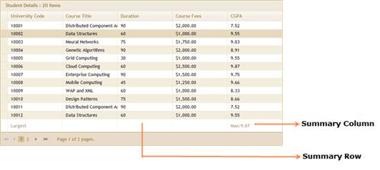

::: {style="DISPLAY: none"}
{#d2h_url_template}{#d2h_package_url style="WIDTH: 0px; DISPLAY: none; HEIGHT: 0px"}
:::

:::::: {.d2h_secondary_topic style="PADDING-BOTTOM: 10pt; MARGIN: 0pt; PADDING-LEFT: 0pt; PADDING-RIGHT: 0pt; PADDING-TOP: 0pt"}
##### Through GridPropertiesModel {#through-gridpropertiesmodel style="tab-stops: 0pt"}

 

1.   Create a model in the application (Refer to [[Getting Started\>Adding a Model to the Application]{style="COLOR: blue"}]{.underline}).

2.   Add the following code in the **Index.aspx** file to create the Grid control in the view.

 

::: {align="center"}
+-----------------------------------------------------------------------------------------------------------------------------------------------------------------------------------------------------------------------------------------------------------------------------------------------+
| **[View \[ASPX\]]{style="FONT-FAMILY: 'Courier New'"}**                                                                                                                                                                                                                                       |
|                                                                                                                                                                                                                                                                                               |
| [        ]{style="FONT-FAMILY: Consolas; COLOR: gray"}[ ]{style="FONT-FAMILY: Consolas"}[   [\<%]{style="BACKGROUND: yellow"}[=]{style="COLOR: blue"}Html.Grid\<[Order]{style="COLOR: #2b91af"}\>([\"Grid1\"]{style="COLOR: #a31515"},[\"GridModel\"]{style="COLOR: #a31515"}, columns =\> {\ |
|             columns.Add(p =\> p.OrderID)\                                                                                                                                                                                                                                                     |
|             columns.Add(p =\> p.CustomerID)\                                                                                                                                                                                                                                                  |
|             columns.Add(p =\> p.EmployeeID);  \                                                                                                                                                                                                                                               |
|             columns.Add(P =\> P.ShipCountry);]{style="FONT-FAMILY: 'Courier New'"}                                                                                                                                                                                                            |
|                                                                                                                                                                                                                                                                                               |
| [            columns.Add(p =\> p.OrderDate).Format([\"{0:dd-MM-yyyy}\"]{style="COLOR: #a31515"});]{style="FONT-FAMILY: 'Courier New'"}                                                                                                                                                        |
|                                                                                                                                                                                                                                                                                               |
| [           })[%\>]{style="BACKGROUND: yellow"}]{style="FONT-FAMILY: 'Courier New'"}                                                                                                                                                                                                          |
|                                                                                                                                                                                                                                                                                               |
| [   ]{style="FONT-FAMILY: 'Courier New'"}                                                                                                                                                                                                                                                     |
+-----------------------------------------------------------------------------------------------------------------------------------------------------------------------------------------------------------------------------------------------------------------------------------------------+
:::

 

::: {align="center"}
+-----------------------------------------------------------------------------------------------------------------------------------------------------------------------------------------------------------------------------------------------------------------------------------------------------------------------------------------------------------------------------------------------------------------------+
| **[View \[cshtml\]]{style="FONT-FAMILY: 'Courier New'"}**                                                                                                                                                                                                                                                                                                                                                             |
|                                                                                                                                                                                                                                                                                                                                                                                                                       |
| [ ]{style="FONT-FAMILY: 'Courier New'"}[@(]{style="FONT-FAMILY: Consolas; BACKGROUND: yellow; FONT-SIZE: 9.5pt"}[new]{style="FONT-FAMILY: Consolas; COLOR: blue; FONT-SIZE: 9.5pt"}[ [HtmlString]{style="COLOR: #2b91af"}(]{style="FONT-FAMILY: Consolas; FONT-SIZE: 9.5pt"}[Html.Grid\<[Order]{style="COLOR: #2b91af"}\>([\"Grid1\"]{style="COLOR: #a31515"},[\"GridModel\"]{style="COLOR: #a31515"}, columns =\> {\ |
|             columns.Add(p =\> p.OrderID)\                                                                                                                                                                                                                                                                                                                                                                             |
|             columns.Add(p =\> p.CustomerID)\                                                                                                                                                                                                                                                                                                                                                                          |
|             columns.Add(p =\> p.EmployeeID);  \                                                                                                                                                                                                                                                                                                                                                                       |
|             columns.Add(P =\> P.ShipCountry);]{style="FONT-FAMILY: 'Courier New'"}                                                                                                                                                                                                                                                                                                                                    |
|                                                                                                                                                                                                                                                                                                                                                                                                                       |
| [            columns.Add(p =\> p.OrderDate).Format([\"{0:dd-MM-yyyy}\"]{style="COLOR: #a31515"});]{style="FONT-FAMILY: 'Courier New'"}                                                                                                                                                                                                                                                                                |
|                                                                                                                                                                                                                                                                                                                                                                                                                       |
| [           }).]{style="FONT-FAMILY: 'Courier New'"}[ToString())[)]{style="BACKGROUND: yellow"} ]{style="FONT-FAMILY: Consolas; FONT-SIZE: 9.5pt"}[]{style="FONT-FAMILY: 'Courier New'"}                                                                                                                                                                                                                              |
+-----------------------------------------------------------------------------------------------------------------------------------------------------------------------------------------------------------------------------------------------------------------------------------------------------------------------------------------------------------------------------------------------------------------------+
:::

 

3.   Create a **GridPropertiesModel** in the **Index** method. Use the **ActionMode** property to set the JSON mode.

4.   Use the **AllowSummaries** property to enable the summaries.

[]{style="FONT-FAMILY: 'Myriad Pro','sans-serif'"} 

::: {align="center"}
+------------------------------------------------------------------------------------------------------------------------------------------------------------------------------------------------------------------------------------------------------------------------------------------------+
| **[\[C#\]]{style="FONT-FAMILY: 'Courier New'"}**                                                                                                                                                                                                                                               |
|                                                                                                                                                                                                                                                                                                |
| [   [public]{style="COLOR: blue"} [ActionResult]{style="COLOR: #2b91af"} Index()\                                                                                                                                                                                                              |
|    {\                                                                                                                                                                                                                                                                                          |
|       ]{style="FONT-FAMILY: 'Courier New'"}[   [GridPropertiesModel]{style="COLOR: #2b91af"}\<[Order]{style="COLOR: #2b91af"}\> gridModel = [new]{style="COLOR: blue"} [GridPropertiesModel]{style="COLOR: #2b91af"}\<[Order]{style="COLOR: #2b91af"}\>()]{style="FONT-FAMILY: 'Courier New'"} |
|                                                                                                                                                                                                                                                                                                |
| [      {]{style="FONT-FAMILY: 'Courier New'"}                                                                                                                                                                                                                                                  |
|                                                                                                                                                                                                                                                                                                |
| [               Caption = [\"Orders\"]{style="COLOR: #a31515"},]{style="FONT-FAMILY: 'Courier New'"}                                                                                                                                                                                           |
|                                                                                                                                                                                                                                                                                                |
| [               AutoFormat = Syncfusion.Mvc.Shared.[Skins]{style="COLOR: #2b91af"}.Sandune,]{style="FONT-FAMILY: 'Courier New'"}                                                                                                                                                               |
|                                                                                                                                                                                                                                                                                                |
| [               **AllowSummaries = true,**]{style="FONT-FAMILY: 'Courier New'"}                                                                                                                                                                                                                |
|                                                                                                                                                                                                                                                                                                |
| **[               ActionMode = ActionMode.JSON]{style="FONT-FAMILY: 'Courier New'"}**                                                                                                                                                                                                          |
|                                                                                                                                                                                                                                                                                                |
| **[                ]{style="FONT-FAMILY: 'Courier New'"}**                                                                                                                                                                                                                                     |
|                                                                                                                                                                                                                                                                                                |
| [      };]{style="FONT-FAMILY: 'Courier New'"}                                                                                                                                                                                                                                                 |
|                                                                                                                                                                                                                                                                                                |
| [\                                                                                                                                                                                                                                                                                             |
|         ViewData\[[\"GridModel\"]{style="COLOR: #a31515"}\] = gridModel;\                                                                                                                                                                                                                      |
|         [return]{style="COLOR: blue"} View();\                                                                                                                                                                                                                                                 |
|    }]{style="FONT-FAMILY: 'Courier New'"}[]{style="FONT-FAMILY: 'Courier New'"}                                                                                                                                                                                                                |
+------------------------------------------------------------------------------------------------------------------------------------------------------------------------------------------------------------------------------------------------------------------------------------------------+
:::

[]{style="FONT-FAMILY: 'Myriad Pro','sans-serif'"} 

5.   Set up a summary column by instantiating the **GridSummaryColumnDescriptor** specifying the **SummaryType** and format.

 

+-------------------------------------------------------------------------------------------------------------------------------------------------------------------------------------------------------------------------------------------------------------------------------------------------------------+
| **[Controller]{style="FONT-FAMILY: 'Courier New'"}**[]{style="FONT-FAMILY: 'Courier New'"}                                                                                                                                                                                                                  |
|                                                                                                                                                                                                                                                                                                             |
| [// Create instance to GridSummaryColumnDescriptor.]{style="FONT-FAMILY: Consolas; COLOR: green; FONT-SIZE: 9.5pt"}[]{style="FONT-FAMILY: 'Times New Roman','serif'; FONT-SIZE: 12pt"}                                                                                                                      |
|                                                                                                                                                                                                                                                                                                             |
| [                [GridSummaryColumnDescriptor]{style="COLOR: #2b91af"} maxCGPA = [new]{style="COLOR: blue"} [GridSummaryColumnDescriptor]{style="COLOR: #2b91af"}();]{style="FONT-FAMILY: Consolas; FONT-SIZE: 9.5pt"}[]{style="FONT-FAMILY: 'Times New Roman','serif'; FONT-SIZE: 12pt"}                   |
|                                                                                                                                                                                                                                                                                                             |
| [                maxCGPA.Name = [\"Maximum CGPA\"]{style="COLOR: #a31515"}; [// Specify the name of the summary column.]{style="COLOR: green"}]{style="FONT-FAMILY: Consolas; FONT-SIZE: 9.5pt"}[]{style="FONT-FAMILY: 'Times New Roman','serif'; FONT-SIZE: 12pt"}                                         |
|                                                                                                                                                                                                                                                                                                             |
| [                maxCGPA.SummaryType = [SummaryType]{style="COLOR: #2b91af"}.DoubleAggregate;[// Specify the summary type.]{style="COLOR: green"}]{style="FONT-FAMILY: Consolas; FONT-SIZE: 9.5pt"}[]{style="FONT-FAMILY: 'Times New Roman','serif'; FONT-SIZE: 12pt"}                                      |
|                                                                                                                                                                                                                                                                                                             |
| [                maxCGPA.DataMember = [\"CGPA\"]{style="COLOR: #a31515"};[// Gets or sets the mapping for this column.]{style="COLOR: green"}]{style="FONT-FAMILY: Consolas; FONT-SIZE: 9.5pt"}[]{style="FONT-FAMILY: 'Times New Roman','serif'; FONT-SIZE: 12pt"}                                          |
|                                                                                                                                                                                                                                                                                                             |
| [                maxCGPA.DisplayColumn= [\"CGPA\"]{style="COLOR: #a31515"};[// The target column in which to display the summary.]{style="COLOR: green"}]{style="FONT-FAMILY: Consolas; FONT-SIZE: 9.5pt"}[]{style="FONT-FAMILY: 'Times New Roman','serif'; FONT-SIZE: 12pt"}                               |
|                                                                                                                                                                                                                                                                                                             |
| [                maxCGPA.Format = [\"{Maximum:##.##}\"]{style="COLOR: #a31515"};[// The format string used to format the text to display in the summary column.]{style="COLOR: green"}]{style="FONT-FAMILY: Consolas; FONT-SIZE: 9.5pt"}[]{style="FONT-FAMILY: 'Times New Roman','serif'; FONT-SIZE: 12pt"} |
+-------------------------------------------------------------------------------------------------------------------------------------------------------------------------------------------------------------------------------------------------------------------------------------------------------------+

[]{style="FONT-FAMILY: 'Myriad Pro','sans-serif'"} 

6.   Define a **SummaryRow** and add the **SummaryColumn** to it.[ ]{style="FONT-FAMILY: 'Calibri','sans-serif'; FONT-SIZE: 12pt"}

[]{style="FONT-FAMILY: 'Calibri','sans-serif'; FONT-SIZE: 12pt"} 

+------------------------------------------------------------------------------------------------------------------------------------------------------------------------------------------------------------------------------------------------------------------------------------------------------+
| **[Controller]{style="FONT-FAMILY: 'Courier New'"}**[]{style="FONT-FAMILY: 'Courier New'"}                                                                                                                                                                                                           |
|                                                                                                                                                                                                                                                                                                      |
| [///]{style="FONT-FAMILY: Consolas; COLOR: gray; FONT-SIZE: 9.5pt"}[ A GridSummaryRowDescriptor declares a summary row with one or multiple GridSummaryColumnDescriptor elements.]{style="FONT-FAMILY: Consolas; COLOR: green; FONT-SIZE: 9.5pt"}[]{style="FONT-FAMILY: Consolas; FONT-SIZE: 9.5pt"} |
|                                                                                                                                                                                                                                                                                                      |
| [                [///]{style="COLOR: gray"}[ ]{style="COLOR: green"}[\<param name=\"name\"\>]{style="COLOR: gray"}[The descriptor name.]{style="COLOR: green"}[\</param\>]{style="COLOR: gray"}]{style="FONT-FAMILY: Consolas; FONT-SIZE: 9.5pt"}                                                    |
|                                                                                                                                                                                                                                                                                                      |
| [                [GridSummaryRowDescriptor]{style="COLOR: #2b91af"} maxRow = [new]{style="COLOR: blue"} [GridSummaryRowDescriptor]{style="COLOR: #2b91af"}([\"Largest\"]{style="COLOR: #a31515"});]{style="FONT-FAMILY: Consolas; FONT-SIZE: 9.5pt"}                                                 |
|                                                                                                                                                                                                                                                                                                      |
| []{style="FONT-FAMILY: Consolas; FONT-SIZE: 9.5pt"}                                                                                                                                                                                                                                                  |
|                                                                                                                                                                                                                                                                                                      |
| [                [///]{style="COLOR: gray"}[ Title displayed in the summary row.]{style="COLOR: green"}]{style="FONT-FAMILY: Consolas; FONT-SIZE: 9.5pt"}                                                                                                                                            |
|                                                                                                                                                                                                                                                                                                      |
| [                maxRow.Title = [\"Largest\"]{style="COLOR: #a31515"};]{style="FONT-FAMILY: Consolas; FONT-SIZE: 9.5pt"}                                                                                                                                                                             |
|                                                                                                                                                                                                                                                                                                      |
| []{style="FONT-FAMILY: Consolas; FONT-SIZE: 9.5pt"}                                                                                                                                                                                                                                                  |
|                                                                                                                                                                                                                                                                                                      |
| [                [///]{style="COLOR: gray"}[ Custom text which can be prefixed with the maxCGPA summary.]{style="COLOR: green"}]{style="FONT-FAMILY: Consolas; FONT-SIZE: 9.5pt"}                                                                                                                    |
|                                                                                                                                                                                                                                                                                                      |
| [                maxCGPA.Prefix = [\"Max:\"]{style="COLOR: #a31515"};             ]{style="FONT-FAMILY: Consolas; FONT-SIZE: 9.5pt"}                                                                                                                                                                 |
|                                                                                                                                                                                                                                                                                                      |
| []{style="FONT-FAMILY: Consolas; FONT-SIZE: 9.5pt"}                                                                                                                                                                                                                                                  |
|                                                                                                                                                                                                                                                                                                      |
| [                [///]{style="COLOR: gray"}[ Summary columns are added to the summary row.                ]{style="COLOR: green"}]{style="FONT-FAMILY: Consolas; FONT-SIZE: 9.5pt"}                                                                                                                  |
|                                                                                                                                                                                                                                                                                                      |
| [                maxRow.SummaryColumns.Add(maxCGPA);]{style="FONT-FAMILY: Consolas; FONT-SIZE: 9.5pt"}                                                                                                                                                                                               |
+------------------------------------------------------------------------------------------------------------------------------------------------------------------------------------------------------------------------------------------------------------------------------------------------------+

[]{style="FONT-FAMILY: 'Myriad Pro','sans-serif'"} 

7.   Finally, add the summary row to the grid using **SummaryRows**.

+---------------------------------------------------------------------------------------------------------------------------------------------------------------------------------------------------------------------------------------+
| **[Controller]{style="FONT-FAMILY: 'Courier New'"}**                                                                                                                                                                                  |
|                                                                                                                                                                                                                                       |
| [// Add summary rows to the grid.]{style="FONT-FAMILY: Consolas; COLOR: green; FONT-SIZE: 9.5pt"}[]{style="FONT-FAMILY: Consolas; FONT-SIZE: 9.5pt"}                                                                                  |
|                                                                                                                                                                                                                                       |
| [            [foreach]{style="COLOR: blue"} ([GridSummaryRowDescriptor]{style="COLOR: #2b91af"} summaryRow [in]{style="COLOR: blue"} [this]{style="COLOR: blue"}.SummaryCollection)]{style="FONT-FAMILY: Consolas; FONT-SIZE: 9.5pt"} |
|                                                                                                                                                                                                                                       |
| [                gridModel.SummaryRows.Add(summaryRow);]{style="FONT-FAMILY: Consolas; FONT-SIZE: 9.5pt"}                                                                                                                             |
|                                                                                                                                                                                                                                       |
| []{style="FONT-FAMILY: Consolas; FONT-SIZE: 9.5pt"}                                                                                                                                                                                   |
|                                                                                                                                                                                                                                       |
| [ViewData\[[\"GridModel\"]{style="COLOR: #a31515"}\] = gridModel;]{style="FONT-FAMILY: Consolas; FONT-SIZE: 9.5pt"}                                                                                                                   |
+---------------------------------------------------------------------------------------------------------------------------------------------------------------------------------------------------------------------------------------+

[]{style="FONT-FAMILY: 'Myriad Pro','sans-serif'"} 

8.   If you enable the paging and sorting features, rebind the **SummaryRow** property again in **Post** actions as given below.[ ]{style="FONT-FAMILY: Consolas; FONT-SIZE: 9.5pt"}

 

+--------------------------------------------------------------------------------------------------------------------------------------------------------------------------------------------------------------------------+
| **[Controller]{style="FONT-FAMILY: 'Courier New'"}[]{style="FONT-FAMILY: 'Courier New'; FONT-SIZE: 14pt"}**                                                                                                              |
|                                                                                                                                                                                                                          |
| [        \[[AcceptVerbs]{style="COLOR: #2b91af"}([HttpVerbs]{style="COLOR: #2b91af"}.Post)\]]{style="FONT-FAMILY: 'Courier New'"}                                                                                        |
|                                                                                                                                                                                                                          |
| [        [public]{style="COLOR: blue"} [ActionResult]{style="COLOR: #2b91af"} Index([PagingParams]{style="COLOR: #2b91af"} args)]{style="FONT-FAMILY: 'Courier New'"}                                                    |
|                                                                                                                                                                                                                          |
| [        {]{style="FONT-FAMILY: 'Courier New'"}                                                                                                                                                                          |
|                                                                                                                                                                                                                          |
| [            [IEnumerable]{style="COLOR: #2b91af"} data = [new]{style="COLOR: blue"} [StudentDataContext]{style="COLOR: #2b91af"}().AutoFormatStudent.Skip(0).Take(20).ToList();]{style="FONT-FAMILY: 'Courier New'"}    |
|                                                                                                                                                                                                                          |
| [            [ActionResult]{style="COLOR: #2b91af"} result = data.GridActions\<[Student]{style="COLOR: #2b91af"}\>();]{style="FONT-FAMILY: 'Courier New'"}                                                               |
|                                                                                                                                                                                                                          |
| [            [var]{style="COLOR: blue"} engineSource = result [as]{style="COLOR: blue"} [GridHtmlActionResult]{style="COLOR: #2b91af"}\<[Student]{style="COLOR: #2b91af"}\>;]{style="FONT-FAMILY: 'Courier New'"}        |
|                                                                                                                                                                                                                          |
| [            [// Rebinding the SummaryRows.]{style="COLOR: green"}]{style="FONT-FAMILY: 'Courier New'"}                                                                                                                  |
|                                                                                                                                                                                                                          |
| [            [foreach]{style="COLOR: blue"} ([GridSummaryRowDescriptor]{style="COLOR: #2b91af"} summaryRow [in]{style="COLOR: blue"} [this]{style="COLOR: blue"}.SummaryCollection)]{style="FONT-FAMILY: 'Courier New'"} |
|                                                                                                                                                                                                                          |
| [                engineSource.GridModel.SummaryRows.Add(summaryRow);]{style="FONT-FAMILY: 'Courier New'"}                                                                                                                |
|                                                                                                                                                                                                                          |
| [            [return]{style="COLOR: blue"} result;]{style="FONT-FAMILY: 'Courier New'"}                                                                                                                                  |
|                                                                                                                                                                                                                          |
| [        }]{style="FONT-FAMILY: 'Courier New'"}[]{style="FONT-FAMILY: 'Times New Roman','serif'; FONT-SIZE: 12pt"}                                                                                                       |
+--------------------------------------------------------------------------------------------------------------------------------------------------------------------------------------------------------------------------+

[]{style="FONT-FAMILY: 'Myriad Pro','sans-serif'"} 

9.   Run the application. The grid will appear as shown below:

[]{style="FONT-FAMILY: 'Myriad Pro','sans-serif'"} 

{border="0"}

Figure 218: Summary-Enabled Grid

 

[]{#related-topics}
::::::
