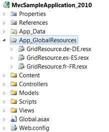

::: {style="DISPLAY: none"}
{#d2h_url_template}{#d2h_package_url style="WIDTH: 0px; DISPLAY: none; HEIGHT: 0px"}
:::

::::::::: {.d2h_secondary_topic style="PADDING-BOTTOM: 10pt; MARGIN: 0pt; PADDING-LEFT: 0pt; PADDING-RIGHT: 0pt; PADDING-TOP: 0pt"}
#### Through GridPropertiesModel {#through-gridpropertiesmodel style="tab-stops: 0pt"}

To enable localization feature using **GridPropertiesModel**:

1.   Create a model in the application (Refer to [Getting Started\>Adding a Model to the Application]{.UGHyperlink}).

2.   Create a folder named **App_GlobalResources** in your application and create your own localization resource (.resx) file in this folder.

[]{style="FONT-FAMILY: 'Myriad Pro','sans-serif'"} 

{border="0"}

Figure 267: App_GlobalResource Folder

**[]{style="FONT-FAMILY: 'Myriad Pro','sans-serif'"}** 

**[]{style="FONT-FAMILY: 'Myriad Pro','sans-serif'"}** 

In order to create a new localization resource file, download the default localization file from the following location, rename it, and then use Visual Studio to edit the values.

[]{style="FONT-FAMILY: 'Myriad Pro','sans-serif'"} 

[[GridResource.zip]{.UGHyperlink}](http://help.syncfusion.com/support/grid_mvc/v8.3.0.20/UG/GridResource.zip)[]{.UGHyperlink}

[]{style="FONT-FAMILY: 'Myriad Pro','sans-serif'"} 

The default English localization file is shown in the following screenshot:

[]{style="FONT-FAMILY: 'Myriad Pro','sans-serif'"} 

{border="0"}

Figure 268: Resource File For English Culture

**[]{style="FONT-FAMILY: 'Myriad Pro','sans-serif'"}** 

::: {style="BORDER-BOTTOM: windowtext 1pt solid; BORDER-LEFT: medium none; PADDING-BOTTOM: 1pt; MARGIN-TOP: 9pt; PADDING-LEFT: 0pt; PADDING-RIGHT: 0pt; MARGIN-BOTTOM: 9pt; BORDER-TOP: windowtext 1pt solid; BORDER-RIGHT: medium none; PADDING-TOP: 1pt"}
{border="0"}Note: The name of the localization file should be in the format GridResource.\[culture\].resx. For example: \"GridLocalization.fr-FR.resx\"
:::

[]{style="FONT-FAMILY: 'Myriad Pro','sans-serif'"} 

3.   Add the following code in the **Index.aspx** file to create the Grid control in the view.

[]{style="FONT-FAMILY: 'Myriad Pro','sans-serif'"} 

::: {align="center"}
+------------------------------------------------------------------------------------------------------------------------------------------------------------------------------------------------------------------------------------------------------------------------------------------------------------+
| **[View \[ASPX\]]{style="FONT-FAMILY: 'Courier New'"}**                                                                                                                                                                                                                                                    |
|                                                                                                                                                                                                                                                                                                            |
| [        ]{style="FONT-FAMILY: Consolas; COLOR: gray"}[ ]{style="FONT-FAMILY: Consolas"}[   [\<%]{style="BACKGROUND: yellow"}[=]{style="COLOR: blue"}Html.Syncfusion().Grid\<[Order]{style="COLOR: #2b91af"}\>([\"Grid1\"]{style="COLOR: #a31515"},[\"GridModel\"]{style="COLOR: #a31515"}, columns =\> {\ |
|             columns.Add(p =\> p.OrderID).HeaderText([\"Order ID\"]{style="COLOR: #a31515"});\                                                                                                                                                                                                              |
|             columns.Add(p =\> p.CustomerID).HeaderText([\"Customer ID\"]{style="COLOR: #a31515"});\                                                                                                                                                                                                        |
|             columns.Add(p =\> p.EmployeeID).HeaderText([\"Employee ID\"]{style="COLOR: #a31515"});\                                                                                                                                                                                                        |
|             columns.Add(P =\> P.ShipCountry).HeaderText([\"Ship Country\"]{style="COLOR: #a31515"});\                                                                                                                                                                                                      |
|             columns.Add(p =\> p.OrderDate).HeaderText([\"Order Date\"]{style="COLOR: #a31515"});]{style="FONT-FAMILY: 'Courier New'"}                                                                                                                                                                      |
|                                                                                                                                                                                                                                                                                                            |
| [           })[%\>]{style="BACKGROUND: yellow"}]{style="FONT-FAMILY: 'Courier New'"}                                                                                                                                                                                                                       |
|                                                                                                                                                                                                                                                                                                            |
| [   ]{style="FONT-FAMILY: 'Courier New'"}                                                                                                                                                                                                                                                                  |
+------------------------------------------------------------------------------------------------------------------------------------------------------------------------------------------------------------------------------------------------------------------------------------------------------------+
:::

[]{style="FONT-FAMILY: 'Myriad Pro','sans-serif'"} 

[]{style="FONT-FAMILY: Consolas; BACKGROUND: yellow; FONT-SIZE: 9.5pt"} 

[]{style="FONT-FAMILY: Consolas; BACKGROUND: yellow; FONT-SIZE: 9.5pt"} 

+---------------------------------------------------------------------------------------------------------------------------------------------------------------------------------------------------------------------------------------------------------------------------------------------------------------------------------------------------------------------------------------------+
| **[View \[cshtml\]]{style="FONT-FAMILY: 'Courier New'"}**                                                                                                                                                                                                                                                                                                                                   |
|                                                                                                                                                                                                                                                                                                                                                                                             |
| [@(]{style="FONT-FAMILY: Consolas; BACKGROUND: yellow; FONT-SIZE: 9.5pt"}[new]{style="FONT-FAMILY: Consolas; COLOR: blue; FONT-SIZE: 9.5pt"}[ [HtmlString]{style="COLOR: #2b91af"}(]{style="FONT-FAMILY: Consolas; FONT-SIZE: 9.5pt"}[Html.Syncfusion().Grid\<[Order]{style="COLOR: #2b91af"}\>([\"Grid1\"]{style="COLOR: #a31515"},[\"GridModel\"]{style="COLOR: #a31515"}, columns =\> {\ |
|             columns.Add(p =\> p.OrderID).HeaderText([\"Order ID\"]{style="COLOR: #a31515"});\                                                                                                                                                                                                                                                                                               |
|             columns.Add(p =\> p.CustomerID).HeaderText([\"Customer ID\"]{style="COLOR: #a31515"});\                                                                                                                                                                                                                                                                                         |
|             columns.Add(p =\> p.EmployeeID).HeaderText([\"Employee ID\"]{style="COLOR: #a31515"});\                                                                                                                                                                                                                                                                                         |
|             columns.Add(P =\> P.ShipCountry).HeaderText([\"Ship Country\"]{style="COLOR: #a31515"});\                                                                                                                                                                                                                                                                                       |
|             columns.Add(p =\> p.OrderDate).HeaderText([\"Order Date\"]{style="COLOR: #a31515"});]{style="FONT-FAMILY: 'Courier New'"}                                                                                                                                                                                                                                                       |
|                                                                                                                                                                                                                                                                                                                                                                                             |
| [           })]{style="FONT-FAMILY: 'Courier New'"}[.]{style="FONT-FAMILY: 'Courier New'"}[ToString())[)]{style="BACKGROUND: yellow"} ]{style="FONT-FAMILY: Consolas; FONT-SIZE: 9.5pt"}***[]{style="COLOR: #4f81bd"}***                                                                                                                                                                    |
+---------------------------------------------------------------------------------------------------------------------------------------------------------------------------------------------------------------------------------------------------------------------------------------------------------------------------------------------------------------------------------------------+

[]{style="FONT-FAMILY: 'Myriad Pro','sans-serif'"} 

4.   There are two ways to specify the culture information, namely:

[]{style="FONT-FAMILY: 'Myriad Pro','sans-serif'"} 

[·      ]{style="FONT-FAMILY: Symbol"}Setting the **CurrentUICulture** property of the **CurrentThread** inside your **Action** method.

[]{style="FONT-FAMILY: 'Myriad Pro','sans-serif'"} 

+------------------------------------------------------------------------------------------------------------------------------------------------------------------------------------------------------------------------------------------------------------------+
| **[\[C#\]]{style="FONT-FAMILY: 'Courier New'"}**                                                                                                                                                                                                                 |
|                                                                                                                                                                                                                                                                  |
| [   [public]{style="COLOR: blue"} [ActionResult]{style="COLOR: #2b91af"} Index()\                                                                                                                                                                                |
|    {\                                                                                                                                                                                                                                                            |
|              System.Threading.[Thread]{style="COLOR: #2b91af"}.CurrentThread.CurrentUICulture = [new]{style="COLOR: blue"} System.Globalization.[CultureInfo]{style="COLOR: #2b91af"}([\"fr-FR\"]{style="COLOR: #a31515"});]{style="FONT-FAMILY: 'Courier New'"} |
|                                                                                                                                                                                                                                                                  |
| [   }]{style="FONT-FAMILY: 'Courier New'"}                                                                                                                                                                                                                       |
|                                                                                                                                                                                                                                                                  |
|                                                                                                                                                                                                                                                                  |
+------------------------------------------------------------------------------------------------------------------------------------------------------------------------------------------------------------------------------------------------------------------+

[]{style="FONT-FAMILY: 'Myriad Pro','sans-serif'"} 

[·      ]{style="FONT-FAMILY: Symbol"}Creating a **GridPropertiesModel** in the **Index** method. Use the **Localize** property to specify the culture details:

[]{style="FONT-FAMILY: 'Myriad Pro','sans-serif'"} 

::: {align="center"}
+-------------------------------------------------------------------------------------------------------------------------------------------------------------------------------------------------------------------+
| **[\[C#\]]{style="FONT-FAMILY: 'Courier New'"}**                                                                                                                                                                  |
|                                                                                                                                                                                                                   |
| [   ]{style="FONT-FAMILY: Consolas"}[public]{style="FONT-FAMILY: 'Courier New'; COLOR: blue"}[ [ActionResult]{style="COLOR: #2b91af"} Index()\                                                                    |
|    {\                                                                                                                                                                                                             |
|       [GridPropertiesModel]{style="COLOR: #2b91af"}\<[Order]{style="COLOR: #2b91af"}\> gridModel = [new]{style="COLOR: blue"} [GridPropertiesModel]{style="COLOR: #2b91af"}\<[Order]{style="COLOR: #2b91af"}\>()\ |
|       {\                                                                                                                                                                                                          |
|          DataSource = [new]{style="COLOR: blue"} [NorthwindDataContext]{style="COLOR: #2b91af"}().Orders,\                                                                                                        |
|          Caption = [\"Orders\"]{style="COLOR: #a31515"},\                                                                                                                                                         |
|          AllowPaging = [true]{style="COLOR: blue"},\                                                                                                                                                              |
|          AllowFiltering = [true]{style="COLOR: blue"},\                                                                                                                                                           |
|          AutoFormat = [Skins]{style="COLOR: #2b91af"}.Sandune,\                                                                                                                                                   |
|          Localize=[\"fr-FR\"]{style="COLOR: #a31515"} [// specify Culture code]{style="COLOR: green"}\                                                                                                            |
|       };\                                                                                                                                                                                                         |
|       ViewData\[[\"GridModel\"]{style="COLOR: #a31515"}\] = gridModel;\                                                                                                                                           |
|         [return]{style="COLOR: blue"} View();\                                                                                                                                                                    |
|    }]{style="FONT-FAMILY: 'Courier New'"}                                                                                                                                                                         |
|                                                                                                                                                                                                                   |
| [   ]{style="FONT-FAMILY: 'Courier New'"}                                                                                                                                                                         |
+-------------------------------------------------------------------------------------------------------------------------------------------------------------------------------------------------------------------+
:::

[]{style="FONT-FAMILY: 'Myriad Pro','sans-serif'"} 

5.   Run the application. The grid will appear as shown in the following screenshot:

[]{style="FONT-FAMILY: 'Myriad Pro','sans-serif'"} 

{border="0"}

Figure 269: Grid with French Localization

 

Customization

If you want to customize the localization resource files folder path use the **LocalizationPath** property.

 

[]{style="FONT-FAMILY: 'Myriad Pro','sans-serif'"} 

::: {align="center"}
+-------------------------------------------------------------------------------------------------------------------------------------------------------------------------------------------------------------------+
| **[\[C#\]]{style="FONT-FAMILY: 'Courier New'"}**                                                                                                                                                                  |
|                                                                                                                                                                                                                   |
| [   ]{style="FONT-FAMILY: Consolas"}[public]{style="FONT-FAMILY: 'Courier New'; COLOR: blue"}[ [ActionResult]{style="COLOR: #2b91af"} Index()\                                                                    |
|    {\                                                                                                                                                                                                             |
|       [GridPropertiesModel]{style="COLOR: #2b91af"}\<[Order]{style="COLOR: #2b91af"}\> gridModel = [new]{style="COLOR: blue"} [GridPropertiesModel]{style="COLOR: #2b91af"}\<[Order]{style="COLOR: #2b91af"}\>()\ |
|       {\                                                                                                                                                                                                          |
|          DataSource = [new]{style="COLOR: blue"} [NorthwindDataContext]{style="COLOR: #2b91af"}().Orders,\                                                                                                        |
|          Caption = [\"Orders\"]{style="COLOR: #a31515"},\                                                                                                                                                         |
|          AllowPaging = [true]{style="COLOR: blue"},\                                                                                                                                                              |
|          AllowFiltering = [true]{style="COLOR: blue"},\                                                                                                                                                           |
|          AutoFormat = [Skins]{style="COLOR: #2b91af"}.Sandune,\                                                                                                                                                   |
|          Localize=[\"fr-FR\",]{style="COLOR: #a31515"} [// Specify culture code.]{style="COLOR: green"}]{style="FONT-FAMILY: 'Courier New'"}                                                                      |
|                                                                                                                                                                                                                   |
| [          ]{style="FONT-FAMILY: Consolas"}[LocalizationPath=[\"\~/App_LocalResources\"]{style="COLOR: #a31515"}[// Specify the folder path.]{style="COLOR: green"}]{style="FONT-FAMILY: 'Courier New'"}          |
|                                                                                                                                                                                                                   |
| [      };\                                                                                                                                                                                                        |
|        ViewData\[[\"GridModel\"]{style="COLOR: #a31515"}\] = gridModel;\                                                                                                                                          |
|         [return]{style="COLOR: blue"} View();\                                                                                                                                                                    |
|    }]{style="FONT-FAMILY: 'Courier New'"}                                                                                                                                                                         |
|                                                                                                                                                                                                                   |
| [   ]{style="FONT-FAMILY: 'Courier New'"}                                                                                                                                                                         |
+-------------------------------------------------------------------------------------------------------------------------------------------------------------------------------------------------------------------+
:::

[]{style="FONT-FAMILY: 'Myriad Pro','sans-serif'"} 

Tables for Properties, Methods, and Events

Properties

 

::: {align="center"}
+-------------------------------------+-------------------------------------------------------------------------+-----------------+--------------------------------------------------------------------------------------------------------+-------------------------------+
| Property                            | Description                                                             | Type            | Data type                                                                                              | Reference links               |
+-------------------------------------+-------------------------------------------------------------------------+-----------------+--------------------------------------------------------------------------------------------------------+-------------------------------+
| Localize[ ]{style="COLOR: #c00000"} | Get or set the localization culture of Grid                             | **Server side** | A string containing the name of the target System.Globalization.CultureInfo[ ]{style="COLOR: #c00000"} | NA[ ]{style="COLOR: #c00000"} |
+-------------------------------------+-------------------------------------------------------------------------+-----------------+--------------------------------------------------------------------------------------------------------+-------------------------------+
| LocalizationPath                    | Get or set the localization resource path of the resource file location | **Server side** | Any string value.                                                                                      | Localize                      |
|                                     |                                                                         |                 |                                                                                                        |                               |
|                                     |                                                                         |                 | Default: "\~/App_GlobalResources"                                                                      |                               |
+-------------------------------------+-------------------------------------------------------------------------+-----------------+--------------------------------------------------------------------------------------------------------+-------------------------------+
:::

**[]{style="COLOR: black"}** 

Methods

 

::: {align="center"}
  Method                                     Description                                             Parameters         Type              Return Type   Reference links
  ------------------------------------------ ------------------------------------------------------- ------------------ ----------------- ------------- -----------------
  Localize                                   Used to specify the localization culture of grid.       (string culture)   **Server-side**   Void          NA
  [LocalizationPath]{style="COLOR: black"}   Used to configure the localization resource file path   (string path)      **Server-side**   Void          Localize
:::

[]{style="COLOR: black"} 

[]{style="COLOR: black"} 

Sample Link

To view the samples:

1.   Open the ASP.NET MVC Sample Browser from the dashboard. (Refer to the Samples and Location chapter)

2.   Navigate to **Grid**\>**Localization** demo.

[]{style="FONT-FAMILY: 'Myriad Pro','sans-serif'"} 

[]{#related-topics}
:::::::::
