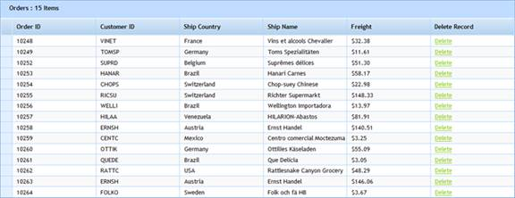

::: {style="DISPLAY: none"}
{#d2h_url_template}{#d2h_package_url style="WIDTH: 0px; DISPLAY: none; HEIGHT: 0px"}
:::

::: {.d2h_secondary_topic style="PADDING-BOTTOM: 10pt; MARGIN: 0pt; PADDING-LEFT: 0pt; PADDING-RIGHT: 0pt; PADDING-TOP: 0pt"}
#### Through GridPropertiesModel {#through-gridpropertiesmodel style="tab-stops: 0pt"}

1.   Create a model in the application (Refer to [Getting Started\>Adding a Model to the Application]{.UGHyperlink}).

2.   Create the grid in the view and create visible a column collection using **IRootColumnBuilder\<T\>** as shown below.

 

+---------------------------------------------------------------------------------------------------------------------------------------------------------------------------------------------------------------------------------------------------------+
| **[View \[ASPX\]]{style="FONT-FAMILY: 'Courier New'; COLOR: black"}**                                                                                                                                                                                   |
|                                                                                                                                                                                                                                                         |
| []{style="BACKGROUND: yellow"}                                                                                                                                                                                                                          |
|                                                                                                                                                                                                                                                         |
| [\<%]{style="FONT-FAMILY: 'Courier New'; BACKGROUND: yellow"}[=]{style="FONT-FAMILY: 'Courier New'; COLOR: blue"}[Html.Syncfusion().Grid\<[Order]{style="COLOR: #2b91af"}\>(\"UnBoundColumn_Grid\", \"GridModel\",]{style="FONT-FAMILY: 'Courier New'"} |
|                                                                                                                                                                                                                                                         |
| [          **column =\>**]{style="FONT-FAMILY: 'Courier New'"}                                                                                                                                                                                          |
|                                                                                                                                                                                                                                                         |
| **[          {]{style="FONT-FAMILY: 'Courier New'"}**                                                                                                                                                                                                   |
|                                                                                                                                                                                                                                                         |
| [              column.Add(p =\> p.OrderID).HeaderText(\"Order ID\");]{style="FONT-FAMILY: 'Courier New'"}                                                                                                                                               |
|                                                                                                                                                                                                                                                         |
| **[              column.Add(p =\> p.CustomerID).HeaderText(\"Customer ID\");]{style="FONT-FAMILY: 'Courier New'"}**                                                                                                                                     |
|                                                                                                                                                                                                                                                         |
| **[              column.Add(p =\> p.ShipCountry).HeaderText(\"Ship Country\");]{style="FONT-FAMILY: 'Courier New'"}**                                                                                                                                   |
|                                                                                                                                                                                                                                                         |
| **[              column.Add(p =\> p.ShipName).HeaderText(\"Ship Name\");]{style="FONT-FAMILY: 'Courier New'"}**                                                                                                                                         |
|                                                                                                                                                                                                                                                         |
| **[              column.Add(p =\> p.Freight).HeaderText(\"Freight\").Format(\"{Freight:c}\");]{style="FONT-FAMILY: 'Courier New'"}**                                                                                                                    |
|                                                                                                                                                                                                                                                         |
| **[          }]{style="FONT-FAMILY: 'Courier New'"}**[)[%\>]{style="BACKGROUND: yellow"}]{style="FONT-FAMILY: 'Courier New'"}                                                                                                                           |
+---------------------------------------------------------------------------------------------------------------------------------------------------------------------------------------------------------------------------------------------------------+

[]{style="FONT-FAMILY: Consolas; FONT-SIZE: 9.5pt"} 

+-----------------------------------------------------------------------------------------------------------------------------------------------------------------------------------------------------------------------------------------------------------------------------------------------------------------------------------------------------------------------------+
| **[View \[]{style="FONT-FAMILY: 'Courier New'; COLOR: black"}[cshtml]{style="FONT-FAMILY: 'Courier New'"}[\]]{style="FONT-FAMILY: 'Courier New'; COLOR: black"}**                                                                                                                                                                                                           |
|                                                                                                                                                                                                                                                                                                                                                                             |
| []{style="BACKGROUND: yellow"}                                                                                                                                                                                                                                                                                                                                              |
|                                                                                                                                                                                                                                                                                                                                                                             |
| [@(]{style="FONT-FAMILY: Consolas; BACKGROUND: yellow; FONT-SIZE: 9.5pt"}[new]{style="FONT-FAMILY: Consolas; COLOR: blue; FONT-SIZE: 9.5pt"}[ [HtmlString]{style="COLOR: #2b91af"}(]{style="FONT-FAMILY: Consolas; FONT-SIZE: 9.5pt"}[Html.Syncfusion().Grid\<[Order]{style="COLOR: #2b91af"}\>(\"UnBoundColumn_Grid\", \"GridModel\",]{style="FONT-FAMILY: 'Courier New'"} |
|                                                                                                                                                                                                                                                                                                                                                                             |
| [          **column =\>**]{style="FONT-FAMILY: 'Courier New'"}                                                                                                                                                                                                                                                                                                              |
|                                                                                                                                                                                                                                                                                                                                                                             |
| **[          {]{style="FONT-FAMILY: 'Courier New'"}**                                                                                                                                                                                                                                                                                                                       |
|                                                                                                                                                                                                                                                                                                                                                                             |
| **[              column.Add(p =\> p.OrderID).HeaderText(\"Order ID\");]{style="FONT-FAMILY: 'Courier New'"}**                                                                                                                                                                                                                                                               |
|                                                                                                                                                                                                                                                                                                                                                                             |
| **[              column.Add(p =\> p.CustomerID).HeaderText(\"Customer ID\");]{style="FONT-FAMILY: 'Courier New'"}**                                                                                                                                                                                                                                                         |
|                                                                                                                                                                                                                                                                                                                                                                             |
| **[              column.Add(p =\> p.ShipCountry).HeaderText(\"Ship Country\");]{style="FONT-FAMILY: 'Courier New'"}**                                                                                                                                                                                                                                                       |
|                                                                                                                                                                                                                                                                                                                                                                             |
| **[              column.Add(p =\> p.ShipName).HeaderText(\"Ship Name\");]{style="FONT-FAMILY: 'Courier New'"}**                                                                                                                                                                                                                                                             |
|                                                                                                                                                                                                                                                                                                                                                                             |
| **[              column.Add(p =\> p.Freight).HeaderText(\"Freight\").Format(\"{Freight:c}\");]{style="FONT-FAMILY: 'Courier New'"}**                                                                                                                                                                                                                                        |
|                                                                                                                                                                                                                                                                                                                                                                             |
| **[          }]{style="FONT-FAMILY: 'Courier New'"}**[)]{style="FONT-FAMILY: 'Courier New'"}[.ToString())[)]{style="BACKGROUND: yellow"}    ]{style="FONT-FAMILY: Consolas; FONT-SIZE: 9.5pt"}                                                                                                                                                                              |
+-----------------------------------------------------------------------------------------------------------------------------------------------------------------------------------------------------------------------------------------------------------------------------------------------------------------------------------------------------------------------------+

[]{style="FONT-FAMILY: Consolas; FONT-SIZE: 9.5pt"} 

[]{style="FONT-FAMILY: Consolas; BACKGROUND: yellow; FONT-SIZE: 9.5pt"} 

3.   In column mapping, add the unbound column using the **Add(string)** method. In this case a "Delete" column has been added as an unbound column which is used to delete records in the grid.

 

+-------------------------------------------------------------------------------------------------------------------------------------------------------------------------------------------------------------------------------------------------------------------------------------------------------------+
| **[View \[ASPX\]]{style="FONT-FAMILY: 'Courier New'; COLOR: black"}**                                                                                                                                                                                                                                       |
|                                                                                                                                                                                                                                                                                                             |
| []{style="FONT-FAMILY: 'Courier New'; BACKGROUND: yellow"}                                                                                                                                                                                                                                                  |
|                                                                                                                                                                                                                                                                                                             |
| [\<%]{style="FONT-FAMILY: 'Courier New'; BACKGROUND: yellow"}[=]{style="FONT-FAMILY: 'Courier New'; COLOR: blue"}[Html.Syncfusion().Grid\<[Order]{style="COLOR: #2b91af"}\>([\"UnBoundColumn_Grid\"]{style="COLOR: #a31515"}, [\"GridModel\"]{style="COLOR: #a31515"},]{style="FONT-FAMILY: 'Courier New'"} |
|                                                                                                                                                                                                                                                                                                             |
| [          column =\>]{style="FONT-FAMILY: 'Courier New'"}                                                                                                                                                                                                                                                  |
|                                                                                                                                                                                                                                                                                                             |
| [          {]{style="FONT-FAMILY: 'Courier New'"}                                                                                                                                                                                                                                                           |
|                                                                                                                                                                                                                                                                                                             |
| [              column.Add(p =\> p.OrderID).HeaderText([\"Order ID\"]{style="COLOR: #a31515"});]{style="FONT-FAMILY: 'Courier New'"}                                                                                                                                                                         |
|                                                                                                                                                                                                                                                                                                             |
| [              column.Add(p =\> p.CustomerID).HeaderText([\"Customer ID\"]{style="COLOR: #a31515"});]{style="FONT-FAMILY: 'Courier New'"}                                                                                                                                                                   |
|                                                                                                                                                                                                                                                                                                             |
| [              column.Add(p =\> p.ShipCountry).HeaderText([\"Ship Country\"]{style="COLOR: #a31515"});]{style="FONT-FAMILY: 'Courier New'"}                                                                                                                                                                 |
|                                                                                                                                                                                                                                                                                                             |
| [              column.Add(p =\> p.ShipName).HeaderText([\"Ship Name\"]{style="COLOR: #a31515"});]{style="FONT-FAMILY: 'Courier New'"}                                                                                                                                                                       |
|                                                                                                                                                                                                                                                                                                             |
| [              column.Add(p =\> p.Freight).HeaderText([\"Freight\"]{style="COLOR: #a31515"}).Format([\"{Freight:c}\"]{style="COLOR: #a31515"});]{style="FONT-FAMILY: 'Courier New'"}                                                                                                                        |
|                                                                                                                                                                                                                                                                                                             |
| [             ** column.Add([\"Delete\"]{style="COLOR: #a31515"}).HeaderText([\"Delete Record\"]{style="COLOR: #a31515"}).Format([\"\<a class=\\\"TemplateCell\\\" href=\\\"DeleteRecord?id={OrderID}\\\"\>Delete\</a\>\"]{style="COLOR: #a31515"});            ** ]{style="FONT-FAMILY: 'Courier New'"}    |
|                                                                                                                                                                                                                                                                                                             |
| [          })[%\>]{style="BACKGROUND: yellow"}  ]{style="FONT-FAMILY: 'Courier New'"}                                                                                                                                                                                                                       |
+-------------------------------------------------------------------------------------------------------------------------------------------------------------------------------------------------------------------------------------------------------------------------------------------------------------+

[]{style="FONT-FAMILY: Consolas; FONT-SIZE: 9.5pt"} 

+---------------------------------------------------------------------------------------------------------------------------------------------------------------------------------------------------------------------------------------------------------------------------------------------------------------------------------------------------------------------------------------------------------------------------------+
| **[View \[]{style="FONT-FAMILY: 'Courier New'; COLOR: black"}[cshtml]{style="FONT-FAMILY: 'Courier New'"}[\]]{style="FONT-FAMILY: 'Courier New'; COLOR: black"}**[]{style="BACKGROUND: yellow"}                                                                                                                                                                                                                                 |
|                                                                                                                                                                                                                                                                                                                                                                                                                                 |
| [@(]{style="FONT-FAMILY: Consolas; BACKGROUND: yellow; FONT-SIZE: 9.5pt"}[new]{style="FONT-FAMILY: Consolas; COLOR: blue; FONT-SIZE: 9.5pt"}[ [HtmlString]{style="COLOR: #2b91af"}(]{style="FONT-FAMILY: Consolas; FONT-SIZE: 9.5pt"}[Html.Syncfusion().Grid\<[Order]{style="COLOR: #2b91af"}\>([\"UnBoundColumn_Grid\"]{style="COLOR: #a31515"}, [\"GridModel\"]{style="COLOR: #a31515"},]{style="FONT-FAMILY: 'Courier New'"} |
|                                                                                                                                                                                                                                                                                                                                                                                                                                 |
| [          column =\>]{style="FONT-FAMILY: 'Courier New'"}                                                                                                                                                                                                                                                                                                                                                                      |
|                                                                                                                                                                                                                                                                                                                                                                                                                                 |
| [          {]{style="FONT-FAMILY: 'Courier New'"}                                                                                                                                                                                                                                                                                                                                                                               |
|                                                                                                                                                                                                                                                                                                                                                                                                                                 |
| [              column.Add(p =\> p.OrderID).HeaderText([\"Order ID\"]{style="COLOR: #a31515"});]{style="FONT-FAMILY: 'Courier New'"}                                                                                                                                                                                                                                                                                             |
|                                                                                                                                                                                                                                                                                                                                                                                                                                 |
| [              column.Add(p =\> p.CustomerID).HeaderText([\"Customer ID\"]{style="COLOR: #a31515"});]{style="FONT-FAMILY: 'Courier New'"}                                                                                                                                                                                                                                                                                       |
|                                                                                                                                                                                                                                                                                                                                                                                                                                 |
| [              column.Add(p =\> p.ShipCountry).HeaderText([\"Ship Country\"]{style="COLOR: #a31515"});]{style="FONT-FAMILY: 'Courier New'"}                                                                                                                                                                                                                                                                                     |
|                                                                                                                                                                                                                                                                                                                                                                                                                                 |
| [              column.Add(p =\> p.ShipName).HeaderText([\"Ship Name\"]{style="COLOR: #a31515"});]{style="FONT-FAMILY: 'Courier New'"}                                                                                                                                                                                                                                                                                           |
|                                                                                                                                                                                                                                                                                                                                                                                                                                 |
| [              column.Add(p =\> p.Freight).HeaderText([\"Freight\"]{style="COLOR: #a31515"}).Format([\"{Freight:c}\"]{style="COLOR: #a31515"});]{style="FONT-FAMILY: 'Courier New'"}                                                                                                                                                                                                                                            |
|                                                                                                                                                                                                                                                                                                                                                                                                                                 |
| [             ** column.Add([\"Delete\"]{style="COLOR: #a31515"}).HeaderText([\"Delete Record\"]{style="COLOR: #a31515"}).Format([\"\<a class=\\\"TemplateCell\\\" href=\\\"DeleteRecord?id={OrderID}\\\"\>Delete\</a\>\"]{style="COLOR: #a31515"});            ** ]{style="FONT-FAMILY: 'Courier New'"}                                                                                                                        |
|                                                                                                                                                                                                                                                                                                                                                                                                                                 |
| [          })]{style="FONT-FAMILY: 'Courier New'"}[.ToString())[)]{style="BACKGROUND: yellow"}    ]{style="FONT-FAMILY: Consolas; FONT-SIZE: 9.5pt"}[]{style="FONT-FAMILY: 'Courier New'"}                                                                                                                                                                                                                                      |
+---------------------------------------------------------------------------------------------------------------------------------------------------------------------------------------------------------------------------------------------------------------------------------------------------------------------------------------------------------------------------------------------------------------------------------+

[]{style="FONT-FAMILY: Consolas; FONT-SIZE: 9.5pt"} 

4.   Create a **GridPropertiesModel** in the **Index** method. Assign grid properties in this model and pass the model from controller to view using the **ViewData** class as given below.

[]{style="FONT-FAMILY: 'Calibri','sans-serif'"} 

+-----------------------------------------------------------------------------------------------------------------------------------------------------------------------------------------------------------------------------------------------------------------+
| [public]{style="FONT-FAMILY: 'Courier New'; COLOR: blue"}[ [ActionResult]{style="COLOR: #2b91af"} Index()]{style="FONT-FAMILY: 'Courier New'"}                                                                                                                  |
|                                                                                                                                                                                                                                                                 |
| [        {]{style="FONT-FAMILY: 'Courier New'"}                                                                                                                                                                                                                 |
|                                                                                                                                                                                                                                                                 |
| [              [GridPropertiesModel]{style="COLOR: #2b91af"}\<[Order]{style="COLOR: #2b91af"}\> gridModel = [new]{style="COLOR: blue"} [GridPropertiesModel]{style="COLOR: #2b91af"}\<[Order]{style="COLOR: #2b91af"}\> ()]{style="FONT-FAMILY: 'Courier New'"} |
|                                                                                                                                                                                                                                                                 |
| [            {]{style="FONT-FAMILY: 'Courier New'"}                                                                                                                                                                                                             |
|                                                                                                                                                                                                                                                                 |
| [                DataSource = [new]{style="COLOR: blue"} [NorthwindDataContext]{style="COLOR: #2b91af"}().Orders.Take(15),]{style="FONT-FAMILY: 'Courier New'"}                                                                                                 |
|                                                                                                                                                                                                                                                                 |
| [                Caption = [\"Orders\"]{style="COLOR: #a31515"}                          ]{style="FONT-FAMILY: 'Courier New'"}                                                                                                                                  |
|                                                                                                                                                                                                                                                                 |
| [            };]{style="FONT-FAMILY: 'Courier New'"}                                                                                                                                                                                                            |
|                                                                                                                                                                                                                                                                 |
| [            ViewData\[[\"GridModel\"]{style="COLOR: #a31515"}\] = gridModel; [// Pass the model from controller to view using ViewData.]{style="COLOR: green"}]{style="FONT-FAMILY: 'Courier New'"}                                                            |
|                                                                                                                                                                                                                                                                 |
| [            [return]{style="COLOR: blue"} View();]{style="FONT-FAMILY: 'Courier New'"}                                                                                                                                                                         |
|                                                                                                                                                                                                                                                                 |
| [        }]{style="FONT-FAMILY: 'Courier New'"}                                                                                                                                                                                                                 |
+-----------------------------------------------------------------------------------------------------------------------------------------------------------------------------------------------------------------------------------------------------------------+

[]{style="FONT-FAMILY: Consolas; FONT-SIZE: 9.5pt"} 

[]{style="FONT-FAMILY: Consolas; FONT-SIZE: 9.5pt"} 

5.   Create a **Delete** action method which is used to delete the record from the database. This is shown below.

 

+-----------------------------------------------------------------------------------------------------------------------------------------------------------------------------------------+
| [\[[AcceptVerbs]{style="COLOR: #2b91af"}([HttpVerbs]{style="COLOR: #2b91af"}.Get)\]]{style="FONT-FAMILY: 'Courier New'"}                                                                |
|                                                                                                                                                                                         |
| [        [public]{style="COLOR: blue"} [ActionResult]{style="COLOR: #2b91af"} DeleteRecord([int]{style="COLOR: blue"} id)]{style="FONT-FAMILY: 'Courier New'"}                          |
|                                                                                                                                                                                         |
| [        {]{style="FONT-FAMILY: 'Courier New'"}                                                                                                                                         |
|                                                                                                                                                                                         |
| [            [NorthwindDataContext]{style="COLOR: #2b91af"} context = [new]{style="COLOR: blue"} [NorthwindDataContext]{style="COLOR: #2b91af"}();]{style="FONT-FAMILY: 'Courier New'"} |
|                                                                                                                                                                                         |
| [            [Order]{style="COLOR: #2b91af"} order = ([Order]{style="COLOR: #2b91af"})context.Orders.Single(p =\> p.OrderID == id);]{style="FONT-FAMILY: 'Courier New'"}                |
|                                                                                                                                                                                         |
| [            context.Orders.DeleteOnSubmit(order);]{style="FONT-FAMILY: 'Courier New'"}                                                                                                 |
|                                                                                                                                                                                         |
| [            context.SubmitChanges();]{style="FONT-FAMILY: 'Courier New'"}                                                                                                              |
|                                                                                                                                                                                         |
| [            [return]{style="COLOR: blue"} RedirectToAction([\"Index\"]{style="COLOR: #a31515"});]{style="FONT-FAMILY: 'Courier New'"}                                                  |
|                                                                                                                                                                                         |
| [        }]{style="FONT-FAMILY: 'Courier New'"}                                                                                                                                         |
+-----------------------------------------------------------------------------------------------------------------------------------------------------------------------------------------+

 

6.   Run the application. The grid will appear as shown below.

 

{border="0"}

Figure 94: Grid with Unbound Column

[]{style="FONT-FAMILY: Consolas; FONT-SIZE: 9.5pt"} 

[]{#related-topics}
:::
