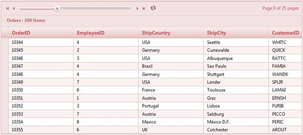

::: {style="DISPLAY: none"}
{#d2h_url_template}{#d2h_package_url style="WIDTH: 0px; DISPLAY: none; HEIGHT: 0px"}
:::

:::: {.d2h_secondary_topic style="PADDING-BOTTOM: 10pt; MARGIN: 0pt; PADDING-LEFT: 0pt; PADDING-RIGHT: 0pt; PADDING-TOP: 0pt"}
##### Through GridPropertiesModel {#through-gridpropertiesmodel style="tab-stops: 0pt"}

 

1.   Create a model in the application (Refer to [[Getting Started\>Adding a Model to the Application]{style="COLOR: blue"}]{.underline}).

2.   Add the following code in the **Index.aspx** file to create the Grid control in the view.

 

+------------------------------------------------------------------------------------------------------------------------------------------------------------------------------------------------------------------------------------------------------+
| **[View \[ASPX\]]{style="FONT-FAMILY: 'Courier New'"}**[ ]{style="FONT-FAMILY: 'Courier New'"}                                                                                                                                                       |
|                                                                                                                                                                                                                                                      |
| [\<%]{style="FONT-FAMILY: 'Courier New'; BACKGROUND: yellow"}[=]{style="FONT-FAMILY: 'Courier New'; COLOR: blue"}[ Html.Grid\<[Order]{style="COLOR: #2b91af"}\>([\"OrderGrid\"]{style="COLOR: #a31515"}, col=\>]{style="FONT-FAMILY: 'Courier New'"} |
|                                                                                                                                                                                                                                                      |
| [    {]{style="FONT-FAMILY: 'Courier New'"}                                                                                                                                                                                                          |
|                                                                                                                                                                                                                                                      |
| [         col.Add(c =\> c.OrderID);]{style="FONT-FAMILY: 'Courier New'"}                                                                                                                                                                             |
|                                                                                                                                                                                                                                                      |
| [               col.Add(c =\> c.EmployeeID);]{style="FONT-FAMILY: 'Courier New'"}                                                                                                                                                                    |
|                                                                                                                                                                                                                                                      |
| [               col.Add(c =\> c.ShipCountry);]{style="FONT-FAMILY: 'Courier New'"}                                                                                                                                                                   |
|                                                                                                                                                                                                                                                      |
| [               col.Add(c =\> c.ShipCity );]{style="FONT-FAMILY: 'Courier New'"}                                                                                                                                                                     |
|                                                                                                                                                                                                                                                      |
| [               col.Add(c =\> c.CustomerID);]{style="FONT-FAMILY: 'Courier New'"}                                                                                                                                                                    |
|                                                                                                                                                                                                                                                      |
| [    }[%\>]{style="BACKGROUND: yellow"}]{style="FONT-FAMILY: 'Courier New'"}                                                                                                                                                                         |
+------------------------------------------------------------------------------------------------------------------------------------------------------------------------------------------------------------------------------------------------------+

 

+--------------------------------------------------------------------------------------------------------------------------------------------------------------------------------------------------------------------------------------------------------------------------------------------+
| **[View \[cshtml\]]{style="FONT-FAMILY: 'Courier New'"}**[ ]{style="FONT-FAMILY: 'Courier New'"}                                                                                                                                                                                           |
|                                                                                                                                                                                                                                                                                            |
| [@(]{style="FONT-FAMILY: 'Courier New'; BACKGROUND: yellow"}[new]{style="FONT-FAMILY: 'Courier New'; COLOR: blue"}[ [HtmlString]{style="COLOR: #2b91af"}(Html.Grid\<[Order]{style="COLOR: #2b91af"}\>([\"OrderGrid\"]{style="COLOR: #a31515"}, col=\>]{style="FONT-FAMILY: 'Courier New'"} |
|                                                                                                                                                                                                                                                                                            |
| [    {]{style="FONT-FAMILY: 'Courier New'"}                                                                                                                                                                                                                                                |
|                                                                                                                                                                                                                                                                                            |
| [         col.Add(c =\> c.OrderID);]{style="FONT-FAMILY: 'Courier New'"}                                                                                                                                                                                                                   |
|                                                                                                                                                                                                                                                                                            |
| [               col.Add(c =\> c.EmployeeID);]{style="FONT-FAMILY: 'Courier New'"}                                                                                                                                                                                                          |
|                                                                                                                                                                                                                                                                                            |
| [               col.Add(c =\> c.ShipCountry);]{style="FONT-FAMILY: 'Courier New'"}                                                                                                                                                                                                         |
|                                                                                                                                                                                                                                                                                            |
| [               col.Add(c =\> c.ShipCity );]{style="FONT-FAMILY: 'Courier New'"}                                                                                                                                                                                                           |
|                                                                                                                                                                                                                                                                                            |
| [               col.Add(c =\> c.CustomerID);]{style="FONT-FAMILY: 'Courier New'"}                                                                                                                                                                                                          |
|                                                                                                                                                                                                                                                                                            |
| [    }).ToString()]{style="FONT-FAMILY: 'Courier New'"}                                                                                                                                                                                                                                    |
|                                                                                                                                                                                                                                                                                            |
| [    )[)]{style="BACKGROUND: yellow"}]{style="FONT-FAMILY: 'Courier New'"}                                                                                                                                                                                                                 |
+--------------------------------------------------------------------------------------------------------------------------------------------------------------------------------------------------------------------------------------------------------------------------------------------+

[]{style="LINE-HEIGHT: 115%; FONT-FAMILY: 'Calibri','sans-serif'; FONT-SIZE: 11pt"} 

3.   Create a **GridPropertiesModel** in the **Index** method. Use the **AllowGrouping** property to enable the grouping feature.

[]{style="FONT-FAMILY: 'Times New Roman','serif'; FONT-SIZE: 12pt"} 

+--------------------------------------------------------------------------------------------------------------------------------------------------------------------------------------------------------------------------------------------------------------+
| **[Controller]{style="FONT-FAMILY: 'Courier New'; COLOR: black"}[]{style="FONT-FAMILY: 'Courier New'"}**                                                                                                                                                     |
|                                                                                                                                                                                                                                                              |
| [public]{style="FONT-FAMILY: 'Courier New'; COLOR: blue"}[ [ActionResult]{style="COLOR: #2b91af"} Index()]{style="FONT-FAMILY: 'Courier New'"}                                                                                                               |
|                                                                                                                                                                                                                                                              |
| [        {]{style="FONT-FAMILY: 'Courier New'"}                                                                                                                                                                                                              |
|                                                                                                                                                                                                                                                              |
| [            [GridPropertiesModel]{style="COLOR: #2b91af"}\<[Order]{style="COLOR: #2b91af"}\> gridModel = [new]{style="COLOR: blue"} [GridPropertiesModel]{style="COLOR: #2b91af"}\<[Order]{style="COLOR: #2b91af"}\>()]{style="FONT-FAMILY: 'Courier New'"} |
|                                                                                                                                                                                                                                                              |
| [            {]{style="FONT-FAMILY: 'Courier New'"}                                                                                                                                                                                                          |
|                                                                                                                                                                                                                                                              |
| [                DataSource = [new]{style="COLOR: blue"} [NorthwindDataContext]{style="COLOR: #2b91af"}().Orders,]{style="FONT-FAMILY: 'Courier New'"}                                                                                                       |
|                                                                                                                                                                                                                                                              |
| [                Caption = [\"Orders\"]{style="COLOR: #a31515"},]{style="FONT-FAMILY: 'Courier New'"}                                                                                                                                                        |
|                                                                                                                                                                                                                                                              |
| [                AutoFormat = [Skins]{style="COLOR: #2b91af"}.Sandune]{style="FONT-FAMILY: 'Courier New'"}                                                                                                                                                   |
|                                                                                                                                                                                                                                                              |
| [            };]{style="FONT-FAMILY: 'Courier New'"}                                                                                                                                                                                                         |
|                                                                                                                                                                                                                                                              |
| [            gridModel.PageSetting.AllowPaging = [true]{style="COLOR: blue"};]{style="FONT-FAMILY: 'Courier New'"}                                                                                                                                           |
|                                                                                                                                                                                                                                                              |
| [            gridModel.PageSetting.PagerStyle = [PagerStyle]{style="COLOR: #2b91af"}.Slider;]{style="FONT-FAMILY: 'Courier New'"}                                                                                                                            |
|                                                                                                                                                                                                                                                              |
| [            gridModel.PageSetting.PagerPosition = [Position]{style="COLOR: #2b91af"}.TopLeft;]{style="FONT-FAMILY: 'Courier New'"}                                                                                                                          |
|                                                                                                                                                                                                                                                              |
| [            gridModel.PageSetting.ShowPagerInformation = [true]{style="COLOR: blue"};]{style="FONT-FAMILY: 'Courier New'"}                                                                                                                                  |
|                                                                                                                                                                                                                                                              |
| [            ViewData\[[\"OrderGrid\"]{style="COLOR: #a31515"}\] = gridModel;[]{style="COLOR: green"}]{style="FONT-FAMILY: 'Courier New'"}                                                                                                                   |
|                                                                                                                                                                                                                                                              |
| [            [return]{style="COLOR: blue"} View();]{style="FONT-FAMILY: 'Courier New'"}                                                                                                                                                                      |
|                                                                                                                                                                                                                                                              |
| [        }]{style="FONT-FAMILY: 'Courier New'"}                                                                                                                                                                                                              |
+--------------------------------------------------------------------------------------------------------------------------------------------------------------------------------------------------------------------------------------------------------------+

[]{style="FONT-FAMILY: 'Times New Roman','serif'; FONT-SIZE: 12pt"} 

4.   Run the application. The grid will appear as shown in the following screenshot.

 

{border="0"}

Figure 110: Grid with Slider Pager

 

Properties

[]{style="LINE-HEIGHT: 115%; FONT-FAMILY: 'Calibri','sans-serif'; FONT-SIZE: 11pt"} 

::: {align="center"}
+----------------------+--------------------------------------------------------------------------------------------------------------------------------------------------------------------------------------------------------+------------------+--------------------------------+--------------------------------------------------+
| Property             | Description                                                                                                                                                                                            | Type of property | Value it accepts               | Any other dependencies/sub-properties associated |
+======================+========================================================================================================================================================================================================+==================+================================+==================================================+
| PagerStyle           | Gets or sets the pager style for the grid. The default value is Default.                                                                                                                               | Enum             | PagerStyle.Default             | NA                                               |
|                      |                                                                                                                                                                                                        |                  |                                |                                                  |
|                      |                                                                                                                                                                                                        |                  |                                |                                                  |
|                      |                                                                                                                                                                                                        |                  |                                |                                                  |
|                      |                                                                                                                                                                                                        |                  | PagerStyle.Advanced            |                                                  |
|                      |                                                                                                                                                                                                        |                  |                                |                                                  |
|                      |                                                                                                                                                                                                        |                  |                                |                                                  |
|                      |                                                                                                                                                                                                        |                  |                                |                                                  |
|                      |                                                                                                                                                                                                        |                  | PagerStyle.DefaultAndAdvanced  |                                                  |
|                      |                                                                                                                                                                                                        |                  |                                |                                                  |
|                      |                                                                                                                                                                                                        |                  |                                |                                                  |
|                      |                                                                                                                                                                                                        |                  |                                |                                                  |
|                      |                                                                                                                                                                                                        |                  | PagerStyle.DefaultAndManual    |                                                  |
|                      |                                                                                                                                                                                                        |                  |                                |                                                  |
|                      |                                                                                                                                                                                                        |                  |                                |                                                  |
|                      |                                                                                                                                                                                                        |                  |                                |                                                  |
|                      |                                                                                                                                                                                                        |                  | PagerStyle.Manual              |                                                  |
|                      |                                                                                                                                                                                                        |                  |                                |                                                  |
|                      |                                                                                                                                                                                                        |                  |                                |                                                  |
|                      |                                                                                                                                                                                                        |                  |                                |                                                  |
|                      |                                                                                                                                                                                                        |                  | PagerStyle.Numeric             |                                                  |
|                      |                                                                                                                                                                                                        |                  |                                |                                                  |
|                      |                                                                                                                                                                                                        |                  |                                |                                                  |
|                      |                                                                                                                                                                                                        |                  |                                |                                                  |
|                      |                                                                                                                                                                                                        |                  | PagerStyle.PrevAndNext         |                                                  |
|                      |                                                                                                                                                                                                        |                  |                                |                                                  |
|                      |                                                                                                                                                                                                        |                  |                                |                                                  |
|                      |                                                                                                                                                                                                        |                  |                                |                                                  |
|                      |                                                                                                                                                                                                        |                  | PagerStyle.PrevNextAndAdvanced |                                                  |
|                      |                                                                                                                                                                                                        |                  |                                |                                                  |
|                      |                                                                                                                                                                                                        |                  |                                |                                                  |
|                      |                                                                                                                                                                                                        |                  |                                |                                                  |
|                      |                                                                                                                                                                                                        |                  | PagerStyle.PrevNextAndManual   |                                                  |
|                      |                                                                                                                                                                                                        |                  |                                |                                                  |
|                      |                                                                                                                                                                                                        |                  |                                |                                                  |
|                      |                                                                                                                                                                                                        |                  |                                |                                                  |
|                      |                                                                                                                                                                                                        |                  | PagerStyle.Slider              |                                                  |
|                      |                                                                                                                                                                                                        |                  |                                |                                                  |
|                      |                                                                                                                                                                                                        |                  |                                |                                                  |
|                      |                                                                                                                                                                                                        |                  |                                |                                                  |
|                      |                                                                                                                                                                                                        |                  | PagerStyle.SliderAndAdvanced   |                                                  |
|                      |                                                                                                                                                                                                        |                  |                                |                                                  |
|                      |                                                                                                                                                                                                        |                  |                                |                                                  |
|                      |                                                                                                                                                                                                        |                  |                                |                                                  |
|                      |                                                                                                                                                                                                        |                  | PagerStyle.SliderAndManual     |                                                  |
|                      |                                                                                                                                                                                                        |                  |                                |                                                  |
|                      |                                                                                                                                                                                                        |                  |                                |                                                  |
+----------------------+--------------------------------------------------------------------------------------------------------------------------------------------------------------------------------------------------------+------------------+--------------------------------+--------------------------------------------------+
| PagerPosition        | Gets or sets the position of the pager. The default value is BottomLeft.                                                                                                                               | Enum             | Position.BottomLeft            | NA                                               |
|                      |                                                                                                                                                                                                        |                  |                                |                                                  |
|                      |                                                                                                                                                                                                        |                  | Position.BottomRight           |                                                  |
|                      |                                                                                                                                                                                                        |                  |                                |                                                  |
|                      |                                                                                                                                                                                                        |                  | Position.TopLeft               |                                                  |
|                      |                                                                                                                                                                                                        |                  |                                |                                                  |
|                      |                                                                                                                                                                                                        |                  | Position.TopRight              |                                                  |
+----------------------+--------------------------------------------------------------------------------------------------------------------------------------------------------------------------------------------------------+------------------+--------------------------------+--------------------------------------------------+
| SliderWidth          | Gets or sets the slider width when **PagerStyle** is set to Slider, SliderAndManual, and SliderAnd Advanced.                                                                                           | double           | double                         | PagerStyle                                       |
+----------------------+--------------------------------------------------------------------------------------------------------------------------------------------------------------------------------------------------------+------------------+--------------------------------+--------------------------------------------------+
| TextboxWidth         | Gets or sets the text box width when **PagerStyle** is set to Manual, Advanced, DefaultAndManual, DefaultAndAdvanced, PrevNextAndManual, PrevNextAndAdvanced, SliderAndManual, and SliderAnd Advanced. | double           | double                         | PagerStyle                                       |
|                      |                                                                                                                                                                                                        |                  |                                |                                                  |
|                      |                                                                                                                                                                                                        |                  |                                |                                                  |
+----------------------+--------------------------------------------------------------------------------------------------------------------------------------------------------------------------------------------------------+------------------+--------------------------------+--------------------------------------------------+
| ShowPagerInformation | Gets or sets the pager information to display or not.                                                                                                                                                  | bool             | True/False                     | NA                                               |
+----------------------+--------------------------------------------------------------------------------------------------------------------------------------------------------------------------------------------------------+------------------+--------------------------------+--------------------------------------------------+
:::

[]{style="LINE-HEIGHT: 115%; FONT-FAMILY: 'Calibri','sans-serif'; FONT-SIZE: 11pt"} 

Sample Link

**[]{style="LINE-HEIGHT: 115%; FONT-FAMILY: 'Calibri','sans-serif'; COLOR: red; FONT-SIZE: 11pt"}** 

To access the sample:

1.   Go to the **ASP.NET MVC** demos in the sample browser. Refer to the[ ]{style="COLOR: windowtext"}[[Sample and Location]{style="COLOR: blue"}]{.underline}[ chapter.]{style="COLOR: windowtext"}

2.   Select the **Grid** icon at the bottom-left of the browser.

3.   Select the **Paging** option in the scrollable menu.

4.   Select the **Pager Types** item to view the full pager customization demo.

[]{style="LINE-HEIGHT: 115%; FONT-FAMILY: 'Calibri','sans-serif'; FONT-SIZE: 11pt"} 

[]{#related-topics}
::::
