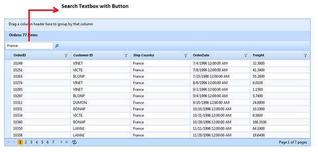

::: {style="DISPLAY: none"}
{#d2h_url_template}{#d2h_package_url style="WIDTH: 0px; DISPLAY: none; HEIGHT: 0px"}
:::

:::: {.d2h_secondary_topic style="PADDING-BOTTOM: 10pt; MARGIN: 0pt; PADDING-LEFT: 0pt; PADDING-RIGHT: 0pt; PADDING-TOP: 0pt"}
#### Through GridPropertiesModel {#through-gridpropertiesmodel style="tab-stops: 0pt"}

To dynamically bind data to the grid through GridPropertiesModel:

1.   Create a model in the application (Refer to Getting Started \> Adding a Model to the Application).

2.   Add the following code in the **Index.aspx** file to create the Grid control in the **view**. 

 

+---------------------------------------------------------------------------------------------------------------------------------------------------------------------------------------------------------------------------------------------------------------------------------------------------------------------------------------------------------------------------------------------------------------------------------------------------------------------------------------+
| **[\[ASPX\]]{style="FONT-FAMILY: 'Courier New'"}**                                                                                                                                                                                                                                                                                                                                                                                                                                    |
|                                                                                                                                                                                                                                                                                                                                                                                                                                                                                       |
|  [\<%]{style="FONT-FAMILY: 'Courier New'; BACKGROUND: yellow"}[=]{style="FONT-FAMILY: 'Courier New'; COLOR: blue"}[Html.Syncfusion().Grid\<[Order]{style="COLOR: #2b91af"}\>([\"]{style="COLOR: #a31515"}]{style="FONT-FAMILY: 'Courier New'"}[SearchingGrid]{style="FONT-FAMILY: 'Courier New'; COLOR: #a31515; FONT-SIZE: 12pt"}[\"]{style="FONT-FAMILY: 'Courier New'; COLOR: #a31515"}[, [\"GridModel\"]{style="COLOR: #a31515"}, column =\>]{style="FONT-FAMILY: 'Courier New'"} |
|                                                                                                                                                                                                                                                                                                                                                                                                                                                                                       |
| [    {]{style="FONT-FAMILY: 'Courier New'"}                                                                                                                                                                                                                                                                                                                                                                                                                                           |
|                                                                                                                                                                                                                                                                                                                                                                                                                                                                                       |
| [        column.Add(p =\> p.OrderID).HeaderText([\"Order ID\"]{style="COLOR: #a31515"});]{style="FONT-FAMILY: 'Courier New'"}                                                                                                                                                                                                                                                                                                                                                         |
|                                                                                                                                                                                                                                                                                                                                                                                                                                                                                       |
| [        column.Add(p =\> p.CustomerID).HeaderText([\"Customer ID\"]{style="COLOR: #a31515"});]{style="FONT-FAMILY: 'Courier New'"}                                                                                                                                                                                                                                                                                                                                                   |
|                                                                                                                                                                                                                                                                                                                                                                                                                                                                                       |
| [        column.Add(p =\> p.ShipCountry).HeaderText([\"Ship Country\"]{style="COLOR: #a31515"});]{style="FONT-FAMILY: 'Courier New'"}                                                                                                                                                                                                                                                                                                                                                 |
|                                                                                                                                                                                                                                                                                                                                                                                                                                                                                       |
| [        column.Add(p =\> p.OrderDate).HeaderText([\"Order Date\"]{style="COLOR: #a31515"}).Format([\"{OrderDate:dd/MM/yyyy}\"]{style="COLOR: #a31515"});]{style="FONT-FAMILY: 'Courier New'"}                                                                                                                                                                                                                                                                                        |
|                                                                                                                                                                                                                                                                                                                                                                                                                                                                                       |
| [        column.Add(p =\> p.Freight).HeaderText([\"Price\"]{style="COLOR: #a31515"}).Format([\"{0:c}\"]{style="COLOR: #a31515"});]{style="FONT-FAMILY: 'Courier New'"}                                                                                                                                                                                                                                                                                                                |
|                                                                                                                                                                                                                                                                                                                                                                                                                                                                                       |
| [     })[%\>]{style="BACKGROUND: yellow"}]{style="FONT-FAMILY: 'Courier New'"}                                                                                                                                                                                                                                                                                                                                                                                                        |
|                                                                                                                                                                                                                                                                                                                                                                                                                                                                                       |
|                                                                                                                                                                                                                                                                                                                                                                                                                                                                                       |
|                                                                                                                                                                                                                                                                                                                                                                                                                                                                                       |
| []{style="FONT-SIZE: 12pt"}                                                                                                                                                                                                                                                                                                                                                                                                                                                           |
+---------------------------------------------------------------------------------------------------------------------------------------------------------------------------------------------------------------------------------------------------------------------------------------------------------------------------------------------------------------------------------------------------------------------------------------------------------------------------------------+

 

+---------------------------------------------------------------------------------------------------------------------------------------------------------------------------------------------------------------------------------------------------------------------------------------------------------------------------------------------------------------------------------------------------------------------------------+
| **[\[Razor\]]{style="FONT-FAMILY: 'Courier New'"}**                                                                                                                                                                                                                                                                                                                                                                             |
|                                                                                                                                                                                                                                                                                                                                                                                                                                 |
|                                                                                                                                                                                                                                                                                                                                                                                                                                 |
|                                                                                                                                                                                                                                                                                                                                                                                                                                 |
| [@(]{style="FONT-FAMILY: 'Courier New'; BACKGROUND: yellow"}[Html.Syncfusion().Grid\<[Order]{style="COLOR: #2b91af"}\>([\"]{style="COLOR: #a31515"}]{style="FONT-FAMILY: 'Courier New'"}[SearchingGrid]{style="FONT-FAMILY: 'Courier New'; COLOR: #a31515; FONT-SIZE: 12pt"}[\"]{style="FONT-FAMILY: 'Courier New'; COLOR: #a31515"}[, [\"GridModel\"]{style="COLOR: #a31515"}, column =\>]{style="FONT-FAMILY: 'Courier New'"} |
|                                                                                                                                                                                                                                                                                                                                                                                                                                 |
| [    {]{style="FONT-FAMILY: 'Courier New'"}                                                                                                                                                                                                                                                                                                                                                                                     |
|                                                                                                                                                                                                                                                                                                                                                                                                                                 |
| [        column.Add(p =\> p.OrderID).HeaderText([\"Order ID\"]{style="COLOR: #a31515"});]{style="FONT-FAMILY: 'Courier New'"}                                                                                                                                                                                                                                                                                                   |
|                                                                                                                                                                                                                                                                                                                                                                                                                                 |
| [        column.Add(p =\> p.CustomerID).HeaderText([\"Customer ID\"]{style="COLOR: #a31515"});]{style="FONT-FAMILY: 'Courier New'"}                                                                                                                                                                                                                                                                                             |
|                                                                                                                                                                                                                                                                                                                                                                                                                                 |
| [        column.Add(p =\> p.ShipCountry).HeaderText([\"Ship Country\"]{style="COLOR: #a31515"});]{style="FONT-FAMILY: 'Courier New'"}                                                                                                                                                                                                                                                                                           |
|                                                                                                                                                                                                                                                                                                                                                                                                                                 |
| [        column.Add(p =\> p.OrderDate).HeaderText([\"Order Date\"]{style="COLOR: #a31515"}).Format([\"{OrderDate:dd/MM/yyyy}\"]{style="COLOR: #a31515"});]{style="FONT-FAMILY: 'Courier New'"}                                                                                                                                                                                                                                  |
|                                                                                                                                                                                                                                                                                                                                                                                                                                 |
| [        column.Add(p =\> p.Freight).HeaderText([\"Price\"]{style="COLOR: #a31515"}).Format([\"{0:c}\"]{style="COLOR: #a31515"});]{style="FONT-FAMILY: 'Courier New'"}                                                                                                                                                                                                                                                          |
|                                                                                                                                                                                                                                                                                                                                                                                                                                 |
| [     })[)]{style="BACKGROUND: yellow"}]{style="FONT-FAMILY: 'Courier New'"} []{style="FONT-SIZE: 12pt"}                                                                                                                                                                                                                                                                                                                        |
+---------------------------------------------------------------------------------------------------------------------------------------------------------------------------------------------------------------------------------------------------------------------------------------------------------------------------------------------------------------------------------------------------------------------------------+

[·      ]{style="FONT-FAMILY: Symbol"}If you want to enable or disable the filtering options for individual columns, then use the **AllowSearching(bool)** method in column mapping.

+---------------------------------------------------------------------------------------------------------------------------------------------------------------------------------------------------------------------------------------------------------------------------------+
| [ ]{style="FONT-FAMILY: 'Times New Roman','serif'; FONT-SIZE: 12pt"}**[View \[ASPX\]]{style="FONT-FAMILY: 'Courier New'"}**[]{style="FONT-FAMILY: 'Times New Roman','serif'"}                                                                                                   |
|                                                                                                                                                                                                                                                                                 |
| []{style="FONT-FAMILY: 'Times New Roman','serif'"}                                                                                                                                                                                                                              |
|                                                                                                                                                                                                                                                                                 |
| [\<%]{style="FONT-FAMILY: 'Courier New'; BACKGROUND: yellow"}[=]{style="FONT-FAMILY: 'Courier New'; COLOR: blue"}[Html.Syncfusion().Grid\<[Order]{style="COLOR: #2b91af"}\>([\"SearchingGrid\"]{style="COLOR: #a31515"},[\"GridModel\"]{style="COLOR: #a31515"}, columns =\> {\ |
|             columns.Add(p =\> p.OrderID).HeaderText([\"Order ID\"]{style="COLOR: #a31515"}).**AllowSearching**([false]{style="COLOR: blue"});\                                                                                                                                  |
|             columns.Add(p =\> p.CustomerID).HeaderText([\"Customer ID\"]{style="COLOR: #a31515"});\                                                                                                                                                                             |
|             columns.Add(p =\> p.EmployeeID).HeaderText([\"Employee ID\"]{style="COLOR: #a31515"});\                                                                                                                                                                             |
|             columns.Add(P =\> P.ShipCountry).HeaderText([\"Ship Country\"]{style="COLOR: #a31515"});\                                                                                                                                                                           |
|             columns.Add(p =\> p.OrderDate).HeaderText([\"Order Date\"]{style="COLOR: #a31515"}).Format([\"{0:dd-MM-yyyy}\"]{style="COLOR: #a31515"});\                                                                                                                          |
|      })[%\>]{style="BACKGROUND: yellow"}]{style="FONT-FAMILY: 'Courier New'"}[]{style="FONT-FAMILY: 'Times New Roman','serif'"}                                                                                                                                                 |
+---------------------------------------------------------------------------------------------------------------------------------------------------------------------------------------------------------------------------------------------------------------------------------+

[  ]{style="FONT-FAMILY: 'Times New Roman','serif'; FONT-SIZE: 12pt"}

::: {align="center"}
+-----------------------------------------------------------------------------------------------------------------------------------------------------------------------------------------------------------------------------------------------------------------------------------------------+
| **[View \[cshtml\]]{style="FONT-FAMILY: 'Courier New'"}**[]{style="FONT-FAMILY: 'Times New Roman','serif'"}                                                                                                                                                                                   |
|                                                                                                                                                                                                                                                                                               |
| [   ]{style="FONT-FAMILY: 'Courier New'"}[]{style="FONT-FAMILY: 'Times New Roman','serif'"}                                                                                                                                                                                                   |
|                                                                                                                                                                                                                                                                                               |
| [@(]{style="FONT-FAMILY: Consolas; BACKGROUND: yellow"}[Html.Syncfusion().Grid\<[Order]{style="COLOR: #2b91af"}\>([\"SearchingGrid\"]{style="COLOR: #a31515"},[\"GridModel\"]{style="COLOR: #a31515"},]{style="FONT-FAMILY: 'Courier New'"}[]{style="FONT-FAMILY: 'Times New Roman','serif'"} |
|                                                                                                                                                                                                                                                                                               |
| [ columns =\> {\                                                                                                                                                                                                                                                                              |
|             columns.Add(p =\> p.OrderID).HeaderText([\"Order ID\"]{style="COLOR: #a31515"}).**AllowSearching**([false]{style="COLOR: blue"});\                                                                                                                                                |
|             columns.Add(p =\> p.CustomerID).HeaderText([\"Customer ID\"]{style="COLOR: #a31515"});\                                                                                                                                                                                           |
|             columns.Add(p =\> p.EmployeeID).HeaderText([\"Employee ID\"]{style="COLOR: #a31515"});\                                                                                                                                                                                           |
|             columns.Add(P =\> P.ShipCountry).HeaderText([\"Ship Country\"]{style="COLOR: #a31515"});\                                                                                                                                                                                         |
|             columns.Add(p =\> p.OrderDate).HeaderText([\"Order Date\"]{style="COLOR: #a31515"}).Format([\"{0:dd-MM-yyyy}\"]{style="COLOR: #a31515"});\                                                                                                                                        |
|      })]{style="FONT-FAMILY: 'Courier New'"}[)]{style="FONT-FAMILY: Consolas; BACKGROUND: yellow"}[  ]{style="FONT-FAMILY: Consolas"}[]{style="FONT-FAMILY: 'Times New Roman','serif'"}                                                                                                       |
+-----------------------------------------------------------------------------------------------------------------------------------------------------------------------------------------------------------------------------------------------------------------------------------------------+
:::

 

3.   Create a **GridPropertiesModel** in the **Index** actions.

 

+-------------------------------------------------------------------------------------------------------------------------------------------------------------------------------------------------------------------------------------------------------------------------------------------------------------------+
| **[Controller]{style="FONT-FAMILY: 'Courier New'; COLOR: black"}**[]{style="FONT-FAMILY: 'Times New Roman','serif'"}                                                                                                                                                                                              |
|                                                                                                                                                                                                                                                                                                                   |
| [         ]{style="FONT-FAMILY: 'Courier New'"}[]{style="FONT-FAMILY: 'Times New Roman','serif'"}                                                                                                                                                                                                                 |
|                                                                                                                                                                                                                                                                                                                   |
| [   [GridPropertiesModel]{style="COLOR: #2b91af"}\<[EditableOrder]{style="COLOR: #2b91af"}\> model = [new]{style="COLOR: blue"} [GridPropertiesModel]{style="COLOR: #2b91af"}\<[EditableOrder]{style="COLOR: #2b91af"}\>()]{style="FONT-FAMILY: 'Courier New'"}[]{style="FONT-FAMILY: 'Times New Roman','serif'"} |
|                                                                                                                                                                                                                                                                                                                   |
| [            {]{style="FONT-FAMILY: 'Courier New'"}[]{style="FONT-FAMILY: 'Times New Roman','serif'"}                                                                                                                                                                                                             |
|                                                                                                                                                                                                                                                                                                                   |
| [                DataSource = [OrderRepository]{style="COLOR: #2b91af"}.GetAllRecords(),]{style="FONT-FAMILY: 'Courier New'"}[]{style="FONT-FAMILY: 'Times New Roman','serif'"}                                                                                                                                   |
|                                                                                                                                                                                                                                                                                                                   |
| [                Caption = [\"Orders\"]{style="COLOR: #a31515"},]{style="FONT-FAMILY: 'Courier New'"}                                                                                                                                                                                                             |
|                                                                                                                                                                                                                                                                                                                   |
| [// set **AllowSearching** as true to activate searching feature.]{style="FONT-FAMILY: 'Courier New'; COLOR: green"}[]{style="FONT-FAMILY: 'Times New Roman','serif'"}                                                                                                                                            |
|                                                                                                                                                                                                                                                                                                                   |
| [                **AllowSearching** = [true]{style="COLOR: blue"},                ]{style="FONT-FAMILY: 'Courier New'"}[]{style="FONT-FAMILY: 'Times New Roman','serif'"}                                                                                                                                         |
|                                                                                                                                                                                                                                                                                                                   |
| [                AutoFormat=[Skins]{style="COLOR: #2b91af"}.Sandune]{style="FONT-FAMILY: 'Courier New'"}[]{style="FONT-FAMILY: 'Times New Roman','serif'"}                                                                                                                                                        |
|                                                                                                                                                                                                                                                                                                                   |
| [            };]{style="FONT-FAMILY: 'Courier New'"}[]{style="FONT-FAMILY: 'Times New Roman','serif'"}                                                                                                                                                                                                            |
|                                                                                                                                                                                                                                                                                                                   |
| []{style="FONT-FAMILY: 'Times New Roman','serif'"}                                                                                                                                                                                                                                                                |
|                                                                                                                                                                                                                                                                                                                   |
| [            ViewData\[[\"GridModel\"]{style="COLOR: #a31515"}\] = model;[ // Pass the model from controller to view using ViewData.]{style="COLOR: green"}]{style="FONT-FAMILY: 'Courier New'"}                                                                                                                  |
+-------------------------------------------------------------------------------------------------------------------------------------------------------------------------------------------------------------------------------------------------------------------------------------------------------------------+

[]{style="FONT-SIZE: 9pt"} 

[·      ]{style="LINE-HEIGHT: 115%; FONT-FAMILY: Symbol"}[Essential Grid allows searching records through grid toolbar items. In this example, **Search** button has been added as toolbar items in the code sample displayed below.]{style="LINE-HEIGHT: 115%"}

[]{style="FONT-FAMILY: 'Times New Roman','serif'; FONT-SIZE: 12pt"} 

+--------------------------------------------------------------------------------------------------------------------------------------------------------------------------------------------------------------------------------------------------------------+
| **[Controller]{style="FONT-FAMILY: 'Courier New'; COLOR: black"}**[]{style="FONT-FAMILY: 'Times New Roman','serif'"}                                                                                                                                         |
|                                                                                                                                                                                                                                                              |
| [        ]{style="FONT-FAMILY: 'Courier New'; COLOR: #2b91af"}[// Configure the toolbar.]{style="FONT-FAMILY: 'Courier New'; COLOR: green"}[]{style="FONT-FAMILY: 'Times New Roman','serif'"}                                                                |
|                                                                                                                                                                                                                                                              |
| [       [ToolbarSettings]{style="COLOR: #2b91af"} toolbar = [new]{style="COLOR: blue"} [ToolbarSettings]{style="COLOR: #2b91af"}();]{style="FONT-FAMILY: 'Courier New'"}[]{style="FONT-FAMILY: 'Times New Roman','serif'"}                                   |
|                                                                                                                                                                                                                                                              |
| []{style="FONT-FAMILY: 'Times New Roman','serif'"}                                                                                                                                                                                                           |
|                                                                                                                                                                                                                                                              |
| [       toolbar.Enable = [true]{style="COLOR: blue"};]{style="FONT-FAMILY: 'Courier New'"}[]{style="FONT-FAMILY: 'Times New Roman','serif'"}                                                                                                                 |
|                                                                                                                                                                                                                                                              |
| []{style="FONT-FAMILY: 'Times New Roman','serif'"}                                                                                                                                                                                                           |
|                                                                                                                                                                                                                                                              |
| [            [// Add the add new, edit, delete, save, cancel button in toolbar.]{style="COLOR: green"}]{style="FONT-FAMILY: 'Courier New'"}[]{style="FONT-FAMILY: 'Times New Roman','serif'"}                                                                |
|                                                                                                                                                                                                                                                              |
| []{style="FONT-FAMILY: 'Times New Roman','serif'"}                                                                                                                                                                                                           |
|                                                                                                                                                                                                                                                              |
| [        toolbar.Items.Add([new]{style="COLOR: blue"} [ToolbarOptions]{style="COLOR: #2b91af"}() { ItemType= [GridToolBarItems]{style="COLOR: #2b91af"}.**Search**});]{style="FONT-FAMILY: 'Courier New'"}[]{style="FONT-FAMILY: 'Times New Roman','serif'"} |
|                                                                                                                                                                                                                                                              |
| [       model.ToolBar = toolbar;]{style="FONT-FAMILY: 'Courier New'"}[]{style="FONT-FAMILY: 'Times New Roman','serif'"}                                                                                                                                      |
|                                                                                                                                                                                                                                                              |
| []{style="FONT-FAMILY: 'Times New Roman','serif'"}                                                                                                                                                                                                           |
+--------------------------------------------------------------------------------------------------------------------------------------------------------------------------------------------------------------------------------------------------------------+

[]{style="FONT-FAMILY: 'Times New Roman','serif'; FONT-SIZE: 12pt"} 

4.   Run the application, The Grid will appear as shown below:

 

 

{border="0"}

Figure 130: Searching through GridPropertiesModel

 

Sample Link

To view the samples, follow the steps below:

1.   Open the Essential Grid sample browser from the dashboard. (Refer to the Samples and Location chapter)

2.   Navigate to **Grid.MVC** \> **Filtering** \> **Searching**

 

[]{#related-topics}
::::
