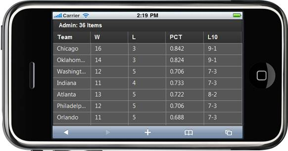
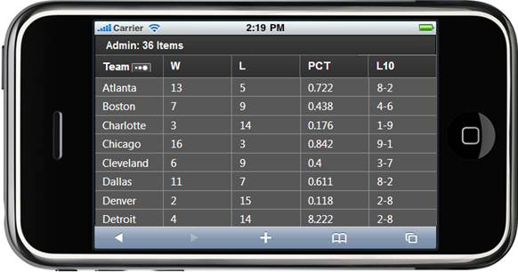

::: {style="DISPLAY: none"}
{#d2h_url_template}{#d2h_package_url style="WIDTH: 0px; DISPLAY: none; HEIGHT: 0px"}
:::

::: {.d2h_secondary_topic style="PADDING-BOTTOM: 10pt; MARGIN: 0pt; PADDING-LEFT: 0pt; PADDING-RIGHT: 0pt; PADDING-TOP: 0pt"}
#### Through MobGridPropertiesModel {#through-mobgridpropertiesmodel style="tab-stops: 0pt"}

1.  Create a model in the application (Refer to [[Getting Started\>Adding a Model to the Razor Application]{.ughyperlink}](ms-xhelp:///?Id=a78221a2-2f66-41bd-925e-bb300459b813)).

2.  Add the following code in the **Index.cshtml** file to create the Grid control in the view. 

**[View \[cshtml\]]{style="FONT-FAMILY: 'Courier New'"}**

 [@(]{style="FONT-FAMILY: 'Courier New'; BACKGROUND: yellow"}[new]{style="FONT-FAMILY: 'Courier New'; COLOR: blue"}[ [HtmlString]{style="COLOR: #2b91af"}(Html.MobSyncfusion().Grid\<[Standings]{style="COLOR: #2b91af"}\>([\"grid\"]{style="COLOR: #a31515"}, ([MobGridPropertiesModel]{style="COLOR: #2b91af"}\<[Standings]{style="COLOR: #2b91af"}\>)(ViewData\[[\"GridModel\"]{style="COLOR: #a31515"}\])).ToString())[)]{style="BACKGROUND: yellow"}  ]{style="FONT-FAMILY: 'Courier New'"}
:::

**[View \[ASPX\]]{style="FONT-FAMILY: 'Courier New'; COLOR: black"}** []{style="FONT-FAMILY: 'Courier New'"}

[   [\<%]{style="BACKGROUND: yellow"}[=]{style="COLOR: blue"} Html.MobSyncfusion().Grid\<[Standings]{style="COLOR: #2b91af"}\>([\"grid\"]{style="COLOR: #a31515"}, ([MobGridPropertiesModel]{style="COLOR: #2b91af"}\<[Standings]{style="COLOR: #2b91af"}\>)(ViewData\[[\"GridModel\"]{style="COLOR: #a31515"}\]))]{style="FONT-FAMILY: 'Courier New'"}

[%\>]{style="FONT-FAMILY: 'Courier New'; BACKGROUND: yellow"}[]{style="FONT-SIZE: 12pt"}

 

 

3.  Create a **MobGridPropertiesModel** object in the **Index** method. Assign grid properties in this model and pass the model from the **controller** to the **view** using the **ViewData** class as shown below: 

 

+-------------------------------------------------------------------------------------------------------------------------------------------------------------------------------------------------------------------------------------------------------------------------------------------+
| []{style="FONT-FAMILY: 'Courier New'; COLOR: blue"}                                                                                                                                                                                                                                       |
|                                                                                                                                                                                                                                                                                           |
| [public]{style="FONT-FAMILY: 'Courier New'; COLOR: blue"}[ [ActionResult]{style="COLOR: #2b91af"} Index()]{style="FONT-FAMILY: 'Courier New'"}                                                                                                                                            |
|                                                                                                                                                                                                                                                                                           |
| [        {]{style="FONT-FAMILY: 'Courier New'"}                                                                                                                                                                                                                                           |
|                                                                                                                                                                                                                                                                                           |
| [            [MobGridPropertiesModel]{style="COLOR: #2b91af"}\<[Standings]{style="COLOR: #2b91af"}\> model = [new]{style="COLOR: blue"} [MobGridPropertiesModel]{style="COLOR: #2b91af"}\<[Standings]{style="COLOR: #2b91af"}\>()]{style="FONT-FAMILY: 'Courier New'"}                    |
|                                                                                                                                                                                                                                                                                           |
| [            {]{style="FONT-FAMILY: 'Courier New'"}                                                                                                                                                                                                                                       |
|                                                                                                                                                                                                                                                                                           |
| [                Caption = [\"Foot Ball Team Standings\"]{style="COLOR: #a31515"},]{style="FONT-FAMILY: 'Courier New'"}                                                                                                                                                                   |
|                                                                                                                                                                                                                                                                                           |
| [                ActionMode= [MobActionMode]{style="COLOR: #2b91af"}.JSON,]{style="FONT-FAMILY: 'Courier New'"}                                                                                                                                                                           |
|                                                                                                                                                                                                                                                                                           |
| [                    ]{style="FONT-FAMILY: Consolas; FONT-SIZE: 9.5pt"}[AllowSorting=[true,]{style="COLOR: blue"}]{style="FONT-FAMILY: 'Courier New'"}**[]{style="FONT-FAMILY: 'Courier New'; FONT-SIZE: 12pt"}**                                                                         |
|                                                                                                                                                                                                                                                                                           |
| []{style="FONT-FAMILY: 'Courier New'; COLOR: blue"}                                                                                                                                                                                                                                       |
|                                                                                                                                                                                                                                                                                           |
| [            };]{style="FONT-FAMILY: 'Courier New'"}                                                                                                                                                                                                                                      |
|                                                                                                                                                                                                                                                                                           |
| [            model.Columns.Add([new]{style="COLOR: blue"} [MobGridColumn]{style="COLOR: #2b91af"}\<[Standings]{style="COLOR: #2b91af"}\>() { HeaderText=[\"Team\"]{style="COLOR: #a31515"}, MappingName=[\"Team\"]{style="COLOR: #a31515"} });]{style="FONT-FAMILY: 'Courier New'"}       |
|                                                                                                                                                                                                                                                                                           |
| [            model.Columns.Add([new]{style="COLOR: blue"} [MobGridColumn]{style="COLOR: #2b91af"}\<[Standings]{style="COLOR: #2b91af"}\>() { HeaderText = [\"W\"]{style="COLOR: #a31515"}, MappingName = [\"Won\"]{style="COLOR: #a31515"} });]{style="FONT-FAMILY: 'Courier New'"}       |
|                                                                                                                                                                                                                                                                                           |
| [            model.Columns.Add([new]{style="COLOR: blue"} [MobGridColumn]{style="COLOR: #2b91af"}\<[Standings]{style="COLOR: #2b91af"}\>() { HeaderText = [\"L\"]{style="COLOR: #a31515"}, MappingName = [\"Loss\"]{style="COLOR: #a31515"} });]{style="FONT-FAMILY: 'Courier New'"}      |
|                                                                                                                                                                                                                                                                                           |
| [            model.Columns.Add([new]{style="COLOR: blue"} [MobGridColumn]{style="COLOR: #2b91af"}\<[Standings]{style="COLOR: #2b91af"}\>() { HeaderText = [\"PCT\"]{style="COLOR: #a31515"}, MappingName = [\"Percent\"]{style="COLOR: #a31515"} });]{style="FONT-FAMILY: 'Courier New'"} |
|                                                                                                                                                                                                                                                                                           |
| [            model.Columns.Add([new]{style="COLOR: blue"} [MobGridColumn]{style="COLOR: #2b91af"}\<[Standings]{style="COLOR: #2b91af"}\>() { HeaderText = [\"L10\"]{style="COLOR: #a31515"}, MappingName = [\"L10\"]{style="COLOR: #a31515"} });]{style="FONT-FAMILY: 'Courier New'"}     |
|                                                                                                                                                                                                                                                                                           |
| [            ViewData\[[\"GridModel\"]{style="COLOR: #a31515"}\] = model; [// pass the model from controller to view using ViewData.]{style="COLOR: green"}]{style="FONT-FAMILY: 'Courier New'"}                                                                                          |
|                                                                                                                                                                                                                                                                                           |
| [            [return]{style="COLOR: blue"} View();]{style="FONT-FAMILY: 'Courier New'"}                                                                                                                                                                                                   |
|                                                                                                                                                                                                                                                                                           |
| [        }]{style="FONT-FAMILY: 'Courier New'"}                                                                                                                                                                                                                                           |
+-------------------------------------------------------------------------------------------------------------------------------------------------------------------------------------------------------------------------------------------------------------------------------------------+

 

4.  In order to work with paging/sorting actions, create a **Post** method for **Index** actions and bind the data source to the grid as shown in the following code.[  ]{style="FONT-FAMILY: Consolas; COLOR: gray; FONT-SIZE: 9.5pt"}

 

+--------------------------------------------------------------------------------------------------------------------------------------------------------------------------------------------------------------------------------------+
| **[Controller]{style="FONT-FAMILY: 'Courier New'; COLOR: black"}**                                                                                                                                                                   |
|                                                                                                                                                                                                                                      |
|  [///]{style="FONT-FAMILY: 'Courier New'; COLOR: gray"}[ ]{style="FONT-FAMILY: 'Courier New'; COLOR: green"}[\<summary\>]{style="FONT-FAMILY: 'Courier New'; COLOR: gray"}[]{style="FONT-FAMILY: 'Courier New'"}                     |
|                                                                                                                                                                                                                                      |
| [        [///]{style="COLOR: gray"}[ Paging/sorting Requests are mapped to this method. This method invokes the MobHtmlActionResult]{style="COLOR: green"}]{style="FONT-FAMILY: 'Courier New'"}                                      |
|                                                                                                                                                                                                                                      |
| [        [///]{style="COLOR: gray"}[ from the grid. Required response is generated.]{style="COLOR: green"}]{style="FONT-FAMILY: 'Courier New'"}                                                                                      |
|                                                                                                                                                                                                                                      |
| [        [///]{style="COLOR: gray"}[ ]{style="COLOR: green"}[\</summary\>]{style="COLOR: gray"}]{style="FONT-FAMILY: 'Courier New'"}                                                                                                 |
|                                                                                                                                                                                                                                      |
| [        [///]{style="COLOR: gray"}[ ]{style="COLOR: green"}[\<param name=\"args\"\>]{style="COLOR: gray"}[Contains paging properties. ]{style="COLOR: green"}[\</param\>]{style="COLOR: gray"}]{style="FONT-FAMILY: 'Courier New'"} |
|                                                                                                                                                                                                                                      |
| [        [///]{style="COLOR: gray"}[ ]{style="COLOR: green"}[\<returns\>]{style="COLOR: gray"}]{style="FONT-FAMILY: 'Courier New'"}                                                                                                  |
|                                                                                                                                                                                                                                      |
| [        [///]{style="COLOR: gray"}[ MobHtmlActionResult returns the data displayed on the grid.]{style="COLOR: green"}]{style="FONT-FAMILY: 'Courier New'"}                                                                         |
|                                                                                                                                                                                                                                      |
| [        [///]{style="COLOR: gray"}[ ]{style="COLOR: green"}[\</returns\>]{style="COLOR: gray"}]{style="FONT-FAMILY: 'Courier New'"}                                                                                                 |
|                                                                                                                                                                                                                                      |
| [        \[[AcceptVerbs]{style="COLOR: #2b91af"}([HttpVerbs]{style="COLOR: #2b91af"}.Post)\]]{style="FONT-FAMILY: 'Courier New'"}                                                                                                    |
|                                                                                                                                                                                                                                      |
| [       [public]{style="COLOR: blue"} [ActionResult]{style="COLOR: #2b91af"} Index([MobGridParams]{style="COLOR: #2b91af"} args)]{style="FONT-FAMILY: 'Courier New'"}                                                                |
|                                                                                                                                                                                                                                      |
| [        {]{style="FONT-FAMILY: 'Courier New'"}                                                                                                                                                                                      |
|                                                                                                                                                                                                                                      |
| [            [var]{style="COLOR: blue"} data = [StandingsDetails]{style="COLOR: #2b91af"}.GetData();]{style="FONT-FAMILY: 'Courier New'"}                                                                                            |
|                                                                                                                                                                                                                                      |
| [            [return]{style="COLOR: blue"} data.MobGridJSONActions\<[Standings]{style="COLOR: #2b91af"}\>();]{style="FONT-FAMILY: 'Courier New'"}                                                                                    |
|                                                                                                                                                                                                                                      |
| []{style="FONT-FAMILY: 'Courier New'"}                                                                                                                                                                                               |
|                                                                                                                                                                                                                                      |
| [        }]{style="FONT-FAMILY: 'Courier New'"}[]{style="FONT-SIZE: 12pt"}                                                                                                                                                           |
+--------------------------------------------------------------------------------------------------------------------------------------------------------------------------------------------------------------------------------------+

 

5.   Run the application. The grid will appear as shown below.

 

{border="0"}

Figure 57: Grid---Sorting

6.  Click on a column heading to sort the column in ascending or descending order. The content will be ordered in ascending order on the first click, then descending order on the next click.

 

{border="0"}

Figure 58: Grid---Sorting (Ascending)

{border="0"}

Figure 59: Grid---Sorting (Descending)

 

[]{#related-topics}
