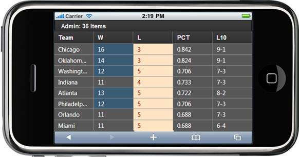

::: {style="DISPLAY: none"}
{#d2h_url_template}{#d2h_package_url style="WIDTH: 0px; DISPLAY: none; HEIGHT: 0px"}
:::

::: {.d2h_secondary_topic style="PADDING-BOTTOM: 10pt; MARGIN: 0pt; PADDING-LEFT: 0pt; PADDING-RIGHT: 0pt; PADDING-TOP: 0pt"}
#### Through MobGridPropertiesModel {#through-mobgridpropertiesmodel style="tab-stops: 0pt"}

1.  Create a model in the application (Refer to [[Getting Started \> Adding a Model to the Razor Application]{.ughyperlink}](ms-xhelp:///?Id=a78221a2-2f66-41bd-925e-bb300459b813)).

2.  Add the following code in the **Index.cshtml** file to create the Grid control in the view.

 

**[View \[cshtml\]]{style="FONT-FAMILY: 'Courier New'"}**

 [@(]{style="FONT-FAMILY: 'Courier New'; BACKGROUND: yellow"}[new]{style="FONT-FAMILY: 'Courier New'; COLOR: blue"}[ [HtmlString]{style="COLOR: #2b91af"}(Html.MobSyncfusion().Grid\<[Standings]{style="COLOR: #2b91af"}\>([\"grid\"]{style="COLOR: #a31515"}, ([MobGridPropertiesModel]{style="COLOR: #2b91af"}\<[Standings]{style="COLOR: #2b91af"}\>)(ViewData\[[\"GridModel\"]{style="COLOR: #a31515"}\])).ToString())[)]{style="BACKGROUND: yellow"}  ]{style="FONT-FAMILY: 'Courier New'"}
:::

**[View \[ASPX\]]{style="FONT-FAMILY: 'Courier New'; COLOR: black"}** []{style="FONT-FAMILY: 'Courier New'"}

[   [\<%]{style="BACKGROUND: yellow"}[=]{style="COLOR: blue"} Html.MobSyncfusion().Grid\<[Standings]{style="COLOR: #2b91af"}\>([\"grid\"]{style="COLOR: #a31515"}, ([MobGridPropertiesModel]{style="COLOR: #2b91af"}\<[Standings]{style="COLOR: #2b91af"}\>)(ViewData\[[\"GridModel\"]{style="COLOR: #a31515"}\]))]{style="FONT-FAMILY: 'Courier New'"}

[%\>]{style="FONT-FAMILY: 'Courier New'; BACKGROUND: yellow"}[]{style="FONT-SIZE: 12pt"}

 

3.  Create a **MobGridPropertiesModel** object in the **Index** method. Assign grid properties in this model and pass the model from the **controller** to the **view** using the **ViewData** class as shown below:

 

+-------------------------------------------------------------------------------------------------------------------------------------------------------------------------------------------------------------------------------------------------------------------------------------------+
| []{style="FONT-FAMILY: 'Courier New'; COLOR: blue"}                                                                                                                                                                                                                                       |
|                                                                                                                                                                                                                                                                                           |
| [public]{style="FONT-FAMILY: 'Courier New'; COLOR: blue"}[ [ActionResult]{style="COLOR: #2b91af"} Index()]{style="FONT-FAMILY: 'Courier New'"}                                                                                                                                            |
|                                                                                                                                                                                                                                                                                           |
| [        {]{style="FONT-FAMILY: 'Courier New'"}                                                                                                                                                                                                                                           |
|                                                                                                                                                                                                                                                                                           |
| [            [MobGridPropertiesModel]{style="COLOR: #2b91af"}\<[Standings]{style="COLOR: #2b91af"}\> model = [new]{style="COLOR: blue"} [MobGridPropertiesModel]{style="COLOR: #2b91af"}\<[Standings]{style="COLOR: #2b91af"}\>()]{style="FONT-FAMILY: 'Courier New'"}                    |
|                                                                                                                                                                                                                                                                                           |
| [            {]{style="FONT-FAMILY: 'Courier New'"}                                                                                                                                                                                                                                       |
|                                                                                                                                                                                                                                                                                           |
| [                DataSource = [StandingsDetails]{style="COLOR: #2b91af"}.GetData(),]{style="FONT-FAMILY: 'Courier New'"}                                                                                                                                                                  |
|                                                                                                                                                                                                                                                                                           |
| [                Caption = [\"Admin:36 Items\"]{style="COLOR: #a31515"},]{style="FONT-FAMILY: 'Courier New'"}                                                                                                                                                                             |
|                                                                                                                                                                                                                                                                                           |
| [                ActionMode= [MobActionMode]{style="COLOR: #2b91af"}.Server]{style="FONT-FAMILY: 'Courier New'"}[]{style="FONT-FAMILY: 'Courier New'; FONT-SIZE: 11pt"}                                                                                                                   |
|                                                                                                                                                                                                                                                                                           |
| [            };]{style="FONT-FAMILY: 'Courier New'; FONT-SIZE: 12pt"}                                                                                                                                                                                                                     |
|                                                                                                                                                                                                                                                                                           |
| [            model.Columns.Add([new]{style="COLOR: blue"} [MobGridColumn]{style="COLOR: #2b91af"}\<[Standings]{style="COLOR: #2b91af"}\>() { HeaderText=[\"Team\"]{style="COLOR: #a31515"}, MappingName=[\"Team\"]{style="COLOR: #a31515"} });]{style="FONT-FAMILY: 'Courier New'"}       |
|                                                                                                                                                                                                                                                                                           |
| [            model.Columns.Add([new]{style="COLOR: blue"} [MobGridColumn]{style="COLOR: #2b91af"}\<[Standings]{style="COLOR: #2b91af"}\>() { HeaderText = [\"W\"]{style="COLOR: #a31515"}, MappingName = [\"Won\"]{style="COLOR: #a31515"} });]{style="FONT-FAMILY: 'Courier New'"}       |
|                                                                                                                                                                                                                                                                                           |
| [            model.Columns.Add([new]{style="COLOR: blue"} [MobGridColumn]{style="COLOR: #2b91af"}\<[Standings]{style="COLOR: #2b91af"}\>() { HeaderText = [\"L\"]{style="COLOR: #a31515"}, MappingName = [\"Loss\"]{style="COLOR: #a31515"} });]{style="FONT-FAMILY: 'Courier New'"}      |
|                                                                                                                                                                                                                                                                                           |
| [            model.Columns.Add([new]{style="COLOR: blue"} [MobGridColumn]{style="COLOR: #2b91af"}\<[Standings]{style="COLOR: #2b91af"}\>() { HeaderText = [\"PCT\"]{style="COLOR: #a31515"}, MappingName = [\"Percent\"]{style="COLOR: #a31515"} });]{style="FONT-FAMILY: 'Courier New'"} |
|                                                                                                                                                                                                                                                                                           |
| [            model.Columns.Add([new]{style="COLOR: blue"} [MobGridColumn]{style="COLOR: #2b91af"}\<[Standings]{style="COLOR: #2b91af"}\>() { HeaderText = [\"L10\"]{style="COLOR: #a31515"}, MappingName = [\"L10\"]{style="COLOR: #a31515"} });]{style="FONT-FAMILY: 'Courier New'"}     |
|                                                                                                                                                                                                                                                                                           |
| [            ViewData\[[\"GridModel\"]{style="COLOR: #a31515"}\] = model; [// pass the model from controller to view using ViewData.]{style="COLOR: green"}]{style="FONT-FAMILY: 'Courier New'"}                                                                                          |
|                                                                                                                                                                                                                                                                                           |
| [                model.QueryCellInfo = onQueryCellAction; ]{style="FONT-FAMILY: Consolas; FONT-SIZE: 9.5pt"}                                                                                                                                                                              |
|                                                                                                                                                                                                                                                                                           |
| []{style="FONT-FAMILY: 'Courier New'"}                                                                                                                                                                                                                                                    |
|                                                                                                                                                                                                                                                                                           |
| [            [return]{style="COLOR: blue"} View();]{style="FONT-FAMILY: 'Courier New'"}                                                                                                                                                                                                   |
|                                                                                                                                                                                                                                                                                           |
| [        }]{style="FONT-FAMILY: 'Courier New'"}                                                                                                                                                                                                                                           |
+-------------------------------------------------------------------------------------------------------------------------------------------------------------------------------------------------------------------------------------------------------------------------------------------+

 

4.  Create a **QueryCellAction** handler as shown below.

 

+------------------------------------------------------------------------------------------------------------------------------------------------------------------------------------------------------------------------------------------------------------------------------------+
| **[Controller]{style="FONT-FAMILY: 'Courier New'; COLOR: black"}**                                                                                                                                                                                                                 |
|                                                                                                                                                                                                                                                                                    |
|                                                                                                                                                                                                                                                                                    |
|                                                                                                                                                                                                                                                                                    |
| [\[[ChildActionOnly]{style="COLOR: #2b91af"}\]]{style="FONT-FAMILY: Consolas; FONT-SIZE: 9.5pt"}                                                                                                                                                                                   |
|                                                                                                                                                                                                                                                                                    |
| [        [public]{style="COLOR: blue"} [void]{style="COLOR: blue"} onQueryCellAction([GridTableCell]{style="COLOR: #2b91af"}\<[Standings]{style="COLOR: #2b91af"}\> cell)]{style="FONT-FAMILY: Consolas; FONT-SIZE: 9.5pt"}                                                        |
|                                                                                                                                                                                                                                                                                    |
| [        {]{style="FONT-FAMILY: Consolas; FONT-SIZE: 9.5pt"}                                                                                                                                                                                                                       |
|                                                                                                                                                                                                                                                                                    |
| [            [if]{style="COLOR: blue"} (cell.TableCellType == [MobGridTableCellType]{style="COLOR: #2b91af"}.RecordFieldCell \|\| cell.TableCellType == [MobGridTableCellType]{style="COLOR: #2b91af"}.AlternateRecordFieldCell)]{style="FONT-FAMILY: Consolas; FONT-SIZE: 9.5pt"} |
|                                                                                                                                                                                                                                                                                    |
| [            {]{style="FONT-FAMILY: Consolas; FONT-SIZE: 9.5pt"}                                                                                                                                                                                                                   |
|                                                                                                                                                                                                                                                                                    |
| [                [if]{style="COLOR: blue"} (cell.Column.MappingName == [\"Won\"]{style="COLOR: #a31515"})]{style="FONT-FAMILY: Consolas; FONT-SIZE: 9.5pt"}                                                                                                                        |
|                                                                                                                                                                                                                                                                                    |
| [                {]{style="FONT-FAMILY: Consolas; FONT-SIZE: 9.5pt"}                                                                                                                                                                                                               |
|                                                                                                                                                                                                                                                                                    |
| [                    [if]{style="COLOR: blue"} (cell.Data.Won \>= 12)]{style="FONT-FAMILY: Consolas; FONT-SIZE: 9.5pt"}                                                                                                                                                            |
|                                                                                                                                                                                                                                                                                    |
| [                        cell.HtmlAttributes\[[\"style\"]{style="COLOR: #a31515"}\] = [\"color:white;background-color:#395b73;\"]{style="COLOR: #a31515"};]{style="FONT-FAMILY: Consolas; FONT-SIZE: 9.5pt"}                                                                       |
|                                                                                                                                                                                                                                                                                    |
| [                }]{style="FONT-FAMILY: Consolas; FONT-SIZE: 9.5pt"}                                                                                                                                                                                                               |
|                                                                                                                                                                                                                                                                                    |
| [                [if]{style="COLOR: blue"} (cell.Column.MappingName == [\"Loss\"]{style="COLOR: #a31515"})]{style="FONT-FAMILY: Consolas; FONT-SIZE: 9.5pt"}                                                                                                                       |
|                                                                                                                                                                                                                                                                                    |
| [                {]{style="FONT-FAMILY: Consolas; FONT-SIZE: 9.5pt"}                                                                                                                                                                                                               |
|                                                                                                                                                                                                                                                                                    |
| [                    [if]{style="COLOR: blue"} (cell.Data.Loss \<= 6)]{style="FONT-FAMILY: Consolas; FONT-SIZE: 9.5pt"}                                                                                                                                                            |
|                                                                                                                                                                                                                                                                                    |
| [                        cell.HtmlAttributes\[[\"style\"]{style="COLOR: #a31515"}\] = [\"color:#ac0c0c;background-color:Bisque;\"]{style="COLOR: #a31515"};]{style="FONT-FAMILY: Consolas; FONT-SIZE: 9.5pt"}                                                                      |
|                                                                                                                                                                                                                                                                                    |
| [                }]{style="FONT-FAMILY: Consolas; FONT-SIZE: 9.5pt"}                                                                                                                                                                                                               |
|                                                                                                                                                                                                                                                                                    |
| [            }]{style="FONT-FAMILY: Consolas; FONT-SIZE: 9.5pt"}                                                                                                                                                                                                                   |
|                                                                                                                                                                                                                                                                                    |
| [        }]{style="FONT-FAMILY: Consolas; FONT-SIZE: 9.5pt"}                                                                                                                                                                                                                       |
+------------------------------------------------------------------------------------------------------------------------------------------------------------------------------------------------------------------------------------------------------------------------------------+

 

5.  In order to work with paging and sorting actions, create a **Post** method for **Index** actions and bind the data source and **QueryCellAction** handler to the grid as shown in the following code.

[  ]{style="FONT-FAMILY: Consolas; COLOR: gray; FONT-SIZE: 9.5pt"}

+-------------------------------------------------------------------------------------------------------------------------------------------------------------------------------------------------------------------------------------------------------------------------------------+
| **[Controller]{style="FONT-FAMILY: 'Courier New'; COLOR: black"}**                                                                                                                                                                                                                  |
|                                                                                                                                                                                                                                                                                     |
|  [///]{style="FONT-FAMILY: 'Courier New'; COLOR: gray"}[ ]{style="FONT-FAMILY: 'Courier New'; COLOR: green"}[\<summary\>]{style="FONT-FAMILY: 'Courier New'; COLOR: gray"}[]{style="FONT-FAMILY: 'Courier New'"}                                                                    |
|                                                                                                                                                                                                                                                                                     |
| [        [///]{style="COLOR: gray"}[ sorting Requests are mapped to this method. This method invokes the MobHtmlActionResult]{style="COLOR: green"}]{style="FONT-FAMILY: 'Courier New'"}                                                                                            |
|                                                                                                                                                                                                                                                                                     |
| [        [///]{style="COLOR: gray"}[ from the grid. Required response is generated.]{style="COLOR: green"}]{style="FONT-FAMILY: 'Courier New'"}                                                                                                                                     |
|                                                                                                                                                                                                                                                                                     |
| [        [///]{style="COLOR: gray"}[ ]{style="COLOR: green"}[\</summary\>]{style="COLOR: gray"}]{style="FONT-FAMILY: 'Courier New'"}                                                                                                                                                |
|                                                                                                                                                                                                                                                                                     |
| [        [///]{style="COLOR: gray"}[ ]{style="COLOR: green"}[\<param name=\"args\"\>]{style="COLOR: gray"}[Contains sorting properties. ]{style="COLOR: green"}[\</param\>]{style="COLOR: gray"}]{style="FONT-FAMILY: 'Courier New'"}                                               |
|                                                                                                                                                                                                                                                                                     |
| [        [///]{style="COLOR: gray"}[ ]{style="COLOR: green"}[\<returns\>]{style="COLOR: gray"}]{style="FONT-FAMILY: 'Courier New'"}                                                                                                                                                 |
|                                                                                                                                                                                                                                                                                     |
| [        [///]{style="COLOR: gray"}[ MobHtmlActionResult returns the data displayed on the grid.]{style="COLOR: green"}]{style="FONT-FAMILY: 'Courier New'"}                                                                                                                        |
|                                                                                                                                                                                                                                                                                     |
| [        [///]{style="COLOR: gray"}[ ]{style="COLOR: green"}[\</returns\>]{style="COLOR: gray"}]{style="FONT-FAMILY: 'Courier New'"}                                                                                                                                                |
|                                                                                                                                                                                                                                                                                     |
| [        \[[AcceptVerbs]{style="COLOR: #2b91af"}([HttpVerbs]{style="COLOR: #2b91af"}.Post)\]]{style="FONT-FAMILY: Consolas; FONT-SIZE: 9.5pt"}                                                                                                                                      |
|                                                                                                                                                                                                                                                                                     |
| [        [public]{style="COLOR: blue"} [ActionResult]{style="COLOR: #2b91af"} Index([MobGridParams]{style="COLOR: #2b91af"} args)]{style="FONT-FAMILY: Consolas; FONT-SIZE: 9.5pt"}                                                                                                 |
|                                                                                                                                                                                                                                                                                     |
| [        {]{style="FONT-FAMILY: Consolas; FONT-SIZE: 9.5pt"}                                                                                                                                                                                                                        |
|                                                                                                                                                                                                                                                                                     |
| []{style="FONT-FAMILY: Consolas; FONT-SIZE: 9.5pt"}                                                                                                                                                                                                                                 |
|                                                                                                                                                                                                                                                                                     |
| [            [var]{style="COLOR: blue"} data = [StandingsDetails]{style="COLOR: #2b91af"}.GetData();]{style="FONT-FAMILY: Consolas; FONT-SIZE: 9.5pt"}                                                                                                                              |
|                                                                                                                                                                                                                                                                                     |
| [            [var]{style="COLOR: blue"} engine = data.MobGridActions\<[Standings]{style="COLOR: #2b91af"}\>() [as]{style="COLOR: blue"} [MobGridHtmlActionResult]{style="COLOR: #2b91af"}\<[Standings]{style="COLOR: #2b91af"}\>;]{style="FONT-FAMILY: Consolas; FONT-SIZE: 9.5pt"} |
|                                                                                                                                                                                                                                                                                     |
| [            engine.GridModel.QueryCellInfo = onQueryCellAction;]{style="FONT-FAMILY: Consolas; FONT-SIZE: 9.5pt"}                                                                                                                                                                  |
|                                                                                                                                                                                                                                                                                     |
| [            [return]{style="COLOR: blue"} engine;]{style="FONT-FAMILY: Consolas; FONT-SIZE: 9.5pt"}                                                                                                                                                                                |
|                                                                                                                                                                                                                                                                                     |
| []{style="FONT-FAMILY: Consolas; FONT-SIZE: 9.5pt"}                                                                                                                                                                                                                                 |
|                                                                                                                                                                                                                                                                                     |
| [        }]{style="FONT-FAMILY: Consolas; FONT-SIZE: 9.5pt"}                                                                                                                                                                                                                        |
+-------------------------------------------------------------------------------------------------------------------------------------------------------------------------------------------------------------------------------------------------------------------------------------+

 

6.  Run the application. The grid will appear as shown below.

 

{border="0"}[]{style="FONT-FAMILY: 'Calibri','sans-serif'; FONT-SIZE: 11pt"}

Figure 61: Grid---QueryCellInfo

[]{#related-topics}
