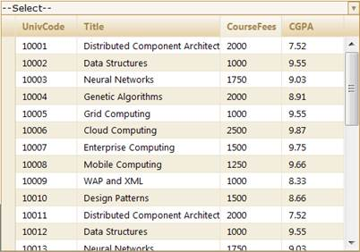
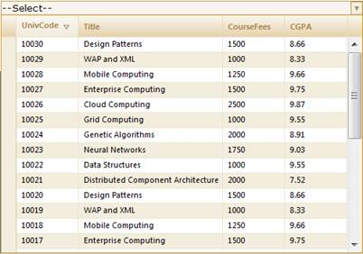

::: {style="DISPLAY: none"}
{#d2h_url_template}{#d2h_package_url style="WIDTH: 0px; DISPLAY: none; HEIGHT: 0px"}
:::

::: {.d2h_secondary_topic style="PADDING-BOTTOM: 10pt; MARGIN: 0pt; PADDING-LEFT: 0pt; PADDING-RIGHT: 0pt; PADDING-TOP: 0pt"}
##### Through MultiColumnDropDownModel {#through-multicolumndropdownmodel style="tab-stops: 0pt"}

To sort in server mode using **MultiColumnDropDownModel**:

1.   Create a model in the application. Refer to Getting Started\>Adding a Model to the Application.

2.   Create the MultiColumnDropDown control in the view.

 

+------------------------------------------------------------------------------------------------------------------------------------------------------------------------------------------------------------------------------------------------------------------------------------------------------------------------------------------------------------------------------------------------------------------------------------------------------------------------------------------------------+
| **[\[View\]]{style="FONT-FAMILY: 'Courier New'"}**                                                                                                                                                                                                                                                                                                                                                                                                                                                   |
|                                                                                                                                                                                                                                                                                                                                                                                                                                                                                                      |
|                                                                                                                                                                                                                                                                                                                                                                                                                                                                                                      |
|                                                                                                                                                                                                                                                                                                                                                                                                                                                                                                      |
| [\<%]{style="FONT-FAMILY: 'Courier New'; BACKGROUND: yellow"}[=]{style="FONT-FAMILY: 'Courier New'; COLOR: blue"}[Html.]{style="FONT-FAMILY: 'Courier New'"}[Syncfusion().]{style="FONT-FAMILY: 'Courier New'"}[MultiColumnDropDown\<[Student]{style="COLOR: #2b91af"}\>([\"Multidropdown\"]{style="COLOR: #a31515"},([MultiColumnDropDownModel]{style="COLOR: #2b91af"}) ViewData\[[\"dropdown\"]{style="COLOR: #a31515"}\]) [%\>]{style="BACKGROUND: yellow"}]{style="FONT-FAMILY: 'Courier New'"} |
+------------------------------------------------------------------------------------------------------------------------------------------------------------------------------------------------------------------------------------------------------------------------------------------------------------------------------------------------------------------------------------------------------------------------------------------------------------------------------------------------------+

 

 

+----------------------------------------------------------------------------------------------------------------------------------------------------------------------------------------------------------------------------------------------------------------------------------------------------------------------------------------------------------------------------------------------------------------------------------------------------------------------------------------------------------------------------------------------------------------------------------------------------------------------------------------------------------------------------------------------------+
| **[View ]{style="FONT-FAMILY: 'Courier New'"}[\[cshtml\]]{style="FONT-FAMILY: 'Courier New'"}**                                                                                                                                                                                                                                                                                                                                                                                                                                                                                                                                                                                                    |
|                                                                                                                                                                                                                                                                                                                                                                                                                                                                                                                                                                                                                                                                                                    |
| [@(]{style="FONT-FAMILY: Consolas; BACKGROUND: yellow; FONT-SIZE: 9.5pt"}[new]{style="FONT-FAMILY: Consolas; COLOR: blue; FONT-SIZE: 9.5pt"}[ [HtmlString]{style="COLOR: #2b91af"}(]{style="FONT-FAMILY: Consolas; FONT-SIZE: 9.5pt"}[Html.Syncfusion().MultiColumnDropDown\<[Student]{style="COLOR: #2b91af"}\>([\"Multidropdown\"]{style="COLOR: #a31515"},([MultiColumnDropDownModel]{style="COLOR: #2b91af"}) ViewData\[[\"dropdown\"]{style="COLOR: #a31515"}\])]{style="FONT-FAMILY: 'Courier New'"}[.]{style="FONT-FAMILY: 'Courier New'"}[ToString())[)]{style="BACKGROUND: yellow"}]{style="FONT-FAMILY: Consolas; FONT-SIZE: 9.5pt"}[]{style="FONT-FAMILY: 'Courier New'; COLOR: black"} |
+----------------------------------------------------------------------------------------------------------------------------------------------------------------------------------------------------------------------------------------------------------------------------------------------------------------------------------------------------------------------------------------------------------------------------------------------------------------------------------------------------------------------------------------------------------------------------------------------------------------------------------------------------------------------------------------------------+

 

Create an instance for **MultiColumnDropDownModel** and assign **Datasource** to the model.

***[]{style="COLOR: #4f81bd"}*** 

+-------------------------------------------------------------------------------------------------------------------------------------------------------------------------------------------------+
| **[Controller]{style="FONT-FAMILY: 'Courier New'"}[]{style="FONT-FAMILY: 'Courier New'"}**                                                                                                      |
|                                                                                                                                                                                                 |
| [// Create instance to MultiColumnDropDownModel and assign properties.]{style="FONT-FAMILY: 'Courier New'; COLOR: green"}[]{style="FONT-FAMILY: 'Courier New'"}                                 |
|                                                                                                                                                                                                 |
| [            [MultiColumnDropDownModel]{style="COLOR: #2b91af"} dropdown = [new]{style="COLOR: blue"} [MultiColumnDropDownModel]{style="COLOR: #2b91af"}()]{style="FONT-FAMILY: 'Courier New'"} |
|                                                                                                                                                                                                 |
| [            {]{style="FONT-FAMILY: 'Courier New'"}                                                                                                                                             |
|                                                                                                                                                                                                 |
| [                Datasource = [new]{style="COLOR: blue"} [StudentDataContext]{style="COLOR: #2b91af"}().JSONStudent.Skip(0).Take(30).ToList(),]{style="FONT-FAMILY: 'Courier New'"}             |
|                                                                                                                                                                                                 |
| [                Text = [\"\--Select\--\"]{style="COLOR: #a31515"},]{style="FONT-FAMILY: 'Courier New'"}                                                                                        |
|                                                                                                                                                                                                 |
| [                DisplayExpression = [new]{style="COLOR: blue"} [int]{style="COLOR: blue"}\[3\] { 2, 3, 5 },]{style="FONT-FAMILY: 'Courier New'"}                                               |
|                                                                                                                                                                                                 |
| [                Width = 500]{style="FONT-FAMILY: 'Courier New'"}                                                                                                                               |
|                                                                                                                                                                                                 |
| [            };]{style="FONT-FAMILY: 'Courier New'"}                                                                                                                                            |
|                                                                                                                                                                                                 |
|                                                                                                                                                                                                 |
+-------------------------------------------------------------------------------------------------------------------------------------------------------------------------------------------------+

***[]{style="COLOR: #4f81bd"}*** 

Enable/disable the sorting feature using the **AllowSorting** property.

***[]{style="COLOR: #4f81bd"}*** 

+-------------------------------------------------------------------------------------------------------------------------------------------------------------------------------------------------+
| **[Controller]{style="FONT-FAMILY: 'Courier New'"}[]{style="FONT-FAMILY: 'Courier New'"}**                                                                                                      |
|                                                                                                                                                                                                 |
| []{style="FONT-FAMILY: 'Courier New'"}                                                                                                                                                          |
|                                                                                                                                                                                                 |
| [// Create instance to MultiColumnDropDownModel and assign properties.]{style="FONT-FAMILY: 'Courier New'; COLOR: green"}[]{style="FONT-FAMILY: 'Courier New'"}                                 |
|                                                                                                                                                                                                 |
| [            [MultiColumnDropDownModel]{style="COLOR: #2b91af"} dropdown = [new]{style="COLOR: blue"} [MultiColumnDropDownModel]{style="COLOR: #2b91af"}()]{style="FONT-FAMILY: 'Courier New'"} |
|                                                                                                                                                                                                 |
| [            {]{style="FONT-FAMILY: 'Courier New'"}                                                                                                                                             |
|                                                                                                                                                                                                 |
| [                Datasource = [new]{style="COLOR: blue"} [StudentDataContext]{style="COLOR: #2b91af"}().JSONStudent.Skip(0).Take(30).ToList(),]{style="FONT-FAMILY: 'Courier New'"}             |
|                                                                                                                                                                                                 |
| [                Text = [\"\--Select\--\"]{style="COLOR: #a31515"},]{style="FONT-FAMILY: 'Courier New'"}                                                                                        |
|                                                                                                                                                                                                 |
| [                DisplayExpression = [new]{style="COLOR: blue"} [int]{style="COLOR: blue"}\[3\] { 2, 3, 5 },]{style="FONT-FAMILY: 'Courier New'"}                                               |
|                                                                                                                                                                                                 |
| [                Width = 500,]{style="FONT-FAMILY: 'Courier New'"}                                                                                                                              |
|                                                                                                                                                                                                 |
| **[                AllowSorting = ]{style="FONT-FAMILY: 'Courier New'"}**[true]{style="FONT-FAMILY: 'Courier New'; COLOR: blue"}**[]{style="FONT-FAMILY: 'Courier New'"}**                      |
|                                                                                                                                                                                                 |
| [            };]{style="FONT-FAMILY: 'Courier New'"}                                                                                                                                            |
|                                                                                                                                                                                                 |
|                                                                                                                                                                                                 |
+-------------------------------------------------------------------------------------------------------------------------------------------------------------------------------------------------+

***[]{style="COLOR: #4f81bd"}*** 

Pass the model to View using **ViewData()**.

 

+-------------------------------------------------------------------------------------------------------------------------------------------------------------+
| **[Controller]{style="FONT-FAMILY: 'Courier New'"}[]{style="FONT-FAMILY: 'Courier New'"}**                                                                  |
|                                                                                                                                                             |
| [// Pass the MultiColumnDropDownModel to the view using ViewData()]{style="FONT-FAMILY: 'Courier New'; COLOR: green"}[]{style="FONT-FAMILY: 'Courier New'"} |
|                                                                                                                                                             |
| [            ViewData\[[\"dropdown\"]{style="COLOR: #a31515"}\] = dropdown;]{style="FONT-FAMILY: 'Courier New'"}                                            |
+-------------------------------------------------------------------------------------------------------------------------------------------------------------+

**                         **

In order to work with sorting actions, create a **Post** method for **Index** actions and bind the data source to **MultiColumnDropDown** as shown in the following code sample.

***[]{style="COLOR: #4f81bd"}*** 

+----------------------------------------------------------------------------------------------------------------------------------------------------------------------------------------------------------------------------------------------------------------------------------------------+
| **[Controller]{style="FONT-FAMILY: 'Courier New'"}[]{style="FONT-FAMILY: 'Courier New'"}**                                                                                                                                                                                                   |
|                                                                                                                                                                                                                                                                                              |
| []{style="FONT-FAMILY: 'Courier New'"}                                                                                                                                                                                                                                                       |
|                                                                                                                                                                                                                                                                                              |
| [        \[[AcceptVerbs]{style="COLOR: #2b91af"}([HttpVerbs]{style="COLOR: #2b91af"}.Post)\]]{style="FONT-FAMILY: 'Courier New'"}                                                                                                                                                            |
|                                                                                                                                                                                                                                                                                              |
| [        [public]{style="COLOR: blue"} [ActionResult]{style="COLOR: #2b91af"} ]{style="FONT-FAMILY: 'Courier New'"}[Index]{style="FONT-FAMILY: 'Courier New'"}[ ([PagingParams]{style="COLOR: #2b91af"} args)]{style="FONT-FAMILY: 'Courier New'"}                                           |
|                                                                                                                                                                                                                                                                                              |
| [        {]{style="FONT-FAMILY: 'Courier New'"}                                                                                                                                                                                                                                              |
|                                                                                                                                                                                                                                                                                              |
| [       [IEnumerable]{style="COLOR: #2b91af"} data =]{style="FONT-FAMILY: 'Courier New'"}[new ]{style="FONT-FAMILY: 'Courier New'; COLOR: blue"}[StudentDataContext]{style="FONT-FAMILY: 'Courier New'; COLOR: #2b91af"}[().AutoFormatStudent.Take(20);]{style="FONT-FAMILY: 'Courier New'"} |
|                                                                                                                                                                                                                                                                                              |
| [       [return]{style="COLOR: blue"} data.GridActions\<[Student]{style="COLOR: #2b91af"}\>();]{style="FONT-FAMILY: 'Courier New'"}                                                                                                                                                          |
|                                                                                                                                                                                                                                                                                              |
| [        }]{style="FONT-FAMILY: 'Courier New'"}                                                                                                                                                                                                                                              |
+----------------------------------------------------------------------------------------------------------------------------------------------------------------------------------------------------------------------------------------------------------------------------------------------+

 

Run the application. The **MultiColumnDropDown** control will appear as shown below.

 

 

{border="0"}

Figure 322: Sorting Enabled MultiColumnDropDown Control

 

{border="0"}

Figure 323: "UnivCode" Column Sorted by Descending Order

 

 

[]{#related-topics}
:::
