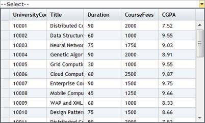

::: {style="DISPLAY: none"}
{#d2h_url_template}{#d2h_package_url style="WIDTH: 0px; DISPLAY: none; HEIGHT: 0px"}
:::

::: {.d2h_secondary_topic style="PADDING-BOTTOM: 10pt; MARGIN: 0pt; PADDING-LEFT: 0pt; PADDING-RIGHT: 0pt; PADDING-TOP: 0pt"}
#### Through MultiColumnDropDownModel {#through-multicolumndropdownmodel style="tab-stops: 0pt"}

 

1.   Create a model in the application (Refer to [Getting Started\>Adding a Model to the Application]{.underline}).

2.   Create the MultiColumnDropdown control in the view.

 

 

+--------------------------------------------------------------------------------------------------------------------------------------------------------------------------------------------------------------------------------------------------------------------------------------------------------------------------------------------------------------------------------------------------------------------------+
| **[View \[ASPX\]]{style="FONT-FAMILY: 'Courier New'"}**                                                                                                                                                                                                                                                                                                                                                                  |
|                                                                                                                                                                                                                                                                                                                                                                                                                          |
| [           ]{style="FONT-FAMILY: 'Courier New'"}                                                                                                                                                                                                                                                                                                                                                                        |
|                                                                                                                                                                                                                                                                                                                                                                                                                          |
| [\<%]{style="FONT-FAMILY: 'Courier New'; BACKGROUND: yellow"}[=]{style="FONT-FAMILY: 'Courier New'; COLOR: blue"}[Html.Syncfusion().MultiColumnDropDown\<[Student]{style="COLOR: #2b91af"}\>([\"Multidropdown\"]{style="COLOR: #a31515"},([MultiColumnDropDownModel]{style="COLOR: #2b91af"}) ViewData\[[\"dropdown\"]{style="COLOR: #a31515"}\]) [%\>]{style="BACKGROUND: yellow"}]{style="FONT-FAMILY: 'Courier New'"} |
+--------------------------------------------------------------------------------------------------------------------------------------------------------------------------------------------------------------------------------------------------------------------------------------------------------------------------------------------------------------------------------------------------------------------------+

[]{style="FONT-FAMILY: Consolas; BACKGROUND: yellow; FONT-SIZE: 9.5pt"} 

 

+--------------------------------------------------------------------------------------------------------------------------------------------------------------------------------------------------------------------------------------------------------------------------------------------------------------------------------------------------------------------------------------------------------------------------------------------------------------------------------------------------------------------------------------------------------------------------------------------------------------------------------------------------------------------------------------+
| **[View \[cshtml\]]{style="FONT-FAMILY: 'Courier New'"}**                                                                                                                                                                                                                                                                                                                                                                                                                                                                                                                                                                                                                            |
|                                                                                                                                                                                                                                                                                                                                                                                                                                                                                                                                                                                                                                                                                      |
| []{style="FONT-FAMILY: 'Courier New'"}                                                                                                                                                                                                                                                                                                                                                                                                                                                                                                                                                                                                                                               |
|                                                                                                                                                                                                                                                                                                                                                                                                                                                                                                                                                                                                                                                                                      |
| [@(]{style="FONT-FAMILY: Consolas; BACKGROUND: yellow; FONT-SIZE: 9.5pt"}[new]{style="FONT-FAMILY: Consolas; COLOR: blue; FONT-SIZE: 9.5pt"}[ [HtmlString]{style="COLOR: #2b91af"}(]{style="FONT-FAMILY: Consolas; FONT-SIZE: 9.5pt"}[Html.Syncfusion().MultiColumnDropDown\<[Student]{style="COLOR: #2b91af"}\>([\"Multidropdown\"]{style="COLOR: #a31515"},([MultiColumnDropDownModel]{style="COLOR: #2b91af"}) ViewData\[[\"dropdown\"]{style="COLOR: #a31515"}\])]{style="FONT-FAMILY: 'Courier New'"}[.]{style="FONT-FAMILY: 'Courier New'"}[ToString())[)]{style="BACKGROUND: yellow"}]{style="FONT-FAMILY: Consolas; FONT-SIZE: 9.5pt"}[]{style="FONT-FAMILY: 'Courier New'"} |
+--------------------------------------------------------------------------------------------------------------------------------------------------------------------------------------------------------------------------------------------------------------------------------------------------------------------------------------------------------------------------------------------------------------------------------------------------------------------------------------------------------------------------------------------------------------------------------------------------------------------------------------------------------------------------------------+

[]{style="FONT-FAMILY: Consolas; BACKGROUND: yellow; FONT-SIZE: 9.5pt"} 

 

3.   Create an instance to **MultiColumnDropdownModel** and assign a data source using the **Datasource** property.

 

+-------------------------------------------------------------------------------------------------------------------------------------------------------------------------------------------------+
| [// Create instance to MultiColumnDropDownModel and assign properties.]{style="FONT-FAMILY: 'Courier New'; COLOR: green"}[]{style="FONT-FAMILY: 'Courier New'"}                                 |
|                                                                                                                                                                                                 |
| [            [MultiColumnDropDownModel]{style="COLOR: #2b91af"} dropdown = [new]{style="COLOR: blue"} [MultiColumnDropDownModel]{style="COLOR: #2b91af"}()]{style="FONT-FAMILY: 'Courier New'"} |
|                                                                                                                                                                                                 |
| [            {]{style="FONT-FAMILY: 'Courier New'"}                                                                                                                                             |
|                                                                                                                                                                                                 |
| [                **Datasource = [new]{style="COLOR: blue"} [StudentDataContext]{style="COLOR: #2b91af"}().JSONStudent.Skip(0).Take(30).ToList(),**]{style="FONT-FAMILY: 'Courier New'"}         |
|                                                                                                                                                                                                 |
| [                Text = [\"\--Select\--\"]{style="COLOR: #a31515"},]{style="FONT-FAMILY: 'Courier New'"}                                                                                        |
|                                                                                                                                                                                                 |
| [                Width = 500]{style="FONT-FAMILY: 'Courier New'"}                                                                                                                               |
|                                                                                                                                                                                                 |
| [            };]{style="FONT-FAMILY: 'Courier New'"}                                                                                                                                            |
+-------------------------------------------------------------------------------------------------------------------------------------------------------------------------------------------------+

[]{style="FONT-FAMILY: Consolas; FONT-SIZE: 9.5pt"} 

4.   Specify the display column indexes in array format using the **DisplayExpression** property.

 

+-------------------------------------------------------------------------------------------------------------------------------------------------------------------------------------------------+
| [// Create instance to MultiColumnDropDownModel and assign properties.]{style="FONT-FAMILY: 'Courier New'; COLOR: green"}[]{style="FONT-FAMILY: 'Courier New'"}                                 |
|                                                                                                                                                                                                 |
| [            [MultiColumnDropDownModel]{style="COLOR: #2b91af"} dropdown = [new]{style="COLOR: blue"} [MultiColumnDropDownModel]{style="COLOR: #2b91af"}()]{style="FONT-FAMILY: 'Courier New'"} |
|                                                                                                                                                                                                 |
| [            {]{style="FONT-FAMILY: 'Courier New'"}                                                                                                                                             |
|                                                                                                                                                                                                 |
| [                Datasource = [new]{style="COLOR: blue"} [StudentDataContext]{style="COLOR: #2b91af"}().JSONStudent.Skip(0).Take(30).ToList(),]{style="FONT-FAMILY: 'Courier New'"}             |
|                                                                                                                                                                                                 |
| [                Text = [\"\--Select\--\"]{style="COLOR: #a31515"},]{style="FONT-FAMILY: 'Courier New'"}                                                                                        |
|                                                                                                                                                                                                 |
| **[                DisplayExpression = [new]{style="COLOR: blue"} [int]{style="COLOR: blue"}\[3\] { 2, 3, 5 },]{style="FONT-FAMILY: 'Courier New'"}**                                           |
|                                                                                                                                                                                                 |
| [                Width = 500,]{style="FONT-FAMILY: 'Courier New'"}                                                                                                                              |
|                                                                                                                                                                                                 |
| [                AutoFormat = [Skins]{style="COLOR: #2b91af"}.Office2007Black]{style="FONT-FAMILY: 'Courier New'"}                                                                              |
|                                                                                                                                                                                                 |
| [            };]{style="FONT-FAMILY: 'Courier New'"}                                                                                                                                            |
+-------------------------------------------------------------------------------------------------------------------------------------------------------------------------------------------------+

[]{style="FONT-FAMILY: Consolas; FONT-SIZE: 9.5pt"} 

5.   Pass the model to the view using **ViewData()**.

**[]{style="FONT-FAMILY: 'Cambria','serif'; COLOR: #365f91; FONT-SIZE: 14pt"}** 

+--------------------------------------------------------------------------------------------------------------------------------------------------------------+
| [// Pass the MultiColumnDropDownModel to the view using ViewData().]{style="FONT-FAMILY: 'Courier New'; COLOR: green"}[]{style="FONT-FAMILY: 'Courier New'"} |
|                                                                                                                                                              |
| [            ViewData\[[\"dropdown\"]{style="COLOR: #a31515"}\] = dropdown;]{style="FONT-FAMILY: 'Courier New'"}                                             |
+--------------------------------------------------------------------------------------------------------------------------------------------------------------+

[]{style="FONT-FAMILY: Consolas; FONT-SIZE: 9.5pt"} 

6.   Run the application. The grid will appear as shown below.

 

{border="0"}

Figure 304: Multicolumn Drop-Down

 

[]{#related-topics}
:::
