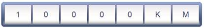

::: {style="DISPLAY: none"}
{#d2h_url_template}{#d2h_package_url style="WIDTH: 0px; DISPLAY: none; HEIGHT: 0px"}
:::

::::: {.d2h_secondary_topic style="PADDING-BOTTOM: 10pt; MARGIN: 0pt; PADDING-LEFT: 0pt; PADDING-RIGHT: 0pt; PADDING-TOP: 0pt"}
#### Through RollingGaugeModel : {#through-rollinggaugemodel style="tab-stops: 0pt"}

 

Step 1:

View:

 

Add the below code in your aspx file.

 

+-----------------------------------------------------------------------------------------------------------------------------------------------------------------------------------------------------------------------------------------------------------+
| **[View\[ASPX\]]{style="FONT-FAMILY: 'Courier New'"}**                                                                                                                                                                                                    |
|                                                                                                                                                                                                                                                           |
| [\<%]{style="FONT-FAMILY: 'Courier New'; BACKGROUND: yellow"}[\--Rendering the Rolling Gauge\--]{style="FONT-FAMILY: 'Courier New'; COLOR: darkgreen"}[%\>]{style="FONT-FAMILY: 'Courier New'; BACKGROUND: yellow"}[]{style="FONT-FAMILY: 'Courier New'"} |
|                                                                                                                                                                                                                                                           |
| []{style="FONT-FAMILY: 'Courier New'"}                                                                                                                                                                                                                    |
|                                                                                                                                                                                                                                                           |
| [     [\<%]{style="BACKGROUND: yellow"}[=]{style="COLOR: blue"}Html.Syncfusion().RollingGauge([\"Gauge\"]{style="COLOR: #a31515"}, [\"GaugeModel\"]{style="COLOR: #a31515"})[%\>]{style="BACKGROUND: yellow"}]{style="FONT-FAMILY: 'Courier New'"}        |
+-----------------------------------------------------------------------------------------------------------------------------------------------------------------------------------------------------------------------------------------------------------+

 

+-----------------------------------------------------------------------------------------------------------------------------------------------------------------------------------------------------------------------------------------------------------------------------------------------------------------------------------------------+
| **[View\[cshtml\]]{style="FONT-FAMILY: 'Courier New'"}**                                                                                                                                                                                                                                                                                      |
|                                                                                                                                                                                                                                                                                                                                               |
| [@\*]{style="FONT-FAMILY: 'Courier New'; BACKGROUND: yellow"}[\--Rendering the Rolling Gauge\--]{style="FONT-FAMILY: 'Courier New'; COLOR: darkgreen"}[\*@]{style="FONT-FAMILY: 'Courier New'; BACKGROUND: yellow"}[]{style="FONT-FAMILY: 'Courier New'"}                                                                                     |
|                                                                                                                                                                                                                                                                                                                                               |
| []{style="FONT-FAMILY: 'Courier New'"}                                                                                                                                                                                                                                                                                                        |
|                                                                                                                                                                                                                                                                                                                                               |
| [     ]{style="FONT-FAMILY: 'Courier New'"}[@]{style="FONT-FAMILY: Consolas; BACKGROUND: yellow; FONT-SIZE: 9.5pt"}[Html.Syncfusion().RollingGauge([\"Gauge\"]{style="COLOR: #a31515"}, [\"GaugeModel\"]{style="COLOR: #a31515"})]{style="FONT-FAMILY: 'Courier New'"}[]{style="FONT-FAMILY: Consolas; BACKGROUND: yellow; FONT-SIZE: 9.5pt"} |
|                                                                                                                                                                                                                                                                                                                                               |
| []{style="FONT-FAMILY: 'Courier New'"}                                                                                                                                                                                                                                                                                                        |
+-----------------------------------------------------------------------------------------------------------------------------------------------------------------------------------------------------------------------------------------------------------------------------------------------------------------------------------------------+

**[]{style="FONT-FAMILY: 'Calibri','sans-serif'"}** 

Step 2:

Controller:[ ]{style="COLOR: blue"}

[]{style="FONT-FAMILY: 'Calibri','sans-serif'; COLOR: blue"} 

Add the below code in the controller.

[]{style="FONT-FAMILY: 'Calibri','sans-serif'"} 

+-----------------------------------------------------------------------------------------------------------------------------------------------------------------------------------+
| []{style="FONT-FAMILY: 'Courier New'"}                                                                                                                                            |
|                                                                                                                                                                                   |
| [public]{style="FONT-FAMILY: 'Courier New'; COLOR: blue"}[ [ActionResult]{style="COLOR: #2b91af"} Index()]{style="FONT-FAMILY: 'Courier New'"}                                    |
|                                                                                                                                                                                   |
| [        {]{style="FONT-FAMILY: 'Courier New'"}                                                                                                                                   |
|                                                                                                                                                                                   |
| [            [//Creating a Rolling Gauge.]{style="COLOR: green"}]{style="FONT-FAMILY: 'Courier New'"}                                                                             |
|                                                                                                                                                                                   |
| [            [RollingGaugeModel]{style="COLOR: #2b91af"} r_Gauge = [new]{style="COLOR: blue"} [RollingGaugeModel]{style="COLOR: #2b91af"}();]{style="FONT-FAMILY: 'Courier New'"} |
|                                                                                                                                                                                   |
| [            [//Specifying the height and width of the gauge.]{style="COLOR: green"}]{style="FONT-FAMILY: 'Courier New'"}                                                         |
|                                                                                                                                                                                   |
| [            r_Gauge.Height = 55;]{style="FONT-FAMILY: 'Courier New'"}                                                                                                            |
|                                                                                                                                                                                   |
| [            r_Gauge.Width = 500;]{style="FONT-FAMILY: 'Courier New'"}                                                                                                            |
|                                                                                                                                                                                   |
| [            [//Setting the segment count value.]{style="COLOR: green"}]{style="FONT-FAMILY: 'Courier New'"}                                                                      |
|                                                                                                                                                                                   |
| [            r_Gauge.SegmentCount = 5;]{style="FONT-FAMILY: 'Courier New'"}                                                                                                       |
|                                                                                                                                                                                   |
| [            [//Specifying the value for the gauge.]{style="COLOR: green"}]{style="FONT-FAMILY: 'Courier New'"}                                                                   |
|                                                                                                                                                                                   |
| [            r_Gauge.Value = [\"10000\"]{style="COLOR: #a31515"};]{style="FONT-FAMILY: 'Courier New'"}                                                                            |
|                                                                                                                                                                                   |
| [            [//Setting the font-size.]{style="COLOR: green"}]{style="FONT-FAMILY: 'Courier New'"}                                                                                |
|                                                                                                                                                                                   |
| [            r_Gauge.FontSize = 20;]{style="FONT-FAMILY: 'Courier New'"}                                                                                                          |
|                                                                                                                                                                                   |
| [            [//Setting the border width for the segments.]{style="COLOR: green"}]{style="FONT-FAMILY: 'Courier New'"}                                                            |
|                                                                                                                                                                                   |
| [            r_Gauge.SegmentBorderWidth = 1;]{style="FONT-FAMILY: 'Courier New'"}                                                                                                 |
|                                                                                                                                                                                   |
| [            [//Specifying the space between the segments.]{style="COLOR: green"}]{style="FONT-FAMILY: 'Courier New'"}                                                            |
|                                                                                                                                                                                   |
| [            r_Gauge.SpaceBetWeenSegment = 2;]{style="FONT-FAMILY: 'Courier New'"}                                                                                                |
|                                                                                                                                                                                   |
| [            [//Setting the skins for the gauge.]{style="COLOR: green"}]{style="FONT-FAMILY: 'Courier New'"}                                                                      |
|                                                                                                                                                                                   |
| [            r_Gauge.GaugeSkins = [GaugeSkins]{style="COLOR: #2b91af"}.VS2010;]{style="FONT-FAMILY: 'Courier New'"}                                                               |
|                                                                                                                                                                                   |
| [            [//Setting RadiusX and RadiusY values to get the rounded corner.]{style="COLOR: green"}]{style="FONT-FAMILY: 'Courier New'"}                                         |
|                                                                                                                                                                                   |
| [            r_Gauge.RadiusX = 8;]{style="FONT-FAMILY: 'Courier New'"}                                                                                                            |
|                                                                                                                                                                                   |
| [            r_Gauge.RadiusY = 8;]{style="FONT-FAMILY: 'Courier New'"}                                                                                                            |
|                                                                                                                                                                                   |
| [            [//Setting the unit value.]{style="COLOR: green"}]{style="FONT-FAMILY: 'Courier New'"}                                                                               |
|                                                                                                                                                                                   |
| [            r_Gauge.Unit = [\"KM\"]{style="COLOR: #a31515"};]{style="FONT-FAMILY: 'Courier New'"}                                                                                |
|                                                                                                                                                                                   |
| [            [//Passing the gauge model to the view.]{style="COLOR: green"}]{style="FONT-FAMILY: 'Courier New'"}                                                                  |
|                                                                                                                                                                                   |
| [            ViewData\[[\"GaugeModel\"]{style="COLOR: #a31515"}\] = r_Gauge;]{style="FONT-FAMILY: 'Courier New'"}                                                                 |
|                                                                                                                                                                                   |
| [            [return]{style="COLOR: blue"} View();]{style="FONT-FAMILY: 'Courier New'"}                                                                                           |
|                                                                                                                                                                                   |
| [        }]{style="FONT-FAMILY: 'Courier New'"}                                                                                                                                   |
+-----------------------------------------------------------------------------------------------------------------------------------------------------------------------------------+

[]{style="FONT-FAMILY: 'Calibri','sans-serif'"} 

Step 3:

[]{style="FONT-FAMILY: 'Calibri','sans-serif'"} 

Run the Code. You will get the below output.

 

{border="0"}

Figure 140: Rolling Gauge**[]{style="FONT-FAMILY: 'Calibri','sans-serif'"}**

[                                      ]{style="FONT-FAMILY: 'Calibri','sans-serif'"}

A sample which [demonstrates a Rolling ]{style="COLOR: black"}Gauge control can be downloaded from the below mentioned link.

[]{style="FONT-FAMILY: 'Calibri','sans-serif'"} 

::: {style="BORDER-BOTTOM: windowtext 1pt solid; BORDER-LEFT: medium none; PADDING-BOTTOM: 1pt; MARGIN-TOP: 9pt; PADDING-LEFT: 0pt; PADDING-RIGHT: 0pt; MARGIN-BOTTOM: 9pt; BORDER-TOP: windowtext 1pt solid; BORDER-RIGHT: medium none; PADDING-TOP: 1pt"}
[ASPX Application](http://files2.syncfusion.com/support/ASP%20MVC/UG/Gauge/Rolling%20Gauge%20(ASPX).zip)

[Razor Application](http://files2.syncfusion.com/support/ASP%20MVC/UG/Gauge/Rolling%20Gauge%20(Razor).zip)
:::

[[]{style="TEXT-DECORATION: none"}]{.UGHyperlink} 

::: {style="BORDER-BOTTOM: windowtext 1pt solid; BORDER-LEFT: medium none; PADDING-BOTTOM: 1pt; MARGIN-TOP: 9pt; PADDING-LEFT: 0pt; PADDING-RIGHT: 0pt; MARGIN-BOTTOM: 9pt; BORDER-TOP: windowtext 1pt solid; BORDER-RIGHT: medium none; PADDING-TOP: 1pt"}
{border="0"} Note: The version number for the assemblies has been set to 9.4.0.62 in the Web.config file of the attached sample
:::

**[]{style="FONT-FAMILY: 'Calibri','sans-serif'"}** 

[]{#related-topics}
:::::
