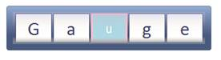

::: {style="DISPLAY: none"}
{#d2h_url_template}{#d2h_package_url style="WIDTH: 0px; DISPLAY: none; HEIGHT: 0px"}
:::

::: {.d2h_secondary_topic style="PADDING-BOTTOM: 10pt; MARGIN: 0pt; PADDING-LEFT: 0pt; PADDING-RIGHT: 0pt; PADDING-TOP: 0pt"}
##### Through RollingGaugeModel {#through-rollinggaugemodel style="tab-stops: 0pt"}

**[]{style="FONT-FAMILY: 'Calibri','sans-serif'"}** 

Step 1:

View:

Add the below code in your aspx file.

 

+-----------------------------------------------------------------------------------------------------------------------------------------------------------------------------------------------------------------------------------------------------------+
| [View\[ASPX\]]{style="FONT-FAMILY: 'Courier New'"}                                                                                                                                                                                                        |
|                                                                                                                                                                                                                                                           |
| [\<%]{style="FONT-FAMILY: 'Courier New'; BACKGROUND: yellow"}[\--Rendering the rolling gauge\--]{style="FONT-FAMILY: 'Courier New'; COLOR: darkgreen"}[%\>]{style="FONT-FAMILY: 'Courier New'; BACKGROUND: yellow"}[]{style="FONT-FAMILY: 'Courier New'"} |
|                                                                                                                                                                                                                                                           |
| []{style="FONT-FAMILY: 'Courier New'"}                                                                                                                                                                                                                    |
|                                                                                                                                                                                                                                                           |
| [  [\<%]{style="BACKGROUND: yellow"}[=]{style="COLOR: blue"}Html.Syncfusion().RollingGauge([\"Gauge\"]{style="COLOR: #a31515"}, [\"GaugeModel\"]{style="COLOR: #a31515"})[%\>]{style="BACKGROUND: yellow"}]{style="FONT-FAMILY: 'Courier New'"}           |
+-----------------------------------------------------------------------------------------------------------------------------------------------------------------------------------------------------------------------------------------------------------+

 

+--------------------------------------------------------------------------------------------------------------------------------------------------------------------------------------------------------------------------------------------------------------------------------------------------------------+
| [View\[cshtml\]]{style="FONT-FAMILY: 'Courier New'"}                                                                                                                                                                                                                                                         |
|                                                                                                                                                                                                                                                                                                              |
| [@\*]{style="FONT-FAMILY: 'Courier New'; BACKGROUND: yellow"}[\--Rendering the rolling gauge\--]{style="FONT-FAMILY: 'Courier New'; COLOR: darkgreen"}[\*@]{style="FONT-FAMILY: 'Courier New'; BACKGROUND: yellow"}[]{style="FONT-FAMILY: 'Courier New'"}                                                    |
|                                                                                                                                                                                                                                                                                                              |
| [@]{style="FONT-FAMILY: Consolas; BACKGROUND: yellow; FONT-SIZE: 9.5pt"}[Html.Syncfusion().RollingGauge([\"Gauge\"]{style="COLOR: #a31515"}, [\"GaugeModel\"]{style="COLOR: #a31515"}]{style="FONT-FAMILY: 'Courier New'"}[)[]{style="BACKGROUND: yellow"}]{style="FONT-FAMILY: Consolas; FONT-SIZE: 9.5pt"} |
|                                                                                                                                                                                                                                                                                                              |
| []{style="FONT-FAMILY: 'Courier New'"}                                                                                                                                                                                                                                                                       |
+--------------------------------------------------------------------------------------------------------------------------------------------------------------------------------------------------------------------------------------------------------------------------------------------------------------+

**[]{style="FONT-FAMILY: 'Calibri','sans-serif'"}** 

**[]{style="FONT-FAMILY: 'Calibri','sans-serif'"}** 

Step 2:

Controller:

 

The segments of the rolling gauge can be customized using its **SegmentBorderWidth**, **SpaceBetWeenSegment**,etc. If you set these properties, it will be applied for all segments. But if you want to customize the particular segments, then this can be done initializing the **RollingCharacter** class and setting its **CharacterIndex** property.

 

In the below code, CharacterIndex is specified as 2. Then the third segment will be customized. The specified segments can be customized through **RollingCharacter** class properties. 

 

You can customize the background and border color for the specified segments using the **BackgroundColor** and **BorderColor** properties.  The font color, font family and font size can be customized using its **FontColor, FontSize** and **FontFamily** properties. The value for the specified segment can be given by using its **Value** property.

 

You can specify the index of the character to be customized using the RollingCharacter class's property named CharacterIndex  and you can customize the specified segment by using its other properties

Add the below code in your controller.

 

+---------------------------------------------------------------------------------------------------------------------------------------------------------------------------------------+
| []{style="FONT-FAMILY: 'Courier New'"}                                                                                                                                                |
|                                                                                                                                                                                       |
| [public]{style="FONT-FAMILY: 'Courier New'; COLOR: blue"}[ [ActionResult]{style="COLOR: #2b91af"} Index()]{style="FONT-FAMILY: 'Courier New'"}                                        |
|                                                                                                                                                                                       |
| [        {]{style="FONT-FAMILY: 'Courier New'"}                                                                                                                                       |
|                                                                                                                                                                                       |
| [           [RollingGaugeModel]{style="COLOR: #2b91af"} roll_Gauge = [new]{style="COLOR: blue"} [RollingGaugeModel]{style="COLOR: #2b91af"}();]{style="FONT-FAMILY: 'Courier New'"}   |
|                                                                                                                                                                                       |
| [            roll_Gauge.Height = 50;]{style="FONT-FAMILY: 'Courier New'"}                                                                                                             |
|                                                                                                                                                                                       |
| [            roll_Gauge.Width = 300;]{style="FONT-FAMILY: 'Courier New'"}                                                                                                             |
|                                                                                                                                                                                       |
| [            roll_Gauge.GaugeSkins = [GaugeSkins]{style="COLOR: #2b91af"}.VS2010;]{style="FONT-FAMILY: 'Courier New'"}                                                                |
|                                                                                                                                                                                       |
| [            roll_Gauge.FontSize = 30;]{style="FONT-FAMILY: 'Courier New'"}                                                                                                           |
|                                                                                                                                                                                       |
| [            [//Setting the space between each segments.]{style="COLOR: green"}]{style="FONT-FAMILY: 'Courier New'"}                                                                  |
|                                                                                                                                                                                       |
| [            roll_Gauge.SpaceBetWeenSegment = 2;]{style="FONT-FAMILY: 'Courier New'"}                                                                                                 |
|                                                                                                                                                                                       |
| [            [//Setting the segment count.]{style="COLOR: green"}]{style="FONT-FAMILY: 'Courier New'"}                                                                                |
|                                                                                                                                                                                       |
| [            roll_Gauge.SegmentCount = 5;]{style="FONT-FAMILY: 'Courier New'"}                                                                                                        |
|                                                                                                                                                                                       |
| [            roll_Gauge.Value = [\"Gauge\"]{style="COLOR: #a31515"};]{style="FONT-FAMILY: 'Courier New'"}                                                                             |
|                                                                                                                                                                                       |
| [            roll_Gauge.BorderWidth = 10;]{style="FONT-FAMILY: 'Courier New'"}                                                                                                        |
|                                                                                                                                                                                       |
| [            [//Setting the border width for the segments.]{style="COLOR: green"}]{style="FONT-FAMILY: 'Courier New'"}                                                                |
|                                                                                                                                                                                       |
| [            roll_Gauge.SegmentBorderWidth = 1;]{style="FONT-FAMILY: 'Courier New'"}                                                                                                  |
|                                                                                                                                                                                       |
| []{style="FONT-FAMILY: 'Courier New'"}                                                                                                                                                |
|                                                                                                                                                                                       |
| [            [//Using the RollingCharacter class, we can customize the particular segments by specifying the index value.]{style="COLOR: green"}]{style="FONT-FAMILY: 'Courier New'"} |
|                                                                                                                                                                                       |
| [            [RollingCharacter]{style="COLOR: #2b91af"} seg1 = [new]{style="COLOR: blue"} [RollingCharacter]{style="COLOR: #2b91af"}();]{style="FONT-FAMILY: 'Courier New'"}          |
|                                                                                                                                                                                       |
| [            [//Setting the character index.]{style="COLOR: green"}]{style="FONT-FAMILY: 'Courier New'"}                                                                              |
|                                                                                                                                                                                       |
| [            seg1.CharacterIndex = 2;]{style="FONT-FAMILY: 'Courier New'"}                                                                                                            |
|                                                                                                                                                                                       |
| [            [//Setting the value for the segment specified by the CharacterIndex property.]{style="COLOR: green"}]{style="FONT-FAMILY: 'Courier New'"}                               |
|                                                                                                                                                                                       |
| [            seg1.Value = [\'u\']{style="COLOR: #a31515"};]{style="FONT-FAMILY: 'Courier New'"}                                                                                       |
|                                                                                                                                                                                       |
| [            [//Setting border and background color for the segment specified by the CharacterIndex property.]{style="COLOR: green"}]{style="FONT-FAMILY: 'Courier New'"}             |
|                                                                                                                                                                                       |
| [            seg1.BackgroundColor = System.Drawing.[Color]{style="COLOR: #2b91af"}.LightBlue;]{style="FONT-FAMILY: 'Courier New'"}                                                    |
|                                                                                                                                                                                       |
| [            seg1.BorderColor = System.Drawing.[Color]{style="COLOR: #2b91af"}.Pink;]{style="FONT-FAMILY: 'Courier New'"}                                                             |
|                                                                                                                                                                                       |
| [            [//setting the border width for the segment specified by the CharacterIndex property.]{style="COLOR: green"}]{style="FONT-FAMILY: 'Courier New'"}                        |
|                                                                                                                                                                                       |
| [            seg1.BorderWidth = 3;]{style="FONT-FAMILY: 'Courier New'"}                                                                                                               |
|                                                                                                                                                                                       |
| [            [//Setting the font size for the segment specified by the CharacterIndex property.]{style="COLOR: green"}]{style="FONT-FAMILY: 'Courier New'"}                           |
|                                                                                                                                                                                       |
| [            seg1.FontSize = 20;]{style="FONT-FAMILY: 'Courier New'"}                                                                                                                 |
|                                                                                                                                                                                       |
| [            [//Setting the font color for the segment specified by the CharacterIndex property.]{style="COLOR: green"}]{style="FONT-FAMILY: 'Courier New'"}                          |
|                                                                                                                                                                                       |
| [            seg1.FontColor = System.Drawing.[Color]{style="COLOR: #2b91af"}.White;]{style="FONT-FAMILY: 'Courier New'"}                                                              |
|                                                                                                                                                                                       |
| [            [//Adding the rolling character to be customized in the segments collection.]{style="COLOR: green"}]{style="FONT-FAMILY: 'Courier New'"}                                 |
|                                                                                                                                                                                       |
| [            roll_Gauge.Segments.Add(seg1);]{style="FONT-FAMILY: 'Courier New'"}                                                                                                      |
|                                                                                                                                                                                       |
| [            ViewData\[[\"GaugeModel\"]{style="COLOR: #a31515"}\] = roll_Gauge;]{style="FONT-FAMILY: 'Courier New'"}                                                                  |
|                                                                                                                                                                                       |
| [            [return]{style="COLOR: blue"} View();]{style="FONT-FAMILY: 'Courier New'"}                                                                                               |
|                                                                                                                                                                                       |
| []{style="FONT-FAMILY: 'Courier New'"}                                                                                                                                                |
|                                                                                                                                                                                       |
| [        }]{style="FONT-FAMILY: 'Courier New'"}                                                                                                                                       |
+---------------------------------------------------------------------------------------------------------------------------------------------------------------------------------------+

[]{style="FONT-FAMILY: 'Calibri','sans-serif'"} 

Step 3:

Run the code. You will get the below output.

 

{border="0"}

Figure 160: Rolling Gauge-Segment Customization

**[]{style="FONT-FAMILY: 'Calibri','sans-serif'"}** 

[]{#related-topics}
:::
