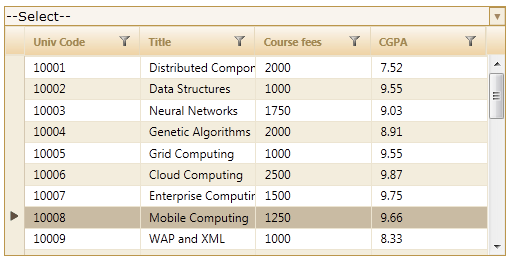
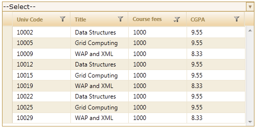

::: {style="DISPLAY: none"}
{#d2h_url_template}{#d2h_package_url style="WIDTH: 0px; DISPLAY: none; HEIGHT: 0px"}
:::

::: {.d2h_secondary_topic style="PADDING-BOTTOM: 10pt; MARGIN: 0pt; PADDING-LEFT: 0pt; PADDING-RIGHT: 0pt; PADDING-TOP: 0pt"}
##### Through the Server Mode {#through-the-server-mode style="tab-stops: 0pt"}

The filtering technique can be incorporated into the MultiColumnDropDown control in MVC by the following two ways using the server mode:

 

Through View

+------------------------------------------------------------------------------------------------------------------------------------------------------------------------------------------------------------------------------+
| **[\[ASPX\]]{style="FONT-FAMILY: 'Courier New'"}**[]{style="FONT-FAMILY: 'Courier New'"}                                                                                                                                     |
|                                                                                                                                                                                                                              |
| []{style="FONT-FAMILY: 'Times New Roman','serif'"}                                                                                                                                                                           |
|                                                                                                                                                                                                                              |
| [\<[%]{style="BACKGROUND: yellow"}[=]{style="COLOR: blue"}Html.Syncfusion().MultiColumnDropDown\<[Student]{style="COLOR: #2b91af"}\>([\"MultiColumnDropDown\"]{style="COLOR: #a31515"})]{style="FONT-FAMILY: 'Courier New'"} |
|                                                                                                                                                                                                                              |
| [.Datasource(([IEnumerable]{style="COLOR: #2b91af"}) ViewData\[[\"data\"]{style="COLOR: #a31515"}\])]{style="FONT-FAMILY: 'Courier New'"}                                                                                    |
|                                                                                                                                                                                                                              |
| [.DisplayExpression([new]{style="COLOR: blue"} [int]{style="COLOR: blue"}\[\] {2, 3, 5})]{style="FONT-FAMILY: 'Courier New'"}                                                                                                |
|                                                                                                                                                                                                                              |
| [.Width(500)]{style="FONT-FAMILY: 'Courier New'"}                                                                                                                                                                            |
|                                                                                                                                                                                                                              |
| **[.AllowFiltering(]{style="FONT-FAMILY: 'Courier New'"}**[true]{style="FONT-FAMILY: 'Courier New'; COLOR: blue"}**[)]{style="FONT-FAMILY: 'Courier New'"}**[]{style="FONT-FAMILY: 'Courier New'"}                           |
|                                                                                                                                                                                                                              |
| [.Text([\"\--Select\--\"]{style="COLOR: #a31515"})]{style="FONT-FAMILY: 'Courier New'"}                                                                                                                                      |
|                                                                                                                                                                                                                              |
| [%]{style="FONT-FAMILY: 'Courier New'; BACKGROUND: yellow"}[\>]{style="FONT-FAMILY: 'Courier New'"}                                                                                                                          |
|                                                                                                                                                                                                                              |
| []{style="FONT-FAMILY: 'Times New Roman','serif'"}                                                                                                                                                                           |
+------------------------------------------------------------------------------------------------------------------------------------------------------------------------------------------------------------------------------+

[]{style="FONT-FAMILY: 'Times New Roman','serif'; FONT-SIZE: 12pt"} 

 

+--------------------------------------------------------------------------------------------------------------------------------------------------------------------------------------------------------------------------------------------------------------------------------------------------+
| **[\[Razor\]]{style="FONT-FAMILY: 'Courier New'"}**                                                                                                                                                                                                                                              |
|                                                                                                                                                                                                                                                                                                  |
| **[]{style="FONT-FAMILY: 'Courier New'"}**                                                                                                                                                                                                                                                       |
|                                                                                                                                                                                                                                                                                                  |
| [  [@(]{style="BACKGROUND: yellow"}[new]{style="COLOR: blue"} [HtmlString]{style="COLOR: #2b91af"}(Html.Syncfusion().MultiColumnDropDown\<[Student]{style="COLOR: #2b91af"}\>([\"Multicolumndropdown\"]{style="COLOR: #a31515"}) []{style="COLOR: #a31515"}]{style="FONT-FAMILY: 'Courier New'"} |
|                                                                                                                                                                                                                                                                                                  |
| [.Datasource(([IEnumerable]{style="COLOR: #2b91af"}) ViewData\[[\"data\"]{style="COLOR: #a31515"}\])]{style="FONT-FAMILY: 'Courier New'"}                                                                                                                                                        |
|                                                                                                                                                                                                                                                                                                  |
| [.DisplayExpression([new]{style="COLOR: blue"} [int]{style="COLOR: blue"}\[\] {2, 3, 5})]{style="FONT-FAMILY: 'Courier New'"}                                                                                                                                                                    |
|                                                                                                                                                                                                                                                                                                  |
| [.Width(500)]{style="FONT-FAMILY: 'Courier New'"}                                                                                                                                                                                                                                                |
|                                                                                                                                                                                                                                                                                                  |
| **[.AllowFiltering(]{style="FONT-FAMILY: 'Courier New'"}**[true]{style="FONT-FAMILY: 'Courier New'; COLOR: blue"}**[)]{style="FONT-FAMILY: 'Courier New'"}**[]{style="FONT-FAMILY: 'Courier New'"}                                                                                               |
|                                                                                                                                                                                                                                                                                                  |
| [              .Text([\"\--Select\--\"]{style="COLOR: #a31515"})]{style="FONT-FAMILY: 'Courier New'"}                                                                                                                                                                                            |
|                                                                                                                                                                                                                                                                                                  |
| []{style="FONT-FAMILY: 'Courier New'"}                                                                                                                                                                                                                                                           |
|                                                                                                                                                                                                                                                                                                  |
| [)[)]{style="BACKGROUND: yellow"}]{style="FONT-FAMILY: 'Courier New'"}                                                                                                                                                                                                                           |
|                                                                                                                                                                                                                                                                                                  |
| **[]{style="FONT-FAMILY: 'Courier New'"}**                                                                                                                                                                                                                                                       |
+--------------------------------------------------------------------------------------------------------------------------------------------------------------------------------------------------------------------------------------------------------------------------------------------------+

 

1.   Set its data source and render the View.

[]{style="FONT-FAMILY: 'Times New Roman','serif'; FONT-SIZE: 12pt"} 

+---------------------------------------------------------------------------------------------------------------------------------------------------------------------------------------------------------------------------------------------------------------------------------------------------------------------------------+
| **[Controller]{style="FONT-FAMILY: 'Courier New'; FONT-SIZE: 9pt"}**[]{style="FONT-FAMILY: 'Times New Roman','serif'; FONT-SIZE: 9pt"}                                                                                                                                                                                          |
|                                                                                                                                                                                                                                                                                                                                 |
| [ [///]{style="COLOR: gray"}[ ]{style="COLOR: green"}[\<summary\>]{style="COLOR: gray"}]{style="FONT-FAMILY: 'Courier New'; FONT-SIZE: 9pt"}[]{style="FONT-FAMILY: 'Times New Roman','serif'; FONT-SIZE: 9pt"}                                                                                                                  |
|                                                                                                                                                                                                                                                                                                                                 |
| [       [///]{style="COLOR: gray"}[ Used for rendering the MultiColumnDropDown initially.]{style="COLOR: green"}]{style="FONT-FAMILY: 'Courier New'; FONT-SIZE: 9pt"}[]{style="FONT-FAMILY: 'Times New Roman','serif'; FONT-SIZE: 9pt"}                                                                                         |
|                                                                                                                                                                                                                                                                                                                                 |
| [       [///]{style="COLOR: gray"}[ ]{style="COLOR: green"}[\</summary\>]{style="COLOR: gray"}]{style="FONT-FAMILY: 'Courier New'; FONT-SIZE: 9pt"}[]{style="FONT-FAMILY: 'Times New Roman','serif'; FONT-SIZE: 9pt"}                                                                                                           |
|                                                                                                                                                                                                                                                                                                                                 |
| [       [///]{style="COLOR: gray"}[ ]{style="COLOR: green"}[\<returns\>]{style="COLOR: gray"}[View page; it displays the  MultiColumnDropDown.]{style="COLOR: green"}[\</returns\>]{style="COLOR: gray"}]{style="FONT-FAMILY: 'Courier New'; FONT-SIZE: 9pt"}[]{style="FONT-FAMILY: 'Times New Roman','serif'; FONT-SIZE: 9pt"} |
|                                                                                                                                                                                                                                                                                                                                 |
| [       [public]{style="COLOR: blue"} [ActionResult]{style="COLOR: #2b91af"} Index()]{style="FONT-FAMILY: 'Courier New'; FONT-SIZE: 9pt"}[]{style="FONT-FAMILY: 'Times New Roman','serif'; FONT-SIZE: 9pt"}                                                                                                                     |
|                                                                                                                                                                                                                                                                                                                                 |
| [       {]{style="FONT-FAMILY: 'Courier New'; FONT-SIZE: 9pt"}                                                                                                                                                                                                                                                                  |
|                                                                                                                                                                                                                                                                                                                                 |
| [            [var]{style="COLOR: blue"} Data = [new]{style="COLOR: blue"} [StudentDataContext]{style="COLOR: #2b91af"}().AutoFormatStudent.Take(200);]{style="FONT-FAMILY: 'Courier New'; FONT-SIZE: 9pt"}[]{style="FONT-FAMILY: 'Times New Roman','serif'; FONT-SIZE: 9pt"}                                                    |
|                                                                                                                                                                                                                                                                                                                                 |
| [            ViewData\[[\"data\"]{style="COLOR: #a31515"}\] = Data;]{style="FONT-FAMILY: 'Courier New'; FONT-SIZE: 9pt"}[]{style="FONT-FAMILY: 'Times New Roman','serif'; FONT-SIZE: 9pt"}                                                                                                                                      |
|                                                                                                                                                                                                                                                                                                                                 |
| [            [return]{style="COLOR: blue"} View(Data);   ]{style="FONT-FAMILY: 'Courier New'; FONT-SIZE: 9pt"}[]{style="FONT-FAMILY: 'Times New Roman','serif'; FONT-SIZE: 9pt"}                                                                                                                                                |
|                                                                                                                                                                                                                                                                                                                                 |
| [       }]{style="FONT-FAMILY: 'Courier New'; FONT-SIZE: 9pt"}[]{style="FONT-FAMILY: 'Times New Roman','serif'; FONT-SIZE: 12pt"}                                                                                                                                                                                               |
+---------------------------------------------------------------------------------------------------------------------------------------------------------------------------------------------------------------------------------------------------------------------------------------------------------------------------------+

[]{style="FONT-FAMILY: 'Times New Roman','serif'; FONT-SIZE: 12pt"} 

2.   In order to work with filtering actions, create a **Post** method for **Index** actions and bind the data source to **MultiColumnDropDown** as in the following code:

[]{style="FONT-FAMILY: 'Times New Roman','serif'; FONT-SIZE: 12pt"} 

+----------------------------------------------------------------------------------------------------------------------------------------------------------------------------------------------------------------------------------------------------------------------------------+
| **[Controller]{style="FONT-FAMILY: 'Courier New'; FONT-SIZE: 9pt"}**[]{style="FONT-FAMILY: 'Times New Roman','serif'; FONT-SIZE: 9pt"}                                                                                                                                           |
|                                                                                                                                                                                                                                                                                  |
| []{style="FONT-FAMILY: 'Times New Roman','serif'; FONT-SIZE: 9pt"}                                                                                                                                                                                                               |
|                                                                                                                                                                                                                                                                                  |
| [        \[[AcceptVerbs]{style="COLOR: #2b91af"}([HttpVerbs]{style="COLOR: #2b91af"}.Post)\]]{style="FONT-FAMILY: 'Courier New'; FONT-SIZE: 9pt"}[]{style="FONT-FAMILY: 'Times New Roman','serif'; FONT-SIZE: 9pt"}                                                              |
|                                                                                                                                                                                                                                                                                  |
| [        [public]{style="COLOR: blue"} [ActionResult]{style="COLOR: #2b91af"} Index ([PagingParams]{style="COLOR: #2b91af"} args)]{style="FONT-FAMILY: 'Courier New'; FONT-SIZE: 9pt"}[]{style="FONT-FAMILY: 'Times New Roman','serif'; FONT-SIZE: 9pt"}                         |
|                                                                                                                                                                                                                                                                                  |
| [        {]{style="FONT-FAMILY: 'Courier New'; FONT-SIZE: 9pt"}[]{style="FONT-FAMILY: 'Times New Roman','serif'; FONT-SIZE: 9pt"}                                                                                                                                                |
|                                                                                                                                                                                                                                                                                  |
| [       [IEnumerable]{style="COLOR: #2b91af"} data =[new ]{style="COLOR: blue"}[StudentDataContext]{style="COLOR: #2b91af"}().AutoFormatStudent.Take(20);]{style="FONT-FAMILY: 'Courier New'; FONT-SIZE: 9pt"}[]{style="FONT-FAMILY: 'Times New Roman','serif'; FONT-SIZE: 9pt"} |
|                                                                                                                                                                                                                                                                                  |
| [       [return]{style="COLOR: blue"} data.GridActions\<[Student]{style="COLOR: #2b91af"}\>();]{style="FONT-FAMILY: 'Courier New'; FONT-SIZE: 9pt"}[]{style="FONT-FAMILY: 'Times New Roman','serif'; FONT-SIZE: 9pt"}                                                            |
|                                                                                                                                                                                                                                                                                  |
| [        }]{style="FONT-FAMILY: 'Courier New'; FONT-SIZE: 9pt"}[]{style="FONT-FAMILY: 'Times New Roman','serif'; FONT-SIZE: 12pt"}                                                                                                                                               |
+----------------------------------------------------------------------------------------------------------------------------------------------------------------------------------------------------------------------------------------------------------------------------------+

[]{style="FONT-FAMILY: 'Times New Roman','serif'; FONT-SIZE: 12pt"} 

3.   Run the application. The MultiColumnDropDown control will appear as shown below[:]{style="FONT-FAMILY: 'Times New Roman','serif'; FONT-SIZE: 12pt"}

[]{style="FONT-FAMILY: 'Times New Roman','serif'; FONT-SIZE: 12pt"} 

[ ]{style="FONT-FAMILY: 'Times New Roman','serif'; FONT-SIZE: 12pt"}{border="0"}

Figure 330: Filtering Enabled MultiColumnDropDown Control**[]{style="FONT-STYLE: normal"}**

 

{border="0"}

Figure 331: "Course Fees" Column Filtered**[]{style="FONT-STYLE: normal"}**

 

Through MultiColumnDropDownModel

To filter in server mode using **MultiColumnDropDownModel**:

1.   [Create a model in the application](file:///D:\UG%20source%20files\ui\asp.net%20mvc\grid\Documents\grid.docx#_Adding_a_Model)

2.   Create a MultiColumnDropDown control in the view.

 

+--------------------------------------------------------------------------------------------------------------------------------------------------------------------------------------------------------------------------------------------------------------------------------------------------------------------------------------------------------+
| **[\[ASPX\]]{style="FONT-FAMILY: 'Courier New'"}**                                                                                                                                                                                                                                                                                                     |
|                                                                                                                                                                                                                                                                                                                                                        |
| [\<%[=]{style="COLOR: blue"}Html.Syncfusion().MultiColumnDropDown\<[Student]{style="COLOR: #2b91af"}\>([\"Multidropdown\"]{style="COLOR: #a31515"},([MultiColumnDropDownModel]{style="COLOR: #2b91af"}) ViewData\[[\"dropdown\"]{style="COLOR: #a31515"}\]) %\>]{style="FONT-FAMILY: 'Courier New'"}[]{style="FONT-FAMILY: 'Times New Roman','serif'"} |
+--------------------------------------------------------------------------------------------------------------------------------------------------------------------------------------------------------------------------------------------------------------------------------------------------------------------------------------------------------+

[]{style="FONT-FAMILY: 'Times New Roman','serif'; FONT-SIZE: 12pt"} 

 

+---------------------------------------------------------------------------------------------------------------------------------------------------------------------------------------------------------------------------------------------------------------------------------------------------------------------------------------------------+
| **[\[Razor\]]{style="FONT-FAMILY: 'Courier New'"}**[]{style="FONT-FAMILY: 'Courier New'; BACKGROUND: yellow"}                                                                                                                                                                                                                                     |
|                                                                                                                                                                                                                                                                                                                                                   |
| [@(]{style="FONT-FAMILY: 'Courier New'; BACKGROUND: yellow"}[new ]{style="FONT-FAMILY: 'Courier New'; COLOR: blue"}[HtmlString]{style="FONT-FAMILY: 'Courier New'; COLOR: #2b91af"}[(Html.Syncfusion().MultiColumnDropDown\<[Student]{style="COLOR: #2b91af"}\>([\"Multidropdown\"]{style="COLOR: #a31515"},]{style="FONT-FAMILY: 'Courier New'"} |
|                                                                                                                                                                                                                                                                                                                                                   |
| [([MultiColumnDropDownModel]{style="COLOR: #2b91af"}) ViewData\[[\"dropdown\"]{style="COLOR: #a31515"}\]))[)]{style="BACKGROUND: yellow"}]{style="FONT-FAMILY: 'Courier New'"}                                                                                                                                                                    |
+---------------------------------------------------------------------------------------------------------------------------------------------------------------------------------------------------------------------------------------------------------------------------------------------------------------------------------------------------+

 

3.   Create an instance for **MultiColumnDropDownModel** and assign **Datasource** to the model.

 

+---------------------------------------------------------------------------------------------------------------------------------------------------------------------------------------------------------------------------------------------------+
| **[Controller]{style="FONT-FAMILY: 'Courier New'"}**[]{style="FONT-FAMILY: 'Times New Roman','serif'"}                                                                                                                                            |
|                                                                                                                                                                                                                                                   |
| [// Create instance to MultiColumnDropDownModel and assign properties.]{style="FONT-FAMILY: 'Courier New'; COLOR: green"}[]{style="FONT-FAMILY: 'Times New Roman','serif'"}                                                                       |
|                                                                                                                                                                                                                                                   |
| [            [MultiColumnDropDownModel]{style="COLOR: #2b91af"} dropdown = [new]{style="COLOR: blue"} [MultiColumnDropDownModel]{style="COLOR: #2b91af"}()]{style="FONT-FAMILY: 'Courier New'"}[]{style="FONT-FAMILY: 'Times New Roman','serif'"} |
|                                                                                                                                                                                                                                                   |
| [            {]{style="FONT-FAMILY: 'Courier New'"}[]{style="FONT-FAMILY: 'Times New Roman','serif'"}                                                                                                                                             |
|                                                                                                                                                                                                                                                   |
| [                Datasource = [new]{style="COLOR: blue"} [StudentDataContext]{style="COLOR: #2b91af"}().JSONStudent.Skip(0).Take(30).ToList(),]{style="FONT-FAMILY: 'Courier New'"}[]{style="FONT-FAMILY: 'Times New Roman','serif'"}             |
|                                                                                                                                                                                                                                                   |
| [                Text = [\"\--Select\--\"]{style="COLOR: #a31515"},]{style="FONT-FAMILY: 'Courier New'"}[]{style="FONT-FAMILY: 'Times New Roman','serif'"}                                                                                        |
|                                                                                                                                                                                                                                                   |
| [                DisplayExpression = [new]{style="COLOR: blue"} [int]{style="COLOR: blue"}\[3\] { 2, 3, 5 },]{style="FONT-FAMILY: 'Courier New'"}[]{style="FONT-FAMILY: 'Times New Roman','serif'"}                                               |
|                                                                                                                                                                                                                                                   |
| [                Width = 500]{style="FONT-FAMILY: 'Courier New'"}[]{style="FONT-FAMILY: 'Times New Roman','serif'"}                                                                                                                               |
|                                                                                                                                                                                                                                                   |
| [            };]{style="FONT-FAMILY: 'Courier New'"}[]{style="FONT-FAMILY: 'Times New Roman','serif'"}                                                                                                                                            |
|                                                                                                                                                                                                                                                   |
| []{style="FONT-FAMILY: 'Times New Roman','serif'; FONT-SIZE: 12pt"}                                                                                                                                                                               |
+---------------------------------------------------------------------------------------------------------------------------------------------------------------------------------------------------------------------------------------------------+

 

4.   Enable/disable the filtering feature using the **AllowFiltering** property.

 

+---------------------------------------------------------------------------------------------------------------------------------------------------------------------------------------------------------------------------------------------------+
| **[Controller]{style="FONT-FAMILY: 'Courier New'"}**[]{style="FONT-FAMILY: 'Times New Roman','serif'"}                                                                                                                                            |
|                                                                                                                                                                                                                                                   |
| [// Create instance to MultiColumnDropDownModel and assign properties.]{style="FONT-FAMILY: 'Courier New'; COLOR: green"}[]{style="FONT-FAMILY: 'Times New Roman','serif'"}                                                                       |
|                                                                                                                                                                                                                                                   |
| [            [MultiColumnDropDownModel]{style="COLOR: #2b91af"} dropdown = [new]{style="COLOR: blue"} [MultiColumnDropDownModel]{style="COLOR: #2b91af"}()]{style="FONT-FAMILY: 'Courier New'"}[]{style="FONT-FAMILY: 'Times New Roman','serif'"} |
|                                                                                                                                                                                                                                                   |
| [            {]{style="FONT-FAMILY: 'Courier New'"}[]{style="FONT-FAMILY: 'Times New Roman','serif'"}                                                                                                                                             |
|                                                                                                                                                                                                                                                   |
| [                Datasource = [new]{style="COLOR: blue"} [StudentDataContext]{style="COLOR: #2b91af"}().JSONStudent.Skip(0).Take(30).ToList(),]{style="FONT-FAMILY: 'Courier New'"}[]{style="FONT-FAMILY: 'Times New Roman','serif'"}             |
|                                                                                                                                                                                                                                                   |
| [                Text = [\"\--Select\--\"]{style="COLOR: #a31515"},]{style="FONT-FAMILY: 'Courier New'"}[]{style="FONT-FAMILY: 'Times New Roman','serif'"}                                                                                        |
|                                                                                                                                                                                                                                                   |
| [                DisplayExpression = [new]{style="COLOR: blue"} [int]{style="COLOR: blue"}\[3\] { 2, 3, 5 },]{style="FONT-FAMILY: 'Courier New'"}[]{style="FONT-FAMILY: 'Times New Roman','serif'"}                                               |
|                                                                                                                                                                                                                                                   |
| [                Width = 500,]{style="FONT-FAMILY: 'Courier New'"}[]{style="FONT-FAMILY: 'Times New Roman','serif'"}                                                                                                                              |
|                                                                                                                                                                                                                                                   |
| **[                AllowFiltering = ]{style="FONT-FAMILY: 'Courier New'"}**[true]{style="FONT-FAMILY: 'Courier New'; COLOR: blue"}[]{style="FONT-FAMILY: 'Times New Roman','serif'"}                                                              |
|                                                                                                                                                                                                                                                   |
| [            };]{style="FONT-FAMILY: 'Courier New'"}[]{style="FONT-FAMILY: 'Times New Roman','serif'"}                                                                                                                                            |
|                                                                                                                                                                                                                                                   |
| []{style="FONT-FAMILY: 'Times New Roman','serif'; FONT-SIZE: 12pt"}                                                                                                                                                                               |
+---------------------------------------------------------------------------------------------------------------------------------------------------------------------------------------------------------------------------------------------------+

 

5.   Pass the model to View using **ViewData()**.

[]{style="FONT-FAMILY: 'Times New Roman','serif'; FONT-SIZE: 12pt"} 

+-------------------------------------------------------------------------------------------------------------------------------------------------------------------------------------+
| **[Controller]{style="FONT-FAMILY: 'Courier New'"}**[]{style="FONT-FAMILY: 'Times New Roman','serif'"}                                                                              |
|                                                                                                                                                                                     |
| [// Pass the MultiColumnDropDownModel to the view using ViewData()]{style="FONT-FAMILY: 'Courier New'; COLOR: green"}[]{style="FONT-FAMILY: 'Times New Roman','serif'"}             |
|                                                                                                                                                                                     |
| [            ViewData\[[\"dropdown\"]{style="COLOR: #a31515"}\] = dropdown;]{style="FONT-FAMILY: 'Courier New'"}[]{style="FONT-FAMILY: 'Times New Roman','serif'; FONT-SIZE: 12pt"} |
+-------------------------------------------------------------------------------------------------------------------------------------------------------------------------------------+

[]{style="FONT-FAMILY: 'Times New Roman','serif'; FONT-SIZE: 12pt"} 

6.   In order to work with filtering actions, create a **Post** method for **Index** actions and bind the data source to **MultiColumnDropDown** as shown in the following code.

[]{style="FONT-FAMILY: 'Times New Roman','serif'; FONT-SIZE: 12pt"} 

+--------------------------------------------------------------------------------------------------------------------------------------------------------------------------------------------------------------------------------------------------+
| **[Controller]{style="FONT-FAMILY: 'Courier New'"}**[]{style="FONT-FAMILY: 'Times New Roman','serif'"}                                                                                                                                           |
|                                                                                                                                                                                                                                                  |
| []{style="FONT-FAMILY: 'Times New Roman','serif'"}                                                                                                                                                                                               |
|                                                                                                                                                                                                                                                  |
| [        \[[AcceptVerbs]{style="COLOR: #2b91af"}([HttpVerbs]{style="COLOR: #2b91af"}.Post)\]]{style="FONT-FAMILY: 'Courier New'"}[]{style="FONT-FAMILY: 'Times New Roman','serif'"}                                                              |
|                                                                                                                                                                                                                                                  |
| [        [public]{style="COLOR: blue"} [ActionResult]{style="COLOR: #2b91af"} Index ([PagingParams]{style="COLOR: #2b91af"} args)]{style="FONT-FAMILY: 'Courier New'"}[]{style="FONT-FAMILY: 'Times New Roman','serif'"}                         |
|                                                                                                                                                                                                                                                  |
| [        {]{style="FONT-FAMILY: 'Courier New'"}[]{style="FONT-FAMILY: 'Times New Roman','serif'"}                                                                                                                                                |
|                                                                                                                                                                                                                                                  |
| [       [IEnumerable]{style="COLOR: #2b91af"} data =[new ]{style="COLOR: blue"}[StudentDataContext]{style="COLOR: #2b91af"}().AutoFormatStudent.Take(20);]{style="FONT-FAMILY: 'Courier New'"}[]{style="FONT-FAMILY: 'Times New Roman','serif'"} |
|                                                                                                                                                                                                                                                  |
| [       [return]{style="COLOR: blue"} data.GridActions\<[Student]{style="COLOR: #2b91af"}\>();]{style="FONT-FAMILY: 'Courier New'"}[]{style="FONT-FAMILY: 'Times New Roman','serif'"}                                                            |
|                                                                                                                                                                                                                                                  |
| [        }]{style="FONT-FAMILY: 'Courier New'"}[]{style="FONT-FAMILY: 'Times New Roman','serif'; FONT-SIZE: 12pt"}                                                                                                                               |
+--------------------------------------------------------------------------------------------------------------------------------------------------------------------------------------------------------------------------------------------------+

[]{style="FONT-FAMILY: 'Times New Roman','serif'; FONT-SIZE: 12pt"} 

7.   Run the application. The MultiColumnDropDown control will appear as shown below[:]{style="FONT-FAMILY: 'Times New Roman','serif'; FONT-SIZE: 12pt"}

[  ]{style="FONT-FAMILY: 'Times New Roman','serif'; FONT-SIZE: 12pt"}{border="0"}

Figure 332: Filtering Enabled MultiColumnDropDown Control**[]{style="FONT-STYLE: normal"}**

{border="0"}

Figure 333: "Course Fees" Column Filtered**[]{style="FONT-STYLE: normal"}**

 

[]{#related-topics}
:::
