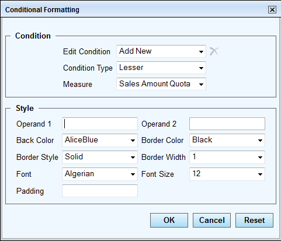
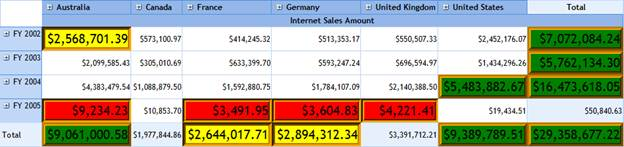

::: {style="DISPLAY: none"}
{#d2h_url_template}{#d2h_package_url style="WIDTH: 0px; DISPLAY: none; HEIGHT: 0px"}
:::

::: {.d2h_secondary_topic style="PADDING-BOTTOM: 10pt; MARGIN: 0pt; PADDING-LEFT: 0pt; PADDING-RIGHT: 0pt; PADDING-TOP: 0pt"}
#### Through Toolbar Dialog {#through-toolbar-dialog style="tab-stops: 0pt"}

[Conditional formatting can also be done through the OLAP grid's toolbar dialog. The toolbar holds different conditional options to format the OlapGrid control.]{style="FONT-WEIGHT: normal"}

 

Different types of conditional formatting

Conditional formatting can be applied for the following condition types:

[·      ]{style="FONT-FAMILY: Symbol"}Lesser

[·      ]{style="FONT-FAMILY: Symbol"}Greater

[·      ]{style="FONT-FAMILY: Symbol"}Equal

[·      ]{style="FONT-FAMILY: Symbol"}Not equal

[·      ]{style="FONT-FAMILY: Symbol"}Between

[·      ]{style="FONT-FAMILY: Symbol"}Not between

 

The properties that can be formatted for value and summary cells are as follows:

[·      ]{style="FONT-FAMILY: Symbol"}Back color

[·      ]{style="FONT-FAMILY: Symbol"}Border color

[·      ]{style="FONT-FAMILY: Symbol"}Border style

[·      ]{style="FONT-FAMILY: Symbol"}Border width

[·      ]{style="FONT-FAMILY: Symbol"}Font family

[·      ]{style="FONT-FAMILY: Symbol"}Font size

[·      ]{style="FONT-FAMILY: Symbol"}Padding

 

Conditional Formatting Dialog

The **Conditional Formatting** dialog provides options to customize the appearance of the grid based on certain conditions. Formatting will be applied based on the selected measure.

{border="0"}

Figure 25: Conditional Formatting Dialog

 

**Edit Condition**: Contains a list of formatting conditions applied to the grid. It has a number of conditions applied starting from Format 0 to Format n.

**Measure:** Contains a list of measures present in the grid.

**Remove:** Used to remove the selected condition along with the formatting from the Grid.

**Operand 1:** Grid will be formatted based on the operand value entered.

**Operand 2:** Required if the **Condition Type** is set to **Between** or **Not between**.

**Back Color**: Sets the background color of a cell.

**Border Color**: Sets the border color of a cell.

**Border Style**: Sets the cell border style to one of the following:

[·      ]{style="FONT-FAMILY: Symbol"}Dashed

[·      ]{style="FONT-FAMILY: Symbol"}Dotted

[·      ]{style="FONT-FAMILY: Symbol"}Double

[·      ]{style="FONT-FAMILY: Symbol"}Groove

[·      ]{style="FONT-FAMILY: Symbol"}Inset

[·      ]{style="FONT-FAMILY: Symbol"}Outset

[·      ]{style="FONT-FAMILY: Symbol"}Ridge

[·      ]{style="FONT-FAMILY: Symbol"}Solid

 

**Border Width:** Sets the border width of a cell.

**Font:** Changes the font family of a cell.

**Font Size:** Changes the font size of a cell.

**Padding**: Sets the cell padding.

 

{border="0"}

Figure 26: OLAP Grid with Conditional Formatting Applied

 

The grid above is formatted with the following three conditions:

[·      ]{style="FONT-FAMILY: Symbol"}Value \< 10000 is marked red.

[·      ]{style="FONT-FAMILY: Symbol"}Value \> 2500000 and Value \< 3000000 are marked yellow.

[·      ]{style="FONT-FAMILY: Symbol"}Value \> 5000000 is marked green.

 

The OLAP grid toolbar showcases the conditional formatting feature. The toolbar can be set by the following property of the OLAP Grid:

  ----------------------------------------------------------------------------------------------------------------------------------------------------
  **[\[C#\]]{style="FONT-FAMILY: 'Courier New'; COLOR: black"}**
  [this]{style="FONT-FAMILY: 'Courier New'; COLOR: blue"}[.OlapGrid1.ShowToolBar = [true]{style="COLOR: blue"};]{style="FONT-FAMILY: 'Courier New'"}
  ----------------------------------------------------------------------------------------------------------------------------------------------------

 

  --------------------------------------------------------------------------------------------------------------------------------------------------
  **[\[VB\]]{style="FONT-FAMILY: 'Courier New'; COLOR: black"}**
  [Me]{style="FONT-FAMILY: 'Courier New'; COLOR: blue"}[.OlapGrid1.ShowToolBar = [True]{style="COLOR: blue"};]{style="FONT-FAMILY: 'Courier New'"}
  --------------------------------------------------------------------------------------------------------------------------------------------------

 

The **Conditional Formatting** dialog can be launched by clicking the **Apply Formatting** icon {border="0"} on the grid toolbar.

 

Sample Link

A sample demo is available at the following link:

***..\\Syncfusion\\EssentialStudio\\\<VersionNumber\>\\BI\\Web\\OlapGrid.Web\\Samples\\3.5\\Appearance\\OlapGrid ToolBar Demo***

**** 

[]{#related-topics}
:::
