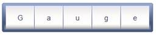

::: {style="DISPLAY: none"}
{#d2h_url_template}{#d2h_package_url style="WIDTH: 0px; DISPLAY: none; HEIGHT: 0px"}
:::

::: {.d2h_secondary_topic style="PADDING-BOTTOM: 10pt; MARGIN: 0pt; PADDING-LEFT: 0pt; PADDING-RIGHT: 0pt; PADDING-TOP: 0pt"}
##### Through View Customization {#through-view-customization style="tab-stops: 0pt"}

[]{style="FONT-FAMILY: 'Calibri','sans-serif'"} 

Step 1:

View:

Add the below code in the aspx file.

 

To automatically update the segment count value dynamically, set its **IsAutomaticSegmentCountEnabled** property to **true**.

 

+----------------------------------------------------------------------------------------------------------------------------------------------------------------------------+
| [View\[ASPX\]]{style="FONT-FAMILY: 'Courier New'"}                                                                                                                         |
|                                                                                                                                                                            |
| [     [\<%]{style="BACKGROUND: yellow"}[\--Rendering the rolling gauge\--]{style="COLOR: darkgreen"}[%\>]{style="BACKGROUND: yellow"}]{style="FONT-FAMILY: 'Courier New'"} |
|                                                                                                                                                                            |
| [    [\<%]{style="BACKGROUND: yellow"}[=]{style="COLOR: blue"}Html.Syncfusion().RollingGauge([\"Gauge\"]{style="COLOR: #a31515"})]{style="FONT-FAMILY: 'Courier New'"}     |
|                                                                                                                                                                            |
| []{style="FONT-FAMILY: 'Courier New'"}                                                                                                                                     |
|                                                                                                                                                                            |
| [         .Value([\"Gauge\"]{style="COLOR: #a31515"})]{style="FONT-FAMILY: 'Courier New'"}                                                                                 |
|                                                                                                                                                                            |
| [            [//Enabling the IsAutomaticSegmentCountEnabled property to update.]{style="COLOR: green"}]{style="FONT-FAMILY: 'Courier New'"}                                |
|                                                                                                                                                                            |
| [            [//The segment count automatically based on the gauge value.]{style="COLOR: green"}]{style="FONT-FAMILY: 'Courier New'"}                                      |
|                                                                                                                                                                            |
| **[          .IsAutomaticSegmentCountEnabled([true]{style="COLOR: blue"})]{style="FONT-FAMILY: 'Courier New'"}**                                                           |
|                                                                                                                                                                            |
| [         .GaugeSkins([GaugeSkins]{style="COLOR: #2b91af"}.VS2010)]{style="FONT-FAMILY: 'Courier New'"}                                                                    |
|                                                                                                                                                                            |
| [         .Height(50)]{style="FONT-FAMILY: 'Courier New'"}                                                                                                                 |
|                                                                                                                                                                            |
| [         ]{style="FONT-FAMILY: 'Courier New'"}                                                                                                                            |
|                                                                                                                                                                            |
| [    [%\>]{style="BACKGROUND: yellow"}]{style="FONT-FAMILY: 'Courier New'"}                                                                                                |
+----------------------------------------------------------------------------------------------------------------------------------------------------------------------------+

[]{style="FONT-FAMILY: 'Calibri','sans-serif'"} 

 

+----------------------------------------------------------------------------------------------------------------------------------------------------------------------------+
| [View\[cshtml\]]{style="FONT-FAMILY: 'Courier New'"}                                                                                                                       |
|                                                                                                                                                                            |
| [     [@\*]{style="BACKGROUND: yellow"}[\--Rendering the rolling gauge\--]{style="COLOR: darkgreen"}[\*@]{style="BACKGROUND: yellow"}]{style="FONT-FAMILY: 'Courier New'"} |
|                                                                                                                                                                            |
| [    [\@{]{style="BACKGROUND: yellow"} Html.Syncfusion().RollingGauge([\"Gauge\"]{style="COLOR: #a31515"})]{style="FONT-FAMILY: 'Courier New'"}                            |
|                                                                                                                                                                            |
| []{style="FONT-FAMILY: 'Courier New'"}                                                                                                                                     |
|                                                                                                                                                                            |
| [         .Value([\"Gauge\"]{style="COLOR: #a31515"})]{style="FONT-FAMILY: 'Courier New'"}                                                                                 |
|                                                                                                                                                                            |
| [            [//Enabling the IsAutomaticSegmentCountEnabled property to update.]{style="COLOR: green"}]{style="FONT-FAMILY: 'Courier New'"}                                |
|                                                                                                                                                                            |
| [            [//The segment count is automatically based on the gauge value.]{style="COLOR: green"}]{style="FONT-FAMILY: 'Courier New'"}                                   |
|                                                                                                                                                                            |
| **[          .IsAutomaticSegmentCountEnabled([true]{style="COLOR: blue"})]{style="FONT-FAMILY: 'Courier New'"}**                                                           |
|                                                                                                                                                                            |
| [         .GaugeSkins([GaugeSkins]{style="COLOR: #2b91af"}.VS2010)]{style="FONT-FAMILY: 'Courier New'"}                                                                    |
|                                                                                                                                                                            |
| [         .Height(50).Render();         ]{style="FONT-FAMILY: 'Courier New'"}                                                                                              |
|                                                                                                                                                                            |
| [    [}]{style="BACKGROUND: yellow"}]{style="FONT-FAMILY: 'Courier New'"}                                                                                                  |
+----------------------------------------------------------------------------------------------------------------------------------------------------------------------------+

[]{style="FONT-FAMILY: 'Calibri','sans-serif'"} 

[]{style="FONT-FAMILY: 'Calibri','sans-serif'"} 

Step 2:

Controller:

Add the code below in the controller.

 

+----------------------------------------------------------------------------------------------------------------------------+
| []{style="FONT-FAMILY: 'Courier New'"}                                                                                     |
|                                                                                                                            |
| [        [public]{style="COLOR: blue"} [ActionResult]{style="COLOR: #2b91af"} Index()]{style="FONT-FAMILY: 'Courier New'"} |
|                                                                                                                            |
| [        {]{style="FONT-FAMILY: 'Courier New'"}                                                                            |
|                                                                                                                            |
| [            [return]{style="COLOR: blue"} View();]{style="FONT-FAMILY: 'Courier New'"}                                    |
|                                                                                                                            |
| [        }]{style="FONT-FAMILY: 'Courier New'"}                                                                            |
+----------------------------------------------------------------------------------------------------------------------------+

**[]{style="FONT-FAMILY: 'Calibri','sans-serif'"}** 

Step 3:

Run the code to achieve the below output.

 

{border="0"}

Figure 153: AutomaticSegment count Enabled-Rolling Gauge**[]{style="FONT-FAMILY: 'Calibri','sans-serif'"}**

[                                                         ]{style="FONT-FAMILY: 'Calibri','sans-serif'"}

[]{#related-topics}
:::
