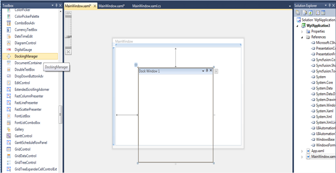

::: {style="DISPLAY: none"}
{#d2h_url_template}{#d2h_package_url style="WIDTH: 0px; DISPLAY: none; HEIGHT: 0px"}
:::

::: {.d2h_secondary_topic style="PADDING-BOTTOM: 10pt; MARGIN: 0pt; PADDING-LEFT: 0pt; PADDING-RIGHT: 0pt; PADDING-TOP: 0pt"}
##### Through Visual Studio {#through-visual-studio style="tab-stops: 0pt"}

To create the Docking Manager control through Visual Studio, drag **DockingManager** control from **Toolbox** and drop it to the designer. It will generate the following Docking Manager control.

 

{border="0"}

Figure 302: Adding Docking Manager through Visual Studio

 

[]{#related-topics}
:::
