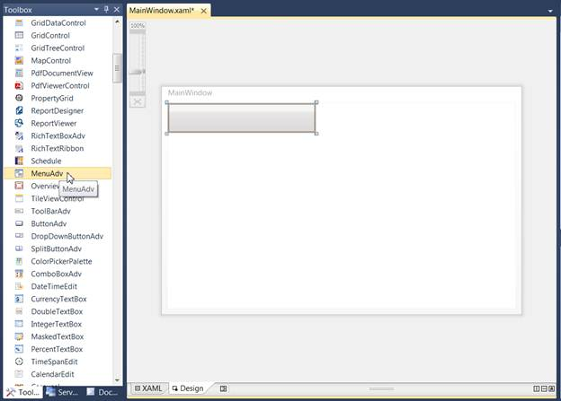
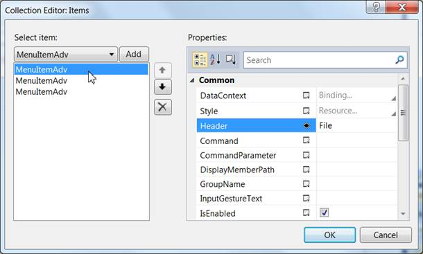

::: {style="DISPLAY: none"}
{#d2h_url_template}{#d2h_package_url style="WIDTH: 0px; DISPLAY: none; HEIGHT: 0px"}
:::

::: {.d2h_secondary_topic style="PADDING-BOTTOM: 10pt; MARGIN: 0pt; PADDING-LEFT: 0pt; PADDING-RIGHT: 0pt; PADDING-TOP: 0pt"}
##### Through Visual Studio {#through-visual-studio style="tab-stops: 0pt"}

The following are the steps to create the MenuAdv control using Visual Studio.

 

1.   Drag **MenuAdv** from the Visual Studio Toolbox and drop it in the designer.

 

{border="0"}

Figure 708: Dragging MenuAdv control to Designer

 

2.   Select the MenuAdv and go to properties.

3.   Click on the button given in Items property. This will open the **Collection Editor** window.

 

{border="0"}

Figure 709: Collection Editor for MenuAdv

 

4.   Using the **Collection Editor**, add the GroupBarItems and configure their properties.

[]{#related-topics}
:::
