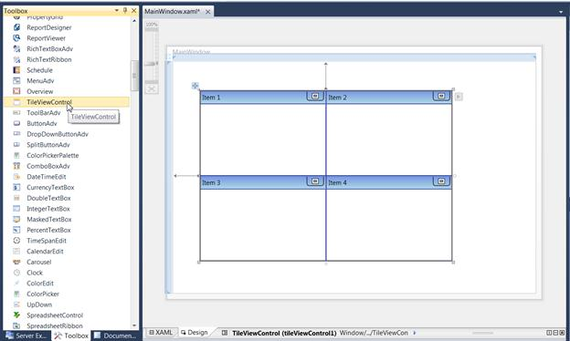
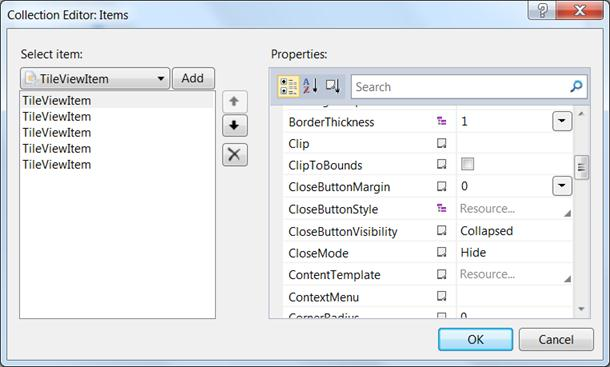

::: {style="DISPLAY: none"}
{#d2h_url_template}{#d2h_package_url style="WIDTH: 0px; DISPLAY: none; HEIGHT: 0px"}
:::

::: {.d2h_secondary_topic style="PADDING-BOTTOM: 10pt; MARGIN: 0pt; PADDING-LEFT: 0pt; PADDING-RIGHT: 0pt; PADDING-TOP: 0pt"}
##### Through Visual Studio {#through-visual-studio style="tab-stops: 0pt"}

The following are the steps to create the TileViewControl using Visual Studio.

1.   Drag **TileViewControl** from the **Toolbox** and drop it in the Designer area. It will generate the TileViewControl.

 

{border="0"}

Figure 1058: Dragging TileViewControl to Visual Studio Designer

 

2.   To add items to the TileViewControl using the Collection Editor, select the **TileViewControl** and look at its properties.

3.   Click the button in the **Items** property. This will open the **Collection Editor**.

 

{border="0"}

Figure 1059: Collection Editor for TileViewControl

 

4.   Using the **Collection Editor**, add the GroupBarItems and configure their properties.

 

[]{#related-topics}
:::
