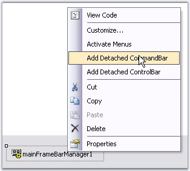
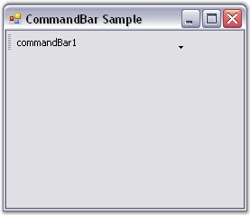

::: {style="DISPLAY: none"}
{#d2h_url_template}{#d2h_package_url style="WIDTH: 0px; DISPLAY: none; HEIGHT: 0px"}
:::

::: {.d2h_secondary_topic style="PADDING-BOTTOM: 10pt; MARGIN: 0pt; PADDING-LEFT: 0pt; PADDING-RIGHT: 0pt; PADDING-TOP: 0pt"}
#### Through XP Menus Framework {#through-xp-menus-framework style="tab-stops: 0pt"}

[]{style="COLOR: #15428b"} 

The XP Menus framework provides the flexibility to add detached toolbars that can host any .NET control. These toolbars are detached from the framework, i.e., they cannot participate in user customization. Otherwise, they are seamless in look and feel.

[]{style="COLOR: #15428b"} 

1.   Right click on the **MainFrameBarManager** component and choose the **Add Detached CommandBar** option to add a detached toolbar.

 

2.   Add that control by dragging and dropping to any .NET control. If you need to host multiple controls, you will need to first add a panel to the CommandBar and then add the controls to this panel.

[]{style="COLOR: #15428b"} 

+-----------------------------------------------------------------------------------------------------------------------------------------------------------------------------------------------------------------------------------------------------------------+
| **[\[C#\]]{style="FONT-FAMILY: 'Courier New'; COLOR: black"}**                                                                                                                                                                                                  |
|                                                                                                                                                                                                                                                                 |
| []{style="FONT-FAMILY: 'Courier New'; COLOR: black"}                                                                                                                                                                                                            |
|                                                                                                                                                                                                                                                                 |
| [// Declare the controls.]{style="FONT-FAMILY: 'Courier New'; COLOR: green"}                                                                                                                                                                                    |
|                                                                                                                                                                                                                                                                 |
| [private]{style="FONT-FAMILY: 'Courier New'; COLOR: blue"}[ Syncfusion.Windows.Forms.Tools.XPMenus.[MainFrameBarManager]{style="COLOR: teal"} mainFrameBarManager2;]{style="FONT-FAMILY: 'Courier New'"}                                                        |
|                                                                                                                                                                                                                                                                 |
| [private]{style="FONT-FAMILY: 'Courier New'; COLOR: blue"}[ Syncfusion.Windows.Forms.Tools.[CommandBar]{style="COLOR: teal"} commandBar2;]{style="FONT-FAMILY: 'Courier New'"}                                                                                  |
|                                                                                                                                                                                                                                                                 |
| **[]{style="FONT-FAMILY: 'Courier New'; COLOR: black"}**                                                                                                                                                                                                        |
|                                                                                                                                                                                                                                                                 |
| [// Initialize the controls.]{style="FONT-FAMILY: 'Courier New'; COLOR: green"}                                                                                                                                                                                 |
|                                                                                                                                                                                                                                                                 |
| [this]{style="FONT-FAMILY: 'Courier New'; COLOR: blue"}[.mainFrameBarManager2 = [new]{style="COLOR: blue"} Syncfusion.Windows.Forms.Tools.XPMenus.[MainFrameBarManager]{style="COLOR: teal"}([this]{style="COLOR: blue"});]{style="FONT-FAMILY: 'Courier New'"} |
|                                                                                                                                                                                                                                                                 |
| [this]{style="FONT-FAMILY: 'Courier New'; COLOR: blue"}[.commandBar2 = [new]{style="COLOR: blue"} Syncfusion.Windows.Forms.Tools.[CommandBar]{style="COLOR: teal"}();]{style="FONT-FAMILY: 'Courier New'"}                                                      |
|                                                                                                                                                                                                                                                                 |
| []{style="FONT-FAMILY: 'Courier New'"}                                                                                                                                                                                                                          |
|                                                                                                                                                                                                                                                                 |
| [// Set the properties.]{style="FONT-FAMILY: 'Courier New'; COLOR: green"}                                                                                                                                                                                      |
|                                                                                                                                                                                                                                                                 |
| [this]{style="FONT-FAMILY: 'Courier New'; COLOR: blue"}[.mainFrameBarManager2.DetachedCommandBars.Add([this]{style="COLOR: blue"}.commandBar2);]{style="FONT-FAMILY: 'Courier New'"}                                                                            |
|                                                                                                                                                                                                                                                                 |
| [this]{style="FONT-FAMILY: 'Courier New'; COLOR: blue"}[.mainFrameBarManager2.Form = [this]{style="COLOR: blue"};]{style="FONT-FAMILY: 'Courier New'"}                                                                                                          |
|                                                                                                                                                                                                                                                                 |
| [this]{style="FONT-FAMILY: 'Courier New'; COLOR: blue"}[.commandBar1.Text = [\"commandBar1\"]{style="COLOR: maroon"};]{style="FONT-FAMILY: 'Courier New'"}                                                                                                      |
+-----------------------------------------------------------------------------------------------------------------------------------------------------------------------------------------------------------------------------------------------------------------+

[]{style="COLOR: #15428b"} 

+-------------------------------------------------------------------------------------------------------------------------------------------------------------------------------------------------------------------------------------+
| **[\[VB.NET\]]{style="FONT-FAMILY: 'Courier New'; COLOR: black"}**                                                                                                                                                                  |
|                                                                                                                                                                                                                                     |
| []{style="FONT-FAMILY: 'Courier New'; COLOR: black"}                                                                                                                                                                                |
|                                                                                                                                                                                                                                     |
| [\' Declare the controls.]{style="FONT-FAMILY: 'Courier New'; COLOR: green"}                                                                                                                                                        |
|                                                                                                                                                                                                                                     |
| [Private]{style="FONT-FAMILY: 'Courier New'; COLOR: blue"}[ mainFrameBarManager2 [As]{style="COLOR: blue"} Syncfusion.Windows.Forms.Tools.XPMenus.MainFrameBarManager]{style="FONT-FAMILY: 'Courier New'"}                          |
|                                                                                                                                                                                                                                     |
| [Private]{style="FONT-FAMILY: 'Courier New'; COLOR: blue"}[ commandBar2 [As]{style="COLOR: blue"} Syncfusion.Windows.Forms.Tools.CommandBar]{style="FONT-FAMILY: 'Courier New'"}                                                    |
|                                                                                                                                                                                                                                     |
| []{style="FONT-FAMILY: 'Courier New'; COLOR: black"}                                                                                                                                                                                |
|                                                                                                                                                                                                                                     |
| [\' Initialize the controls.]{style="FONT-FAMILY: 'Courier New'; COLOR: green"}                                                                                                                                                     |
|                                                                                                                                                                                                                                     |
| [Me]{style="FONT-FAMILY: 'Courier New'; COLOR: blue"}[.mainFrameBarManager2 = [New]{style="COLOR: blue"} Syncfusion.Windows.Forms.Tools.XPMenus.MainFrameBarManager([Me]{style="COLOR: blue"})]{style="FONT-FAMILY: 'Courier New'"} |
|                                                                                                                                                                                                                                     |
| [Me]{style="FONT-FAMILY: 'Courier New'; COLOR: blue"}[.commandBar2 = [New]{style="COLOR: blue"} Syncfusion.Windows.Forms.Tools.CommandBar()]{style="FONT-FAMILY: 'Courier New'"}                                                    |
|                                                                                                                                                                                                                                     |
| []{style="FONT-FAMILY: 'Courier New'"}                                                                                                                                                                                              |
|                                                                                                                                                                                                                                     |
| [\' Set the properties.]{style="FONT-FAMILY: 'Courier New'; COLOR: green"}                                                                                                                                                          |
|                                                                                                                                                                                                                                     |
| [Me]{style="FONT-FAMILY: 'Courier New'; COLOR: blue"}[.mainFrameBarManager2.DetachedCommandBars.Add([Me]{style="COLOR: blue"}.commandBar2)]{style="FONT-FAMILY: 'Courier New'"}                                                     |
|                                                                                                                                                                                                                                     |
| [Me]{style="FONT-FAMILY: 'Courier New'; COLOR: blue"}[.mainFrameBarManager2.Form = [Me]{style="COLOR: blue"}]{style="FONT-FAMILY: 'Courier New'"}                                                                                   |
|                                                                                                                                                                                                                                     |
| [Me]{style="FONT-FAMILY: 'Courier New'; COLOR: blue"}[.commandBar1.Text = [\"commandBar1\"]{style="COLOR: maroon"}]{style="FONT-FAMILY: 'Courier New'"}                                                                             |
+-------------------------------------------------------------------------------------------------------------------------------------------------------------------------------------------------------------------------------------+

[]{style="COLOR: #15428b"} 

{border="0"}?

[]{style="COLOR: #15428b"} 

Figure 10: Adding Detached CommandBar Through Design Time Verb

[]{style="COLOR: #15428b"} 

{border="0"}

[]{style="COLOR: #15428b"} 

Figure 11: Detached CommandBar created Through MainFrameBarManager

[]{style="COLOR: #15428b"} 

See Also

[]{style="COLOR: #15428b"} 

[Through Designer]{.UGHyperlink}[, ]{.UGHyperlink}[Through Code]{.UGHyperlink}[]{.UGHyperlink}

[]{#related-topics}
:::
