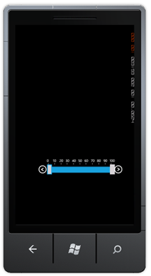
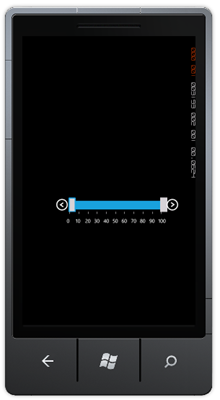
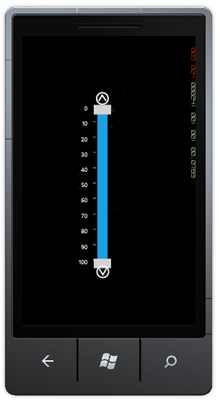
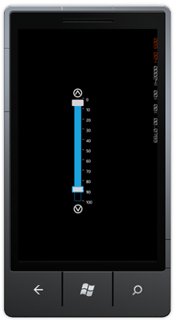

::: {style="DISPLAY: none"}
{#d2h_url_template}{#d2h_package_url style="WIDTH: 0px; DISPLAY: none; HEIGHT: 0px"}
:::

::: {.d2h_secondary_topic style="PADDING-BOTTOM: 10pt; MARGIN: 0pt; PADDING-LEFT: 0pt; PADDING-RIGHT: 0pt; PADDING-TOP: 0pt"}
#### Tick position      []{style="FONT-SIZE: 14pt"} {#tick-position style="tab-stops: 0pt"}

This[ ]{style="COLOR: #c00000"}feature enables you to position the ticks as needed. You can place the ticks in four positions. They are:

[]{style="COLOR: #c00000"} 

[·      ]{style="FONT-FAMILY: Symbol"}Top

[·      ]{style="FONT-FAMILY: Symbol"}Down

[·      ]{style="FONT-FAMILY: Symbol"}Left

[·      ]{style="FONT-FAMILY: Symbol"}Right

 

Positioning the Ticks

 

You can position the ticks using the *TicksPlacement* property. By default this is set to *Top*.

The following code illustrates how to position the ticks on the top:

 

+------------------------------------------------------------------------------------------------------------------------------+
| **[\[C#\]]{style="FONT-FAMILY: Consolas; FONT-SIZE: 9.5pt"}**                                                                |
|                                                                                                                              |
| [     slider1.TickPlacement = [Tickplacement]{style="COLOR: #2b91af"}.Top;]{style="FONT-FAMILY: Consolas; FONT-SIZE: 9.5pt"} |
+------------------------------------------------------------------------------------------------------------------------------+

 

{border="0"}

Figure 119:Ticks Top

 

 

The following code illustrates how to position the ticks at the bottom:

 

+-------------------------------------------------------------------------------------------------------------------------------------------------------------------------+
| **[\[C#\]]{style="FONT-FAMILY: Consolas; FONT-SIZE: 9.5pt"}**                                                                                                           |
|                                                                                                                                                                         |
| []{style="FONT-FAMILY: Consolas; FONT-SIZE: 9.5pt"}                                                                                                                     |
|                                                                                                                                                                         |
| [slider1.TickPlacement = [Tickplacement]{style="COLOR: #2b91af"}.Down;]{style="FONT-FAMILY: Consolas; FONT-SIZE: 9.5pt"}[]{style="FONT-FAMILY: 'Calibri','sans-serif'"} |
+-------------------------------------------------------------------------------------------------------------------------------------------------------------------------+

 

{border="0"}

Figure 120:Ticks Bottom

[]{style="FONT-FAMILY: Consolas; FONT-SIZE: 9.5pt"} 

The following code illustrates how to position the ticks to the left:

 

+--------------------------------------------------------------------------------------------------------------------------------------+
| **[\[C#\]]{style="FONT-FAMILY: Consolas; FONT-SIZE: 9.5pt"}**                                                                        |
|                                                                                                                                      |
| [            slider1.TickPlacement = [Tickplacement]{style="COLOR: #2b91af"}.Left;]{style="FONT-FAMILY: Consolas; FONT-SIZE: 9.5pt"} |
|                                                                                                                                      |
| []{style="FONT-FAMILY: 'Calibri','sans-serif'"}                                                                                      |
+--------------------------------------------------------------------------------------------------------------------------------------+

 

{border="0"}

Figure 121:Ticks Left

[]{style="FONT-FAMILY: Consolas; FONT-SIZE: 9.5pt"} 

The following code illustrates how to position the ticks to the right:

 

+---------------------------------------------------------------------------------------------------------------------------------------+
| **[\[C#\]]{style="FONT-FAMILY: Consolas; FONT-SIZE: 9.5pt"}**                                                                         |
|                                                                                                                                       |
| []{style="FONT-FAMILY: Consolas; FONT-SIZE: 9.5pt"}                                                                                   |
|                                                                                                                                       |
| [            slider1.TickPlacement = [Tickplacement]{style="COLOR: #2b91af"}.Right;]{style="FONT-FAMILY: Consolas; FONT-SIZE: 9.5pt"} |
+---------------------------------------------------------------------------------------------------------------------------------------+

[]{style="FONT-FAMILY: Consolas; FONT-SIZE: 9.5pt"} 

{border="0"}

Figure 122:Ticks Right

 

[]{style="COLOR: #c00000"} 

[]{style="COLOR: #c00000"} 

[]{#related-topics}
:::
