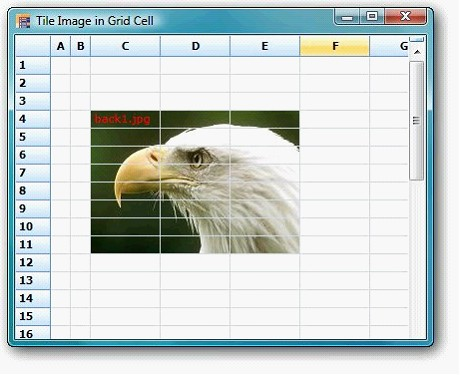

::: {style="DISPLAY: none"}
{#d2h_url_template}{#d2h_package_url style="WIDTH: 0px; DISPLAY: none; HEIGHT: 0px"}
:::

::: {.d2h_secondary_topic style="PADDING-BOTTOM: 10pt; MARGIN: 0pt; PADDING-LEFT: 0pt; PADDING-RIGHT: 0pt; PADDING-TOP: 0pt"}
#### Tile Image In Grid Cell {#tile-image-in-grid-cell style="tab-stops: 0pt"}

 

 

Essential **GridControl** supports Tile Image feature in Grid cell.

Set BackgroundImageMode property to GridBackgroundImageMode.TileImage to add title image in grid cell.

[]{style="FONT-FAMILY: 'Trebuchet MS','sans-serif'; COLOR: #15428b; FONT-SIZE: 9pt"} 

The following code illustrates how to add **Tile Image feature** in Grid cell.

[]{style="FONT-FAMILY: 'Trebuchet MS','sans-serif'; COLOR: #15428b; FONT-SIZE: 9pt"} 

+-------------------------------------------------------------------------------------------------------------------------------------------------------------------------------------------------------+
| [\[C#\]]{style="FONT-FAMILY: 'Courier New'"}                                                                                                                                                          |
|                                                                                                                                                                                                       |
| [this]{style="FONT-FAMILY: 'Courier New'; COLOR: blue"}[.gridControl1\[2, 2\].BackgroundImageMode = [GridBackgroundImageMode]{style="COLOR: #2b91af"}.TileImage;]{style="FONT-FAMILY: 'Courier New'"} |
+-------------------------------------------------------------------------------------------------------------------------------------------------------------------------------------------------------+

[]{style="FONT-FAMILY: 'Courier New'"} 

+----------------------------------------------------------------------------------------------------------------------------------------------+
| [\[VB\]]{style="FONT-FAMILY: 'Courier New'"}                                                                                                 |
|                                                                                                                                              |
| [  [Me]{style="COLOR: blue"}.gridControl1(2, 2).BackgroundImageMode = GridBackgroundImageMode.TileImage]{style="FONT-FAMILY: 'Courier New'"} |
+----------------------------------------------------------------------------------------------------------------------------------------------+

When the code runs, the following image displays.

{border="0"}

*[Figure ]{style="FONT-SIZE: 9pt"}[198]{style="FONT-SIZE: 9pt"}[: Tile Image in grid cell]{style="FONT-SIZE: 9pt"}*

[]{#p359} 

 

[]{#related-topics}
:::
