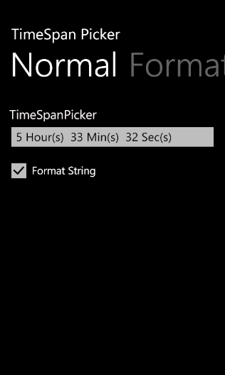
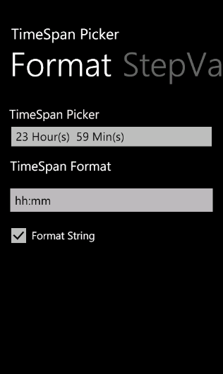

::: {style="DISPLAY: none"}
{#d2h_url_template}{#d2h_package_url style="WIDTH: 0px; DISPLAY: none; HEIGHT: 0px"}
:::

::: {.d2h_secondary_topic style="PADDING-BOTTOM: 10pt; MARGIN: 0pt; PADDING-LEFT: 0pt; PADDING-RIGHT: 0pt; PADDING-TOP: 0pt"}
#### TimeSpan Format {#timespan-format style="tab-stops: 0pt"}

TimeSpan Picker control supports four timespan elements. They are:

[]{style="COLOR: #c00000"} 

[·      ]{style="FONT-FAMILY: Symbol"}Day

[·      ]{style="FONT-FAMILY: Symbol"}Hour

[·      ]{style="FONT-FAMILY: Symbol"}Minute

[·      ]{style="FONT-FAMILY: Symbol"}Second

You can customize the timespan format as needed.[]{style="COLOR: #c00000"}

         

Customizing the timespan format

You can customize the timespan format using the *ValueStringFormat* property.  Default timespan format is dd:hh:mm:ss.

 

The following code illustrates how to set timespan format as hh:mm:ss:

[]{style="FONT-FAMILY: Consolas; COLOR: blue; FONT-SIZE: 9.5pt"} 

+------------------------------------------------------------------------------------------------------------------------------------------------------------------------------------------------------------------------------------------------------------------------------------------------------------------------------------------------------------------------------------------------------------------------------------------------------------------------------------------------------------------------------------------------------------------------------------------------------------------------------------------------------------------------------------------------------------------------------------------------------------------------------------------------------------------------------------------------------------------------------------------------------------------------------------------------------------------------------------------------------------------------------------------------------------------------------------------------------------------------------------------------------------------------------------------------------------------------------------------------------------------------------------------------------------------------------------------------------------------------------------+
| **[\[xaml\]]{style="FONT-FAMILY: 'Courier New'"}**                                                                                                                                                                                                                                                                                                                                                                                                                                                                                                                                                                                                                                                                                                                                                                                                                                                                                                                                                                                                                                                                                                                                                                                                                                                                                                                                 |
|                                                                                                                                                                                                                                                                                                                                                                                                                                                                                                                                                                                                                                                                                                                                                                                                                                                                                                                                                                                                                                                                                                                                                                                                                                                                                                                                                                                    |
| [\<]{style="FONT-FAMILY: 'Courier New'; COLOR: blue"}[syncfusion]{style="FONT-FAMILY: 'Courier New'; COLOR: #a31515"}[:]{style="FONT-FAMILY: 'Courier New'; COLOR: blue"}[TimeSpanPicker]{style="FONT-FAMILY: 'Courier New'; COLOR: #a31515"}[ x]{style="FONT-FAMILY: 'Courier New'; COLOR: red"}[:]{style="FONT-FAMILY: 'Courier New'; COLOR: blue"}[Name]{style="FONT-FAMILY: 'Courier New'; COLOR: red"}[=\"timespanpicker\"]{style="FONT-FAMILY: 'Courier New'; COLOR: blue"}[ Text]{style="FONT-FAMILY: 'Courier New'; COLOR: red"}[=\"TimeSpanPicker\"]{style="FONT-FAMILY: 'Courier New'; COLOR: blue"}[ ValueStringFormat]{style="FONT-FAMILY: 'Courier New'; COLOR: red"}[=\"hh:mm:ss\"]{style="FONT-FAMILY: 'Courier New'; COLOR: blue"}[ MaxValue]{style="FONT-FAMILY: 'Courier New'; COLOR: red"}[=\"10:11:1\"]{style="FONT-FAMILY: 'Courier New'; COLOR: blue"}[ MinValue]{style="FONT-FAMILY: 'Courier New'; COLOR: red"}[=\"2:1:1\"]{style="FONT-FAMILY: 'Courier New'; COLOR: blue"}[ Value]{style="FONT-FAMILY: 'Courier New'; COLOR: red"}[=\"5:33:32\"]{style="FONT-FAMILY: 'Courier New'; COLOR: blue"}[ StepValue]{style="FONT-FAMILY: 'Courier New'; COLOR: red"}[=\"2:2:2\"]{style="FONT-FAMILY: 'Courier New'; COLOR: blue"}[ FormatString]{style="FONT-FAMILY: 'Courier New'; COLOR: red"}[=\"True\"/\>]{style="FONT-FAMILY: 'Courier New'; COLOR: blue"} |
+------------------------------------------------------------------------------------------------------------------------------------------------------------------------------------------------------------------------------------------------------------------------------------------------------------------------------------------------------------------------------------------------------------------------------------------------------------------------------------------------------------------------------------------------------------------------------------------------------------------------------------------------------------------------------------------------------------------------------------------------------------------------------------------------------------------------------------------------------------------------------------------------------------------------------------------------------------------------------------------------------------------------------------------------------------------------------------------------------------------------------------------------------------------------------------------------------------------------------------------------------------------------------------------------------------------------------------------------------------------------------------+

[]{style="FONT-FAMILY: Consolas; COLOR: blue; FONT-SIZE: 9.5pt"} 

+------------------------------------------------------------------------------------------------------------------------------------------------------------------------------------------------------------------------------------------------------------------------------------------------------------------------------------------------------------------------------------------------------------------------------------------------------------------------------------------------------------------------------------------------------------------------------------------------------------------------------------------------------------------------------------------+
| **[\[C#\]]{style="FONT-FAMILY: 'Courier New'"}**                                                                                                                                                                                                                                                                                                                                                                                                                                                                                                                                                                                                                                         |
|                                                                                                                                                                                                                                                                                                                                                                                                                                                                                                                                                                                                                                                                                          |
| [TimeSpanPicker]{style="FONT-FAMILY: 'Courier New'; COLOR: #2b91af"}[ timespanpicker= [new]{style="COLOR: blue"} [TimeSpanPicker]{style="COLOR: #2b91af"}(){ Text=[\"TimeSpanPicker\"]{style="COLOR: #a31515"}, ValueStringFormat=[\"hh:mm:ss\"]{style="COLOR: #a31515"}, MaxValue= [new]{style="COLOR: blue"} [TimeSpan]{style="COLOR: #2b91af"}(10,11,1), MinValue=[new]{style="COLOR: blue"} [TimeSpan]{style="COLOR: #2b91af"}(2,1,1), Value=[new]{style="COLOR: blue"} [TimeSpan]{style="COLOR: #2b91af"}(5,33,32), StepValue=[new]{style="COLOR: blue"} [TimeSpan]{style="COLOR: #2b91af"}(2,2,2), FormatString=[true]{style="COLOR: blue"}};]{style="FONT-FAMILY: 'Courier New'"} |
+------------------------------------------------------------------------------------------------------------------------------------------------------------------------------------------------------------------------------------------------------------------------------------------------------------------------------------------------------------------------------------------------------------------------------------------------------------------------------------------------------------------------------------------------------------------------------------------------------------------------------------------------------------------------------------------+

[]{style="FONT-FAMILY: Consolas; COLOR: blue; FONT-SIZE: 9.5pt"} 

{border="0"}

Figure 77: Hour, minutes and seconds are set as TimeSpan format.

 

The following code illustrates how to set timespan format as hh:mm:

 

+------------------------------------------------------------------------------------------------------------------------------------------------------------------------------------------------------------------------------------------------------------------------------------------------------------------------------------------------------------------------------------------------------------------------------------------------------------------------------------------------------------------------------------------------------------------------------------------------------------------------------------------------------------------------------------------------------------------------------------------------------------------------------------------------------------------------------------------------------------------------------------------------------------------------------+
| [\[Xaml\]]{style="FONT-FAMILY: 'Courier New'"}                                                                                                                                                                                                                                                                                                                                                                                                                                                                                                                                                                                                                                                                                                                                                                                                                                                                               |
|                                                                                                                                                                                                                                                                                                                                                                                                                                                                                                                                                                                                                                                                                                                                                                                                                                                                                                                              |
| [\<]{style="FONT-FAMILY: 'Courier New'; COLOR: blue"}[syncfusion]{style="FONT-FAMILY: 'Courier New'; COLOR: #a31515"}[:]{style="FONT-FAMILY: 'Courier New'; COLOR: blue"}[TimeSpanPicker]{style="FONT-FAMILY: 'Courier New'; COLOR: #a31515"}[ x]{style="FONT-FAMILY: 'Courier New'; COLOR: red"}[:]{style="FONT-FAMILY: 'Courier New'; COLOR: blue"}[Name]{style="FONT-FAMILY: 'Courier New'; COLOR: red"}[=\"timespanpicker\"]{style="FONT-FAMILY: 'Courier New'; COLOR: blue"}[ Text]{style="FONT-FAMILY: 'Courier New'; COLOR: red"}[=\"TimeSpanPicker\"]{style="FONT-FAMILY: 'Courier New'; COLOR: blue"}[ ValueStringFormat]{style="FONT-FAMILY: 'Courier New'; COLOR: red"}[=\"hh:mm\"]{style="FONT-FAMILY: 'Courier New'; COLOR: blue"}[ [ Value]{style="COLOR: red"}[=\"10:23:59\"]{style="COLOR: blue"}[ FormatString]{style="COLOR: red"}[=\"True\"/\>]{style="COLOR: blue"}]{style="FONT-FAMILY: 'Courier New'"} |
|                                                                                                                                                                                                                                                                                                                                                                                                                                                                                                                                                                                                                                                                                                                                                                                                                                                                                                                              |
| []{style="FONT-FAMILY: 'Courier New'"}                                                                                                                                                                                                                                                                                                                                                                                                                                                                                                                                                                                                                                                                                                                                                                                                                                                                                       |
+------------------------------------------------------------------------------------------------------------------------------------------------------------------------------------------------------------------------------------------------------------------------------------------------------------------------------------------------------------------------------------------------------------------------------------------------------------------------------------------------------------------------------------------------------------------------------------------------------------------------------------------------------------------------------------------------------------------------------------------------------------------------------------------------------------------------------------------------------------------------------------------------------------------------------+

 

+------------------------------------------------------------------------------------------------------------------------------------------------------------------------------------------------------------------------------------------------------------------------------------------------------------------------------------------------------------------------------------------------------------+
| [\[C#\]]{style="FONT-FAMILY: 'Courier New'"}                                                                                                                                                                                                                                                                                                                                                               |
|                                                                                                                                                                                                                                                                                                                                                                                                            |
| [ [TimeSpanPicker]{style="COLOR: #2b91af"} timespanpicker= [new]{style="COLOR: blue"} [TimeSpanPicker]{style="COLOR: #2b91af"}(){ Text=[\"TimeSpanPicker\"]{style="COLOR: #a31515"}, ValueStringFormat=[\"hh:mm\"]{style="COLOR: #a31515"}, Value=[new]{style="COLOR: blue"} [TimeSpan]{style="COLOR: #2b91af"}(10,23,59), FormatString=[true]{style="COLOR: blue"}};]{style="FONT-FAMILY: 'Courier New'"} |
|                                                                                                                                                                                                                                                                                                                                                                                                            |
| []{style="FONT-FAMILY: 'Courier New'"}                                                                                                                                                                                                                                                                                                                                                                     |
+------------------------------------------------------------------------------------------------------------------------------------------------------------------------------------------------------------------------------------------------------------------------------------------------------------------------------------------------------------------------------------------------------------+

 

{border="0"}

Figure 78: Hour and minutes are set as TimeSpan format.

 

 

[]{#related-topics}
:::
