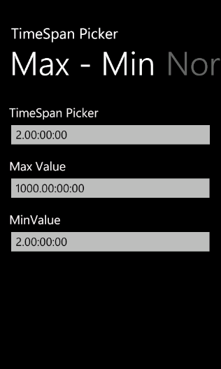
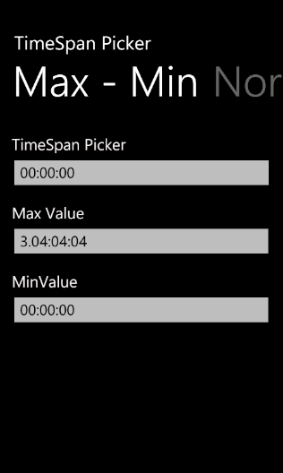
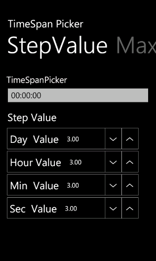

::: {style="DISPLAY: none"}
{#d2h_url_template}{#d2h_package_url style="WIDTH: 0px; DISPLAY: none; HEIGHT: 0px"}
:::

::: {.d2h_secondary_topic style="PADDING-BOTTOM: 10pt; MARGIN: 0pt; PADDING-LEFT: 0pt; PADDING-RIGHT: 0pt; PADDING-TOP: 0pt"}
#### TimeSpan Range {#timespan-range style="tab-stops: 0pt"}

          []{style="COLOR: #c00000"}

This feature enables you to set the minimum and maximum timespan range and the step value.  [[]{style="COLOR: #c00000; FONT-WEIGHT: normal"}]{.Heading3Char}

 

Setting the Minimum TimeSpan Range

You can set the minimum timespan range using the *MinValue* property. Default value is 0 timespan.

 

The following code illustrates how to set the minimum timespan range:

 

+----------------------------------------------------------------------------------------------------------------------------------------------------------------------------------------------------------------------------------------------------------------------------------------------------------------------------------------------------------------------------------------------------------------------------------------------------------------------------------------------------------------------------------------------------------------------------------------------------------------------------------------------------------------------------------------------------------------------------------------------------------------------------------------------------------------------------------------------------------------------------------------------------------------------------------------------------------------------------------------------+
| [\[xaml\]]{style="FONT-FAMILY: 'Courier New'"}                                                                                                                                                                                                                                                                                                                                                                                                                                                                                                                                                                                                                                                                                                                                                                                                                                                                                                                                               |
|                                                                                                                                                                                                                                                                                                                                                                                                                                                                                                                                                                                                                                                                                                                                                                                                                                                                                                                                                                                              |
| [\<]{style="FONT-FAMILY: 'Courier New'; COLOR: blue"}[syncfusion]{style="FONT-FAMILY: 'Courier New'; COLOR: #a31515"}[:]{style="FONT-FAMILY: 'Courier New'; COLOR: blue"}[TimeSpanPicker]{style="FONT-FAMILY: 'Courier New'; COLOR: #a31515"}[ x]{style="FONT-FAMILY: 'Courier New'; COLOR: red"}[:]{style="FONT-FAMILY: 'Courier New'; COLOR: blue"}[Name]{style="FONT-FAMILY: 'Courier New'; COLOR: red"}[=\"timespanpicker\"]{style="FONT-FAMILY: 'Courier New'; COLOR: blue"}[ Text]{style="FONT-FAMILY: 'Courier New'; COLOR: red"}[=\"TimeSpanPicker\"]{style="FONT-FAMILY: 'Courier New'; COLOR: blue"}[ ValueStringFormat]{style="FONT-FAMILY: 'Courier New'; COLOR: red"}[=\"dd:hh:mm:ss\"]{style="FONT-FAMILY: 'Courier New'; COLOR: blue"}[ MinValue]{style="FONT-FAMILY: 'Courier New'; COLOR: red"}[=\"2.0:0:0\"]{style="FONT-FAMILY: 'Courier New'; COLOR: blue"}[ [ FormatString]{style="COLOR: red"}[=\"True\"/\>]{style="COLOR: blue"}]{style="FONT-FAMILY: 'Courier New'"} |
+----------------------------------------------------------------------------------------------------------------------------------------------------------------------------------------------------------------------------------------------------------------------------------------------------------------------------------------------------------------------------------------------------------------------------------------------------------------------------------------------------------------------------------------------------------------------------------------------------------------------------------------------------------------------------------------------------------------------------------------------------------------------------------------------------------------------------------------------------------------------------------------------------------------------------------------------------------------------------------------------+

 

+-----------------------------------------------------------------------------------------------------------------------------------------------------------------------------------------------------------------------------------------------------------------------------------------------------------------------------------------------------------------------------------------------------------------------------------------------+
| [\[C#\]]{style="FONT-FAMILY: 'Courier New'"}                                                                                                                                                                                                                                                                                                                                                                                                  |
|                                                                                                                                                                                                                                                                                                                                                                                                                                               |
| []{style="FONT-FAMILY: 'Courier New'"}                                                                                                                                                                                                                                                                                                                                                                                                        |
|                                                                                                                                                                                                                                                                                                                                                                                                                                               |
| [TimeSpanPicker]{style="FONT-FAMILY: 'Courier New'; COLOR: #2b91af"}[ timespanpicker= [new]{style="COLOR: blue"} [TimeSpanPicker]{style="COLOR: #2b91af"}(){ Text=[\"TimeSpanPicker\"]{style="COLOR: #a31515"}, ValueStringFormat=[\"dd:hh:mm:ss\"]{style="COLOR: #a31515"}, MinValue=[new]{style="COLOR: blue"} [TimeSpan]{style="COLOR: #2b91af"}(2,0,0,0), FormatString=[true]{style="COLOR: blue"}};]{style="FONT-FAMILY: 'Courier New'"} |
+-----------------------------------------------------------------------------------------------------------------------------------------------------------------------------------------------------------------------------------------------------------------------------------------------------------------------------------------------------------------------------------------------------------------------------------------------+

 

{border="0"}

Figure 79: Customized Minimum Value

 

Setting the Maximum TimeSpan Range

You can set the maximum timespan range using the *MaxValue* property. Default value is 1000 days.

 

The following code illustrates how to set the maximum timespan range:

 

+----------------------------------------------------------------------------------------------------------------------------------------------------------------------------------------------------------------------------------------------------------------------------------------------------------------------------------------------------------------------------------------------------------------------------------------------------------------------------------------------------------------------------------------------------------------------------------------------------------------------------------------------------------------------------------------------------------------------------------------------------------------------------------------------------------------------------------------------------------------------------------------------------------------------------------------------------------------------------------------------+
| [\[xaml\]]{style="FONT-FAMILY: 'Courier New'"}                                                                                                                                                                                                                                                                                                                                                                                                                                                                                                                                                                                                                                                                                                                                                                                                                                                                                                                                               |
|                                                                                                                                                                                                                                                                                                                                                                                                                                                                                                                                                                                                                                                                                                                                                                                                                                                                                                                                                                                              |
| [\<]{style="FONT-FAMILY: 'Courier New'; COLOR: blue"}[syncfusion]{style="FONT-FAMILY: 'Courier New'; COLOR: #a31515"}[:]{style="FONT-FAMILY: 'Courier New'; COLOR: blue"}[TimeSpanPicker]{style="FONT-FAMILY: 'Courier New'; COLOR: #a31515"}[ x]{style="FONT-FAMILY: 'Courier New'; COLOR: red"}[:]{style="FONT-FAMILY: 'Courier New'; COLOR: blue"}[Name]{style="FONT-FAMILY: 'Courier New'; COLOR: red"}[=\"timespanpicker\"]{style="FONT-FAMILY: 'Courier New'; COLOR: blue"}[ Text]{style="FONT-FAMILY: 'Courier New'; COLOR: red"}[=\"TimeSpanPicker\"]{style="FONT-FAMILY: 'Courier New'; COLOR: blue"}[ ValueStringFormat]{style="FONT-FAMILY: 'Courier New'; COLOR: red"}[=\"dd:hh:mm:ss\"]{style="FONT-FAMILY: 'Courier New'; COLOR: blue"}[ MaxValue]{style="FONT-FAMILY: 'Courier New'; COLOR: red"}[=\"3.4:4:4\"]{style="FONT-FAMILY: 'Courier New'; COLOR: blue"}[ [ FormatString]{style="COLOR: red"}[=\"True\"/\>]{style="COLOR: blue"}]{style="FONT-FAMILY: 'Courier New'"} |
+----------------------------------------------------------------------------------------------------------------------------------------------------------------------------------------------------------------------------------------------------------------------------------------------------------------------------------------------------------------------------------------------------------------------------------------------------------------------------------------------------------------------------------------------------------------------------------------------------------------------------------------------------------------------------------------------------------------------------------------------------------------------------------------------------------------------------------------------------------------------------------------------------------------------------------------------------------------------------------------------+

 

+-----------------------------------------------------------------------------------------------------------------------------------------------------------------------------------------------------------------------------------------------------------------------------------------------------------------------------------------------------------------------------------------------------------------------------------------------+
| [\[C#\]]{style="FONT-FAMILY: 'Courier New'"}                                                                                                                                                                                                                                                                                                                                                                                                  |
|                                                                                                                                                                                                                                                                                                                                                                                                                                               |
| [TimeSpanPicker]{style="FONT-FAMILY: 'Courier New'; COLOR: #2b91af"}[ timespanpicker= [new]{style="COLOR: blue"} [TimeSpanPicker]{style="COLOR: #2b91af"}(){ Text=[\"TimeSpanPicker\"]{style="COLOR: #a31515"}, ValueStringFormat=[\"dd:hh:mm:ss\"]{style="COLOR: #a31515"}, MaxValue=[new]{style="COLOR: blue"} [TimeSpan]{style="COLOR: #2b91af"}(3,4,4,4), FormatString=[true]{style="COLOR: blue"}};]{style="FONT-FAMILY: 'Courier New'"} |
+-----------------------------------------------------------------------------------------------------------------------------------------------------------------------------------------------------------------------------------------------------------------------------------------------------------------------------------------------------------------------------------------------------------------------------------------------+

 

 

{border="0"}

Figure 80: Customized Maximum Value

 

 

Setting the Step Value[]{style="COLOR: #c00000"}

You can set the step value using the *StepValue* property. Default value is 1.

 

The following code illustrates how to set the step value:

 

+-----------------------------------------------------------------------------------------------------------------------------------------------------------------------------------------------------------------------------------------------------------------------------------------------------------------------------------------------------------------------------------------------------------------------------------------------------------------------------------------------------------------------------------------------------------------------------------------------------------------------------------------------------------------------------------------------------------------------------------------------------------------------------------------------------------------------------------------------------------------------------------------------------------------------------------------------------------------------------------------------+
| [\[xaml\]]{style="FONT-FAMILY: 'Courier New'"}                                                                                                                                                                                                                                                                                                                                                                                                                                                                                                                                                                                                                                                                                                                                                                                                                                                                                                                                                |
|                                                                                                                                                                                                                                                                                                                                                                                                                                                                                                                                                                                                                                                                                                                                                                                                                                                                                                                                                                                               |
| [\<]{style="FONT-FAMILY: 'Courier New'; COLOR: blue"}[syncfusion]{style="FONT-FAMILY: 'Courier New'; COLOR: #a31515"}[:]{style="FONT-FAMILY: 'Courier New'; COLOR: blue"}[TimeSpanPicker]{style="FONT-FAMILY: 'Courier New'; COLOR: #a31515"}[ x]{style="FONT-FAMILY: 'Courier New'; COLOR: red"}[:]{style="FONT-FAMILY: 'Courier New'; COLOR: blue"}[Name]{style="FONT-FAMILY: 'Courier New'; COLOR: red"}[=\"timespanpicker\"]{style="FONT-FAMILY: 'Courier New'; COLOR: blue"}[ Text]{style="FONT-FAMILY: 'Courier New'; COLOR: red"}[=\"TimeSpanPicker\"]{style="FONT-FAMILY: 'Courier New'; COLOR: blue"}[ ValueStringFormat]{style="FONT-FAMILY: 'Courier New'; COLOR: red"}[=\"dd:hh:mm:ss\"]{style="FONT-FAMILY: 'Courier New'; COLOR: blue"}[ StepValue]{style="FONT-FAMILY: 'Courier New'; COLOR: red"}[=\"3.3:3:3\"]{style="FONT-FAMILY: 'Courier New'; COLOR: blue"}[ [ FormatString]{style="COLOR: red"}[=\"True\"/\>]{style="COLOR: blue"}]{style="FONT-FAMILY: 'Courier New'"} |
+-----------------------------------------------------------------------------------------------------------------------------------------------------------------------------------------------------------------------------------------------------------------------------------------------------------------------------------------------------------------------------------------------------------------------------------------------------------------------------------------------------------------------------------------------------------------------------------------------------------------------------------------------------------------------------------------------------------------------------------------------------------------------------------------------------------------------------------------------------------------------------------------------------------------------------------------------------------------------------------------------+

 

+------------------------------------------------------------------------------------------------------------------------------------------------------------------------------------------------------------------------------------------------------------------------------------------------------------------------------------------------------------------------------------------------------------------------------------------------+
| [\[C#\]]{style="FONT-FAMILY: 'Courier New'"}                                                                                                                                                                                                                                                                                                                                                                                                   |
|                                                                                                                                                                                                                                                                                                                                                                                                                                                |
| [TimeSpanPicker]{style="FONT-FAMILY: 'Courier New'; COLOR: #2b91af"}[ timespanpicker= [new]{style="COLOR: blue"} [TimeSpanPicker]{style="COLOR: #2b91af"}(){ Text=[\"TimeSpanPicker\"]{style="COLOR: #a31515"}, ValueStringFormat=[\"dd:hh:mm:ss\"]{style="COLOR: #a31515"}, StepValue=[new]{style="COLOR: blue"} [TimeSpan]{style="COLOR: #2b91af"}(3,3,3,3), FormatString=[true]{style="COLOR: blue"}};]{style="FONT-FAMILY: 'Courier New'"} |
+------------------------------------------------------------------------------------------------------------------------------------------------------------------------------------------------------------------------------------------------------------------------------------------------------------------------------------------------------------------------------------------------------------------------------------------------+

 

{border="0"}

Figure 81: Customized Step Value

{border="0"}

Figure 82: TimeSpan Picker with Customized Step Value

 

 

 

[]{#related-topics}
:::
