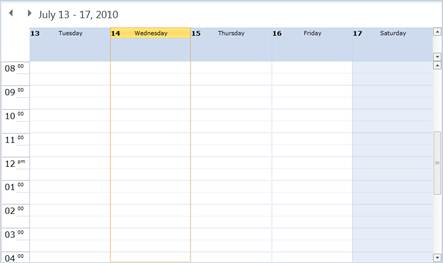
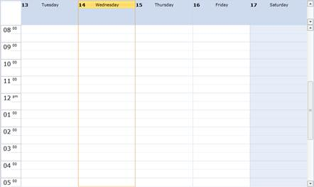
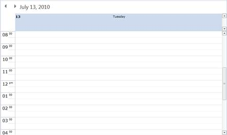
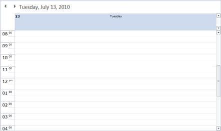

::: {style="DISPLAY: none"}
{#d2h_url_template}{#d2h_package_url style="WIDTH: 0px; DISPLAY: none; HEIGHT: 0px"}
:::

::::: {#nsbanner .d2h_main_nsbanner style="BORDER-BOTTOM: #999999 1px solid; POSITION: relative; PADDING-BOTTOM: 0px; BACKGROUND-COLOR: transparent; PADDING-LEFT: 0px; PADDING-RIGHT: 0px; DISPLAY: none; BORDER-TOP: #999999 1px solid; PADDING-TOP: 0px; LEFT: 0px"}
:::: {#TitleRow .d2h_main_titlerow style="PADDING-BOTTOM: 4px; BACKGROUND-COLOR: transparent; PADDING-LEFT: 22px; WIDTH: 100%; PADDING-RIGHT: 10px; DISPLAY: none; PADDING-TOP: 4px"}
::: {#ienav .d2h_main_ienav style="DISPLAY: none"}
{#D2HPrevious .D2HPreviousEnabled}  {#D2HNext .D2HNextEnabled}
:::
::::
:::::

:::: {#nstext .d2h_main_nstext style="PADDING-BOTTOM: 10px; BACKGROUND-COLOR: transparent; PADDING-LEFT: 22px; PADDING-RIGHT: 10px; HEIGHT: 100%; OVERFLOW: auto; PADDING-TOP: 5px" hasuserbackground="true" valign="bottom"}
::: {#d2h_breadcrumbs .d2h_breadcrumbs}
[Essential Studio User Guide Documentation](ms-xhelp:///?Id=12457748-09e3-4d74-a240-8e049cedf030){.d2h_breadcrumbsNormal}[ \> ]{.d2h_breadcrumbsLinkSeparator}[User Interface Edition](ms-xhelp:///?Id=c29296b7-531c-413b-a0ec-488ca1f7f669){.d2h_breadcrumbsNormal}[ \> ]{.d2h_breadcrumbsLinkSeparator}[Essential Silverlight](ms-xhelp:///?Id=66221bd1-ba2e-43c2-94a7-618f50e01d24){.d2h_breadcrumbsNormal}[ \> ]{.d2h_breadcrumbsLinkSeparator}[Essential Schedule]{.d2h_breadcrumbsContentsOnly}[ \> ]{.d2h_breadcrumbsLinkSeparator}[Schedule Control](ms-xhelp:///?Id=641660d5-c458-4c5d-9615-332d1a8eb458){.d2h_breadcrumbsNormal}[ \> ]{.d2h_breadcrumbsLinkSeparator}[Appearance](ms-xhelp:///?Id=436fb287-6cea-4a87-b33f-7177087dd205){.d2h_breadcrumbsNormal}
:::

### Title Bar {#title-bar style="tab-stops: 0pt"}

You have options for showing / hiding the title bar and also customizing the title bar text to the format you want. This topic covers:

[]{#_Title_Bar_Visibility}Title Bar Visibility

You can change the **Visibility** of the Title Bar in the Schedule control by using the **TitleBarVisibility** property. By default, the value is **Visible.**

+-----------------------------------------------------------------------------------------------------------------------------------------------------------------------------------------------------------------------------------------------------------------------------------------------------------------------------------------------------------------------------------------------------------------------------------------------------------------------------------------------------------------------------------------------------------------------------------------------------------------------------------------------------------------------------------------------------------------------+
| **[\[XAML\]]{style="FONT-FAMILY: 'Courier New'"}**[]{style="FONT-FAMILY: 'Courier New'"}                                                                                                                                                                                                                                                                                                                                                                                                                                                                                                                                                                                                                              |
|                                                                                                                                                                                                                                                                                                                                                                                                                                                                                                                                                                                                                                                                                                                       |
| [\<]{style="FONT-FAMILY: 'Courier New'; COLOR: blue"}[Schedule:Schedule]{style="FONT-FAMILY: 'Courier New'; COLOR: #a31515"}[ ]{style="FONT-FAMILY: 'Courier New'; COLOR: blue"}[x:Name]{style="FONT-FAMILY: 'Courier New'; COLOR: red"}[=]{style="FONT-FAMILY: 'Courier New'; COLOR: blue"}[\"]{style="FONT-FAMILY: 'Courier New'; COLOR: black"}[schedule]{style="FONT-FAMILY: 'Courier New'; COLOR: blue"}[\" ]{style="FONT-FAMILY: 'Courier New'; COLOR: black"}[TitleBarVisibility]{style="FONT-FAMILY: 'Courier New'; COLOR: red"}[=\"Collapsed\" ]{style="FONT-FAMILY: 'Courier New'; COLOR: blue"}[ /]{style="FONT-FAMILY: 'Courier New'; COLOR: black"}[\>]{style="FONT-FAMILY: 'Courier New'; COLOR: blue"} |
+-----------------------------------------------------------------------------------------------------------------------------------------------------------------------------------------------------------------------------------------------------------------------------------------------------------------------------------------------------------------------------------------------------------------------------------------------------------------------------------------------------------------------------------------------------------------------------------------------------------------------------------------------------------------------------------------------------------------------+

**[]{style="LINE-HEIGHT: 150%; FONT-FAMILY: 'Trebuchet MS','sans-serif'; COLOR: #15428b; FONT-SIZE: 9pt"}** 

{border="0"}

 

Figure 33: TitleBarVisibility is Visible

 

{border="0"}

 

Figure 34: TitleBarVisibility is Collapsed

[]{#_Title_Bar_Text} 

Title Bar Text Converter

You can change text format of the title bar text using the **TitleBarTextConverter** property. It accepts the value as **IValueConverter**

Usually , we have the format of the title bar text to be similar to  Outlook,which can changed based on the selected dates. In the following example, the format changed in Single day and Other formats are based on Outlook.  Like wise, you can change the formats based on the selected dates. In the **IValueConverte**r, the **object value** comes as **Selected Dates**. The code is as follows:

 

+-----------------------------------------------------------------------------------------------------------------------------------------------------------------------------------------------------------------------------------------------------------------------------------------------------------------------------------------------------------------------------------------------------------+
| **[\[XAML\]]{style="FONT-FAMILY: 'Courier New'"}**                                                                                                                                                                                                                                                                                                                                                        |
|                                                                                                                                                                                                                                                                                                                                                                                                           |
| [// Assign the IValueConverterClass Object into Schedule TitleBarTextConverter Property]{style="FONT-FAMILY: 'Courier New'; COLOR: green"}[]{style="FONT-FAMILY: 'Courier New'"}                                                                                                                                                                                                                          |
|                                                                                                                                                                                                                                                                                                                                                                                                           |
| [  [Schedule]{style="COLOR: #2b91af"} schedule = [new]{style="COLOR: blue"} [Schedule]{style="COLOR: #2b91af"}();]{style="FONT-FAMILY: 'Courier New'"}                                                                                                                                                                                                                                                    |
|                                                                                                                                                                                                                                                                                                                                                                                                           |
| [  [TitleBarTextConverter]{style="COLOR: #2b91af"} titleBarTextConverter = [new]{style="COLOR: blue"} [TitleBarTextConverter]{style="COLOR: #2b91af"}();]{style="FONT-FAMILY: 'Courier New'"}                                                                                                                                                                                                             |
|                                                                                                                                                                                                                                                                                                                                                                                                           |
| [  schedule.TitleBarTextConverter = titleBarTextConverter;[]{style="COLOR: blue"}]{style="FONT-FAMILY: 'Courier New'"}                                                                                                                                                                                                                                                                                    |
|                                                                                                                                                                                                                                                                                                                                                                                                           |
| []{style="FONT-FAMILY: 'Courier New'; COLOR: blue"}                                                                                                                                                                                                                                                                                                                                                       |
|                                                                                                                                                                                                                                                                                                                                                                                                           |
| [// IValueConverter Class]{style="FONT-FAMILY: 'Courier New'; COLOR: green"}[]{style="FONT-FAMILY: 'Courier New'"}                                                                                                                                                                                                                                                                                        |
|                                                                                                                                                                                                                                                                                                                                                                                                           |
| [public]{style="FONT-FAMILY: 'Courier New'; COLOR: blue"}[ [class]{style="COLOR: blue"} [TitleBarTextConverter]{style="COLOR: #2b91af"} : [IValueConverter]{style="COLOR: #2b91af"}]{style="FONT-FAMILY: 'Courier New'"}                                                                                                                                                                                  |
|                                                                                                                                                                                                                                                                                                                                                                                                           |
| [    {]{style="FONT-FAMILY: 'Courier New'"}                                                                                                                                                                                                                                                                                                                                                               |
|                                                                                                                                                                                                                                                                                                                                                                                                           |
| [        [public]{style="COLOR: blue"} [object]{style="COLOR: blue"} Convert([object]{style="COLOR: blue"} value, [Type]{style="COLOR: #2b91af"} targetType, [object]{style="COLOR: blue"} parameter, System.Globalization.[CultureInfo]{style="COLOR: #2b91af"} culture)]{style="FONT-FAMILY: 'Courier New'"}                                                                                            |
|                                                                                                                                                                                                                                                                                                                                                                                                           |
| [        {]{style="FONT-FAMILY: 'Courier New'"}                                                                                                                                                                                                                                                                                                                                                           |
|                                                                                                                                                                                                                                                                                                                                                                                                           |
| [            [var]{style="COLOR: blue"} selectedDates = value [as]{style="COLOR: blue"} [ObservableCollection]{style="COLOR: #2b91af"}\<[DateTime]{style="COLOR: #2b91af"}\>;]{style="FONT-FAMILY: 'Courier New'"}                                                                                                                                                                                        |
|                                                                                                                                                                                                                                                                                                                                                                                                           |
| [            [if]{style="COLOR: blue"} (selectedDates == [null]{style="COLOR: blue"})]{style="FONT-FAMILY: 'Courier New'"}                                                                                                                                                                                                                                                                                |
|                                                                                                                                                                                                                                                                                                                                                                                                           |
| [            {]{style="FONT-FAMILY: 'Courier New'"}                                                                                                                                                                                                                                                                                                                                                       |
|                                                                                                                                                                                                                                                                                                                                                                                                           |
| [                [return]{style="COLOR: blue"} value;]{style="FONT-FAMILY: 'Courier New'"}                                                                                                                                                                                                                                                                                                                |
|                                                                                                                                                                                                                                                                                                                                                                                                           |
| [            }]{style="FONT-FAMILY: 'Courier New'"}                                                                                                                                                                                                                                                                                                                                                       |
|                                                                                                                                                                                                                                                                                                                                                                                                           |
| [            [var]{style="COLOR: blue"} firstDate = selectedDates\[0\];]{style="FONT-FAMILY: 'Courier New'"}                                                                                                                                                                                                                                                                                              |
|                                                                                                                                                                                                                                                                                                                                                                                                           |
| [            [var]{style="COLOR: blue"} lastDate = selectedDates\[selectedDates.Count - 1\];            ]{style="FONT-FAMILY: 'Courier New'"}                                                                                                                                                                                                                                                             |
|                                                                                                                                                                                                                                                                                                                                                                                                           |
| [            [var]{style="COLOR: blue"} result = [string]{style="COLOR: blue"}.Empty;]{style="FONT-FAMILY: 'Courier New'"}                                                                                                                                                                                                                                                                                |
|                                                                                                                                                                                                                                                                                                                                                                                                           |
| [            [var]{style="COLOR: blue"} calendar = [CultureInfo]{style="COLOR: #2b91af"}.CurrentCulture.Calendar;]{style="FONT-FAMILY: 'Courier New'"}                                                                                                                                                                                                                                                    |
|                                                                                                                                                                                                                                                                                                                                                                                                           |
| [            [if]{style="COLOR: blue"} (selectedDates.Count == 1)]{style="FONT-FAMILY: 'Courier New'"}                                                                                                                                                                                                                                                                                                    |
|                                                                                                                                                                                                                                                                                                                                                                                                           |
| [            {                ]{style="FONT-FAMILY: 'Courier New'"}                                                                                                                                                                                                                                                                                                                                       |
|                                                                                                                                                                                                                                                                                                                                                                                                           |
| [                [// Changing the format for a Single Day]{style="COLOR: green"}]{style="FONT-FAMILY: 'Courier New'"}                                                                                                                                                                                                                                                                                     |
|                                                                                                                                                                                                                                                                                                                                                                                                           |
| [                result = selectedDates\[0\].ToLongDateString();]{style="FONT-FAMILY: 'Courier New'"}                                                                                                                                                                                                                                                                                                     |
|                                                                                                                                                                                                                                                                                                                                                                                                           |
| [            }]{style="FONT-FAMILY: 'Courier New'"}                                                                                                                                                                                                                                                                                                                                                       |
|                                                                                                                                                                                                                                                                                                                                                                                                           |
| [            [else]{style="COLOR: blue"} [if]{style="COLOR: blue"} (selectedDates.Count \> 1 && selectedDates.Count \<= 7)]{style="FONT-FAMILY: 'Courier New'"}                                                                                                                                                                                                                                           |
|                                                                                                                                                                                                                                                                                                                                                                                                           |
| [            {]{style="FONT-FAMILY: 'Courier New'"}                                                                                                                                                                                                                                                                                                                                                       |
|                                                                                                                                                                                                                                                                                                                                                                                                           |
| [                [if]{style="COLOR: blue"} (firstDate.Month == lastDate.Month && firstDate.Year == lastDate.Year)]{style="FONT-FAMILY: 'Courier New'"}                                                                                                                                                                                                                                                    |
|                                                                                                                                                                                                                                                                                                                                                                                                           |
| [                {]{style="FONT-FAMILY: 'Courier New'"}                                                                                                                                                                                                                                                                                                                                                   |
|                                                                                                                                                                                                                                                                                                                                                                                                           |
| [                    [string]{style="COLOR: blue"} lastDateString;]{style="FONT-FAMILY: 'Courier New'"}                                                                                                                                                                                                                                                                                                   |
|                                                                                                                                                                                                                                                                                                                                                                                                           |
| [                    [if]{style="COLOR: blue"} (lastDate.Day \< 10)]{style="FONT-FAMILY: 'Courier New'"}                                                                                                                                                                                                                                                                                                  |
|                                                                                                                                                                                                                                                                                                                                                                                                           |
| [                        lastDateString = [\"0\"]{style="COLOR: #a31515"} + lastDate.Day.ToString();]{style="FONT-FAMILY: 'Courier New'"}                                                                                                                                                                                                                                                                 |
|                                                                                                                                                                                                                                                                                                                                                                                                           |
| [                    [else]{style="COLOR: blue"}]{style="FONT-FAMILY: 'Courier New'"}                                                                                                                                                                                                                                                                                                                     |
|                                                                                                                                                                                                                                                                                                                                                                                                           |
| [                        lastDateString = lastDate.Day.ToString();]{style="FONT-FAMILY: 'Courier New'"}                                                                                                                                                                                                                                                                                                   |
|                                                                                                                                                                                                                                                                                                                                                                                                           |
| []{style="FONT-FAMILY: 'Courier New'"}                                                                                                                                                                                                                                                                                                                                                                    |
|                                                                                                                                                                                                                                                                                                                                                                                                           |
| [                    result = firstDate.ToString([\"M\"]{style="COLOR: #a31515"}).TrimEnd([\';\']{style="COLOR: #a31515"}) + [\" - \"]{style="COLOR: #a31515"} + lastDateString + [\", \"]{style="COLOR: #a31515"} + lastDate.Year.ToString();]{style="FONT-FAMILY: 'Courier New'"}                                                                                                                       |
|                                                                                                                                                                                                                                                                                                                                                                                                           |
| [                }           ]{style="FONT-FAMILY: 'Courier New'"}                                                                                                                                                                                                                                                                                                                                        |
|                                                                                                                                                                                                                                                                                                                                                                                                           |
| [                [else]{style="COLOR: blue"} [if]{style="COLOR: blue"} (firstDate.Year == lastDate.Year)                    ]{style="FONT-FAMILY: 'Courier New'"}                                                                                                                                                                                                                                         |
|                                                                                                                                                                                                                                                                                                                                                                                                           |
| [                    result = firstDate.ToString([\"M\"]{style="COLOR: #a31515"}).TrimEnd([\';\']{style="COLOR: #a31515"}) + [\" - \"]{style="COLOR: #a31515"} + lastDate.ToString([\"M\"]{style="COLOR: #a31515"}).TrimEnd([\';\']{style="COLOR: #a31515"}) + [\", \"]{style="COLOR: #a31515"} + lastDate.Year;]{style="FONT-FAMILY: 'Courier New'"}                                                     |
|                                                                                                                                                                                                                                                                                                                                                                                                           |
| [                [else]{style="COLOR: blue"}                    ]{style="FONT-FAMILY: 'Courier New'"}                                                                                                                                                                                                                                                                                                     |
|                                                                                                                                                                                                                                                                                                                                                                                                           |
| [                    result = firstDate.ToString([\"M\"]{style="COLOR: #a31515"}).TrimEnd([\';\']{style="COLOR: #a31515"}) + [\", \"]{style="COLOR: #a31515"} + firstDate.Year + [\" - \"]{style="COLOR: #a31515"} + lastDate.ToString([\"M\"]{style="COLOR: #a31515"}).TrimEnd([\';\']{style="COLOR: #a31515"}) + [\", \"]{style="COLOR: #a31515"} + lastDate.Year;]{style="FONT-FAMILY: 'Courier New'"} |
|                                                                                                                                                                                                                                                                                                                                                                                                           |
| [            }]{style="FONT-FAMILY: 'Courier New'"}                                                                                                                                                                                                                                                                                                                                                       |
|                                                                                                                                                                                                                                                                                                                                                                                                           |
| [            [else]{style="COLOR: blue"}]{style="FONT-FAMILY: 'Courier New'"}                                                                                                                                                                                                                                                                                                                             |
|                                                                                                                                                                                                                                                                                                                                                                                                           |
| [            {]{style="FONT-FAMILY: 'Courier New'"}                                                                                                                                                                                                                                                                                                                                                       |
|                                                                                                                                                                                                                                                                                                                                                                                                           |
| [                [if]{style="COLOR: blue"} (firstDate.Month == lastDate.Month && firstDate.Year == lastDate.Year)]{style="FONT-FAMILY: 'Courier New'"}                                                                                                                                                                                                                                                    |
|                                                                                                                                                                                                                                                                                                                                                                                                           |
| [                    result = firstDate.ToString([\"MMMM\"]{style="COLOR: #a31515"}) + [\" \"]{style="COLOR: #a31515"} + firstDate.Year;                ]{style="FONT-FAMILY: 'Courier New'"}                                                                                                                                                                                                             |
|                                                                                                                                                                                                                                                                                                                                                                                                           |
| [                [else]{style="COLOR: blue"} [if]{style="COLOR: blue"} (firstDate.Year == lastDate.Year)                ]{style="FONT-FAMILY: 'Courier New'"}                                                                                                                                                                                                                                             |
|                                                                                                                                                                                                                                                                                                                                                                                                           |
| [                    result = firstDate.ToString([\"MMMM\"]{style="COLOR: #a31515"}) + [\" - \"]{style="COLOR: #a31515"} +]{style="FONT-FAMILY: 'Courier New'"}[ lastDate.ToString([\"MMMM\"]{style="COLOR: #a31515"}) + [\" \"]{style="COLOR: #a31515"} + lastDate.Year;]{style="FONT-FAMILY: 'Courier New'"}                                                                                            |
|                                                                                                                                                                                                                                                                                                                                                                                                           |
| [                [else]{style="COLOR: blue"}                ]{style="FONT-FAMILY: 'Courier New'"}                                                                                                                                                                                                                                                                                                         |
|                                                                                                                                                                                                                                                                                                                                                                                                           |
| [                    result = firstDate.ToString([\"MMMM\"]{style="COLOR: #a31515"}) + [\" \"]{style="COLOR: #a31515"} + firstDate.Year + [\" - \"]{style="COLOR: #a31515"} + lastDate.ToString([\"MMMM\"]{style="COLOR: #a31515"}) + [\" \"]{style="COLOR: #a31515"} + lastDate.Year;]{style="FONT-FAMILY: 'Courier New'"}                                                                               |
|                                                                                                                                                                                                                                                                                                                                                                                                           |
| [            }]{style="FONT-FAMILY: 'Courier New'"}                                                                                                                                                                                                                                                                                                                                                       |
|                                                                                                                                                                                                                                                                                                                                                                                                           |
| [            [return]{style="COLOR: blue"} result;]{style="FONT-FAMILY: 'Courier New'"}                                                                                                                                                                                                                                                                                                                   |
|                                                                                                                                                                                                                                                                                                                                                                                                           |
| [        }]{style="FONT-FAMILY: 'Courier New'"}                                                                                                                                                                                                                                                                                                                                                           |
|                                                                                                                                                                                                                                                                                                                                                                                                           |
| []{style="FONT-FAMILY: 'Courier New'"}                                                                                                                                                                                                                                                                                                                                                                    |
|                                                                                                                                                                                                                                                                                                                                                                                                           |
| [        [public]{style="COLOR: blue"} [object]{style="COLOR: blue"} ConvertBack([object]{style="COLOR: blue"} value, [Type]{style="COLOR: #2b91af"} targetType, [object]{style="COLOR: blue"} parameter, System.Globalization.[CultureInfo]{style="COLOR: #2b91af"} culture)]{style="FONT-FAMILY: 'Courier New'"}                                                                                        |
|                                                                                                                                                                                                                                                                                                                                                                                                           |
| [        {]{style="FONT-FAMILY: 'Courier New'"}                                                                                                                                                                                                                                                                                                                                                           |
|                                                                                                                                                                                                                                                                                                                                                                                                           |
| [            [return]{style="COLOR: blue"} value;]{style="FONT-FAMILY: 'Courier New'"}                                                                                                                                                                                                                                                                                                                    |
|                                                                                                                                                                                                                                                                                                                                                                                                           |
| [        }]{style="FONT-FAMILY: 'Courier New'"}                                                                                                                                                                                                                                                                                                                                                           |
|                                                                                                                                                                                                                                                                                                                                                                                                           |
| []{style="FONT-FAMILY: 'Courier New'"}                                                                                                                                                                                                                                                                                                                                                                    |
|                                                                                                                                                                                                                                                                                                                                                                                                           |
| [    }]{style="FONT-FAMILY: 'Courier New'"}                                                                                                                                                                                                                                                                                                                                                               |
|                                                                                                                                                                                                                                                                                                                                                                                                           |
| []{style="FONT-FAMILY: 'Courier New'; COLOR: blue"}                                                                                                                                                                                                                                                                                                                                                       |
+-----------------------------------------------------------------------------------------------------------------------------------------------------------------------------------------------------------------------------------------------------------------------------------------------------------------------------------------------------------------------------------------------------------+

[]{style="FONT-FAMILY: 'Trebuchet MS','sans-serif'; COLOR: #15428b; FONT-SIZE: 9pt"} 

The following screenshots show the differentiation:

 

{border="0"}

 

Figure 35: Default Title Bar[]{style="FONT-FAMILY: 'Trebuchet MS','sans-serif'; COLOR: #15428b"}

*[]{style="LINE-HEIGHT: 150%; LETTER-SPACING: 0.75pt; FONT-FAMILY: 'Cambria','serif'; COLOR: #4f81bd; FONT-SIZE: 9pt"}* 

{border="0"}

 

Figure 36: Title Bar after Converter applied[]{style="FONT-FAMILY: 'Trebuchet MS','sans-serif'; COLOR: #15428b"}

[]{#related-topics}
::::
