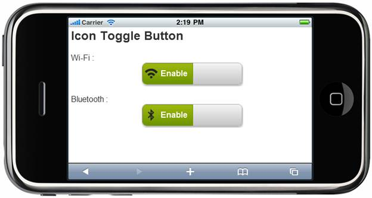

::: {style="DISPLAY: none"}
{#d2h_url_template} {#d2h_package_url style="WIDTH: 0px; DISPLAY: none; HEIGHT: 0px"}
:::

::: {.d2h_secondary_topic style="PADDING-BOTTOM: 10pt; MARGIN: 0pt; PADDING-LEFT: 0pt; PADDING-RIGHT: 0pt; PADDING-TOP: 0pt"}
##### ToggleState {#togglestate style="tab-stops: 0pt"}

The toggle state can be customized via the **ToggleState** property while the control is rendered initially.

 

Table 3 ToggleState Properties Table

+----------------+----------------------------------------------------------+------------------+--------------------------------------------------------------------------+-------------+
| Name           | Description                                              | Type of Property | Value it Accepts                                                         | Dependency  |
+----------------+----------------------------------------------------------+------------------+--------------------------------------------------------------------------+-------------+
| Bool Value     | True---Makes the toggle button active in enabled state   | Bool             | True                                                                     | \-          |
|                |                                                          |                  |                                                                          |             |
|                | False---Makes the toggle button active in disabled state |                  | False                                                                    |             |
+----------------+----------------------------------------------------------+------------------+--------------------------------------------------------------------------+-------------+
| MobToggleState | On---Makes the toggle button active in enabled state     | Enum             | [MobToggleState]{style="FONT-FAMILY: 'Courier New'; COLOR: #2b91af"}.On  | \-          |
|                |                                                          |                  |                                                                          |             |
|                | Off---Makes the toggle button active in disabled state   |                  | [MobToggleState]{style="FONT-FAMILY: 'Courier New'; COLOR: #2b91af"}.Off |             |
+----------------+----------------------------------------------------------+------------------+--------------------------------------------------------------------------+-------------+

 

Using Builder

The following steps explain how to set the state settings in the ToggleButton control using Builder:

 

3.   In the **view**, invoke the **ToggleButton** helper with the control ID as the first argument followed by the **AutoFormat**, **ToggleState**, **OnText**, **OffText**, **OnStateImageUrl**, and **OffStateImageUrl** methods with their respective text and images.

 

+-----------------------------------------------------------------------------------------------------------------------------------------------------------------+
| **[\[ASPX\]]{style="FONT-FAMILY: 'Courier New'"}**                                                                                                              |
|                                                                                                                                                                 |
| [        [\<%]{style="BACKGROUND: yellow"}[=]{style="COLOR: blue"}\                                                                                             |
|           Html.MobSyncfusion().ToggleButton([\"Togg\"]{style="COLOR: #a31515"})\                                                                                |
|              .ToggleState([MobToggleState]{style="COLOR: #2b91af"}.On)\                                                                                         |
|              .OnText([\"Enable\"]{style="COLOR: #a31515"})\                                                                                                     |
|              .OffText([\"Disable]{style="COLOR: #a31515"})\                                                                                                     |
|              .OnStateImageUrl([\"../Content/Button/Images/Wifi.png\"]{style="COLOR: #a31515"})\                                                                 |
|              .OffStateImageUrl([\"../Content/Button/Images/Wifi.png\"]{style="COLOR: #a31515"})\                                                                |
|              .AutoFormat([MobSkins]{style="COLOR: #2b91af"}.Spinach)[%\>\                                                                                       |
| \                                                                                                                                                               |
| ]{style="BACKGROUND: yellow"}]{style="FONT-FAMILY: 'Courier New'"}                                                                                              |
|                                                                                                                                                                 |
| [        [\<%]{style="BACKGROUND: yellow"}[=]{style="COLOR: blue"}\                                                                                             |
|            Html.MobSyncfusion().ToggleButton([\"Togg1\"]{style="COLOR: #a31515"})\                                                                              |
|                .ToggleState(false)\                                                                                                                             |
|                .OnText([\"Enable\"]{style="COLOR: #a31515"})\                                                                                                   |
|                .OffText([\"Disable]{style="COLOR: #a31515"})\                                                                                                   |
|                .OnStateImageUrl([\"../Content/Button/Images/Wifi.png\"]{style="COLOR: #a31515"})\                                                               |
|                .OffStateImageUrl([\"../Content/Button/Images/Wifi.png\"]{style="COLOR: #a31515"})\                                                              |
|                .AutoFormat([MobSkins]{style="COLOR: #2b91af"}.Spinach) [%\>]{style="BACKGROUND: yellow"}]{style="FONT-FAMILY: 'Courier New'"}                   |
|                                                                                                                                                                 |
| **[\[Razor\]]{style="FONT-FAMILY: 'Courier New'"}**                                                                                                             |
|                                                                                                                                                                 |
| [        ]{style="FONT-FAMILY: 'Courier New'; COLOR: blue"} [\@{]{style="FONT-FAMILY: 'Courier New'; BACKGROUND: yellow"} [\                                    |
|         ]{style="FONT-FAMILY: 'Courier New'"} [Html.MobSyncfusion().ToggleButton([\"Togg\"]{style="COLOR: #a31515"})\                                           |
|             .ToggleState([MobToggleState]{style="COLOR: #2b91af"}.On)\                                                                                          |
|             .OnText([\"Enable\"]{style="COLOR: #a31515"})\                                                                                                      |
|             .OffText([\"Disable]{style="COLOR: #a31515"})\                                                                                                      |
|             .OnStateImageUrl([\"../Content/Button/Images/Wifi.png\"]{style="COLOR: #a31515"})\                                                                  |
|             .OffStateImageUrl([\"../Content/Button/Images/Wifi.png\"]{style="COLOR: #a31515"})\                                                                 |
|             .AutoFormat([MobSkins]{style="COLOR: #2b91af"}.Spinach)\                                                                                            |
|             .Render(); ]{style="FONT-FAMILY: 'Courier New'"} [}]{style="FONT-FAMILY: 'Courier New'; BACKGROUND: yellow"} []{style="FONT-FAMILY: 'Courier New'"} |
|                                                                                                                                                                 |
| [         ]{style="FONT-FAMILY: 'Courier New'; COLOR: white"} [\@{]{style="FONT-FAMILY: 'Courier New'; BACKGROUND: yellow"} [\                                  |
| ]{style="FONT-FAMILY: 'Courier New'"} [         Html.MobSyncfusion().ToggleButton([\"Togg1\"]{style="COLOR: #a31515"})[\                                        |
| ]{style="COLOR: #a31515"}            .ToggleState(false)\                                                                                                       |
|             .OnText([\"Enable\"]{style="COLOR: #a31515"})\                                                                                                      |
|             .OffText([\"Disable]{style="COLOR: #a31515"})\                                                                                                      |
|             .OnStateImageUrl([\"../Content/Button/Images/Wifi.png\"]{style="COLOR: #a31515"})\                                                                  |
|             .OffStateImageUrl([\"../Content/Button/Images/Wifi.png\"]{style="COLOR: #a31515"})\                                                                 |
|            .AutoFormat([MobSkins]{style="COLOR: #2b91af"}.Spinach)\                                                                                             |
|            .Render(); ]{style="FONT-FAMILY: 'Courier New'"} [}]{style="FONT-FAMILY: 'Courier New'; BACKGROUND: yellow"}                                         |
+-----------------------------------------------------------------------------------------------------------------------------------------------------------------+

 

4.   Build and run the application.

 

Using Properties Model

The following steps explain how to set the state settings in the ToggleButton control using the properties model:

 

4.   In the **controller**, create an instance of **MobToggleButtonModel**, define the **ToggleState** property and pass the instance through **ViewData** to **View** as given below:**

*[[]{style="TEXT-DECORATION: none"}]{.underline}*  

+--------------------------------------------------------------------------------------------------------------------------------------------------------------------------------------------------------------------+
| **[Controller]{style="FONT-FAMILY: 'Courier New'"}**                                                                                                                                                               |
|                                                                                                                                                                                                                    |
| [       [public]{style="COLOR: blue"}[ActionResult]{style="COLOR: #2b91af"} ToggleButton()]{style="FONT-FAMILY: 'Courier New'"}                                                                                    |
|                                                                                                                                                                                                                    |
| [        {]{style="FONT-FAMILY: 'Courier New'"}                                                                                                                                                                    |
|                                                                                                                                                                                                                    |
| [            [MobToggleButtonModel]{style="COLOR: #2b91af"} model = [new]{style="COLOR: blue"}[MobToggleButtonModel]{style="COLOR: #2b91af"}()]{style="FONT-FAMILY: 'Courier New'"}                                |
|                                                                                                                                                                                                                    |
|             [{]{style="FONT-FAMILY: 'Courier New'"}                                                                                                                                                                |
|                                                                                                                                                                                                                    |
| [                ]{style="FONT-FAMILY: 'Courier New'"} [OnText=[\"Enable\"]{style="COLOR: #a31515"},]{style="FONT-FAMILY: 'Courier New'"}                                                                          |
|                                                                                                                                                                                                                    |
| [                OffText=[\"Disable\"]{style="COLOR: #a31515"},]{style="FONT-FAMILY: 'Courier New'"}                                                                                                               |
|                                                                                                                                                                                                                    |
| [                OnStateImageUrl=[\"../Content/Button/Images/Wifi.png\"]{style="COLOR: #a31515"},[]{style="COLOR: #a31515"}]{style="FONT-FAMILY: 'Courier New'"}                                                   |
|                                                                                                                                                                                                                    |
| [                OffStateImageUrl=[\"../Content/Button/Images/ Bluetooth.png\"]{style="COLOR: #a31515"},]{style="FONT-FAMILY: 'Courier New'"}                                                                      |
|                                                                                                                                                                                                                    |
| [                AutoFormat=[MobSkins]{style="COLOR: #2b91af"}.Spinach]{style="FONT-FAMILY: 'Courier New'"}                                                                                                        |
|                                                                                                                                                                                                                    |
| [            };]{style="FONT-FAMILY: 'Courier New'"}                                                                                                                                                               |
|                                                                                                                                                                                                                    |
| [             MobToggleButtonModel]{style="FONT-FAMILY: 'Courier New'; COLOR: #2b91af"} [ model1 = [new]{style="COLOR: blue"}[MobToggleButtonModel]{style="COLOR: #2b91af"}()]{style="FONT-FAMILY: 'Courier New'"} |
|                                                                                                                                                                                                                    |
| [            {]{style="FONT-FAMILY: 'Courier New'"}                                                                                                                                                                |
|                                                                                                                                                                                                                    |
| [                ]{style="FONT-FAMILY: 'Courier New'"} [OnText=[\"Enable\"]{style="COLOR: #a31515"},]{style="FONT-FAMILY: 'Courier New'"}                                                                          |
|                                                                                                                                                                                                                    |
| [                OffText=[\"Disable\"]{style="COLOR: #a31515"},]{style="FONT-FAMILY: 'Courier New'"}                                                                                                               |
|                                                                                                                                                                                                                    |
| [                OnStateImageUrl=[\"../Content/Button/Images/Wifi.png\"]{style="COLOR: #a31515"},[]{style="COLOR: #a31515"}]{style="FONT-FAMILY: 'Courier New'"}                                                   |
|                                                                                                                                                                                                                    |
| [                OffStateImageUrl=[\"../Content/Button/Images/Bluetooth.png\"]{style="COLOR: #a31515"},]{style="FONT-FAMILY: 'Courier New'"}                                                                       |
|                                                                                                                                                                                                                    |
| [                AutoFormat=[MobSkins]{style="COLOR: #2b91af"}.Spinach,]{style="FONT-FAMILY: 'Courier New'"}                                                                                                       |
|                                                                                                                                                                                                                    |
| [                ToggleState = [MobToggleState]{style="COLOR: #2b91af"}.Off]{style="FONT-FAMILY: 'Courier New'"}                                                                                                   |
|                                                                                                                                                                                                                    |
| [            };]{style="FONT-FAMILY: 'Courier New'"}                                                                                                                                                               |
|                                                                                                                                                                                                                    |
| [            ViewData\[[\"Toggle\"]{style="COLOR: #a31515"}\] = model;]{style="FONT-FAMILY: 'Courier New'"}                                                                                                        |
|                                                                                                                                                                                                                    |
| [            ViewData\[[\"Toggle1\"]{style="COLOR: #a31515"}\] = model1;]{style="FONT-FAMILY: 'Courier New'"}                                                                                                      |
|                                                                                                                                                                                                                    |
| [            [return]{style="COLOR: blue"} View();]{style="FONT-FAMILY: 'Courier New'"}                                                                                                                            |
|                                                                                                                                                                                                                    |
| [        }]{style="FONT-FAMILY: 'Courier New'"}                                                                                                                                                                    |
+--------------------------------------------------------------------------------------------------------------------------------------------------------------------------------------------------------------------+

 

5.   In the **view**, invoke the **ToggleButton** helper with the **ViewData** key as the first argument.

 

+--------------------------------------------------------------------------------------------------------------------------------------------------------------------------------------------------------------------------------------------------------------------------------------------------------------------------------------+
| **[\[ASPX\]]{style="FONT-FAMILY: 'Courier New'"}**                                                                                                                                                                                                                                                                                   |
|                                                                                                                                                                                                                                                                                                                                      |
| [       [\<%]{style="BACKGROUND: yellow"}[=]{style="COLOR: blue"}Html.MobSyncfusion().ToggleButton]{style="FONT-FAMILY: 'Courier New'"} [([\"Toggle\"]{style="COLOR: #a31515"}]{style="FONT-FAMILY: 'Courier New'"} [)[%\>]{style="BACKGROUND: yellow"}]{style="FONT-FAMILY: 'Courier New'"}                                         |
|                                                                                                                                                                                                                                                                                                                                      |
| [       [\<%]{style="BACKGROUND: yellow"}[=]{style="COLOR: blue"}Html.MobSyncfusion().ToggleButton]{style="FONT-FAMILY: 'Courier New'"} [([\"Toggle1\"]{style="COLOR: #a31515"}]{style="FONT-FAMILY: 'Courier New'"} [)[%\>]{style="BACKGROUND: yellow"}]{style="FONT-FAMILY: 'Courier New'"} []{style="FONT-FAMILY: 'Courier New'"} |
|                                                                                                                                                                                                                                                                                                                                      |
| **[]{style="FONT-FAMILY: 'Courier New'"}**                                                                                                                                                                                                                                                                                           |
|                                                                                                                                                                                                                                                                                                                                      |
| **[\[Razor\]]{style="FONT-FAMILY: 'Courier New'"}**                                                                                                                                                                                                                                                                                  |
|                                                                                                                                                                                                                                                                                                                                      |
| [       [\@{]{style="BACKGROUND: yellow"}Html.MobSyncfusion().ToggleButton([\"Toggle\"]{style="COLOR: #a31515"}).Render();[}]{style="BACKGROUND: yellow"}]{style="FONT-FAMILY: 'Courier New'"}                                                                                                                                       |
|                                                                                                                                                                                                                                                                                                                                      |
| [       [\@{]{style="BACKGROUND: yellow"}Html.MobSyncfusion().ToggleButton([\"Toggle1\"]{style="COLOR: #a31515"}).Render();[}]{style="BACKGROUND: yellow"}]{style="FONT-FAMILY: 'Courier New'"}                                                                                                                                      |
+--------------------------------------------------------------------------------------------------------------------------------------------------------------------------------------------------------------------------------------------------------------------------------------------------------------------------------------+

[]{style="BACKGROUND: yellow"} 

6.   Build and run the application.

 

The output is shown in the following screenshot:

{border="0"}

Figure 167: ToggleButton---ToggleState Property

[]{#related-topics}
:::
