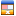
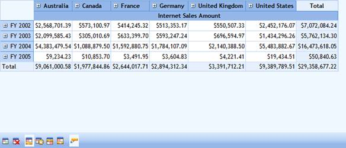

::: {style="DISPLAY: none"}
{#d2h_url_template}{#d2h_package_url style="WIDTH: 0px; DISPLAY: none; HEIGHT: 0px"}
:::

::::: {#nsbanner .d2h_main_nsbanner style="BORDER-BOTTOM: #999999 1px solid; POSITION: relative; PADDING-BOTTOM: 0px; BACKGROUND-COLOR: transparent; PADDING-LEFT: 0px; PADDING-RIGHT: 0px; DISPLAY: none; BORDER-TOP: #999999 1px solid; PADDING-TOP: 0px; LEFT: 0px"}
:::: {#TitleRow .d2h_main_titlerow style="PADDING-BOTTOM: 4px; BACKGROUND-COLOR: transparent; PADDING-LEFT: 22px; WIDTH: 100%; PADDING-RIGHT: 10px; DISPLAY: none; PADDING-TOP: 4px"}
::: {#ienav .d2h_main_ienav style="DISPLAY: none"}
{#D2HPrevious .D2HPreviousEnabled}  {#D2HNext .D2HNextEnabled}
:::
::::
:::::

:::::: {#nstext .d2h_main_nstext style="PADDING-BOTTOM: 10px; BACKGROUND-COLOR: transparent; PADDING-LEFT: 22px; PADDING-RIGHT: 10px; HEIGHT: 100%; OVERFLOW: auto; PADDING-TOP: 5px" hasuserbackground="true" valign="bottom"}
::: {#d2h_breadcrumbs .d2h_breadcrumbs}
[Essential Studio User Guide Documentation](ms-xhelp:///?Id=12457748-09e3-4d74-a240-8e049cedf030){.d2h_breadcrumbsNormal}[ \> ]{.d2h_breadcrumbsLinkSeparator}[Business Intelligence Edition](ms-xhelp:///?Id=fdf33dd8-62b2-47b9-ad7b-fc50e590bca5){.d2h_breadcrumbsNormal}[ \> ]{.d2h_breadcrumbsLinkSeparator}[Essential BI ASP.NET](ms-xhelp:///?Id=99c6694e-59c3-4c59-abb5-ce9ce9a948bc){.d2h_breadcrumbsNormal}[ \> ]{.d2h_breadcrumbsLinkSeparator}[Essential BI Grid]{.d2h_breadcrumbsContentsOnly}[ \> ]{.d2h_breadcrumbsLinkSeparator}[Concepts and Features](ms-xhelp:///?Id=6745c49b-2e43-4f50-aaf9-6e9c42650969){.d2h_breadcrumbsNormal}
:::

## Toolbar {#toolbar style="tab-stops: 0pt"}

The OLAP grid toolbar showcases the important features of the OLAP grid such as conditional formatting, changing grid layouts, and value cell ToolTip configuration.

+----------------------------------------------------------------------------------------------------------------------------------------------------+
| **[\[C#\]]{style="FONT-FAMILY: 'Courier New'"}**                                                                                                   |
|                                                                                                                                                    |
| [// To Show OLAP Grid Toolbar.]{style="FONT-FAMILY: 'Courier New'; COLOR: green"}                                                                  |
|                                                                                                                                                    |
| [this]{style="FONT-FAMILY: 'Courier New'; COLOR: blue"}[.OlapGrid1.ShowToolBar = [true]{style="COLOR: blue"};]{style="FONT-FAMILY: 'Courier New'"} |
+----------------------------------------------------------------------------------------------------------------------------------------------------+

 

+------------------------------------------------------------------------------------------------------------------------------------------------------------------------+
| **[\[VB\]]{style="FONT-FAMILY: 'Courier New'"}**                                                                                                                       |
|                                                                                                                                                                        |
| [\'To Show OLAP Grid Toolbar.]{style="FONT-FAMILY: 'Courier New'; COLOR: green"}[]{style="FONT-FAMILY: 'Courier New'"}                                                 |
|                                                                                                                                                                        |
| [Me]{style="FONT-FAMILY: 'Courier New'; COLOR: blue"}[.OlapGrid1.ShowToolBar = [True]{style="COLOR: blue"}]{style="FONT-FAMILY: 'Courier New'"}[]{style="COLOR: blue"} |
+------------------------------------------------------------------------------------------------------------------------------------------------------------------------+

 

Toolbar Items

The following are the items available in the grid toolbar.

 

Table 18: Toolbar Items

::: {align="center"}
+----------------------------------------------------------------------------------------------------------------------------------------+--------------------------------+--------------------------------------------------------------------------------+
| Icon                                                                                                                                   | Option                         | Description                                                                    |
+----------------------------------------------------------------------------------------------------------------------------------------+--------------------------------+--------------------------------------------------------------------------------+
| {border="0"}                                                                          | Apply Conditional Formatting   | Launches **Conditional Formatting** dialog to conditionally format grid cells. |
|                                                                                                                                        |                                |                                                                                |
| []{style="FONT-SIZE: 12pt"}                                                                                                            |                                |                                                                                |
+----------------------------------------------------------------------------------------------------------------------------------------+--------------------------------+--------------------------------------------------------------------------------+
| [{border="0"}]{style="FONT-SIZE: 12pt"}[]{style="FONT-SIZE: 12pt"}                   | Clear Formatting               | Clears the formatting applied in the OLAP Grid.                                |
+----------------------------------------------------------------------------------------------------------------------------------------+--------------------------------+--------------------------------------------------------------------------------+
| [{border="0"}]{style="FONT-SIZE: 12pt"}[]{style="FONT-SIZE: 12pt"}           | Normal Grid Layout             | Sets the Normal layout of the OLAP grid.                                       |
+----------------------------------------------------------------------------------------------------------------------------------------+--------------------------------+--------------------------------------------------------------------------------+
| [{border="0"}]{style="FONT-SIZE: 12pt"}[]{style="FONT-SIZE: 12pt"}            | Excel-like Layout              | Sets the Excel-like layout of the OLAP grid.                                   |
+----------------------------------------------------------------------------------------------------------------------------------------+--------------------------------+--------------------------------------------------------------------------------+
| [{border="0"}]{style="FONT-SIZE: 12pt"}[]{style="FONT-SIZE: 12pt"} | Normal Top Summary Grid Layout | Sets the Normal Top Summary layout of the OLAP grid.                           |
+----------------------------------------------------------------------------------------------------------------------------------------+--------------------------------+--------------------------------------------------------------------------------+
| [{border="0"}]{style="FONT-SIZE: 12pt"}[]{style="FONT-SIZE: 12pt"}          | No Summaries Layout            | Sets the No Summaries layout of the OLAP grid.                                 |
+----------------------------------------------------------------------------------------------------------------------------------------+--------------------------------+--------------------------------------------------------------------------------+
| [{border="0"}]{style="FONT-SIZE: 12pt"}[]{style="FONT-SIZE: 12pt"}                    | Value Cell Tooltip             | Shows/hides the value cell ToolTip.                                            |
+----------------------------------------------------------------------------------------------------------------------------------------+--------------------------------+--------------------------------------------------------------------------------+
:::

 

{border="0"}

Figure 33: OLAP Grid Toolbar

[]{#_Conditional_Formatting} 

Table 19: ShowToolBar Property

::: {align="center"}
  ------------------------------------- ------------------------------------------------------------------------------------------------------- ------------------------------------- ---------------------------------
  Property                              Description                                                                                             Type                                  Data Type
  ShowToolBar[]{style="COLOR: black"}   [Enables/disables the toolbar containing options to edit the OlapGrid control.]{style="COLOR: black"}   [Server side]{style="COLOR: black"}   [boolean]{style="COLOR: black"}
  ------------------------------------- ------------------------------------------------------------------------------------------------------- ------------------------------------- ---------------------------------
:::

 

Sample Link

A sample demo is available at the following link:

**..\\Syncfusion\\EssentialStudio\\\<VersionNumber\>\\BI\\Web\\OlapGrid.Web\\Samples\\3.5\\Appearance\\OlapGrid ToolBar Demo**

[]{#related-topics}
::::::
