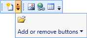

::: {style="DISPLAY: none"}
{#d2h_url_template}{#d2h_package_url style="WIDTH: 0px; DISPLAY: none; HEIGHT: 0px"}
:::

::: {.d2h_secondary_topic style="PADDING-BOTTOM: 10pt; MARGIN: 0pt; PADDING-LEFT: 0pt; PADDING-RIGHT: 0pt; PADDING-TOP: 0pt"}
#### ToolBarAdv with Overflow items {#toolbaradv-with-overflow-items style="TEXT-JUSTIFY: inter-ideograph; TEXT-ALIGN: justify; tab-stops: 0pt"}

When ToolBarAdv control contains more items, it cannot be displayed within the toolbar\'s size. So they are listed in the Overflow popup. You can click the Overflow button to view these items.

 

ToolBarAdv enables you to set the overflow mode for each item.

 

[·      ]{style="FONT-FAMILY: Symbol"}OverflowMode.Always -- Specified item will always be listed in the Overflow popup.

[·      ]{style="FONT-FAMILY: Symbol"}OverflowMode.Never - Specified item will never be moved to the Overflow popup.

[·      ]{style="FONT-FAMILY: Symbol"}OverflowMode.AsNeeded - Specified item will be listed in the Overflow popup if required.

 

{border="0"}

Figure 1107: ToolBarAdv with OverflowPanel

 

 

[]{#related-topics}
:::
