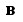
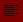
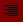
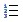
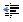

::: {style="DISPLAY: none"}
{#d2h_url_template}{#d2h_package_url style="WIDTH: 0px; DISPLAY: none; HEIGHT: 0px"}
:::

::::::::::: {.d2h_secondary_topic style="PADDING-BOTTOM: 10pt; MARGIN: 0pt; PADDING-LEFT: 0pt; PADDING-RIGHT: 0pt; PADDING-TOP: 0pt"}
##### [Toolbar Commands]{style="FONT-WEIGHT: normal"} {#toolbar-commands style="tab-stops: 0pt"}

[]{style="FONT-FAMILY: 'Trebuchet MS','sans-serif'; COLOR: #15428b; FONT-SIZE: 9pt"} 

The Editor contains a rich set of tool options included in the built-in toolbars of the RichTextEditor to allow the users edit content comprehensively. The buttons incorporated in the toolbar and its functionalities are listed below.

 

::: {align="center"}
  ----------------------------------------------------------------------------------------------------------------------------------------------------- ---------------------------- ------------------------ ------------------------------------------------------------------
  **Image**                                                                                                                                             **Icon Name**                **Insert Toolbar**       **Description**
  {border="0"}      \_Insert_InsertSmiley        Insert Smiley            Inserts emote icons in the editor.
  {border="0"}         \_Insert_Upload              UploadImage              Uploads image to server.
  {border="0"}       \_Insert_InsertImage         Insert Image             Inserts images in the editor.
  {border="0"}         \_Insert_InsertSymbol        Insert Symbol            Inserts symbols into the editor.
  {border="0"}   \_Insert_PageBreak           Insert Page Break        Inserts a page break in the current cursor position.
  {border="0"}         \_Insert_InsertDate          Insert Date              Inserts current date.
  {border="0"}         \_Insert_InsertTime          Insert Time              Inserts current time.
  {border="0"}         \_Insert_InsertRule          Insert Horizontal Rule   Inserts horizontal rule in the current cursor position.
  {border="0"}         \_Insert_InsertParagraph     Insert Paragraph         Positions the cursor at new paragraph.
  {border="0"}         \_Insert_Link                Link                     Creates a link to the file in the internet or your local system.
  {border="0"}         \_Insert_Unlink              UnLink                   Removes hyperlink from the selected text or image.
  {border="0"}         \_Insert_InsertFormElement   Insert Form Element      Inserts the form element from the set of predefined options.
  ----------------------------------------------------------------------------------------------------------------------------------------------------- ---------------------------- ------------------------ ------------------------------------------------------------------
:::

 

::: {align="center"}
  ---------------------------------------------------------------------------------------------------------------------------------------------------------- ----------------------- ------------------ ---------------------------------------------------------------
  **Image**                                                                                                                                                  **Icon Name**           **Edit Toolbar**   **Description**
  {border="0"}   \_Edit_SpellCheck       Spell Check        Does a spell checking.
  {border="0"}              \_Edit_Undo             Undo (Ctrl+Z)      Undo the last action.
  {border="0"}              \_Edit_Redo             Redo (Ctrl+Y)      Repeats the last action which has been undone.
  {border="0"}              \_Edit_Cut              Cut                Cuts selected text from the editor.
  {border="0"}              \_Edit_Copy             Copy               Copies the selected text from the editor.
  {border="0"}             \_Edit_Paste            Paste              Pastes the cut or copied text in the editor.
  {border="0"}             \_Edit_PasteWord        Paste From word    Pastes as plain text.
  {border="0"}             \_Edit_SelectAll        Select All         Selects entire content of the editor.
  {border="0"}             \_Edit_FindAndReplace   Find and Replace   Finds the specified text and replaces it with the given text.
  ---------------------------------------------------------------------------------------------------------------------------------------------------------- ----------------------- ------------------ ---------------------------------------------------------------
:::

 

::: {align="center"}
  --------------------------------------------------------------------------------------------------------------------------------------------------- ------------------------- ---------------------- ---------------------------------------------------------------
  **Image**                                                                                                                                           **Icon Name**             **Standard Toolbar**   **Description**
  {border="0"}            \_Standard_New            Create New Document    Opens a new Editor.
  {border="0"}     \_Standard_OpenRemote     Open remote document   Opens the *Open* dialog box to choose a file to be opened.
  {border="0"}      \_Standard_SaveLocal      Save local document    Saves file in the specified path.
  {border="0"}   \_Standard_PrintPreview   Print Preview          View the preview of the print page.
  {border="0"}          \_Standard_Print          Print                  Prints content of the current document or the whole web page.
  --------------------------------------------------------------------------------------------------------------------------------------------------- ------------------------- ---------------------- ---------------------------------------------------------------
:::

 

::: {align="center"}
  ------------------------------------------------------------------------------------------------------------------------------------------------------ ------------------------- ------------------------ ----------------------------------------
  **Image**                                                                                                                                              **Icon Name**             **Table Toolbar**        **Description**
  {border="0"}       \_Table_InsertTable       Insert Table             Inserts a table.
  {border="0"}    \_Table_InsertTableRow    Insert Table Row         Inserts a row in the table.
  {border="0"}   \_Table_InsertTableCell   Insert Table Column      Inserts a column in the table.
  {border="0"}    \_Table_DeleteTableRow    Delete Table Row         Deletes a row from the table.
  {border="0"}   \_Table_DeleteTableCell   Delete Table Column      Deletes a column from the table.
  {border="0"}   \_Table_SplitTableCell    Split Table Cell         Splits the cell into two.
  {border="0"}   \_Table_MergeTableCell    Merge Table Cells        Merges the adjacent cells.
  {border="0"}        \_Table_ShowTableBorder   Show/Hide Table Border   Shows or hide the border of the table.
  ------------------------------------------------------------------------------------------------------------------------------------------------------ ------------------------- ------------------------ ----------------------------------------
:::

 

::: {align="center"}
  ---------------------------------------------------------------------------------------------------------------------------------------------------------- -------------------------- -------------------- ---------------------------------------------------------------------------------------------------------------
  **Image**                                                                                                                                                  **Icon Name**              **Format Toolbar**   **Description**
  {border="0"}            \_Format_Bold              Bold (Ctrl+B)        Bolds the highlighted text, if the text is already in bold, then it will be removed.
  {border="0"}            \_Format_Italic            Italic (Ctrl+I)      Italicizes the highlighted text in the editor, if the text is already in italicized, then it will be removed.
  {border="0"}            \_Format_Underline         Underline (Ctrl+U)   Underlines the highlighted text in the editor, if the text is already in underlined, then it will be removed.
  {border="0"}            \_Format_Strike            Strikethrough        Strikes the selected text.
  {border="0"}            \_Format_LeftAligment      Align Left           Aligns the selected text to the left.
  {border="0"}            \_Format_CenterAligment    Center               Aligns the selected text at the center.
  {border="0"}            \_Format_RightAligment     Align Right          Aligns the selected text to the right.
  {border="0"}       \_Format_JustifyAligment   Justify              Justifies the selected text.
  {border="0"}            \_Format_OrderList         Numbering            Creates a numbered list for the selection.
  {border="0"}   \_Format_UnorderList       Bullets              Creates a bulleted list for the selection.
  {border="0"}            \_Format_Indent            Increase Indent      Applies indents to the paragraph.
  {border="0"}            \_Format_Outdent           Decrease Indent      Applies negative indent to the paragraph.
  {border="0"}             \_Format_Superscript       Superscript          Reduces font size of the selected text and raises the text above the baseline.
  {border="0"}             \_Format_Subscript         Subscript            Reduces font size of the selected text and lowers the text below the baseline.
  {border="0"}               \_Format_DirLeft           Left-To-Right        Enters text from left to right.
  {border="0"}              \_Format_DirRight          Right-To-Left        Enters text from right to left.
  {border="0"}            \_Format_Upper             To Uppercase         Converts text to upper case.
  {border="0"}            \_Format_Lower             To Lowercase         Converts text to lower case.
  {border="0"}            \_Format_CleanHTML         Clean HTML           Move cursor to the end.
  {border="0"}                \_Format_Remove            Remove Formatting    Clears any format applied to the selected text.
  ---------------------------------------------------------------------------------------------------------------------------------------------------------- -------------------------- -------------------- ---------------------------------------------------------------------------------------------------------------
:::

 

::: {align="center"}
  ------------------------------------------------------------------------------------------------------------------------------------------------ -------------------- ------------------- ----------------------------------------------------------------------------------
  **Image**                                                                                                                                        **Icon Name**        **Style Toolbar**   **Description**
  {border="0"}   \_Style_ForeColor    ForeColor           Specifies the foreground color of the selected text.
  {border="0"}   \_Style_BackColor    BackColor           Specifies the background color of the selected text.
  \-                                                                                                                                               \_Style_FontSize     Font Size           This collection allows you to specify the font size of the selected editor text.
  \-                                                                                                                                               \_Style_FontFamily   Font Family         This collection allows to you choose the font of the selected editor text.
  \-                                                                                                                                               \_Style_Style        Size                This collection allows you to apply some pre-defined styles to the editor text.
  ------------------------------------------------------------------------------------------------------------------------------------------------ -------------------- ------------------- ----------------------------------------------------------------------------------
:::

 

::: {align="center"}
  -------------------------------------------------------------------------------------------------------------------------------------------- --------------- ------------------ --------------------------------------------------------------------------
  **Image**                                                                                                                                    **Icon Name**   **Help Toolbar**   **Description**
  {border="0"}   \_Help_About    About Editor       Displays information about the editor.
  {border="0"}    \_Help_Help     Help               Launches the Quick Help with description of the various toolbar buttons.
  -------------------------------------------------------------------------------------------------------------------------------------------- --------------- ------------------ --------------------------------------------------------------------------
:::

 

::: {align="center"}
  ------------------------------------------------------------------------------------------------------------------------------------------------- ----------------------- ------------------- ---------------------------------------------------------
  **Image**                                                                                                                                         **Icon Name**           **Tools ToolBar**   **Description**
  {border="0"}   \_Tools_IncSize         Increase Size       Increases the width and height of the editor.
  {border="0"}   \_Tools_DecSize         Decrease Size       Decreases the width and height of the editor.
  {border="0"}   \_Tools_WindowRefresh   Refresh             Refreshes the page.
  {border="0"}   \_Tools_FullScreen      Full Screen         Specifies the control to occupy the entire screen size.
  ------------------------------------------------------------------------------------------------------------------------------------------------- ----------------------- ------------------- ---------------------------------------------------------
:::

 

[]{style="FONT-FAMILY: 'Trebuchet MS','sans-serif'; COLOR: #15428b; FONT-SIZE: 9pt"} 

See Also

[]{style="FONT-FAMILY: 'Trebuchet MS','sans-serif'; COLOR: #15428b; FONT-SIZE: 9pt"} 

[Controlling Visibility of the Toolbars]{.UGHyperlink}[]{.UGHyperlink}

 

[]{#related-topics}
:::::::::::
