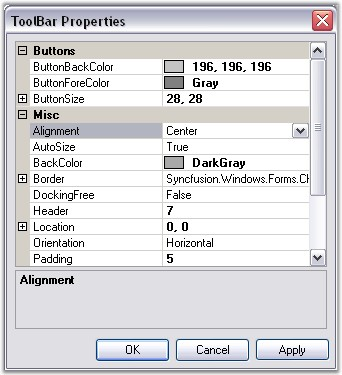

::: {style="DISPLAY: none"}
{#d2h_url_template}{#d2h_package_url style="WIDTH: 0px; DISPLAY: none; HEIGHT: 0px"}
:::

:::: {.d2h_secondary_topic style="PADDING-BOTTOM: 10pt; MARGIN: 0pt; PADDING-LEFT: 0pt; PADDING-RIGHT: 0pt; PADDING-TOP: 0pt"}
#### Toolbar Properties {#toolbar-properties style="tab-stops: 0pt"}

 

The chart control provides complete support for customizing the toolbar appearance. Use the ChartControl.**ToolBar** property to access the toolbar. At runtime, double-click the toolbar to show the **ToolBar Properties** dialog box as in the below image, which lists all the properties. For this, you need to set the **ToolBar.ShowDialog** property to **True**. If you do not want to display this dialog box, set this property to **False**.

 

{border="0"}

 

Figure 297: ToolBar Properties Dialog Box

 

Below are the toolbar properties and their description.

 

::: {align="center"}
  ------------------------ ------------------------------------------------------------------------------------------------------------
  Chart ToolBar Property   Description
  Alignment                Indicates the alignment of the toolbar. Default value is **Center**.
  Autosize                 Indicates if the toolbar can be resized automatically. Default value is **true**.
  BackColor                Indicates back color of the toolbar.
  Border                   Specifies the border style.
  Buttons                  List of buttons to which you can add new Buttons or delete existing ones.
  ButtonBackColor          Gets / sets the back color of the toolbar button.
  ButtonFlatStyle          Gets / sets the flat style appearance for the toolbar button control. Default value is **FlatStyle.Flat**.
  ButtonForeColor          Gets / sets the fore color of the toolbar button.
  ButtonSize               Indicates the button size of the toolbar buttons.
  DockingFree              Indicates if the toolbar is to be held docked. Default value is **false**.
  Header                   Gets / sets the height of the header. Default value **0**.
  Location                 Gets / sets the location of the toolbar.
  Orientation              Gets / sets the orientation of the toolbar. Default value is **Horizontal**.
  Position                 Gets / sets the docking position of the toolbar. Default value is **ChartDock.Top**.
  ShowBorder               Indicates if the border of the toolbar should be shown. Default value is **true**.
  Size                     Gets / sets the size of the toolbar button. Will be used only when Autosize property is set to **false**.
  Spacing                  Gets or sets the spacing. Default value is **4**.
  ------------------------ ------------------------------------------------------------------------------------------------------------
:::

 

[]{#p200} 

 

 

[]{#related-topics}
::::
