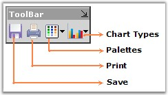
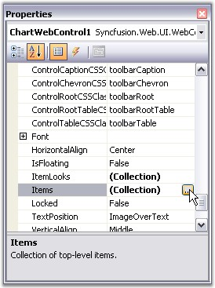
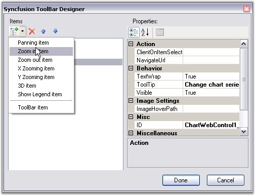
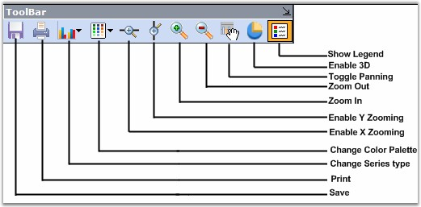

::: {style="DISPLAY: none"}
{#d2h_url_template}{#d2h_package_url style="WIDTH: 0px; DISPLAY: none; HEIGHT: 0px"}
:::

::::: {#nsbanner .d2h_main_nsbanner style="BORDER-BOTTOM: #999999 1px solid; POSITION: relative; PADDING-BOTTOM: 0px; BACKGROUND-COLOR: transparent; PADDING-LEFT: 0px; PADDING-RIGHT: 0px; DISPLAY: none; BORDER-TOP: #999999 1px solid; PADDING-TOP: 0px; LEFT: 0px"}
:::: {#TitleRow .d2h_main_titlerow style="PADDING-BOTTOM: 4px; BACKGROUND-COLOR: transparent; PADDING-LEFT: 22px; WIDTH: 100%; PADDING-RIGHT: 10px; DISPLAY: none; PADDING-TOP: 4px"}
::: {#ienav .d2h_main_ienav style="DISPLAY: none"}
{#D2HPrevious .D2HPreviousEnabled}  {#D2HNext .D2HNextEnabled}
:::
::::
:::::

::::: {#nstext .d2h_main_nstext style="PADDING-BOTTOM: 10px; BACKGROUND-COLOR: transparent; PADDING-LEFT: 22px; PADDING-RIGHT: 10px; HEIGHT: 100%; OVERFLOW: auto; PADDING-TOP: 5px" hasuserbackground="true" valign="bottom"}
::: {#d2h_breadcrumbs .d2h_breadcrumbs}
[Essential Studio User Guide Documentation](ms-xhelp:///?Id=12457748-09e3-4d74-a240-8e049cedf030){.d2h_breadcrumbsNormal}[ \> ]{.d2h_breadcrumbsLinkSeparator}[User Interface Edition](ms-xhelp:///?Id=c29296b7-531c-413b-a0ec-488ca1f7f669){.d2h_breadcrumbsNormal}[ \> ]{.d2h_breadcrumbsLinkSeparator}[Essential ASP.NET](ms-xhelp:///?Id=25c35330-c127-4dad-9a92-ed79dc7261a6){.d2h_breadcrumbsNormal}[ \> ]{.d2h_breadcrumbsLinkSeparator}[Essential Chart]{.d2h_breadcrumbsContentsOnly}[ \> ]{.d2h_breadcrumbsLinkSeparator}[Concepts and Features](ms-xhelp:///?Id=100687ce-82f2-4424-9d16-0949ea76cf15){.d2h_breadcrumbsNormal}[ \> ]{.d2h_breadcrumbsLinkSeparator}[Runtime Features](ms-xhelp:///?Id=c39d19cc-1870-49f0-82da-e2e91ebb2e43){.d2h_breadcrumbsNormal}
:::

### Toolbars {#toolbars style="tab-stops: 0pt"}

**[]{style="FONT-FAMILY: 'Trebuchet MS','sans-serif'"}** 

Essential Charts comes with a built-in toolbar that can be made visible to enable the user to do the following during runtime.

[]{style="FONT-FAMILY: 'Trebuchet MS','sans-serif'; FONT-SIZE: 9pt"} 

[·      ]{style="FONT-FAMILY: Symbol"}Save the chart as an image.

[·      ]{style="FONT-FAMILY: Symbol"}Copy the image to clipboard.

[·      ]{style="FONT-FAMILY: Symbol"}Print the chart.

[·      ]{style="FONT-FAMILY: Symbol"}Print Preview of the Chart.

[·      ]{style="FONT-FAMILY: Symbol"}Change the color palette of the chart.

[·      ]{style="FONT-FAMILY: Symbol"}Affects the style of the chart.

[·      ]{style="FONT-FAMILY: Symbol"}Change the Chart Type.

[·      ]{style="FONT-FAMILY: Symbol"}Toggle 3D style of the Chart.

[·      ]{style="FONT-FAMILY: Symbol"}Toggle Legend Appearance.

[]{style="FONT-FAMILY: 'Trebuchet MS','sans-serif'; FONT-SIZE: 9pt"} 

The toolbar can be made visible through the Chart\'s **ShowToolbar** property.

The toolbar looks like the following image.

[]{style="FONT-FAMILY: 'Trebuchet MS','sans-serif'; FONT-SIZE: 9pt"} 

{border="0"}

**[]{style="FONT-FAMILY: 'Trebuchet MS','sans-serif'; FONT-SIZE: 9pt"}** 

Figure 286: Built-In Chart Toolbar

[]{style="FONT-FAMILY: 'Trebuchet MS','sans-serif'; FONT-SIZE: 9pt"} 

The toolbar commands and their functionalities are described below.

[]{style="FONT-FAMILY: 'Trebuchet MS','sans-serif'; FONT-SIZE: 9pt"} 

::: {align="center"}
  ------------------------ ------------------------------------------------------------------------------------------------------------------------------------------------------------------
  Chart toolbar Commands   Description
  Save                     Using this command, user can save the chart to a specific location.
  Print                    This toolbar command is used to print the Chart.
  Palette                  Palette for the series can be chosen at run time using this command. All palette colors available in the designer will be available in this Palette option also.
  Chart Types              Any chart type can be set for the chart at run time using this command.
  ------------------------ ------------------------------------------------------------------------------------------------------------------------------------------------------------------
:::

[]{style="FONT-FAMILY: 'Trebuchet MS','sans-serif'; FONT-SIZE: 9pt"} 

Custom Toolbar Commands

[]{style="FONT-FAMILY: 'Trebuchet MS','sans-serif'; FONT-SIZE: 9pt"} 

You can also add custom toolbar items to the default toolbar items through designer. Open the Toolbar Designer using the **Items** property of the toolbar as illustrated in the below image.

[]{style="FONT-FAMILY: 'Trebuchet MS','sans-serif'; FONT-SIZE: 9pt"} 

{border="0"}

***[]{style="FONT-FAMILY: 'Trebuchet MS','sans-serif'; FONT-SIZE: 9pt"}*** 

Figure 287: Opening Toolbar Designer through Toolbar.Items property in Properties Dialog Box

**[]{style="FONT-FAMILY: 'Trebuchet MS','sans-serif'; FONT-SIZE: 9pt"}** 

In the **Syncfusion ToolBar Designer** dialog, select the custom command that you want to add, using the drop-down at the top left corner of the dialog. Once you finish adding the required commands, click **Done**.

**[]{style="FONT-FAMILY: 'Trebuchet MS','sans-serif'; FONT-SIZE: 9pt"}** 

{border="0"}

**[]{style="FONT-FAMILY: 'Trebuchet MS','sans-serif'; FONT-SIZE: 9pt"}** 

Figure 288: Adding Toolbar Commands

**[]{style="FONT-FAMILY: 'Trebuchet MS','sans-serif'; FONT-SIZE: 9pt"}** 

The custom commands are now added to the Chart Toolbar.

[]{style="FONT-FAMILY: 'Trebuchet MS','sans-serif'; FONT-SIZE: 9pt"} 

{border="0"}

***[]{style="FONT-FAMILY: 'Trebuchet MS','sans-serif'; FONT-SIZE: 9pt"}*** 

Figure 289: Custom Commands added to the Toolbar

**[]{style="FONT-FAMILY: 'Trebuchet MS','sans-serif'; FONT-SIZE: 9pt"}** 

See Also

[]{style="FONT-FAMILY: 'Trebuchet MS','sans-serif'; FONT-SIZE: 9pt"} 

[Toolbar Appearance]{.UGHyperlink}[]{.UGHyperlink}

[]{#p201} 

More:

[ ]{#related-topics}

[{border="0" align="absMiddle"}Toolbar Appearance](ms-xhelp:///?Id=dfb671b4-54b1-4506-b54f-70f95fbac9ed){style="TEXT-DECORATION: none"}
:::::
