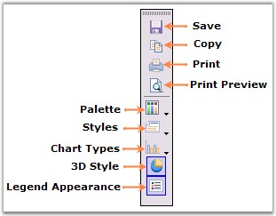
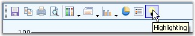
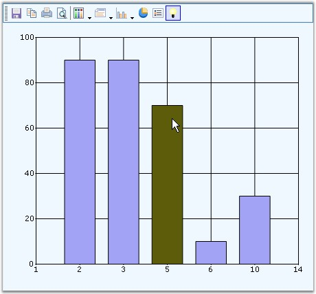

::: {style="DISPLAY: none"}
{#d2h_url_template}{#d2h_package_url style="WIDTH: 0px; DISPLAY: none; HEIGHT: 0px"}
:::

::::: {#nsbanner .d2h_main_nsbanner style="BORDER-BOTTOM: #999999 1px solid; POSITION: relative; PADDING-BOTTOM: 0px; BACKGROUND-COLOR: transparent; PADDING-LEFT: 0px; PADDING-RIGHT: 0px; DISPLAY: none; BORDER-TOP: #999999 1px solid; PADDING-TOP: 0px; LEFT: 0px"}
:::: {#TitleRow .d2h_main_titlerow style="PADDING-BOTTOM: 4px; BACKGROUND-COLOR: transparent; PADDING-LEFT: 22px; WIDTH: 100%; PADDING-RIGHT: 10px; DISPLAY: none; PADDING-TOP: 4px"}
::: {#ienav .d2h_main_ienav style="DISPLAY: none"}
{#D2HPrevious .D2HPreviousEnabled}  {#D2HNext .D2HNextEnabled}
:::
::::
:::::

:::::: {#nstext .d2h_main_nstext style="PADDING-BOTTOM: 10px; BACKGROUND-COLOR: transparent; PADDING-LEFT: 22px; PADDING-RIGHT: 10px; HEIGHT: 100%; OVERFLOW: auto; PADDING-TOP: 5px" hasuserbackground="true" valign="bottom"}
::: {#d2h_breadcrumbs .d2h_breadcrumbs}
[Essential Studio User Guide Documentation](ms-xhelp:///?Id=12457748-09e3-4d74-a240-8e049cedf030){.d2h_breadcrumbsNormal}[ \> ]{.d2h_breadcrumbsLinkSeparator}[User Interface Edition](ms-xhelp:///?Id=c29296b7-531c-413b-a0ec-488ca1f7f669){.d2h_breadcrumbsNormal}[ \> ]{.d2h_breadcrumbsLinkSeparator}[Essential Windows](ms-xhelp:///?Id=e60759d8-47a4-4570-9d7a-16a68d63f2ea){.d2h_breadcrumbsNormal}[ \> ]{.d2h_breadcrumbsLinkSeparator}[Essential Chart]{.d2h_breadcrumbsContentsOnly}[ \> ]{.d2h_breadcrumbsLinkSeparator}[Concepts and Features](ms-xhelp:///?Id=71321e9c-336c-4c1c-a127-be9f135ad4bb){.d2h_breadcrumbsNormal}[ \> ]{.d2h_breadcrumbsLinkSeparator}[Runtime Features](ms-xhelp:///?Id=90d48bbb-6229-484d-9d3e-31e26c59f1d3){.d2h_breadcrumbsNormal}
:::

### Toolbars {#toolbars style="tab-stops: 0pt"}

 

Essential Charts comes with a built-in Toolbar that can be made visible to enable the user to do the following during runtime.

 

[·      ]{style="FONT-FAMILY: Symbol"}Save the chart as an image.

[·      ]{style="FONT-FAMILY: Symbol"}Copy the image to clipboard.

[·      ]{style="FONT-FAMILY: Symbol"}Print the chart.

[·      ]{style="FONT-FAMILY: Symbol"}Print Preview of the Chart.

[·      ]{style="FONT-FAMILY: Symbol"}Change the color palette of the chart.

[·      ]{style="FONT-FAMILY: Symbol"}Affects the style of the chart.

[·      ]{style="FONT-FAMILY: Symbol"}Change the Chart Type.

[·      ]{style="FONT-FAMILY: Symbol"}Toggle 3D style of the Chart.

[·      ]{style="FONT-FAMILY: Symbol"}Toggle Legend Appearance.

 

The toolbar can be made visible through the ChartControl\'s **ShowToolbar** property.

 

The toolbar looks like the below image.

 

{border="0"}

 

Figure 294: Built-In Chart Toolbar

 

The toolbar commands and their functionalities are described below.

 

::: {align="center"}
  ---------------------------------------- ------------------------------ ------------------------------------------------------------------------------------------------------------------------------------------------------------------
  Chart toolbar Commands                   Chart toolbar Items name       Description
  Save                                     ChartToolbarSaveItem           Using this command, user can save the chart to a specific location.
  Copy                                     ChartToolBarCopyItem           Clicking this toolbar command will copy the chart to the clipboard.
  Styles                                   ChartToolBarStyleItem          This popsup a Chart Series Style dialog window, using which various properties and chart styles can be set.
  Print                                    ChartToolBarPrintItem          This toolbar command is used to print the Chart.
  Palette                                  ChartToolBarPaletteItem        Palette for the series can be chosen at run time using this command. All palette colors available in the designer will be available in this Palette option also.
  Chart Types                              ChartToolBarTypeItem           Any chart type can be set for the chart at run time using this command.
  Print Preview                            ChartToolBarPrintPreviewItem   This toolbar command is used to see a print preview of the Chart.
  []{#DDE_LINK1}Toggling 3D                ChartToolBarSeries3DItem       This command is used to toggle the 3D mode of the chart.
  []{#DDE_LINK2}Toggle Legend Appearance   ChartToolBarShowLegendItem     This command is used to toggle the legend appearance.
  Splitter                                 ChartToolBarSplitter           This item provides a logical split between the collection of commands.
  ---------------------------------------- ------------------------------ ------------------------------------------------------------------------------------------------------------------------------------------------------------------
:::

[]{style="COLOR: black"} 

Custom Toolbar Commands

 

You can also add custom toolbar items using **ChartToolBarCommandItem** class. The **ChartCommands** enum lists the commands that can be added. The following table describes  those commands.

 

::: {align="center"}
  ------------------------------- -------------------------------------------------------------------------------------------------------
  Chart toolbar Custom Commands   Description
  ZoomIn                          Using this command, user can zoom the chart.
  ZoomOut                         This command zooms out the chart.
  ResetZooming                    The zooming is reset using this command.
  AutoHighlight                   This command is used to enable the [autohighlight]{style="COLOR: black"} feature in the chart series.
  ToggleXZooming                  This toolbar command enables zooming in x-axis.
  ToggleYZooming                  This toolbar command enables zooming in y-axis.
  TogglePanning                   This command enables panning of the zoomed chart.
  ------------------------------- -------------------------------------------------------------------------------------------------------
:::

 

+-----------------------------------------------------------------------------------------------------------------------------------------------------------------------------------------------------------------+
| **[\[C#\]]{style="FONT-FAMILY: 'Courier New'; COLOR: black"}**                                                                                                                                                  |
|                                                                                                                                                                                                                 |
| []{style="FONT-FAMILY: 'Courier New'"}                                                                                                                                                                          |
|                                                                                                                                                                                                                 |
| [ChartToolBarCommandItem]{style="FONT-FAMILY: 'Courier New'; COLOR: teal"}[ x1 = [new]{style="COLOR: blue"} [ChartToolBarCommandItem]{style="COLOR: teal"}();]{style="FONT-FAMILY: 'Courier New'"}              |
|                                                                                                                                                                                                                 |
| [x1.Command = [ChartCommands]{style="COLOR: teal"}.AutoHighlight;]{style="FONT-FAMILY: 'Courier New'"}                                                                                                          |
|                                                                                                                                                                                                                 |
| [x1.IsCheckable = [false]{style="COLOR: blue"};]{style="FONT-FAMILY: 'Courier New'"}                                                                                                                            |
|                                                                                                                                                                                                                 |
| [Image]{style="FONT-FAMILY: 'Courier New'; COLOR: teal"}[ v = System.Drawing.[Image]{style="COLOR: teal"}.FromFile([@\"..\\..\\Data\\Visio.png\"]{style="COLOR: maroon"});]{style="FONT-FAMILY: 'Courier New'"} |
|                                                                                                                                                                                                                 |
| [x1.Image = v;]{style="FONT-FAMILY: 'Courier New'"}                                                                                                                                                             |
|                                                                                                                                                                                                                 |
| [x1.Name = [\"Custom Tools\"]{style="COLOR: maroon"};]{style="FONT-FAMILY: 'Courier New'"}                                                                                                                      |
|                                                                                                                                                                                                                 |
| [x1.ToolTip = [\"Highlighting\"]{style="COLOR: maroon"};]{style="FONT-FAMILY: 'Courier New'"}                                                                                                                   |
|                                                                                                                                                                                                                 |
| [x1.Checked = [true]{style="COLOR: blue"};]{style="FONT-FAMILY: 'Courier New'"}                                                                                                                                 |
|                                                                                                                                                                                                                 |
| [this]{style="FONT-FAMILY: 'Courier New'; COLOR: blue"}[.chartControl1.ToolBar.Items.Add(x1);   ]{style="FONT-FAMILY: 'Courier New'"}                                                                           |
+-----------------------------------------------------------------------------------------------------------------------------------------------------------------------------------------------------------------+

 

+----------------------------------------------------------------------------------------------------------------------------------------------------------------------------------------------------------------------------------------------+
| **[\[VB.NET\]]{style="FONT-FAMILY: 'Courier New'; COLOR: black"}**                                                                                                                                                                           |
|                                                                                                                                                                                                                                              |
| **[]{style="FONT-FAMILY: 'Courier New'; COLOR: black"}**                                                                                                                                                                                     |
|                                                                                                                                                                                                                                              |
| [Dim]{style="FONT-FAMILY: 'Courier New'; COLOR: blue"}[ x1 [As New]{style="COLOR: blue"} ChartToolBarCommandItem()]{style="FONT-FAMILY: 'Courier New'"}                                                                                      |
|                                                                                                                                                                                                                                              |
| [x1.Command = [ChartCommands]{style="COLOR: black"}.AutoHighlight]{style="FONT-FAMILY: 'Courier New'"}                                                                                                                                       |
|                                                                                                                                                                                                                                              |
| [x1.IsCheckable = False]{style="FONT-FAMILY: 'Courier New'"}                                                                                                                                                                                 |
|                                                                                                                                                                                                                                              |
| [Dim]{style="FONT-FAMILY: 'Courier New'; COLOR: blue"}[ v [As]{style="COLOR: blue"} Image = System.Drawing.[Image]{style="COLOR: black"}.FromFile([\"..\\..\\Data\\Visio.png\"]{style="COLOR: maroon"})]{style="FONT-FAMILY: 'Courier New'"} |
|                                                                                                                                                                                                                                              |
| [x1.Image = v]{style="FONT-FAMILY: 'Courier New'"}                                                                                                                                                                                           |
|                                                                                                                                                                                                                                              |
| [x1.Name = [\"Custom Tools\"]{style="COLOR: maroon"}]{style="FONT-FAMILY: 'Courier New'"}                                                                                                                                                    |
|                                                                                                                                                                                                                                              |
| [x1.ToolTip = [\"Highlighting\"]{style="COLOR: maroon"}]{style="FONT-FAMILY: 'Courier New'"}                                                                                                                                                 |
|                                                                                                                                                                                                                                              |
| [x1.Checked = True]{style="FONT-FAMILY: 'Courier New'"}                                                                                                                                                                                      |
|                                                                                                                                                                                                                                              |
| [Me]{style="FONT-FAMILY: 'Courier New'; COLOR: blue"}[.chartControl1.ToolBar.Items.Add(x1)]{style="FONT-FAMILY: 'Courier New'"}                                                                                                              |
+----------------------------------------------------------------------------------------------------------------------------------------------------------------------------------------------------------------------------------------------+

 

{border="0"}

 

Figure 295: CustomCommand = \"ChartCommands.AutoHighlight\" ; Command ToolTip = \"Highlighting\"

 

{border="0"}

 

Figure 296: AutoHighlight feature enabled in Chart using Custom Toolbar Command

[]{#p199} 

More:

[ ]{#related-topics}

[{border="0" align="absMiddle"}Toolbar Properties](ms-xhelp:///?Id=e30dd39d-a0ea-4c29-97d3-e28436c9d889){style="TEXT-DECORATION: none"}

[{border="0" align="absMiddle"}Appearance](ms-xhelp:///?Id=32ffeffd-7faf-4281-a68e-fcd59af8e93d){style="TEXT-DECORATION: none"}
::::::
