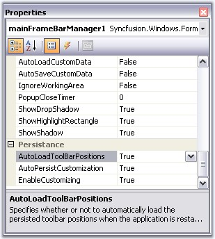
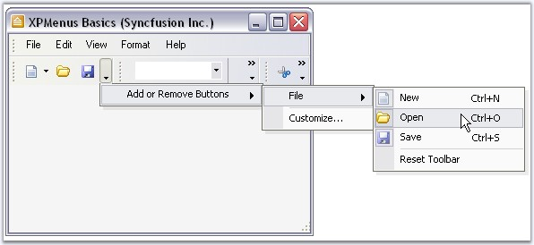
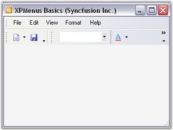

::: {style="DISPLAY: none"}
{#d2h_url_template}{#d2h_package_url style="WIDTH: 0px; DISPLAY: none; HEIGHT: 0px"}
:::

:::: {.d2h_secondary_topic style="PADDING-BOTTOM: 10pt; MARGIN: 0pt; PADDING-LEFT: 0pt; PADDING-RIGHT: 0pt; PADDING-TOP: 0pt"}
#### Toolbar State Persistence {#toolbar-state-persistence style="tab-stops: 0pt"}

[]{style="COLOR: #15428b"} 

Toolbar state can be saved in two ways.

[]{style="COLOR: #15428b"} 

[·      ]{style="FONT-FAMILY: Symbol"}Automatic serialization of Tool bar position.

[·      ]{style="FONT-FAMILY: Symbol"}It can be read/written to different media such as the default Isolated Storage, XML file, XML stream, Binary file, Binary stream and the Windows Registry.

[]{style="COLOR: #15428b"} 

If this is a MainFrameBarManager, the toolbar\'s positions will be retained during run-time. If it is a ChildFrameBarManager, then the toolbar\'s positions will be docked to the top border of the main frame.

[]{style="COLOR: #15428b"} 

::: {style="BORDER-BOTTOM: windowtext 1pt solid; BORDER-LEFT: medium none; PADDING-BOTTOM: 1pt; MARGIN-TOP: 9pt; PADDING-LEFT: 0pt; PADDING-RIGHT: 0pt; MARGIN-BOTTOM: 9pt; BORDER-TOP: windowtext 1pt solid; BORDER-RIGHT: medium none; PADDING-TOP: 1pt"}
{border="0"} Note: This is true, only when your application is run for the first time and subsequent invocations will use the user\'s latest settings, if the persisting toolbar position is turned on.
:::

[]{style="COLOR: #15428b"} 

The position of the toolbar and the customization applied by the user are stored in the user system\'s Isolated Storage.

[]{style="COLOR: #15428b"} 

You can turn on/off default persistence through the BarManager\'s **AutoLoadToolbarPositions** and **EnableCustomizing** properties.

[]{style="COLOR: #15428b"} 

{border="0"}

**[]{style="COLOR: #15428b"}** 

Figure 844: Toolbar State Persistence

**[]{style="COLOR: #15428b"}** 

We can customize the toolbar at run time and it can be stored by setting **AutoLoadToolBarPositions** property to true. The following screen shot displays the Toolbar customization at run time where BarItem \"Open\" is removed.

[]{style="COLOR: #15428b"} 

{border="0"}

***[]{style="COLOR: #15428b"}*** 

Figure 845: Removing the \"Open\" Bar Item

[]{style="COLOR: #15428b"} 

Close the application and again run the same application. The removed MenuBarItem \"Open\" is sustained. The following screen shot illustrates this.

[]{style="COLOR: #15428b"} 

{border="0"}

***[]{style="COLOR: #15428b"}*** 

Figure 846: \"Open\" Bar Item removed from the Toolbar

More:

[ ]{#related-topics}

[{border="0" align="absMiddle"}Save / Load the Bar Information](ms-xhelp:///?Id=feeb5216-80f4-4f64-a61b-3d93f2e37859){style="TEXT-DECORATION: none"}
::::
