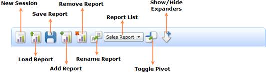
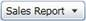
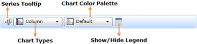
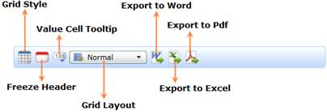

::: {style="DISPLAY: none"}
{#d2h_url_template}{#d2h_package_url style="WIDTH: 0px; DISPLAY: none; HEIGHT: 0px"}
:::

::::: {#nsbanner .d2h_main_nsbanner style="BORDER-BOTTOM: #999999 1px solid; POSITION: relative; PADDING-BOTTOM: 0px; BACKGROUND-COLOR: transparent; PADDING-LEFT: 0px; PADDING-RIGHT: 0px; DISPLAY: none; BORDER-TOP: #999999 1px solid; PADDING-TOP: 0px; LEFT: 0px"}
:::: {#TitleRow .d2h_main_titlerow style="PADDING-BOTTOM: 4px; BACKGROUND-COLOR: transparent; PADDING-LEFT: 22px; WIDTH: 100%; PADDING-RIGHT: 10px; DISPLAY: none; PADDING-TOP: 4px"}
::: {#ienav .d2h_main_ienav style="DISPLAY: none"}
{#D2HPrevious .D2HPreviousEnabled}  {#D2HNext .D2HNextEnabled}
:::
::::
:::::

:::::: {#nstext .d2h_main_nstext style="PADDING-BOTTOM: 10px; BACKGROUND-COLOR: transparent; PADDING-LEFT: 22px; PADDING-RIGHT: 10px; HEIGHT: 100%; OVERFLOW: auto; PADDING-TOP: 5px" hasuserbackground="true" valign="bottom"}
::: {#d2h_breadcrumbs .d2h_breadcrumbs}
[Essential Studio User Guide Documentation](ms-xhelp:///?Id=12457748-09e3-4d74-a240-8e049cedf030){.d2h_breadcrumbsNormal}[ \> ]{.d2h_breadcrumbsLinkSeparator}[Business Intelligence Edition](ms-xhelp:///?Id=fdf33dd8-62b2-47b9-ad7b-fc50e590bca5){.d2h_breadcrumbsNormal}[ \> ]{.d2h_breadcrumbsLinkSeparator}[Essential BI Silverlight](ms-xhelp:///?Id=c006b39c-6aa2-4637-b7de-3e7b6cb3f9f9){.d2h_breadcrumbsNormal}[ \> ]{.d2h_breadcrumbsLinkSeparator}[Essential BI Client]{.d2h_breadcrumbsContentsOnly}[ \> ]{.d2h_breadcrumbsLinkSeparator}[Features](ms-xhelp:///?Id=4ae10797-e3a8-4270-b8ba-34441d2e1a3d){.d2h_breadcrumbsNormal}
:::

## Tool Bar support {#tool-bar-support style="tab-stops: 0pt"}

There are three toolbars in OLAP Client to provide the number of options to perform the different operations.

[]{#_OLAP_Client_Tool}OLAP Client Tool Bar

This toolbar contains menus to invoke the particular operation of OLAP Client.

 

{border="0"}

 

Figure 33: OLAP Client Tool Bar

 

Table 5: OLAP Client Tool Bar

 

::: {align="center"}
  Icon                                        Name                  Description                                                                   Reference Link
  ------------------------------------------- --------------------- ----------------------------------------------------------------------------- -------------------------------------------------------------------------------------------------------
  {border="0"}   New Report            Creates a new session to create the report                                    [[New Report]{.UGHyperlink}](ms-xhelp:///?Id=54f1e025-9741-4f6d-9016-75ade78ecf50)[]{.UGHyperlink}
  {border="0"}   Load Report           Loads the reports from the saved XML file                                     [[Load Report]{.UGHyperlink}](ms-xhelp:///?Id=a63ed5b9-eec8-4d34-97f0-d0b10e84ef01)[]{.UGHyperlink}
  {border="0"}   Save Report           Saves the current session as an XML file                                      [[Save Report]{.UGHyperlink}](ms-xhelp:///?Id=a63ed5b9-eec8-4d34-97f0-d0b10e84ef01)[]{.UGHyperlink}
  {border="0"}   Add Report            Adds a new report to the current report set                                   [[Add Report]{.UGHyperlink}](ms-xhelp:///?Id=efb8ff73-9f7f-414c-bc7a-5f9f78705c5e)[]{.UGHyperlink}
  {border="0"}   Remove Report         Removes the selected report from the current report set                       [[Remove Report]{.UGHyperlink}](ms-xhelp:///?Id=75852bae-8627-4a18-93d5-e28ff39106fb)[]{.UGHyperlink}
  {border="0"}   Rename Report         Renames the selected report in the current report set                         [[Rename Report]{.UGHyperlink}](ms-xhelp:///?Id=26151b56-fa31-4b70-bf07-d9f488c21591)[]{.UGHyperlink}
  {border="0"}   Report list           Displays the reports in the current report set                                [[]{style="TEXT-DECORATION: none"}]{.UGHyperlink} 
  {border="0"}   Toggle Pivot          Toggles the axis of the selected report                                       [-]{.UGHyperlink}
  {border="0"}   Show/Hide expanders   Shows/Hides the expanders of Chart and Grid controls of the selected report   \-
:::

[]{#_OLAP_Chart_Tool} 

OLAP Chart Tool Bar

By using the menus in the OLAP Chart Tool Bar, users can customize the appearance and style of the chart. Also, the user can change the type of the chart.

 

{border="0"}

 

Figure 34: OLAP Chart Tool Bar

 

The following is the list of options in the OLAP Chart Tool Bar.

 

Table 6: OLAP Chart Tool Bar

 

::: {align="center"}
  Icon                                        Name                  Description
  ------------------------------------------- --------------------- ------------------------------------------------------------------------------
  {border="0"}   Show Legend           Shows/Hides the legend of the chart
  {border="0"}   Chart Color Palette   Displays the list of color palettes to change the current color of the chart
  {border="0"}   Chart Types           Displays the list of chart types to change the current chart
  {border="0"}   Export Chart          Exports the current visual of the chart as image
:::

 

[]{#_OLAP_Grid_Tool}OLAP Grid Tool Bar

By using the menus in the OLAP Grid Tool Bar, users can customize the appearance and style of the Grid.

 

{border="0"}

 

Figure 35: OLAP Grid Tool Bar

 

The following are the options in the OLAP Grid Tool Bar.

 

Table 7: OLAP Grid Tool Bar

  ------------------------------------------- ------------------------- ------------------------------------------------------------------------
  Icon                                        Name                      Description
  {border="0"}   Grid Style                Displays the Grid Style Dialog to change the current style of the Grid
  {border="0"}   Show value cell tooltip   Shows/Hides the value cell tool tip.
  {border="0"}   Freeze Headers            Freezes the Header cells of the Grid
  {border="0"}   Grid Layout               Lists the different types of grid layout to change the current layout
  {border="0"}   Export to Excel           Exports the Grid to Excel
  {border="0"}   Export to word            Exports the Grid to Word
  {border="0"}   Export to Pdf             Exports the Grid to PDF
  ------------------------------------------- ------------------------- ------------------------------------------------------------------------

 

 

[]{#related-topics}
::::::
