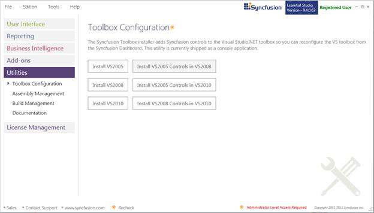
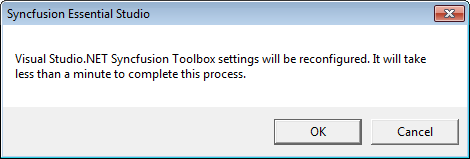
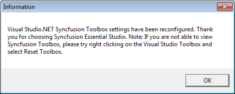

::: {style="DISPLAY: none"}
{#d2h_url_template}{#d2h_package_url style="WIDTH: 0px; DISPLAY: none; HEIGHT: 0px"}
:::

::::: {#nsbanner .d2h_main_nsbanner style="BORDER-BOTTOM: #999999 1px solid; POSITION: relative; PADDING-BOTTOM: 0px; BACKGROUND-COLOR: transparent; PADDING-LEFT: 0px; PADDING-RIGHT: 0px; DISPLAY: none; BORDER-TOP: #999999 1px solid; PADDING-TOP: 0px; LEFT: 0px"}
:::: {#TitleRow .d2h_main_titlerow style="PADDING-BOTTOM: 4px; BACKGROUND-COLOR: transparent; PADDING-LEFT: 22px; WIDTH: 100%; PADDING-RIGHT: 10px; DISPLAY: none; PADDING-TOP: 4px"}
::: {#ienav .d2h_main_ienav style="DISPLAY: none"}
{#D2HPrevious .D2HPreviousEnabled}  {#D2HNext .D2HNextEnabled}
:::
::::
:::::

:::::: {#nstext .d2h_main_nstext style="PADDING-BOTTOM: 10px; BACKGROUND-COLOR: transparent; PADDING-LEFT: 22px; PADDING-RIGHT: 10px; HEIGHT: 100%; OVERFLOW: auto; PADDING-TOP: 5px" hasuserbackground="true" valign="bottom"}
::: {#d2h_breadcrumbs .d2h_breadcrumbs}
[Essential Studio User Guide Documentation](ms-xhelp:///?Id=12457748-09e3-4d74-a240-8e049cedf030){.d2h_breadcrumbsNormal}[ \> ]{.d2h_breadcrumbsLinkSeparator}[Essential Common](ms-xhelp:///?Id=2bfe10b6-fac1-4f91-a173-04db314f10c3){.d2h_breadcrumbsNormal}[ \> ]{.d2h_breadcrumbsLinkSeparator}[Dashboard Utilities](ms-xhelp:///?Id=2f121e36-ec61-4721-87d7-ef6b9a6b8c4c){.d2h_breadcrumbsNormal}
:::

## Toolbox Configuration {#toolbox-configuration style="tab-stops: 0pt"}

The Syncfusion Toolbox Installer adds the Syncfusion controls into the Visual Studio .NET toolbox. This utility is currently shipped as a console application.

Configuring Toolbox

 

1.   Open **Syncfusion Dashboard**.

2.   Click **Utilities \> Toolbox Configuration**.

 

{border="0"}

Figure 115: Toolbox Configuration

 

3.   Select the required option.

The following options are available Toolbox Configuration:

 

[·      ]{style="FONT-FAMILY: Symbol"}Install VS2005 -- Configures Framework 2.0 Syncfusion controls in VS 2005 toolbox.

[·      ]{style="FONT-FAMILY: Symbol"}Install VS2008 -- Configures Framework 3.5 Syncfusion controls in VS 2008 toolbox.

[·      ]{style="FONT-FAMILY: Symbol"}Install VS2010 -- Configures Framework 4.0 Syncfusion controls in VS 2010 toolbox.

[·      ]{style="FONT-FAMILY: Symbol"}Install VS2005 Controls in VS2008 -- Configures Framework 2.0 Syncfusion controls in VS 2008 toolbox.

[·      ]{style="FONT-FAMILY: Symbol"}Install VS2005 Controls in VS2010 -- Configures Framework 2.0 Syncfusion controls in VS 2010 toolbox.

[·      ]{style="FONT-FAMILY: Symbol"}Install VS2008 Controls in VS2010 -- Configures Framework 3.5 Syncfusion controls in VS 2010 toolbox.

 

4.   The **Syncfusion Essential Studio** dialog will open. Click **OK**.

 

{border="0"}

Figure 116: Syncfusion Essential Studio Dialog

 

5.   The **Information** dialog will open. Click **OK**.

 

{border="0"}

Figure 117: Information

::: {style="BORDER-BOTTOM: windowtext 1pt solid; BORDER-LEFT: medium none; PADDING-BOTTOM: 1pt; MARGIN-TOP: 9pt; PADDING-LEFT: 0pt; PADDING-RIGHT: 0pt; MARGIN-BOTTOM: 9pt; BORDER-TOP: windowtext 1pt solid; BORDER-RIGHT: medium none; PADDING-TOP: 1pt"}
{border="0"}Note:
:::

::: {style="BORDER-BOTTOM: windowtext 1pt solid; BORDER-LEFT: medium none; PADDING-BOTTOM: 1pt; MARGIN: 9pt 0pt 9pt 18pt; PADDING-LEFT: 0pt; PADDING-RIGHT: 0pt; BORDER-TOP: windowtext 1pt solid; BORDER-RIGHT: medium none; PADDING-TOP: 1pt"}
***[·    ]{style="FONT-FAMILY: Symbol"}***You need to reset the toolbox if the installed controls are not reflected properly in the Toolbox.

***[·    ]{style="FONT-FAMILY: Symbol"}***This tool will configure only the controls which are located under Installed Location\]\\Assemblies\\ {Framework version}.
:::

 

[]{#related-topics}
::::::
