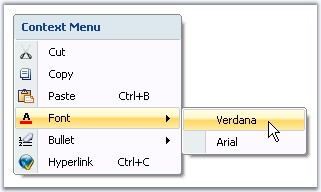
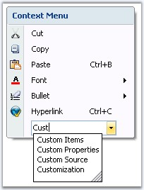

::: {style="DISPLAY: none"}
{#d2h_url_template}{#d2h_package_url style="WIDTH: 0px; DISPLAY: none; HEIGHT: 0px"}
:::

::::::: {.d2h_secondary_topic style="PADDING-BOTTOM: 10pt; MARGIN: 0pt; PADDING-LEFT: 0pt; PADDING-RIGHT: 0pt; PADDING-TOP: 0pt"}
##### ToolStripItems {#toolstripitems style="tab-stops: 0pt"}

[]{style="COLOR: #15428b"} 

The following are the ToolStripItems which can be added as menu items to the ContextMenuStripEx control.

 

###### 3.15.1.6.6.1        ToolStripItem - MenuItem {#toolstripitem---menuitem style="tab-stops: 0pt"}

[]{style="COLOR: #15428b"} 

The ToolStripMenuItem supports all the general properties of a ToolStripItems. This section will walk you through the unique properties with their description for the ToolStripMenuItem.

[]{style="COLOR: #15428b"} 

::: {align="center"}
+-----------------------------------+------------------------------------------------------------------------------------------------------------------------------------------------------------------------------------+
| Property                          | Description                                                                                                                                                                        |
+-----------------------------------+------------------------------------------------------------------------------------------------------------------------------------------------------------------------------------+
| Checked                           | Indicates whether the item is in the checked state.                                                                                                                                |
|                                   |                                                                                                                                                                                    |
|                                   |                                                                                                                                                                                    |
|                                   |                                                                                                                                                                                    |
|                                   | Note: This will be displayed only if [ContextMenuStripEx.ShowCheckMargin ]{.UGHyperlink}property is set to true.                                                                   |
+-----------------------------------+------------------------------------------------------------------------------------------------------------------------------------------------------------------------------------+
| Image                             | Sets the image for the menu item. This image will be displayed only when the [ContextMenuStripEx.ShowImageMargin ]{.UGHyperlink}is true and DisplayStyle is Image or ImageAndText. |
+-----------------------------------+------------------------------------------------------------------------------------------------------------------------------------------------------------------------------------+
| CheckedState                      | Specifies the check state of the item. They can be Checked, Unchecked or Indeterminate.                                                                                            |
+-----------------------------------+------------------------------------------------------------------------------------------------------------------------------------------------------------------------------------+
| ShowShortcutkeys                  | Indicates whether a shortcut key should be displayed in the menu item. User can access the particular menu item using this shortcut key specified in ShortcutKeys property.        |
+-----------------------------------+------------------------------------------------------------------------------------------------------------------------------------------------------------------------------------+
| ShortcutKeys                      | The shortcut key to be displayed for a menu item.                                                                                                                                  |
+-----------------------------------+------------------------------------------------------------------------------------------------------------------------------------------------------------------------------------+
| ShortcutKeyDisplayString          | You can modify the ShortcutKey string, that is set, using the ShortcutKeyDisplayString property.                                                                                   |
+-----------------------------------+------------------------------------------------------------------------------------------------------------------------------------------------------------------------------------+
| AutoToolTip                       | When set to true, will display the text set in the Text property as the item\'s tooltip.                                                                                           |
|                                   |                                                                                                                                                                                    |
|                                   | When set to false, will display the text set in the ToolTipText property.                                                                                                          |
+-----------------------------------+------------------------------------------------------------------------------------------------------------------------------------------------------------------------------------+
| ToolTipText                       | Sets the text for the tooltip when AutoToolTip is set to false.                                                                                                                    |
+-----------------------------------+------------------------------------------------------------------------------------------------------------------------------------------------------------------------------------+
| DropDown                          | Specifies the ToolStripDropDown to be shown when the item is clicked.                                                                                                              |
+-----------------------------------+------------------------------------------------------------------------------------------------------------------------------------------------------------------------------------+
| DropDownItems                     | Invokes the Items Collection Editor and lets you add ToolStripItems to be displayed when the item is clicked.                                                                      |
+-----------------------------------+------------------------------------------------------------------------------------------------------------------------------------------------------------------------------------+
:::

[]{#p1191}[]{style="COLOR: #15428b"} 

+-------------------------------------------------------------------------------------------------------------------------------------------------------------------------------------------------------------------------------------------------------------------------------------------------------------------------------------------------------+
| **[\[C#\]]{style="FONT-FAMILY: 'Courier New'; COLOR: black"}**                                                                                                                                                                                                                                                                                        |
|                                                                                                                                                                                                                                                                                                                                                       |
| []{style="FONT-FAMILY: 'Courier New'; COLOR: black"}                                                                                                                                                                                                                                                                                                  |
|                                                                                                                                                                                                                                                                                                                                                       |
| [this]{style="FONT-FAMILY: 'Courier New'; COLOR: blue"}[.pasteToolStripMenuItem.ShortcutKeys = ((System.Windows.Forms.[Keys]{style="COLOR: teal"})((System.Windows.Forms.[Keys]{style="COLOR: teal"}.Control \| System.Windows.Forms.[Keys]{style="COLOR: teal"}.B)));]{style="FONT-FAMILY: 'Courier New'"}                                           |
|                                                                                                                                                                                                                                                                                                                                                       |
| []{style="FONT-FAMILY: 'Courier New'"}                                                                                                                                                                                                                                                                                                                |
|                                                                                                                                                                                                                                                                                                                                                       |
| [this]{style="FONT-FAMILY: 'Courier New'; COLOR: blue"}[.fontToolStripMenuItem.DropDownItems.AddRange([new]{style="COLOR: blue"} System.Windows.Forms.[ToolStripItem]{style="COLOR: teal"}\[\] {]{style="FONT-FAMILY: 'Courier New'"}                                                                                                                 |
|                                                                                                                                                                                                                                                                                                                                                       |
| [this]{style="FONT-FAMILY: 'Courier New'; COLOR: blue"}[.toolStripMenuItem1,]{style="FONT-FAMILY: 'Courier New'"}                                                                                                                                                                                                                                     |
|                                                                                                                                                                                                                                                                                                                                                       |
| [this]{style="FONT-FAMILY: 'Courier New'; COLOR: blue"}[.toolStripMenuItem2});]{style="FONT-FAMILY: 'Courier New'"}                                                                                                                                                                                                                                   |
|                                                                                                                                                                                                                                                                                                                                                       |
| []{style="FONT-FAMILY: 'Courier New'"}                                                                                                                                                                                                                                                                                                                |
|                                                                                                                                                                                                                                                                                                                                                       |
| [this]{style="FONT-FAMILY: 'Courier New'; COLOR: blue"}[.hyperlinkToolStripMenuItem.ShortcutKeys = ((System.Windows.Forms.[Keys]{style="COLOR: teal"})((System.Windows.Forms.[Keys]{style="COLOR: teal"}.Control \| System.Windows.Forms.[Keys]{style="COLOR: teal"}.C)));]{style="FONT-FAMILY: 'Courier New'"}[]{style="FONT-FAMILY: 'Courier New'"} |
+-------------------------------------------------------------------------------------------------------------------------------------------------------------------------------------------------------------------------------------------------------------------------------------------------------------------------------------------------------+

[]{style="COLOR: #15428b"} 

+----------------------------------------------------------------------------------------------------------------------------------------------------------------------------------------------------------------------------------------------------------------------------------------------------------------------------------------+
| **[\[VB.NET\]]{style="FONT-FAMILY: 'Courier New'; COLOR: black"}**                                                                                                                                                                                                                                                                     |
|                                                                                                                                                                                                                                                                                                                                        |
| []{style="COLOR: black"}                                                                                                                                                                                                                                                                                                               |
|                                                                                                                                                                                                                                                                                                                                        |
| [Me]{style="FONT-FAMILY: 'Courier New'; COLOR: blue"}[.pasteToolStripMenuItem.ShortcutKeys = [DirectCast]{style="COLOR: blue"}(((System.Windows.Forms.Keys.Control [Or]{style="COLOR: blue"} System.Windows.Forms.Keys.B)), System.Windows.Forms.Keys) ]{style="FONT-FAMILY: 'Courier New'"}                                           |
|                                                                                                                                                                                                                                                                                                                                        |
| []{style="FONT-FAMILY: 'Courier New'"}                                                                                                                                                                                                                                                                                                 |
|                                                                                                                                                                                                                                                                                                                                        |
| [Me]{style="FONT-FAMILY: 'Courier New'; COLOR: blue"}[.fontToolStripMenuItem.DropDownItems.AddRange([New]{style="COLOR: blue"} System.Windows.Forms.ToolStripItem() {[Me]{style="COLOR: blue"}.toolStripMenuItem1, [Me]{style="COLOR: blue"}.toolStripMenuItem2}) ]{style="FONT-FAMILY: 'Courier New'"}                                |
|                                                                                                                                                                                                                                                                                                                                        |
| []{style="FONT-FAMILY: 'Courier New'"}                                                                                                                                                                                                                                                                                                 |
|                                                                                                                                                                                                                                                                                                                                        |
| [Me]{style="FONT-FAMILY: 'Courier New'; COLOR: blue"}[.hyperlinkToolStripMenuItem.ShortcutKeys = [DirectCast]{style="COLOR: blue"}(((System.Windows.Forms.Keys.Control [Or]{style="COLOR: blue"} System.Windows.Forms.Keys.C)), System.Windows.Forms.Keys) ]{style="FONT-FAMILY: 'Courier New'"}[]{style="FONT-FAMILY: 'Courier New'"} |
+----------------------------------------------------------------------------------------------------------------------------------------------------------------------------------------------------------------------------------------------------------------------------------------------------------------------------------------+

[]{style="COLOR: #15428b"} 

{border="0"}

[]{style="COLOR: #15428b"} 

Figure 1433: Context Menu items with ShortCut keys and Font Menu with DropDown Menu Items

 

###### []{#_ToolStripItem_-_ComboBox}3.15.1.6.6.2        ToolStripItem - ComboBox {#toolstripitem---combobox style="tab-stops: 0pt"}

[]{style="COLOR: #15428b"} 

This section lists the unique properties of a ToolStripComboBox item and their description.

[]{style="COLOR: #15428b"} 

::: {align="center"}
+-----------------------------------+-----------------------------------------------------------------------------------------------------------------------------------------------------------------------------------------------+
| Property                          | Description                                                                                                                                                                                   |
+-----------------------------------+-----------------------------------------------------------------------------------------------------------------------------------------------------------------------------------------------+
| FlatStyle                         | Specifies the style of display of the control. The options are,                                                                                                                               |
|                                   |                                                                                                                                                                                               |
|                                   |                                                                                                                                                                                               |
|                                   |                                                                                                                                                                                               |
|                                   | [·      ]{style="FONT-FAMILY: Symbol"}Flat,                                                                                                                                                   |
|                                   |                                                                                                                                                                                               |
|                                   | [·      ]{style="FONT-FAMILY: Symbol"}Popup,                                                                                                                                                  |
|                                   |                                                                                                                                                                                               |
|                                   | [·      ]{style="FONT-FAMILY: Symbol"}Standard and                                                                                                                                            |
|                                   |                                                                                                                                                                                               |
|                                   | [·      ]{style="FONT-FAMILY: Symbol"}System.                                                                                                                                                 |
+-----------------------------------+-----------------------------------------------------------------------------------------------------------------------------------------------------------------------------------------------+
| Items                             | Invokes String Collection Editor which lets you add strings list to be displayed in the combobox.                                                                                             |
+-----------------------------------+-----------------------------------------------------------------------------------------------------------------------------------------------------------------------------------------------+
| MaxDropDownItems                  | Sets the maximum number of strings that should be displayed in the dropdown.                                                                                                                  |
+-----------------------------------+-----------------------------------------------------------------------------------------------------------------------------------------------------------------------------------------------+
| MaxLength                         | Specifies the maximum characters that can be entered into the combobox.                                                                                                                       |
+-----------------------------------+-----------------------------------------------------------------------------------------------------------------------------------------------------------------------------------------------+
| DropDownHeight                    | Sets the height for the DropDown.                                                                                                                                                             |
+-----------------------------------+-----------------------------------------------------------------------------------------------------------------------------------------------------------------------------------------------+
| DropDownWidth                     | Sets the width for the DropDown.                                                                                                                                                              |
+-----------------------------------+-----------------------------------------------------------------------------------------------------------------------------------------------------------------------------------------------+
| IntegralHeight                    | Indicates whether the combobox should resize to avoid showing partial items.                                                                                                                  |
+-----------------------------------+-----------------------------------------------------------------------------------------------------------------------------------------------------------------------------------------------+
| Sorted                            | Specifies whether the dropdown list should be sorted.                                                                                                                                         |
+-----------------------------------+-----------------------------------------------------------------------------------------------------------------------------------------------------------------------------------------------+
| AutoCompleteCustomSource          | Represents the custom source of string collection for the autocomplete feature, when AutoCompleteSource property is set to CustomSource.                                                      |
+-----------------------------------+-----------------------------------------------------------------------------------------------------------------------------------------------------------------------------------------------+
| AutoCompleteSource                | Represents the source of strings used for autocompletion. The sources can be,                                                                                                                 |
|                                   |                                                                                                                                                                                               |
|                                   |                                                                                                                                                                                               |
|                                   |                                                                                                                                                                                               |
|                                   | [·      ]{style="FONT-FAMILY: Symbol"}FileSystem,                                                                                                                                             |
|                                   |                                                                                                                                                                                               |
|                                   | [·      ]{style="FONT-FAMILY: Symbol"}AllSystemSources (Default),                                                                                                                             |
|                                   |                                                                                                                                                                                               |
|                                   | [·      ]{style="FONT-FAMILY: Symbol"}AllUrl,                                                                                                                                                 |
|                                   |                                                                                                                                                                                               |
|                                   | [·      ]{style="FONT-FAMILY: Symbol"}CustomSource,                                                                                                                                           |
|                                   |                                                                                                                                                                                               |
|                                   | [·      ]{style="FONT-FAMILY: Symbol"}FileSystemDirectories,                                                                                                                                  |
|                                   |                                                                                                                                                                                               |
|                                   | [·      ]{style="FONT-FAMILY: Symbol"}HistoryList,                                                                                                                                            |
|                                   |                                                                                                                                                                                               |
|                                   | [·      ]{style="FONT-FAMILY: Symbol"}ListItems,                                                                                                                                              |
|                                   |                                                                                                                                                                                               |
|                                   | [·      ]{style="FONT-FAMILY: Symbol"}RecentlyUsedList and                                                                                                                                    |
|                                   |                                                                                                                                                                                               |
|                                   | [·      ]{style="FONT-FAMILY: Symbol"}None.                                                                                                                                                   |
+-----------------------------------+-----------------------------------------------------------------------------------------------------------------------------------------------------------------------------------------------+
| AutoCompleteMode                  | Indicates text completion behavior of the combo box. The modes are,                                                                                                                           |
|                                   |                                                                                                                                                                                               |
|                                   |                                                                                                                                                                                               |
|                                   |                                                                                                                                                                                               |
|                                   | [·      ]{style="FONT-FAMILY: Symbol"}*Suggest* - Displays the drop down list associated with the EditControl. This dropdown list is populated with one or more suggested completion strings, |
|                                   |                                                                                                                                                                                               |
|                                   | [·      ]{style="FONT-FAMILY: Symbol"}*Append* - Appends the reminder of the most likely candidate string to the existing character, highlighting the appended character, and                 |
|                                   |                                                                                                                                                                                               |
|                                   | [·      ]{style="FONT-FAMILY: Symbol"}*SuggestAppend* - Displays the drop down, also appends the highlighted string.                                                                          |
+-----------------------------------+-----------------------------------------------------------------------------------------------------------------------------------------------------------------------------------------------+
:::

[]{style="COLOR: #15428b"} 

AutoComplete Feature

[]{style="COLOR: #15428b"} 

+-----------------------------------------------------------------------------------------------------------------------------------------------------------------------------------------------------------------------------------------------------------------------------------------------------------------------------------------------------------------------------------------------------------------------------------------------------------------------------------------+
| **[\[C#\]]{style="FONT-FAMILY: 'Courier New'; COLOR: black"}**                                                                                                                                                                                                                                                                                                                                                                                                                          |
|                                                                                                                                                                                                                                                                                                                                                                                                                                                                                         |
| []{style="FONT-FAMILY: 'Courier New'; COLOR: black"}                                                                                                                                                                                                                                                                                                                                                                                                                                    |
|                                                                                                                                                                                                                                                                                                                                                                                                                                                                                         |
| [this]{style="FONT-FAMILY: 'Courier New'; COLOR: blue"}[.toolStripComboBox1.AutoCompleteCustomSource.AddRange([new]{style="COLOR: blue"} [string]{style="COLOR: blue"}\[\] {[\"Customization\"]{style="COLOR: maroon"}, [\"Custom Properties\"]{style="COLOR: maroon"}, [\"Custom Source\"]{style="COLOR: maroon"}, [\"Custom Items\"]{style="COLOR: maroon"}, [\"Properties\"]{style="COLOR: maroon"}, [\"IssuesList\"]{style="COLOR: maroon"}});]{style="FONT-FAMILY: 'Courier New'"} |
|                                                                                                                                                                                                                                                                                                                                                                                                                                                                                         |
| [this]{style="FONT-FAMILY: 'Courier New'; COLOR: blue"}[.toolStripComboBox1.AutoCompleteMode = System.Windows.Forms.[AutoCompleteMode]{style="COLOR: teal"}.Suggest;]{style="FONT-FAMILY: 'Courier New'"}                                                                                                                                                                                                                                                                               |
|                                                                                                                                                                                                                                                                                                                                                                                                                                                                                         |
| [this]{style="FONT-FAMILY: 'Courier New'; COLOR: blue"}[.toolStripComboBox1.AutoCompleteSource = System.Windows.Forms.[AutoCompleteSource]{style="COLOR: teal"}.CustomSource;]{style="FONT-FAMILY: 'Courier New'"}                                                                                                                                                                                                                                                                      |
+-----------------------------------------------------------------------------------------------------------------------------------------------------------------------------------------------------------------------------------------------------------------------------------------------------------------------------------------------------------------------------------------------------------------------------------------------------------------------------------------+

[]{style="COLOR: #15428b"} 

+-------------------------------------------------------------------------------------------------------------------------------------------------------------------------------------------------------------------------------------------------------------------------------------------------------------------------------------------------------------------------------------------------------------------------------------------------------------------------------------+
| **[\[VB.NET\]]{style="FONT-FAMILY: 'Courier New'; COLOR: black"}**                                                                                                                                                                                                                                                                                                                                                                                                                  |
|                                                                                                                                                                                                                                                                                                                                                                                                                                                                                     |
| []{style="COLOR: black"}                                                                                                                                                                                                                                                                                                                                                                                                                                                            |
|                                                                                                                                                                                                                                                                                                                                                                                                                                                                                     |
| [Me]{style="FONT-FAMILY: 'Courier New'; COLOR: blue"}[.toolStripComboBox1.AutoCompleteCustomSource.AddRange([New]{style="COLOR: blue"} [String]{style="COLOR: blue"}() {[\"Customization\"]{style="COLOR: maroon"}, [\"Custom Properties\"]{style="COLOR: maroon"}, [\"Custom Source\"]{style="COLOR: maroon"}, [\"Custom Items\"]{style="COLOR: maroon"}, [\"Properties\"]{style="COLOR: maroon"}, [\"IssuesList\"]{style="COLOR: maroon"}}) ]{style="FONT-FAMILY: 'Courier New'"} |
|                                                                                                                                                                                                                                                                                                                                                                                                                                                                                     |
| [Me]{style="FONT-FAMILY: 'Courier New'; COLOR: blue"}[.toolStripComboBox1.AutoCompleteMode = System.Windows.Forms.AutoCompleteMode.Suggest ]{style="FONT-FAMILY: 'Courier New'"}                                                                                                                                                                                                                                                                                                    |
|                                                                                                                                                                                                                                                                                                                                                                                                                                                                                     |
| [Me]{style="FONT-FAMILY: 'Courier New'; COLOR: blue"}[.toolStripComboBox1.AutoCompleteSource = System.Windows.Forms.AutoCompleteSource.CustomSource ]{style="FONT-FAMILY: 'Courier New'"}[]{style="FONT-FAMILY: 'Courier New'"}                                                                                                                                                                                                                                                     |
+-------------------------------------------------------------------------------------------------------------------------------------------------------------------------------------------------------------------------------------------------------------------------------------------------------------------------------------------------------------------------------------------------------------------------------------------------------------------------------------+

[]{style="COLOR: #15428b"} 

{border="0"}

[]{style="COLOR: #15428b"} 

Figure 1434: AutoCompleteSource = \"CustomSource\"; AutoCompleteMode = \"Suggest\"

 

###### []{#_Separator}3.15.1.6.6.3        Separator {#separator style="tab-stops: 0pt"}

[  ]{style="COLOR: #15428b"}

This section lists the unique properties of a ToolStripSeparator and their description.

[]{style="COLOR: #15428b"} 

::: {align="center"}
  ----------- ------------------------------------------------------------------------------------
  Property    Description
  BackColor   Sets the back color for the separator.
  ForeColor   Sets the fore color for the separator.
  AutoSize    Determines whether the item should automatically size based on its image and text.
  Visible     Sets the visibility of the separator.
  ----------- ------------------------------------------------------------------------------------
:::

 

###### 3.15.1.6.6.4        TextBox {#textbox style="tab-stops: 0pt"}

[]{style="COLOR: #15428b"} 

This section lists the unique properties of a ToolStripTextBox item and their description.

[]{style="COLOR: #15428b"} 

::: {align="center"}
+-----------------------------------+--------------------------------------------------------------------------------------+
| Property                          | Description                                                                          |
+-----------------------------------+--------------------------------------------------------------------------------------+
| BorderStyle                       | Sets the border style for the textbox. The styles available are,                     |
|                                   |                                                                                      |
|                                   |                                                                                      |
|                                   |                                                                                      |
|                                   | [·      ]{style="FONT-FAMILY: Symbol"}FixedSingle and                                |
|                                   |                                                                                      |
|                                   | [·      ]{style="FONT-FAMILY: Symbol"}Fixed3D (Default).                             |
+-----------------------------------+--------------------------------------------------------------------------------------+
| Lines                             | Lets you open a String Collection Editor, using which multiline text can be entered. |
+-----------------------------------+--------------------------------------------------------------------------------------+
| Text                              | Specifies the text to be displayed on the item.                                      |
+-----------------------------------+--------------------------------------------------------------------------------------+
| TextBoxTextAlign                  | Specifies the alignment of the text inside the textbox.                              |
+-----------------------------------+--------------------------------------------------------------------------------------+
| AcceptsReturn                     | Indicates if return characters are accepted as input.                                |
+-----------------------------------+--------------------------------------------------------------------------------------+
| AcceptsTab                        | Indicates if tab characters are accepted as input.                                   |
+-----------------------------------+--------------------------------------------------------------------------------------+
| CharacterCasing                   | Indicates if the characters should be Normal or in Upper Case or in Lower Case.      |
+-----------------------------------+--------------------------------------------------------------------------------------+
| HideSelection                     | Indicates whether the selection should be hidden when the control loses focus.       |
+-----------------------------------+--------------------------------------------------------------------------------------+
| MaxLength                         | Maximum number of characters that can be entered into the control.                   |
+-----------------------------------+--------------------------------------------------------------------------------------+
| ReadOnly                          | Indicates whether the text in the textbox is read-only.                              |
+-----------------------------------+--------------------------------------------------------------------------------------+
:::

 

 

 

 

[]{#related-topics}
:::::::
