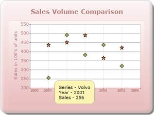

::: {style="DISPLAY: none"}
{#d2h_url_template}{#d2h_package_url style="WIDTH: 0px; DISPLAY: none; HEIGHT: 0px"}
:::

::::: {#nsbanner .d2h_main_nsbanner style="BORDER-BOTTOM: #999999 1px solid; POSITION: relative; PADDING-BOTTOM: 0px; BACKGROUND-COLOR: transparent; PADDING-LEFT: 0px; PADDING-RIGHT: 0px; DISPLAY: none; BORDER-TOP: #999999 1px solid; PADDING-TOP: 0px; LEFT: 0px"}
:::: {#TitleRow .d2h_main_titlerow style="PADDING-BOTTOM: 4px; BACKGROUND-COLOR: transparent; PADDING-LEFT: 22px; WIDTH: 100%; PADDING-RIGHT: 10px; DISPLAY: none; PADDING-TOP: 4px"}
::: {#ienav .d2h_main_ienav style="DISPLAY: none"}
{#D2HPrevious .D2HPreviousEnabled}  {#D2HNext .D2HNextEnabled}
:::
::::
:::::

:::::::: {#nstext .d2h_main_nstext style="PADDING-BOTTOM: 10px; BACKGROUND-COLOR: transparent; PADDING-LEFT: 22px; PADDING-RIGHT: 10px; HEIGHT: 100%; OVERFLOW: auto; PADDING-TOP: 5px" hasuserbackground="true" valign="bottom"}
::: {#d2h_breadcrumbs .d2h_breadcrumbs}
[Essential Studio User Guide Documentation](ms-xhelp:///?Id=12457748-09e3-4d74-a240-8e049cedf030){.d2h_breadcrumbsNormal}[ \> ]{.d2h_breadcrumbsLinkSeparator}[User Interface Edition](ms-xhelp:///?Id=c29296b7-531c-413b-a0ec-488ca1f7f669){.d2h_breadcrumbsNormal}[ \> ]{.d2h_breadcrumbsLinkSeparator}[Essential ASP.NET MVC](ms-xhelp:///?Id=4b14e7d1-65c4-4f67-b1aa-2c37709905a5){.d2h_breadcrumbsNormal}[ \> ]{.d2h_breadcrumbsLinkSeparator}[Essential Chart]{.d2h_breadcrumbsContentsOnly}[ \> ]{.d2h_breadcrumbsLinkSeparator}[Concepts and Features](ms-xhelp:///?Id=696f5666-8b81-4685-9bd9-12198f06f3ad){.d2h_breadcrumbsNormal}[ \> ]{.d2h_breadcrumbsLinkSeparator}[UserInteraction](ms-xhelp:///?Id=0c3ea2f6-e05d-4162-9e06-d6af6a893c70){.d2h_breadcrumbsNormal}
:::

### ToolTip {#tooltip style="tab-stops: 0pt"}

 

The ToolTip feature allows users to display the tooltip for the Chart point, Chart Series, and ChartArea by using custom string formatting.

The **ChartModel.ShowTooltips** property enables the Tooltip for all the chart regions. To render all the ChartRegions, you need to set the **ChartModel.Calcregions** property to true.

Essential Chart supports ToolTips in different areas of the chart, which comes with multiple customization options.

The different tooltips in the chart can be turned off by using the control\'s ShowToolTips property.

The steps to implement tooltip support for the Chart series are as follows:

Controller:

Step 1:

**[]{style="FONT-FAMILY: 'Calibri','sans-serif'"}** 

Set the properties of the Chart series, displayed below, to get tooltip support for the Chart series. []{style="COLOR: #2b91af"}

[]{style="FONT-FAMILY: 'Calibri','sans-serif'; COLOR: #2b91af"} 

::: {style="BORDER-BOTTOM: #c8c8c8 1pt solid; BORDER-LEFT: #c8c8c8 1pt solid; PADDING-BOTTOM: 1pt; MARGIN-TOP: 0pt; PADDING-LEFT: 4pt; PADDING-RIGHT: 4pt; MARGIN-BOTTOM: 0pt; BACKGROUND: #f0f0f0; BORDER-TOP: #c8c8c8 1pt solid; BORDER-RIGHT: #c8c8c8 1pt solid; PADDING-TOP: 1pt"}
[//Enabling the tooltip support]{style="FONT-FAMILY: 'Courier New'; COLOR: green"}

[            chartModel.ShowToolTip = [true]{style="COLOR: blue"};]{style="FONT-FAMILY: 'Courier New'"}

[            chartModel.CalcRegions = [true]{style="COLOR: blue"};]{style="FONT-FAMILY: 'Courier New'"}

[]{style="FONT-FAMILY: 'Courier New'"} 

[            [//Setting the Tooltip Format]{style="COLOR: green"}]{style="FONT-FAMILY: 'Courier New'"}

[            series.PointsToolTipFormat = [\"{1}{2}\"]{style="COLOR: #a31515"};]{style="FONT-FAMILY: 'Courier New'"}

[            [//Calling the  event for  tooltip for chart series]{style="COLOR: green"}]{style="FONT-FAMILY: 'Courier New'"}

[            series.PrepareStyle += [new]{style="COLOR: blue"} [ChartPrepareStyleInfoHandler]{style="COLOR: #2b91af"}(show_ToolTip);]{style="FONT-FAMILY: 'Courier New'"}
:::

[]{style="FONT-FAMILY: 'Calibri','sans-serif'"} 

Step 2:

Add the call back event for the tooltip, displayed below, in the Controller. By using the ToolTip property of the [ChartPrepareStyleInfoEventArgs ]{style="COLOR: #2b91af"}event class, you can set the content to be displayed in the tooltip.

[]{style="FONT-FAMILY: 'Calibri','sans-serif'"} 

::: {style="BORDER-BOTTOM: #c8c8c8 1pt solid; BORDER-LEFT: #c8c8c8 1pt solid; PADDING-BOTTOM: 1pt; MARGIN-TOP: 0pt; PADDING-LEFT: 4pt; PADDING-RIGHT: 4pt; MARGIN-BOTTOM: 0pt; BACKGROUND: #f0f0f0; BORDER-TOP: #c8c8c8 1pt solid; BORDER-RIGHT: #c8c8c8 1pt solid; PADDING-TOP: 1pt"}
[// Style formatting using a callback. ]{style="FONT-FAMILY: 'Courier New'; COLOR: green"}

[        [//You can apply the same settings directly on the series style on the point styles.]{style="COLOR: green"}]{style="FONT-FAMILY: 'Courier New'"}

[]{style="FONT-FAMILY: 'Courier New'; COLOR: green"} 

[        [void]{style="COLOR: blue"} show_ToolTip ([object]{style="COLOR: blue"} sender, [ChartPrepareStyleInfoEventArgs]{style="COLOR: #2b91af"} args)]{style="FONT-FAMILY: 'Courier New'"}

[        {]{style="FONT-FAMILY: 'Courier New'"}

[            [ChartSeries]{style="COLOR: #2b91af"} series = sender [as]{style="COLOR: blue"} [ChartSeries]{style="COLOR: #2b91af"};]{style="FONT-FAMILY: 'Courier New'"}

[            [if]{style="COLOR: blue"} (series != [null]{style="COLOR: blue"})]{style="FONT-FAMILY: 'Courier New'"}

[            {]{style="FONT-FAMILY: 'Courier New'"}

[                [ChartPoint]{style="COLOR: #2b91af"} chpt = [new]{style="COLOR: blue"} [ChartPoint]{style="COLOR: #2b91af"}(series.Points\[args.Index\].X, series.Points\[args.Index\].YValues\[0\]);]{style="FONT-FAMILY: 'Courier New'"}

[                [Point]{style="COLOR: #2b91af"} pt = chartModel.ChartArea.GetPointByValue(chpt);]{style="FONT-FAMILY: 'Courier New'"}

[                [ChartPoint]{style="COLOR: #2b91af"} cpoint = chartModel.ChartArea.GetValueByPoint(pt);]{style="FONT-FAMILY: 'Courier New'"}

[]{style="FONT-FAMILY: 'Courier New'"} 

[                args.Style.ToolTip = [\"Series - \"]{style="COLOR: #a31515"} + series.Name + [\"\<br/\>Year - \"]{style="COLOR: #a31515"} + [Math]{style="COLOR: #2b91af"}.Round(chpt.X, 2).ToString() + [\"\<br/\>Sales - \"]{style="COLOR: #a31515"} + [Math]{style="COLOR: #2b91af"}.Round(chpt.YValues\[0\], 2).ToString();]{style="FONT-FAMILY: 'Courier New'"}

[            }]{style="FONT-FAMILY: 'Courier New'"}

[        }]{style="FONT-FAMILY: 'Courier New'"}[]{style="FONT-FAMILY: 'Courier New'"}
:::

                                

Step 3:

Add the code displayed below in the aspx file.

[]{style="FONT-FAMILY: 'Calibri','sans-serif'"} 

::: {style="BORDER-BOTTOM: #c8c8c8 1pt solid; BORDER-LEFT: #c8c8c8 1pt solid; PADDING-BOTTOM: 1pt; MARGIN-TOP: 0pt; PADDING-LEFT: 4pt; PADDING-RIGHT: 4pt; MARGIN-BOTTOM: 0pt; BACKGROUND: #f0f0f0; BORDER-TOP: #c8c8c8 1pt solid; BORDER-RIGHT: #c8c8c8 1pt solid; PADDING-TOP: 1pt"}
View \[ASPX\]

[]{style="FONT-FAMILY: 'Courier New'; BACKGROUND: yellow"} 

[\<%]{style="FONT-FAMILY: 'Courier New'; BACKGROUND: yellow"}[\--Rendering the Chart COntrol\--]{style="FONT-FAMILY: 'Courier New'; COLOR: green"}[%\>]{style="FONT-FAMILY: 'Courier New'; BACKGROUND: yellow"}

[  ]{style="FONT-FAMILY: 'Courier New'"}

[        [\<%]{style="BACKGROUND: yellow"}[=]{style="COLOR: blue"} Html.Chart([\"ChartModel\"]{style="COLOR: #a31515"},([MVCChartModel]{style="COLOR: #2b91af"})ViewData\[[\"ChartModel\"]{style="COLOR: #a31515"}\]) [%\>]{style="BACKGROUND: yellow"}]{style="FONT-FAMILY: 'Courier New'"}**[]{style="FONT-FAMILY: 'Courier New'"}**
:::

 

 

::: {style="BORDER-BOTTOM: #c8c8c8 1pt solid; BORDER-LEFT: #c8c8c8 1pt solid; PADDING-BOTTOM: 1pt; MARGIN-TOP: 0pt; PADDING-LEFT: 4pt; PADDING-RIGHT: 4pt; MARGIN-BOTTOM: 0pt; BACKGROUND: #f0f0f0; BORDER-TOP: #c8c8c8 1pt solid; BORDER-RIGHT: #c8c8c8 1pt solid; PADDING-TOP: 1pt"}
View \[cshtml\]

[]{style="FONT-FAMILY: 'Courier New'; BACKGROUND: yellow"} 

[@\*]{style="FONT-FAMILY: 'Courier New'; BACKGROUND: yellow"}[\--Rendering the Chart Control\--]{style="FONT-FAMILY: 'Courier New'; COLOR: green"}[\*@]{style="FONT-FAMILY: 'Courier New'; BACKGROUND: yellow"}

[]{style="FONT-FAMILY: 'Courier New'; BACKGROUND: yellow"} 

[@(]{style="FONT-FAMILY: 'Courier New'; BACKGROUND: yellow"}[new]{style="FONT-FAMILY: Consolas; COLOR: blue; FONT-SIZE: 9.5pt"}[ [HtmlString]{style="COLOR: #2b91af"}]{style="FONT-FAMILY: Consolas; FONT-SIZE: 9.5pt"}[(Html.Chart([\"ChartModel\"]{style="COLOR: #a31515"},([MVCChartModel]{style="COLOR: #2b91af"})ViewData\[[\"ChartModel\"]{style="COLOR: #a31515"}\]).ToString())[)]{style="BACKGROUND: yellow"}]{style="FONT-FAMILY: 'Courier New'"}

[]{style="FONT-FAMILY: 'Courier New'; BACKGROUND: yellow"} 
:::

 

 

 

Step 4:

Run the code.

[]{style="FONT-FAMILY: 'Calibri','sans-serif'"} 

{border="0"}

Figure 332: Chart ToolTip

[]{style="FONT-FAMILY: 'Calibri','sans-serif'"} 

More:

[ ]{#related-topics}

[{border="0" align="absMiddle"}DataPoint Tooltips](ms-xhelp:///?Id=9bdcf322-e184-4d54-9a09-16f32f190bbe){style="TEXT-DECORATION: none"}

[{border="0" align="absMiddle"}SeriesToolTipFormat](ms-xhelp:///?Id=1d331dbd-6909-4ca6-8b4b-c54635f20012){style="TEXT-DECORATION: none"}

[{border="0" align="absMiddle"}ChartArea ToolTip](ms-xhelp:///?Id=8529063e-5792-453b-b64a-8187e162cc65){style="TEXT-DECORATION: none"}

[{border="0" align="absMiddle"}Chart Empty Area ToolTip](ms-xhelp:///?Id=02560b46-fc97-4d09-81b0-08f949da02db){style="TEXT-DECORATION: none"}

[{border="0" align="absMiddle"}Chart Axis Tooltip](ms-xhelp:///?Id=914f9ec2-b7c8-4cf4-a8f9-decd1eacb0f0){style="TEXT-DECORATION: none"}
::::::::
