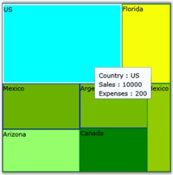

::: {style="DISPLAY: none"}
{#d2h_url_template}{#d2h_package_url style="WIDTH: 0px; DISPLAY: none; HEIGHT: 0px"}
:::

::: {.d2h_secondary_topic style="PADDING-BOTTOM: 10pt; MARGIN: 0pt; PADDING-LEFT: 0pt; PADDING-RIGHT: 0pt; PADDING-TOP: 0pt"}
#### ToolTip {#tooltip style="tab-stops: 0pt"}

[]{#p392} 

ToolTips can also be specified for each item via Data Templates. ToolTips include additional information regarding an item. The bound item becomes the template parent of the Data Template. Hence, you can access the other fields (or properties) that are there in the bound item in your Custom templates, easily.

 

{border="0"}

Figure 56: ToolTip set for the HeatMap Control

[]{#related-topics}
:::
