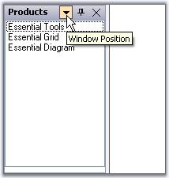
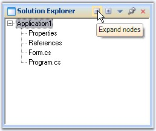
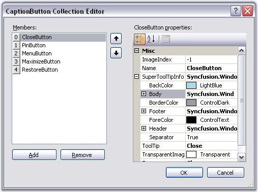

::: {style="DISPLAY: none"}
{#d2h_url_template}{#d2h_package_url style="WIDTH: 0px; DISPLAY: none; HEIGHT: 0px"}
:::

::::: {.d2h_secondary_topic style="PADDING-BOTTOM: 10pt; MARGIN: 0pt; PADDING-LEFT: 0pt; PADDING-RIGHT: 0pt; PADDING-TOP: 0pt"}
##### ToolTip[]{style="FONT-SIZE: 9pt"} {#tooltip style="tab-stops: 0pt"}

By default, tooltips will be displayed for the caption buttons in a docked control when the mouse is moved over it.

[]{style="COLOR: #15428b"} 

{border="0"}

[]{style="COLOR: red; FONT-SIZE: 8pt"} 

Figure 66: Default Tooltip for Menu Button

[]{style="COLOR: #15428b"} 

::: {style="BORDER-BOTTOM: windowtext 1pt solid; BORDER-LEFT: medium none; PADDING-BOTTOM: 1pt; MARGIN-TOP: 9pt; PADDING-LEFT: 0pt; PADDING-RIGHT: 0pt; MARGIN-BOTTOM: 9pt; BORDER-TOP: windowtext 1pt solid; BORDER-RIGHT: medium none; PADDING-TOP: 1pt"}
{border="0"} Note: EnableSuperTooltip property which is discussed below, should be set to false to effect the above default tooltip.
:::

[]{style="COLOR: #15428b"} 

SuperTooltip Support

**[]{style="COLOR: #15428b"}** 

Docking manager can display a super tooltip by enabling the **DockingManager.EnableSuperTooltip** property. For this a SuperTooltip control should be dragged and dropped on to the form and it should be selected in the **DockingManager.SuperTooltip** property.

[]{style="COLOR: #15428b"} 

::: {align="center"}
  ------------------------- --------------------------------------------------------------------------
  DockingManager Property   Description
  EnableSuperTooltip        Gets/Sets whether to enable SuperToolTip using the dock caption buttons.
  SuperToolTip              Indicates the SuperToolTip associated with the docking manager.
  ------------------------- --------------------------------------------------------------------------
:::

[]{style="COLOR: #15428b"} 

A SuperToolip can be added to the docking manager programmatically using the below code snippet.

[]{style="COLOR: #15428b"} 

+-------------------------------------------------------------------------------------------------------------------------------------------------------------------------+
| **[\[C#\]]{style="FONT-FAMILY: 'Courier New'; COLOR: black"}**                                                                                                          |
|                                                                                                                                                                         |
| **[]{style="FONT-FAMILY: 'Courier New'; COLOR: black"}**                                                                                                                |
|                                                                                                                                                                         |
| [this]{style="FONT-FAMILY: 'Courier New'; COLOR: blue"}[.dockingManager1.EnableSuperToolTip = [true]{style="COLOR: blue"};]{style="FONT-FAMILY: 'Courier New'"}         |
|                                                                                                                                                                         |
| [this]{style="FONT-FAMILY: 'Courier New'; COLOR: blue"}[.dockingManager1.SuperToolTip = [this]{style="COLOR: blue"}.superToolTip1;]{style="FONT-FAMILY: 'Courier New'"} |
+-------------------------------------------------------------------------------------------------------------------------------------------------------------------------+

[]{style="COLOR: #15428b"} 

+--------------------------------------------------------------------------------------------------------------------------------------------------------------------+
| **[\[VB.NET\]]{style="FONT-FAMILY: 'Courier New'; COLOR: black"}**                                                                                                 |
|                                                                                                                                                                    |
| []{style="FONT-FAMILY: 'Courier New'; COLOR: black"}                                                                                                               |
|                                                                                                                                                                    |
| [Me]{style="FONT-FAMILY: 'Courier New'; COLOR: blue"}[.dockingManager1.EnableSuperToolTip = [True]{style="COLOR: blue"}]{style="FONT-FAMILY: 'Courier New'"}       |
|                                                                                                                                                                    |
| [Me]{style="FONT-FAMILY: 'Courier New'; COLOR: blue"}[.dockingManager1.SuperToolTip = [Me]{style="COLOR: blue"}.superToolTip1]{style="FONT-FAMILY: 'Courier New'"} |
+--------------------------------------------------------------------------------------------------------------------------------------------------------------------+

[]{style="COLOR: #15428b"} 

{border="0"}

***[]{style="COLOR: #15428b"}*** 

Figure 67: SuperToolTip added to the Docking Manager

[]{style="COLOR: #15428b"} 

Text for the supertooltip and other customizing options can be specified for a particular button by using the **CaptionButton Collection Editor**.

[]{style="COLOR: #15428b"} 

{border="0"}

[]{style="COLOR: #15428b"} 

Figure 68: SuperToolTip customized by using the CaptionButton Collection Editor

[]{#related-topics}
:::::
