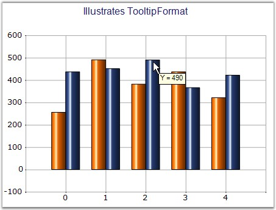
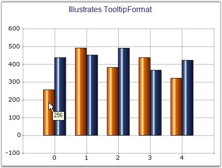

::: {style="DISPLAY: none"}
{#d2h_url_template}{#d2h_package_url style="WIDTH: 0px; DISPLAY: none; HEIGHT: 0px"}
:::

:::: {.d2h_secondary_topic style="PADDING-BOTTOM: 10pt; MARGIN: 0pt; PADDING-LEFT: 0pt; PADDING-RIGHT: 0pt; PADDING-TOP: 0pt"}
#### ToolTipFormat {#tooltipformat style="tab-stops: 0pt"}

 

Sets the tooltip format of the style object associated with the series.

 

::: {align="center"}
+------------------------------+---------------------------------------------------------------------------------------------------------------------------------------------------------------------------------------------------------------------------------------------------------+
| Details                                                                                                                                                                                                                                                                                |
+------------------------------+---------------------------------------------------------------------------------------------------------------------------------------------------------------------------------------------------------------------------------------------------------+
| **Possible Values**          | Any string with \'{0}\' as the place holder for Y value.                                                                                                                                                                                                |
+------------------------------+---------------------------------------------------------------------------------------------------------------------------------------------------------------------------------------------------------------------------------------------------------+
| **Default Value    **        | **Nil**                                                                                                                                                                                                                                                 |
+------------------------------+---------------------------------------------------------------------------------------------------------------------------------------------------------------------------------------------------------------------------------------------------------+
| **2D / 3D Limitations**      | No                                                                                                                                                                                                                                                      |
+------------------------------+---------------------------------------------------------------------------------------------------------------------------------------------------------------------------------------------------------------------------------------------------------+
| **Applies to Chart Element** | Any Series and Points                                                                                                                                                                                                                                   |
+------------------------------+---------------------------------------------------------------------------------------------------------------------------------------------------------------------------------------------------------------------------------------------------------+
| **Applies to Chart Types**   | Scatter Chart, Hilo Open Close Chart(3D),Column Charts, BarCharts, Bubble Chart,Line Charts,  BoxandWhisker Chart, Tornado Chart, Combination Chart, Gantt Chart,Candle Chart, HiLo Chart(3D), PolarAndRadar, PieChart,Accumulation Charts, Area Charts |
+------------------------------+---------------------------------------------------------------------------------------------------------------------------------------------------------------------------------------------------------------------------------------------------------+
:::

 

Here is sample code snippet using ToolTipFormat in the Column chart.

[]{style="COLOR: red; FONT-SIZE: 8pt"} 

Series Wide Setting

 

+-------------------------------------------------------------------------------------------------------------------------------------------------------------------------------------+
| **[\[C#\]]{style="FONT-FAMILY: 'Courier New'; COLOR: black"}**                                                                                                                      |
|                                                                                                                                                                                     |
| **[]{style="FONT-FAMILY: 'Courier New'; COLOR: black"}**                                                                                                                            |
|                                                                                                                                                                                     |
| [this]{style="FONT-FAMILY: 'Courier New'; COLOR: blue"}[.chartControl1.ShowToolTips = [true]{style="COLOR: blue"};]{style="FONT-FAMILY: 'Courier New'"}                             |
|                                                                                                                                                                                     |
| [this]{style="FONT-FAMILY: 'Courier New'; COLOR: blue"}[.chartControl1.Series\[1\].Style.ToolTipFormat = [\"Y = {0}\";]{style="COLOR: maroon"}]{style="FONT-FAMILY: 'Courier New'"} |
+-------------------------------------------------------------------------------------------------------------------------------------------------------------------------------------+

 

+-----------------------------------------------------------------------------------------------------------------------------------------------------------------------------------+
| **[\[VB.NET\]]{style="FONT-FAMILY: 'Courier New'; COLOR: black"}**                                                                                                                |
|                                                                                                                                                                                   |
| **[]{style="FONT-FAMILY: 'Courier New'; COLOR: black"}**                                                                                                                          |
|                                                                                                                                                                                   |
| [Me]{style="FONT-FAMILY: 'Courier New'; COLOR: blue"}[.chartControl1.ShowToolTips = [True ]{style="COLOR: blue"}]{style="FONT-FAMILY: 'Courier New'"}                             |
|                                                                                                                                                                                   |
| [Me]{style="FONT-FAMILY: 'Courier New'; COLOR: blue"}[.chartControl1.Series\[1\].Style.ToolTipFormat = [\"Y = {0}\" ]{style="COLOR: maroon"}]{style="FONT-FAMILY: 'Courier New'"} |
+-----------------------------------------------------------------------------------------------------------------------------------------------------------------------------------+

**                                                                                            **

{border="0"}

 

Figure 225: ToolTipFormat set for Chart Series

[]{style="COLOR: red; FONT-SIZE: 8pt"} 

Specific Data Point Setting

[]{style="COLOR: red; FONT-SIZE: 8pt"} 

ToolTipformat can be applied for individual points by using **Series.Styles\[0\].ToolTipFormat** property settings.

 

+---------------------------------------------------------------------------------------------------------------------------------------------------------------------------------------------------------------------------------------------------------------+
| **[\[C#\]]{style="FONT-FAMILY: 'Courier New'; COLOR: black"}**                                                                                                                                                                                                |
|                                                                                                                                                                                                                                                               |
| **[]{style="FONT-FAMILY: 'Courier New'; COLOR: black"}**                                                                                                                                                                                                      |
|                                                                                                                                                                                                                                                               |
| [for]{style="FONT-FAMILY: 'Courier New'; COLOR: blue"}[ (]{style="FONT-FAMILY: 'Courier New'; COLOR: black"}[int]{style="FONT-FAMILY: 'Courier New'; COLOR: blue"}[ i = 0; i \< series1.Points.Count; i++)]{style="FONT-FAMILY: 'Courier New'; COLOR: black"} |
|                                                                                                                                                                                                                                                               |
| [{                ]{style="FONT-FAMILY: 'Courier New'; COLOR: black"}                                                                                                                                                                                         |
|                                                                                                                                                                                                                                                               |
| [    series1.Styles\[i\].ToolTipFormat = ]{style="FONT-FAMILY: 'Courier New'; COLOR: black"}[\"{0}\"]{style="FONT-FAMILY: 'Courier New'; COLOR: maroon"}[;]{style="FONT-FAMILY: 'Courier New'; COLOR: black"}                                                 |
|                                                                                                                                                                                                                                                               |
| [}]{style="FONT-FAMILY: 'Courier New'; COLOR: black"}                                                                                                                                                                                                         |
+---------------------------------------------------------------------------------------------------------------------------------------------------------------------------------------------------------------------------------------------------------------+

 

+------------------------------------------------------------------------------------------------------------------------------------------------------------------------------------------------------------------------------------+
| **[\[VB\]]{style="FONT-FAMILY: 'Courier New'; COLOR: black"}**                                                                                                                                                                     |
|                                                                                                                                                                                                                                    |
| **[]{style="FONT-FAMILY: 'Courier New'; COLOR: black"}**                                                                                                                                                                           |
|                                                                                                                                                                                                                                    |
| [Dim]{style="FONT-FAMILY: 'Courier New'; COLOR: blue"}[ i ]{style="FONT-FAMILY: 'Courier New'; COLOR: black"}[As Integer]{style="FONT-FAMILY: 'Courier New'; COLOR: blue"}[ = 0]{style="FONT-FAMILY: 'Courier New'; COLOR: black"} |
|                                                                                                                                                                                                                                    |
| [Do While]{style="FONT-FAMILY: 'Courier New'; COLOR: blue"}[ i \< series1.Points.Count]{style="FONT-FAMILY: 'Courier New'; COLOR: black"}                                                                                          |
|                                                                                                                                                                                                                                    |
| [      series1.Styles(i).ToolTipFormat = ]{style="FONT-FAMILY: 'Courier New'; COLOR: black"}[\"{0}\"]{style="FONT-FAMILY: 'Courier New'; COLOR: maroon"}[;]{style="FONT-FAMILY: 'Courier New'; COLOR: black"}                      |
|                                                                                                                                                                                                                                    |
| [  i += 1]{style="FONT-FAMILY: 'Courier New'; COLOR: black"}                                                                                                                                                                       |
|                                                                                                                                                                                                                                    |
| [Loop]{style="FONT-FAMILY: 'Courier New'; COLOR: blue"}                                                                                                                                                                            |
+------------------------------------------------------------------------------------------------------------------------------------------------------------------------------------------------------------------------------------+

                                                                                                                                                                                      {border="0"}

**** 

Figure 226: ToolTip Format set for Data Point in a Series

 

See Also

 

[Scatter Chart]{.UGHyperlink}, [Hilo Open Close Chart]{.UGHyperlink}(3D)

 

[]{#p164} 

 

[]{#related-topics}
::::
