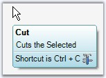
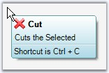
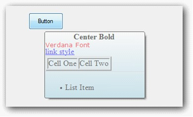

::: {style="DISPLAY: none"}
{#d2h_url_template}{#d2h_package_url style="WIDTH: 0px; DISPLAY: none; HEIGHT: 0px"}
:::

:::::::: {.d2h_secondary_topic style="PADDING-BOTTOM: 10pt; MARGIN: 0pt; PADDING-LEFT: 0pt; PADDING-RIGHT: 0pt; PADDING-TOP: 0pt"}
##### ToolTip Items Customization {#tooltip-items-customization style="tab-stops: 0pt"}

 

This section discusses the customization properties for the ToolTipItems.

[]{style="COLOR: #15428b"} 

::: {style="BORDER-BOTTOM: windowtext 1pt solid; BORDER-LEFT: medium none; PADDING-BOTTOM: 1pt; MARGIN: 9pt 0pt 9pt 18pt; PADDING-LEFT: 0pt; PADDING-RIGHT: 0pt; BORDER-TOP: windowtext 1pt solid; BORDER-RIGHT: medium none; PADDING-TOP: 1pt"}
{border="0"} Note:[ ]{style="COLOR: black; FONT-SIZE: 8pt"}All these properties are applicable to all the three ToolTipItems.
:::

[]{style="COLOR: #15428b"} 

Image Settings

**[]{style="COLOR: #15428b"}** 

::: {align="center"}
  ----------------------- --------------------------------------------
  Property                Description
  Image                   Sets the image to be shown on the Tooltip.
  ImageAlign              Indicates the alignment of the image.
  ImageScalingSize        Sets the size of the image.
  ImageTransparentColor   Sets the transparent color for the image.
  ----------------------- --------------------------------------------
:::

[]{style="COLOR: #4a5c8c; FONT-SIZE: 8pt"} 

Images can be associated with the header, body and footer of the super tooltip using this property.

[]{style="COLOR: #15428b"} 

+--------------------------------------------------------------------------------------------------------------------------------------------------------------------------------------+
| **[\[C#\]]{style="FONT-FAMILY: 'Courier New'; COLOR: black"}**                                                                                                                       |
|                                                                                                                                                                                      |
| []{style="COLOR: #15428b"}                                                                                                                                                           |
|                                                                                                                                                                                      |
| [toolTipInfo1.Footer.Image = ((System.Drawing.[Image]{style="COLOR: teal"})(resources.GetObject([\"resource.Image\"]{style="COLOR: maroon"})));]{style="FONT-FAMILY: 'Courier New'"} |
|                                                                                                                                                                                      |
| [toolTipInfo1.Footer.ImageAlign = System.Drawing.[ContentAlignment]{style="COLOR: teal"}.MiddleCenter;]{style="FONT-FAMILY: 'Courier New'"}                                          |
|                                                                                                                                                                                      |
| [toolTipInfo1.Footer.ImageScalingSize = [new]{style="COLOR: blue"} System.Drawing.[Size]{style="COLOR: teal"}(16, 16);]{style="FONT-FAMILY: 'Courier New'"}                          |
+--------------------------------------------------------------------------------------------------------------------------------------------------------------------------------------+

[]{style="COLOR: #15428b"} 

+------------------------------------------------------------------------------------------------------------------------------------------------------------------------------------------------+
| **[\[VB.NET\]]{style="FONT-FAMILY: 'Courier New'; COLOR: black"}**                                                                                                                             |
|                                                                                                                                                                                                |
| []{style="COLOR: black"}                                                                                                                                                                       |
|                                                                                                                                                                                                |
| [toolTipInfo1.Footer.Image = [DirectCast]{style="COLOR: blue"}((resources.GetObject([\"resource.Image\"]{style="COLOR: maroon"})), System.Drawing.Image) ]{style="FONT-FAMILY: 'Courier New'"} |
|                                                                                                                                                                                                |
| [toolTipInfo1.Footer.ImageAlign = System.Drawing.ContentAlignment.MiddleCenter ]{style="FONT-FAMILY: 'Courier New'"}                                                                           |
|                                                                                                                                                                                                |
| [toolTipInfo1.Footer.ImageScalingSize = [New]{style="COLOR: blue"} System.Drawing.Size(16, 16)]{style="FONT-FAMILY: 'Courier New'"}[]{style="FONT-FAMILY: 'Courier New'"}                      |
+------------------------------------------------------------------------------------------------------------------------------------------------------------------------------------------------+

[]{style="COLOR: #15428b"} 

{border="0"}

[]{style="COLOR: #15428b"} 

***[]{style="COLOR: #15428b"}*** 

Figure 1450: Image Set for Footer

**[]{style="COLOR: #15428b"}** 

Foreground Settings[]{#p1198}

[]{style="COLOR: #15428b"} 

::: {align="center"}
  ----------- ------------------------------------------
  Property    Description
  Font        Sets the FontStyle for the item\'s text.
  ForeColor   Sets the ForeColor for the item\'s text.
  ----------- ------------------------------------------
:::

[]{style="COLOR: #15428b"} 

+---------------------------------------------------------------------------------------------------------------------------------------------------------------------------------------------------------------------------------------------------------+
| **[\[C#\]]{style="FONT-FAMILY: 'Courier New'; COLOR: black"}**                                                                                                                                                                                          |
|                                                                                                                                                                                                                                                         |
| []{style="COLOR: black"}                                                                                                                                                                                                                                |
|                                                                                                                                                                                                                                                         |
| [toolTipInfo1.Header.Font = [new]{style="COLOR: blue"} System.Drawing.[Font]{style="COLOR: teal"}([\"Microsoft Sans Serif\"]{style="COLOR: maroon"}, 8.25F, System.Drawing.[FontStyle]{style="COLOR: teal"}.Bold);]{style="FONT-FAMILY: 'Courier New'"} |
|                                                                                                                                                                                                                                                         |
| [toolTipInfo1.Header.ForeColor = System.Drawing.[Color]{style="COLOR: teal"}.Black;]{style="FONT-FAMILY: 'Courier New'"}                                                                                                                                |
+---------------------------------------------------------------------------------------------------------------------------------------------------------------------------------------------------------------------------------------------------------+

[]{style="COLOR: #15428b"} 

+-----------------------------------------------------------------------------------------------------------------------------------------------------------------------------------------------------------+
| **[\[VB.NET\]]{style="FONT-FAMILY: 'Courier New'; COLOR: black"}**                                                                                                                                        |
|                                                                                                                                                                                                           |
| []{style="COLOR: #15428b"}                                                                                                                                                                                |
|                                                                                                                                                                                                           |
| [toolTipInfo1.Header.Font = [New]{style="COLOR: blue"} System.Drawing.Font([\"Microsoft Sans Serif\"]{style="COLOR: maroon"}, 8.25F, System.Drawing.FontStyle.Bold) ]{style="FONT-FAMILY: 'Courier New'"} |
|                                                                                                                                                                                                           |
| [toolTipInfo1.Header.ForeColor = System.Drawing.Color.Black ]{style="FONT-FAMILY: 'Courier New'"}                                                                                                         |
+-----------------------------------------------------------------------------------------------------------------------------------------------------------------------------------------------------------+

[]{style="COLOR: #15428b"} 

Appearance and Text Settings[]{#p1199}

[]{style="COLOR: #15428b"} 

::: {align="center"}
+-----------------------------------+--------------------------------------------------------------------------------------+
| Property                          | Description                                                                          |
+-----------------------------------+--------------------------------------------------------------------------------------+
| Hidden                            | Shows or hides a tooltip item. Default is false.                                     |
+-----------------------------------+--------------------------------------------------------------------------------------+
| Text                              | Sets the text to be displayed in the ToolTip Item. Its supports multiline text also. |
+-----------------------------------+--------------------------------------------------------------------------------------+
| TextAlign                         | Indicates the alignment of the tooltip text.                                         |
+-----------------------------------+--------------------------------------------------------------------------------------+
| TextImageRelation                 | Sets the location of the text in relation to the image. The options are,             |
|                                   |                                                                                      |
|                                   |                                                                                      |
|                                   |                                                                                      |
|                                   | [·      ]{style="FONT-FAMILY: Symbol"}ImageBeforeText and                            |
|                                   |                                                                                      |
|                                   | [·      ]{style="FONT-FAMILY: Symbol"}TextBeforeImage.                               |
+-----------------------------------+--------------------------------------------------------------------------------------+
| TextMargin                        | Sets the text margin for the Tooltip item.                                           |
+-----------------------------------+--------------------------------------------------------------------------------------+
:::

[]{style="COLOR: #15428b"} 

+-------------------------------------------------------------------------------------------------------------------------------------------------------------------------------------------------------------------------------------------------------------------------------------------------------------------------------------------------------------------------------------------------------------+
| **[\[C#\]]{style="FONT-FAMILY: 'Courier New'; COLOR: black"}**                                                                                                                                                                                                                                                                                                                                              |
|                                                                                                                                                                                                                                                                                                                                                                                                             |
| []{style="COLOR: black"}                                                                                                                                                                                                                                                                                                                                                                                    |
|                                                                                                                                                                                                                                                                                                                                                                                                             |
| [toolTipInfo1.Header.Hidden = ]{style="FONT-FAMILY: 'Courier New'; COLOR: black"}[true]{style="FONT-FAMILY: 'Courier New'; COLOR: blue"}[;]{style="FONT-FAMILY: 'Courier New'; COLOR: black"}                                                                                                                                                                                                               |
|                                                                                                                                                                                                                                                                                                                                                                                                             |
| [toolTipInfo1.Header.Text = [\"Cut\"]{style="COLOR: maroon"};]{style="FONT-FAMILY: 'Courier New'"}                                                                                                                                                                                                                                                                                                          |
|                                                                                                                                                                                                                                                                                                                                                                                                             |
| [toolTipInfo1.Header.TextAlign = System.Drawing.[ContentAlignment]{style="COLOR: teal"}.MiddleLeft;]{style="FONT-FAMILY: 'Courier New'"}                                                                                                                                                                                                                                                                    |
|                                                                                                                                                                                                                                                                                                                                                                                                             |
| [toolTipInfo1.Header.TextImageRelation = Syncfusion.Windows.Forms.Tools.[ToolTipTextImageRelation]{style="COLOR: teal"}.ImageBeforeText;]{style="FONT-FAMILY: 'Courier New'"}                                                                                                                                                                                                                               |
|                                                                                                                                                                                                                                                                                                                                                                                                             |
| [toolTipInfo1.]{style="FONT-FAMILY: 'Courier New'; COLOR: black"}[Header[.TextMargin = ]{style="COLOR: black"}[new]{style="COLOR: blue"}[ ]{style="COLOR: black"}]{style="FONT-FAMILY: 'Courier New'"}[System.Windows.Forms.]{style="FONT-FAMILY: 'Courier New'; COLOR: black"}[Padding(1, 1, 1, 1);]{style="FONT-FAMILY: 'Courier New'; COLOR: black"}[]{style="FONT-FAMILY: 'Courier New'; COLOR: black"} |
+-------------------------------------------------------------------------------------------------------------------------------------------------------------------------------------------------------------------------------------------------------------------------------------------------------------------------------------------------------------------------------------------------------------+

[]{style="COLOR: #15428b"} 

+------------------------------------------------------------------------------------------------------------------------------------------------------------------------------------------------------------------------------------------------------------------------------------------------------------------------------------------------------------------------------------------------------------+
| **[\[VB.NET\]]{style="FONT-FAMILY: 'Courier New'; COLOR: black"}**                                                                                                                                                                                                                                                                                                                                         |
|                                                                                                                                                                                                                                                                                                                                                                                                            |
| []{style="COLOR: black"}                                                                                                                                                                                                                                                                                                                                                                                   |
|                                                                                                                                                                                                                                                                                                                                                                                                            |
| [toolTipInfo1.Header.Hidden = ]{style="FONT-FAMILY: 'Courier New'; COLOR: black"}[True]{style="FONT-FAMILY: 'Courier New'; COLOR: blue"}                                                                                                                                                                                                                                                                   |
|                                                                                                                                                                                                                                                                                                                                                                                                            |
| [toolTipInfo1.Header.Text = [\"Cut\"]{style="COLOR: maroon"} ]{style="FONT-FAMILY: 'Courier New'"}                                                                                                                                                                                                                                                                                                         |
|                                                                                                                                                                                                                                                                                                                                                                                                            |
| [toolTipInfo1.Header.TextAlign = System.Drawing.ContentAlignment.MiddleLeft ]{style="FONT-FAMILY: 'Courier New'"}                                                                                                                                                                                                                                                                                          |
|                                                                                                                                                                                                                                                                                                                                                                                                            |
| [toolTipInfo1.Header.TextImageRelation = Syncfusion.Windows.Forms.Tools.ToolTipTextImageRelation.ImageBeforeText ]{style="FONT-FAMILY: 'Courier New'"}                                                                                                                                                                                                                                                     |
|                                                                                                                                                                                                                                                                                                                                                                                                            |
| [toolTipInfo1.]{style="FONT-FAMILY: 'Courier New'; COLOR: black"}[Header[.TextMargin = ]{style="COLOR: black"}[New]{style="COLOR: blue"}[ ]{style="COLOR: black"}]{style="FONT-FAMILY: 'Courier New'"}[System.Windows.Forms.]{style="FONT-FAMILY: 'Courier New'; COLOR: black"}[Padding(1, 1, 1, 1)]{style="FONT-FAMILY: 'Courier New'; COLOR: black"}[]{style="FONT-FAMILY: 'Courier New'; COLOR: black"} |
+------------------------------------------------------------------------------------------------------------------------------------------------------------------------------------------------------------------------------------------------------------------------------------------------------------------------------------------------------------------------------------------------------------+

[]{style="COLOR: #15428b"} 

{border="0"}

[]{style="COLOR: #15428b"} 

Figure 1451: Header ToolTipItem with Customized Appearance and Text Settings

**[]{style="COLOR: #15428b"}** 

::: {style="BORDER-BOTTOM: windowtext 1pt solid; BORDER-LEFT: medium none; PADDING-BOTTOM: 1pt; MARGIN: 9pt 0pt 9pt 18pt; PADDING-LEFT: 0pt; PADDING-RIGHT: 0pt; BORDER-TOP: windowtext 1pt solid; BORDER-RIGHT: medium none; PADDING-TOP: 1pt"}
{border="0"} Note: A SuperToolTip (Body, Header and Footer) can be hidden by calling the SuperToolTip.Hide() method.
:::

[]{style="COLOR: #15428b"} 

[]{style="FONT-FAMILY: 'Times New Roman','serif'; FONT-SIZE: 11pt"} 

Adding  RenderHtml and Size Property to the SuperToolTip.

Text given in the Text property will be considered as HTML strings and displayed as HTML, when the RenderHtml property is set to true.

Size property sets the size of header, body and footer Item. Size property will be enabled when the RenderHtml is set to true.

 

CSS properties and all the text formatting HTML tags are supported.

{border="0"}

***[]{style="COLOR: #15428b"}*** 

Figure 1452: Tooltip

***[]{style="COLOR: #15428b"}*** 

The following code illustrates setting **RenderHtml**, **Text**, **Size** properties.

+-------------------------------------------------------------------------------------------------------------------------------------------------------------------+
| []{#p1200}**[\[C# .Net\]]{style="FONT-FAMILY: 'Courier New'"}**                                                                                                   |
|                                                                                                                                                                   |
| []{style="FONT-FAMILY: 'Courier New'"}                                                                                                                            |
|                                                                                                                                                                   |
| [toolTipInfo2.Footer.Size = new System.Drawing.Size(200, 50);]{style="FONT-FAMILY: 'Courier New'"}                                                                |
|                                                                                                                                                                   |
| [ toolTipInfo2.Footer.RenderHtml = true;]{style="FONT-FAMILY: 'Courier New'"}                                                                                     |
|                                                                                                                                                                   |
| [ toolTipInfo2.Footer.Text = \"\<ul\>\<li\>List Item\</li\>\</ul\>\";]{style="FONT-FAMILY: 'Courier New'"}[]{style="FONT-FAMILY: 'Courier New'; FONT-SIZE: 11pt"} |
+-------------------------------------------------------------------------------------------------------------------------------------------------------------------+

[]{style="FONT-FAMILY: 'Times New Roman','serif'; FONT-SIZE: 11pt"} 

+--------------------------------------------------------------------------------------------------------------------------------------------------------------------+
| **[\[VB .Net\]]{style="FONT-FAMILY: 'Courier New'"}**                                                                                                              |
|                                                                                                                                                                    |
| []{style="FONT-FAMILY: 'Courier New'"}                                                                                                                             |
|                                                                                                                                                                    |
| [Me. toolTipInfo2.Footer.Size= New System.Drawing.Size(200,50)]{style="FONT-FAMILY: 'Courier New'"}                                                                |
|                                                                                                                                                                    |
| [Me.toolTipInfo2.Footer.RenderHtml = true]{style="FONT-FAMILY: 'Courier New'"}                                                                                     |
|                                                                                                                                                                    |
| [Me.toolTipInfo2.Footer.Text = \"\<ul\>\<li\>List Item\</li\>\</ul\>\"]{style="FONT-FAMILY: 'Courier New'"}[]{style="FONT-FAMILY: 'Courier New'; FONT-SIZE: 11pt"} |
+--------------------------------------------------------------------------------------------------------------------------------------------------------------------+

 

[]{#related-topics}
::::::::
