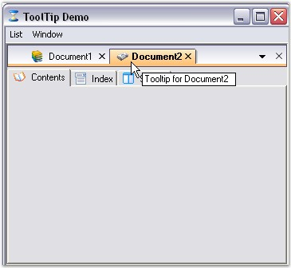

::: {style="DISPLAY: none"}
{#d2h_url_template}{#d2h_package_url style="WIDTH: 0px; DISPLAY: none; HEIGHT: 0px"}
:::

:::: {.d2h_secondary_topic style="PADDING-BOTTOM: 10pt; MARGIN: 0pt; PADDING-LEFT: 0pt; PADDING-RIGHT: 0pt; PADDING-TOP: 0pt"}
##### Tooltips {#tooltips style="MARGIN-LEFT: 18pt; tab-stops: 18.0pt"}

[]{style="COLOR: #15428b"} 

Tooltip can be enabled for child windows or tabs using the below code snippet, where doc is the new child form that is created.

 

The **GetTooltip** method is used to set the Tooltips for the tabs.

[]{style="COLOR: #15428b"} 

::: {align="center"}
+-----------------------------------+----------------------------------------------------------------------------------------------------------------------+
| Method                            | Description                                                                                                          |
+-----------------------------------+----------------------------------------------------------------------------------------------------------------------+
| GetTooltip                        | Gets the tooltips for the tabs associated with a form.                                                               |
|                                   |                                                                                                                      |
|                                   |                                                                                                                      |
|                                   |                                                                                                                      |
|                                   | [·      ]{style="FONT-FAMILY: Symbol"}*mdiChild* - indicates the MDIChild form to which the tooltip should be added. |
|                                   |                                                                                                                      |
|                                   | [·      ]{style="FONT-FAMILY: Symbol"}*tooltip* - indicates that the tooltip to be added is of type string.          |
+-----------------------------------+----------------------------------------------------------------------------------------------------------------------+
| SetTooltip                        | Sets the tooltips for the tabs associated with a form.                                                               |
+-----------------------------------+----------------------------------------------------------------------------------------------------------------------+
:::

[]{style="COLOR: #15428b"} 

+--------------------------------------------------------------------------------------------------------------------------------------------------------------+
| **[\[C#\]]{style="FONT-FAMILY: 'Courier New'; COLOR: black"}**                                                                                               |
|                                                                                                                                                              |
| []{style="FONT-FAMILY: 'Courier New'; COLOR: black"}                                                                                                         |
|                                                                                                                                                              |
| [this]{style="FONT-FAMILY: 'Courier New'; COLOR: blue"}[.TabbedMDIManager.GetTooltip(doc, \"Tooltip for \" + doc.Text);]{style="FONT-FAMILY: 'Courier New'"} |
+--------------------------------------------------------------------------------------------------------------------------------------------------------------+

[]{style="COLOR: #15428b"} 

+-----------------------------------------------------------------------------------------------------------------------------------------------------------+
| **[\[VB.NET\]]{style="FONT-FAMILY: 'Courier New'; COLOR: black"}**                                                                                        |
|                                                                                                                                                           |
| []{style="FONT-FAMILY: 'Courier New'; COLOR: black"}                                                                                                      |
|                                                                                                                                                           |
| [Me]{style="FONT-FAMILY: 'Courier New'; COLOR: blue"}[.TabbedMDIManager.GetTooltip(doc, \"Tooltip for \" + doc.Text)]{style="FONT-FAMILY: 'Courier New'"} |
+-----------------------------------------------------------------------------------------------------------------------------------------------------------+

[]{style="COLOR: #485e8c; FONT-SIZE: 8pt"} 

{border="0"}

**[]{style="COLOR: #15428b"}** 

Figure 1101: Tooltip Support Illustrated

[]{style="COLOR: #15428b"} 

See Also

[]{style="COLOR: #15428b"} 

[[Context Menu]{.UGHyperlink}](../../../../../../../../Documents%20and%20Settings/sylviap/Desktop/Tools%20-%20Part%202.docx#_Context_Menu)[]{.UGHyperlink}

 

 

 

[]{#p921} 

[]{#related-topics}
::::
