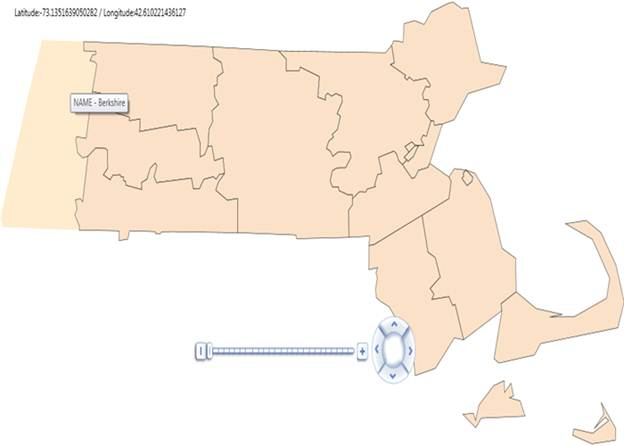

::: {style="DISPLAY: none"}
{#d2h_url_template}{#d2h_package_url style="WIDTH: 0px; DISPLAY: none; HEIGHT: 0px"}
:::

::::: {#nsbanner .d2h_main_nsbanner style="BORDER-BOTTOM: #999999 1px solid; POSITION: relative; PADDING-BOTTOM: 0px; BACKGROUND-COLOR: transparent; PADDING-LEFT: 0px; PADDING-RIGHT: 0px; DISPLAY: none; BORDER-TOP: #999999 1px solid; PADDING-TOP: 0px; LEFT: 0px"}
:::: {#TitleRow .d2h_main_titlerow style="PADDING-BOTTOM: 4px; BACKGROUND-COLOR: transparent; PADDING-LEFT: 22px; WIDTH: 100%; PADDING-RIGHT: 10px; DISPLAY: none; PADDING-TOP: 4px"}
::: {#ienav .d2h_main_ienav style="DISPLAY: none"}
{#D2HPrevious .D2HPreviousEnabled}  {#D2HNext .D2HNextEnabled}
:::
::::
:::::

:::: {#nstext .d2h_main_nstext style="PADDING-BOTTOM: 10px; BACKGROUND-COLOR: transparent; PADDING-LEFT: 22px; PADDING-RIGHT: 10px; HEIGHT: 100%; OVERFLOW: auto; PADDING-TOP: 5px" hasuserbackground="true" valign="bottom"}
::: {#d2h_breadcrumbs .d2h_breadcrumbs}
[Essential Studio User Guide Documentation](ms-xhelp:///?Id=12457748-09e3-4d74-a240-8e049cedf030){.d2h_breadcrumbsNormal}[ \> ]{.d2h_breadcrumbsLinkSeparator}[User Interface Edition](ms-xhelp:///?Id=c29296b7-531c-413b-a0ec-488ca1f7f669){.d2h_breadcrumbsNormal}[ \> ]{.d2h_breadcrumbsLinkSeparator}[Essential Silverlight](ms-xhelp:///?Id=66221bd1-ba2e-43c2-94a7-618f50e01d24){.d2h_breadcrumbsNormal}[ \> ]{.d2h_breadcrumbsLinkSeparator}[Essential Maps]{.d2h_breadcrumbsContentsOnly}[ \> ]{.d2h_breadcrumbsLinkSeparator}[Concepts and Features](ms-xhelp:///?Id=ab523ca4-cfb2-4736-9bef-ec20b3268450){.d2h_breadcrumbsNormal}
:::

## ToolTips {#tooltips style="tab-stops: 0pt"}

 

ToolTips will be shown during mouse over on the shape in Maps control. ToolTips can be shown through the AttributesItemSource of the ShapeFileLayer. AttributesItemSource is the IEnumerable collection. AttributesDataMapping will be mapped with AttributesItemSource, to show the ToolTip for  Maps Silverlight.

The following Code Snippet will demonstrate how to create the ToolTips for Maps Silverlight.

 

{border="0"}

Figure 23: ToolTips

+----------------------------------------------------------------------------------------------------------------------------------------------------------------------------------------+
| [\[C#\]]{style="FONT-FAMILY: 'Courier New'"}[ ]{style="FONT-FAMILY: Consolas; COLOR: #2b91af; FONT-SIZE: 9.5pt"}                                                                       |
|                                                                                                                                                                                        |
| [using]{style="FONT-FAMILY: Consolas; COLOR: blue; FONT-SIZE: 9.5pt"}[ System;]{style="FONT-FAMILY: Consolas; FONT-SIZE: 9.5pt"}                                                       |
|                                                                                                                                                                                        |
| [using]{style="FONT-FAMILY: Consolas; COLOR: blue; FONT-SIZE: 9.5pt"}[ System.Collections.Generic;]{style="FONT-FAMILY: Consolas; FONT-SIZE: 9.5pt"}                                   |
|                                                                                                                                                                                        |
| [using]{style="FONT-FAMILY: Consolas; COLOR: blue; FONT-SIZE: 9.5pt"}[ System.Linq;]{style="FONT-FAMILY: Consolas; FONT-SIZE: 9.5pt"}                                                  |
|                                                                                                                                                                                        |
| [using]{style="FONT-FAMILY: Consolas; COLOR: blue; FONT-SIZE: 9.5pt"}[ System.Text;]{style="FONT-FAMILY: Consolas; FONT-SIZE: 9.5pt"}                                                  |
|                                                                                                                                                                                        |
| [namespace]{style="FONT-FAMILY: Consolas; COLOR: blue; FONT-SIZE: 9.5pt"}[ ToolTipDemo]{style="FONT-FAMILY: Consolas; FONT-SIZE: 9.5pt"}                                               |
|                                                                                                                                                                                        |
| [{]{style="FONT-FAMILY: Consolas; FONT-SIZE: 9.5pt"}                                                                                                                                   |
|                                                                                                                                                                                        |
| [   [public]{style="COLOR: blue"} [class]{style="COLOR: blue"} [MapToolTips]{style="COLOR: #2b91af"}]{style="FONT-FAMILY: Consolas; FONT-SIZE: 9.5pt"}                                 |
|                                                                                                                                                                                        |
| [    {]{style="FONT-FAMILY: Consolas; FONT-SIZE: 9.5pt"}                                                                                                                               |
|                                                                                                                                                                                        |
| [       [public]{style="COLOR: blue"} MapToolTips()]{style="FONT-FAMILY: Consolas; FONT-SIZE: 9.5pt"}                                                                                  |
|                                                                                                                                                                                        |
| [       { }]{style="FONT-FAMILY: Consolas; FONT-SIZE: 9.5pt"}                                                                                                                          |
|                                                                                                                                                                                        |
| [       [public]{style="COLOR: blue"} [string]{style="COLOR: blue"} NAME { [get]{style="COLOR: blue"}; [set]{style="COLOR: blue"}; }]{style="FONT-FAMILY: Consolas; FONT-SIZE: 9.5pt"} |
|                                                                                                                                                                                        |
| [    }]{style="FONT-FAMILY: Consolas; FONT-SIZE: 9.5pt"}                                                                                                                               |
|                                                                                                                                                                                        |
| [}]{style="FONT-FAMILY: Consolas; FONT-SIZE: 9.5pt"}                                                                                                                                   |
+----------------------------------------------------------------------------------------------------------------------------------------------------------------------------------------+

 

+-------------------------------------------------------------------------------------------------------------------------------------------------------------------------------------------------------+
| [\[C#\]]{style="FONT-FAMILY: 'Courier New'"}[ ]{style="FONT-FAMILY: 'Courier New'; COLOR: #2b91af"}                                                                                                   |
|                                                                                                                                                                                                       |
| [using]{style="FONT-FAMILY: 'Courier New'; COLOR: blue"}[ System;]{style="FONT-FAMILY: 'Courier New'"}                                                                                                |
|                                                                                                                                                                                                       |
| [using]{style="FONT-FAMILY: 'Courier New'; COLOR: blue"}[ System.Collections.Generic;]{style="FONT-FAMILY: 'Courier New'"}                                                                            |
|                                                                                                                                                                                                       |
| [using]{style="FONT-FAMILY: 'Courier New'; COLOR: blue"}[ System.Linq;]{style="FONT-FAMILY: 'Courier New'"}                                                                                           |
|                                                                                                                                                                                                       |
| [using]{style="FONT-FAMILY: 'Courier New'; COLOR: blue"}[ System.Text;]{style="FONT-FAMILY: 'Courier New'"}                                                                                           |
|                                                                                                                                                                                                       |
| [using]{style="FONT-FAMILY: 'Courier New'; COLOR: blue"}[ System.Collections.ObjectModel;]{style="FONT-FAMILY: 'Courier New'"}                                                                        |
|                                                                                                                                                                                                       |
| []{style="FONT-FAMILY: 'Courier New'"}                                                                                                                                                                |
|                                                                                                                                                                                                       |
| [namespace]{style="FONT-FAMILY: 'Courier New'; COLOR: blue"}[ ToolTipDemo]{style="FONT-FAMILY: 'Courier New'"}                                                                                        |
|                                                                                                                                                                                                       |
| [{]{style="FONT-FAMILY: 'Courier New'"}                                                                                                                                                               |
|                                                                                                                                                                                                       |
| [    [class]{style="COLOR: blue"} [MapToolTip]{style="COLOR: #2b91af"} : [ObservableCollection]{style="COLOR: #2b91af"}\<[MapToolTips]{style="COLOR: #2b91af"}\>]{style="FONT-FAMILY: 'Courier New'"} |
|                                                                                                                                                                                                       |
| [    {]{style="FONT-FAMILY: 'Courier New'"}                                                                                                                                                           |
|                                                                                                                                                                                                       |
| [        [public]{style="COLOR: blue"} MapToolTip()]{style="FONT-FAMILY: 'Courier New'"}                                                                                                              |
|                                                                                                                                                                                                       |
| [        {]{style="FONT-FAMILY: 'Courier New'"}                                                                                                                                                       |
|                                                                                                                                                                                                       |
| [            Add([new]{style="COLOR: blue"} [MapToolTips]{style="COLOR: #2b91af"} { NAME = [\"Essex\"]{style="COLOR: #a31515"} });]{style="FONT-FAMILY: 'Courier New'"}                               |
|                                                                                                                                                                                                       |
| [            Add([new]{style="COLOR: blue"} [MapToolTips]{style="COLOR: #2b91af"} { NAME = [\"Berkshire\"]{style="COLOR: #a31515"} });]{style="FONT-FAMILY: 'Courier New'"}                           |
|                                                                                                                                                                                                       |
| [            Add([new]{style="COLOR: blue"} [MapToolTips]{style="COLOR: #2b91af"} { NAME = [\"Franklin\"]{style="COLOR: #a31515"} });]{style="FONT-FAMILY: 'Courier New'"}                            |
|                                                                                                                                                                                                       |
| [            Add([new]{style="COLOR: blue"} [MapToolTips]{style="COLOR: #2b91af"} { NAME = [\"Middlesex\"]{style="COLOR: #a31515"} });]{style="FONT-FAMILY: 'Courier New'"}                           |
|                                                                                                                                                                                                       |
| [            Add([new]{style="COLOR: blue"} [MapToolTips]{style="COLOR: #2b91af"} { NAME = [\"Worcester\"]{style="COLOR: #a31515"} });]{style="FONT-FAMILY: 'Courier New'"}                           |
|                                                                                                                                                                                                       |
| [            Add([new]{style="COLOR: blue"} [MapToolTips]{style="COLOR: #2b91af"} { NAME = [\"Hampshire\"]{style="COLOR: #a31515"} });]{style="FONT-FAMILY: 'Courier New'"}                           |
|                                                                                                                                                                                                       |
| [            Add([new]{style="COLOR: blue"} [MapToolTips]{style="COLOR: #2b91af"} { NAME = [\"Suffolk\"]{style="COLOR: #a31515"} });]{style="FONT-FAMILY: 'Courier New'"}                             |
|                                                                                                                                                                                                       |
| [            Add([new]{style="COLOR: blue"} [MapToolTips]{style="COLOR: #2b91af"} { NAME = [\"Plymouth\"]{style="COLOR: #a31515"} });]{style="FONT-FAMILY: 'Courier New'"}                            |
|                                                                                                                                                                                                       |
| [            Add([new]{style="COLOR: blue"} [MapToolTips]{style="COLOR: #2b91af"} { NAME = [\"Norfolk\"]{style="COLOR: #a31515"} });]{style="FONT-FAMILY: 'Courier New'"}                             |
|                                                                                                                                                                                                       |
| [            Add([new]{style="COLOR: blue"} [MapToolTips]{style="COLOR: #2b91af"} { NAME = [\"Briscol\"]{style="COLOR: #a31515"} });]{style="FONT-FAMILY: 'Courier New'"}                             |
|                                                                                                                                                                                                       |
| [            Add([new]{style="COLOR: blue"} [MapToolTips]{style="COLOR: #2b91af"} { NAME = [\"Branstable\"]{style="COLOR: #a31515"} });]{style="FONT-FAMILY: 'Courier New'"}                          |
|                                                                                                                                                                                                       |
| [            Add([new]{style="COLOR: blue"} [MapToolTips]{style="COLOR: #2b91af"} { NAME = [\"Dukes\"]{style="COLOR: #a31515"} });]{style="FONT-FAMILY: 'Courier New'"}                               |
|                                                                                                                                                                                                       |
| [            Add([new]{style="COLOR: blue"} [MapToolTips]{style="COLOR: #2b91af"} { NAME = [\"Nantucket\"]{style="COLOR: #a31515"} });]{style="FONT-FAMILY: 'Courier New'"}                           |
|                                                                                                                                                                                                       |
| [           ]{style="FONT-FAMILY: 'Courier New'"}                                                                                                                                                     |
|                                                                                                                                                                                                       |
| [        }]{style="FONT-FAMILY: 'Courier New'"}                                                                                                                                                       |
|                                                                                                                                                                                                       |
| [    }]{style="FONT-FAMILY: 'Courier New'"}                                                                                                                                                           |
|                                                                                                                                                                                                       |
| [}]{style="FONT-FAMILY: 'Courier New'"}                                                                                                                                                               |
+-------------------------------------------------------------------------------------------------------------------------------------------------------------------------------------------------------+

         

+---------------------------------------------------------------------------------------------------------------------------------------------------------------------------------------+
| [\[C#\]]{style="FONT-FAMILY: 'Courier New'"}[ ]{style="FONT-FAMILY: 'Courier New'; COLOR: #2b91af"}                                                                                   |
|                                                                                                                                                                                       |
| [            this]{style="FONT-FAMILY: 'Courier New'; COLOR: blue"}[.shapeControl.AttributesDataMapping = [\"NAME;\"]{style="COLOR: #a31515"};]{style="FONT-FAMILY: 'Courier New'"}   |
|                                                                                                                                                                                       |
| [            [this]{style="COLOR: blue"}.shapeControl.AttributesItemsSource = [new]{style="COLOR: blue"} [MapToolTip]{style="COLOR: #2b91af"}();]{style="FONT-FAMILY: 'Courier New'"} |
+---------------------------------------------------------------------------------------------------------------------------------------------------------------------------------------+

 

**Notes:**

To define multiple AttributesDataMapping elements, the elements can be separated by the semi colon (;). AttributesItemSource elements value and the property of the class, which is to be binded with AttributesItemSource should be same. For enabling the ToolTips with this method, ShowAttributesToolTip property must be set as true.

 

+-----------------------------------------------------------------------------------------------------------------------------------------------------------------------------+
| [\[C#\]]{style="FONT-FAMILY: 'Courier New'"}[ ]{style="FONT-FAMILY: 'Courier New'; COLOR: #2b91af"}                                                                         |
|                                                                                                                                                                             |
| [            this]{style="FONT-FAMILY: 'Courier New'; COLOR: blue"}[.shapeControl.ShowAttributesToolTip = [true]{style="COLOR: blue"};]{style="FONT-FAMILY: 'Courier New'"} |
+-----------------------------------------------------------------------------------------------------------------------------------------------------------------------------+

 

 

[]{#related-topics}
::::
