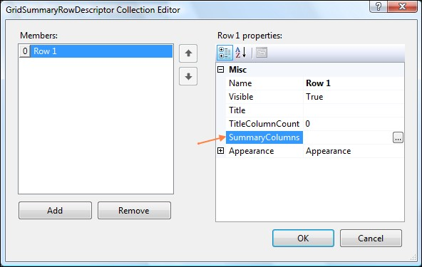
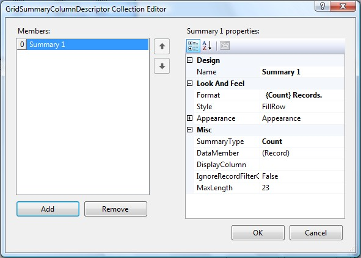

::: {style="DISPLAY: none"}
{#d2h_url_template}{#d2h_package_url style="WIDTH: 0px; DISPLAY: none; HEIGHT: 0px"}
:::

::::: {#nsbanner .d2h_main_nsbanner style="BORDER-BOTTOM: #999999 1px solid; POSITION: relative; PADDING-BOTTOM: 0px; BACKGROUND-COLOR: transparent; PADDING-LEFT: 0px; PADDING-RIGHT: 0px; DISPLAY: none; BORDER-TOP: #999999 1px solid; PADDING-TOP: 0px; LEFT: 0px"}
:::: {#TitleRow .d2h_main_titlerow style="PADDING-BOTTOM: 4px; BACKGROUND-COLOR: transparent; PADDING-LEFT: 22px; WIDTH: 100%; PADDING-RIGHT: 10px; DISPLAY: none; PADDING-TOP: 4px"}
::: {#ienav .d2h_main_ienav style="DISPLAY: none"}
{#D2HPrevious .D2HPreviousEnabled}  {#D2HNext .D2HNextEnabled}
:::
::::
:::::

::::: {#nstext .d2h_main_nstext style="PADDING-BOTTOM: 10px; BACKGROUND-COLOR: transparent; PADDING-LEFT: 22px; PADDING-RIGHT: 10px; HEIGHT: 100%; OVERFLOW: auto; PADDING-TOP: 5px" hasuserbackground="true" valign="bottom"}
::: {#d2h_breadcrumbs .d2h_breadcrumbs}
[Essential Studio User Guide Documentation](ms-xhelp:///?Id=12457748-09e3-4d74-a240-8e049cedf030){.d2h_breadcrumbsNormal}[ \> ]{.d2h_breadcrumbsLinkSeparator}[User Interface Edition](ms-xhelp:///?Id=c29296b7-531c-413b-a0ec-488ca1f7f669){.d2h_breadcrumbsNormal}[ \> ]{.d2h_breadcrumbsLinkSeparator}[Essential ASP.NET](ms-xhelp:///?Id=25c35330-c127-4dad-9a92-ed79dc7261a6){.d2h_breadcrumbsNormal}[ \> ]{.d2h_breadcrumbsLinkSeparator}[Essential Grid]{.d2h_breadcrumbsContentsOnly}[ \> ]{.d2h_breadcrumbsLinkSeparator}[Concepts and Features](ms-xhelp:///?Id=9e489974-524d-457c-9881-e458b1321685){.d2h_breadcrumbsNormal}[ \> ]{.d2h_breadcrumbsLinkSeparator}[Summary](ms-xhelp:///?Id=99ccb45f-cf88-4212-a6e0-481362ff7f20){.d2h_breadcrumbsNormal}
:::

### Total Summary {#total-summary style="tab-stops: 0pt"}

[]{style="FONT-FAMILY: 'Trebuchet MS','sans-serif'; COLOR: #15428b; FONT-SIZE: 9pt"} 

Summaries can be created in the following two ways.

[]{style="FONT-FAMILY: 'Trebuchet MS','sans-serif'; COLOR: #15428b; FONT-SIZE: 9pt"} 

[·      ]{style="FONT-FAMILY: Symbol"}Though Designer

[·      ]{style="FONT-FAMILY: Symbol"}Through Code

[]{style="FONT-FAMILY: 'Trebuchet MS','sans-serif'; COLOR: #15428b; FONT-SIZE: 9pt"} 

Through Designer

[]{style="FONT-FAMILY: 'Trebuchet MS','sans-serif'; COLOR: #15428b; FONT-SIZE: 9pt"} 

This section deals with creation of summaries through the designer.

**[]{style="COLOR: black; FONT-SIZE: 8pt"}** 

[·      ]{style="FONT-FAMILY: Symbol"}**GridSummaryRowDescriptor[ ]{style="FONT-FAMILY: 'Verdana','sans-serif'; COLOR: black; FONT-SIZE: 8pt"}**Collection Editor is used to add summary rows to the Grid control.

[]{style="FONT-FAMILY: 'Trebuchet MS','sans-serif'; COLOR: #15428b; FONT-SIZE: 9pt"} 

{border="0"}

Figure 98

[]{style="FONT-FAMILY: 'Trebuchet MS','sans-serif'; COLOR: #15428b; FONT-SIZE: 9pt"} 

[·      ]{style="FONT-FAMILY: Symbol"}On the same window, clicking on the \"SummaryColumns\" field will open the **SummaryColumnDescriptor** Collection Editor, for adding Summary Columns to the selected Summary Row.

[]{style="FONT-FAMILY: 'Trebuchet MS','sans-serif'; COLOR: #15428b; FONT-SIZE: 9pt"} 

{border="0"}

Figure 99

[]{style="FONT-FAMILY: 'Trebuchet MS','sans-serif'; COLOR: #15428b; FONT-SIZE: 9pt"} 

The following properties can be set for the Summary Rows by using the SummaryColumnDescriptor Collection Editor.

[]{style="FONT-FAMILY: 'Trebuchet MS','sans-serif'; COLOR: #15428b; FONT-SIZE: 9pt"} 

::: {align="center"}
+-------------------------------------------------------------+-----------------------------------------------------------------------------------+
| Properties in GridSummaryColumnDescriptor Collection Editor | Description                                                                       |
+-------------------------------------------------------------+-----------------------------------------------------------------------------------+
| Format                                                      | Specifies the format for the summary column. The options included are as follows: |
|                                                             |                                                                                   |
|                                                             |                                                                                   |
|                                                             |                                                                                   |
|                                                             | [·      ]{style="FONT-FAMILY: Symbol"}Maximum                                     |
|                                                             |                                                                                   |
|                                                             | [·      ]{style="FONT-FAMILY: Symbol"}Average                                     |
|                                                             |                                                                                   |
|                                                             | [·      ]{style="FONT-FAMILY: Symbol"}Minimum                                     |
|                                                             |                                                                                   |
|                                                             | [·      ]{style="FONT-FAMILY: Symbol"}Sum                                         |
|                                                             |                                                                                   |
|                                                             | [·      ]{style="FONT-FAMILY: Symbol"}Count                                       |
+-------------------------------------------------------------+-----------------------------------------------------------------------------------+
| Style                                                       | Specifies the style. The options included are as follows:                         |
|                                                             |                                                                                   |
|                                                             |                                                                                   |
|                                                             |                                                                                   |
|                                                             | [·      ]{style="FONT-FAMILY: Symbol"}Hidden                                      |
|                                                             |                                                                                   |
|                                                             | [·      ]{style="FONT-FAMILY: Symbol"}FillRow                                     |
|                                                             |                                                                                   |
|                                                             | [·      ]{style="FONT-FAMILY: Symbol"}Column                                      |
|                                                             |                                                                                   |
|                                                             |                                                                                   |
|                                                             |                                                                                   |
|                                                             | The default value is FillRow.                                                     |
+-------------------------------------------------------------+-----------------------------------------------------------------------------------+
| Appearance                                                  | Specifies the appearance of the column.                                           |
+-------------------------------------------------------------+-----------------------------------------------------------------------------------+
| SummaryType                                                 | Specifies the summary type. The options included are as follows:                  |
|                                                             |                                                                                   |
|                                                             | [·      ]{style="FONT-FAMILY: Symbol"}Count                                       |
|                                                             |                                                                                   |
|                                                             | [·      ]{style="FONT-FAMILY: Symbol"}BooleanAggregate                            |
|                                                             |                                                                                   |
|                                                             | [·      ]{style="FONT-FAMILY: Symbol"}ByteAggregate                               |
|                                                             |                                                                                   |
|                                                             | [·      ]{style="FONT-FAMILY: Symbol"}CharAggregate                               |
|                                                             |                                                                                   |
|                                                             | [·      ]{style="FONT-FAMILY: Symbol"}DoubleAggregate                             |
|                                                             |                                                                                   |
|                                                             | [·      ]{style="FONT-FAMILY: Symbol"}Int32Aggregate                              |
|                                                             |                                                                                   |
|                                                             | [·      ]{style="FONT-FAMILY: Symbol"}StringAggregate                             |
|                                                             |                                                                                   |
|                                                             | [·      ]{style="FONT-FAMILY: Symbol"}MaxLength                                   |
|                                                             |                                                                                   |
|                                                             | [·      ]{style="FONT-FAMILY: Symbol"}Vector                                      |
|                                                             |                                                                                   |
|                                                             | [·      ]{style="FONT-FAMILY: Symbol"}DoubleVector                                |
|                                                             |                                                                                   |
|                                                             | [·      ]{style="FONT-FAMILY: Symbol"}Custom                                      |
+-------------------------------------------------------------+-----------------------------------------------------------------------------------+
| DataMember                                                  | Specifies the data member for which you want to display the summary.              |
+-------------------------------------------------------------+-----------------------------------------------------------------------------------+
| DisplayColumn                                               | Specifies the column to be displayed.                                             |
+-------------------------------------------------------------+-----------------------------------------------------------------------------------+
| IgnoreRecordFilter                                          | Specifies whether to ignore the record filter.                                    |
+-------------------------------------------------------------+-----------------------------------------------------------------------------------+
:::

[]{style="FONT-FAMILY: 'Trebuchet MS','sans-serif'; COLOR: #15428b; FONT-SIZE: 9pt"} 

Through Code

[]{style="COLOR: #4a5c8c; FONT-SIZE: 8pt"} 

+--------------------------------------------------------------------------------------------------------------------------------------------------------------------------------------------------------------------------------------------------------------------------------------------------------------+
| **[\[C#\]]{style="FONT-FAMILY: 'Courier New'; COLOR: black"}**                                                                                                                                                                                                                                               |
|                                                                                                                                                                                                                                                                                                              |
| []{style="FONT-FAMILY: 'Courier New'; COLOR: black"}                                                                                                                                                                                                                                                         |
|                                                                                                                                                                                                                                                                                                              |
| [GridSummaryColumnDescriptor]{style="FONT-FAMILY: 'Courier New'; COLOR: teal"}[ scd = [new]{style="COLOR: blue"} [GridSummaryColumnDescriptor]{style="COLOR: teal"}();]{style="FONT-FAMILY: 'Courier New'"}                                                                                                  |
|                                                                                                                                                                                                                                                                                                              |
| [scd.Name = [\"SummaryColumn\"]{style="COLOR: maroon"};]{style="FONT-FAMILY: 'Courier New'"}                                                                                                                                                                                                                 |
|                                                                                                                                                                                                                                                                                                              |
| [scd.DataMember = [\"Col1\"]{style="COLOR: maroon"};]{style="FONT-FAMILY: 'Courier New'"}                                                                                                                                                                                                                    |
|                                                                                                                                                                                                                                                                                                              |
| [scd.DisplayColumn = [\"Col1\"]{style="COLOR: maroon"};]{style="FONT-FAMILY: 'Courier New'"}                                                                                                                                                                                                                 |
|                                                                                                                                                                                                                                                                                                              |
| [scd.Format = [\"{Sum:#}\"]{style="COLOR: maroon"};]{style="FONT-FAMILY: 'Courier New'"}                                                                                                                                                                                                                     |
|                                                                                                                                                                                                                                                                                                              |
| [scd.SummaryType = SummaryType.Int32Aggregate;]{style="FONT-FAMILY: 'Courier New'"}                                                                                                                                                                                                                          |
|                                                                                                                                                                                                                                                                                                              |
| [this]{style="FONT-FAMILY: 'Courier New'; COLOR: blue"}[.GridGroupingControl1.TableDescriptor.SummaryRows.Add([new]{style="COLOR: blue"} [GridSummaryRowDescriptor]{style="COLOR: teal"}([\"Row 1\"]{style="COLOR: maroon"}, [\"Total\"]{style="COLOR: maroon"}, scd));]{style="FONT-FAMILY: 'Courier New'"} |
+--------------------------------------------------------------------------------------------------------------------------------------------------------------------------------------------------------------------------------------------------------------------------------------------------------------+

[]{style="FONT-FAMILY: 'Trebuchet MS','sans-serif'; COLOR: #15428b; FONT-SIZE: 9pt"} 

+-----------------------------------------------------------------------------------------------------------------------------------------------------------------------------------------------------------------------------------------------------------------------------------+
| **[\[VB.NET\]]{style="FONT-FAMILY: 'Courier New'; COLOR: black"}**                                                                                                                                                                                                                |
|                                                                                                                                                                                                                                                                                   |
| []{style="FONT-FAMILY: 'Courier New'; COLOR: black"}                                                                                                                                                                                                                              |
|                                                                                                                                                                                                                                                                                   |
| [Dim]{style="FONT-FAMILY: 'Courier New'; COLOR: blue"}[ scd [As]{style="COLOR: blue"} Syncfusion.Web.UI.WebControls.Grid.Grouping.GridSummaryColumnDescriptor = [New]{style="COLOR: blue"} GridSummaryColumnDescriptor()]{style="FONT-FAMILY: 'Courier New'"}                     |
|                                                                                                                                                                                                                                                                                   |
| [scd.Name = [\"SummaryColumn\"]{style="COLOR: maroon"}]{style="FONT-FAMILY: 'Courier New'"}                                                                                                                                                                                       |
|                                                                                                                                                                                                                                                                                   |
| [scd.DataMember = [\"Col1\"]{style="COLOR: maroon"}]{style="FONT-FAMILY: 'Courier New'"}                                                                                                                                                                                          |
|                                                                                                                                                                                                                                                                                   |
| [scd.DisplayColumn = [\"Col1\"]{style="COLOR: maroon"}]{style="FONT-FAMILY: 'Courier New'"}                                                                                                                                                                                       |
|                                                                                                                                                                                                                                                                                   |
| [scd.Format = [\"{Sum:#}\"]{style="COLOR: maroon"}]{style="FONT-FAMILY: 'Courier New'"}                                                                                                                                                                                           |
|                                                                                                                                                                                                                                                                                   |
| [scd.SummaryType = SummaryType.Int32Aggregate]{style="FONT-FAMILY: 'Courier New'"}                                                                                                                                                                                                |
|                                                                                                                                                                                                                                                                                   |
| [Me]{style="FONT-FAMILY: 'Courier New'; COLOR: blue"}[.GridGroupingControl1.TableDescriptor.SummaryRows.Add([New]{style="COLOR: blue"} GridSummaryRowDescriptor([\"Row 1\"]{style="COLOR: maroon"},[\"Total\"]{style="COLOR: maroon"}, scd))]{style="FONT-FAMILY: 'Courier New'"} |
+-----------------------------------------------------------------------------------------------------------------------------------------------------------------------------------------------------------------------------------------------------------------------------------+

[]{#p77} 

[]{#related-topics}
:::::
